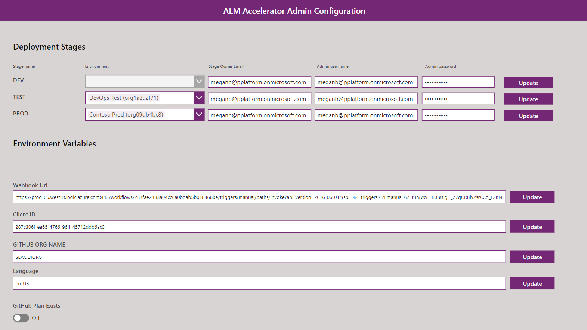
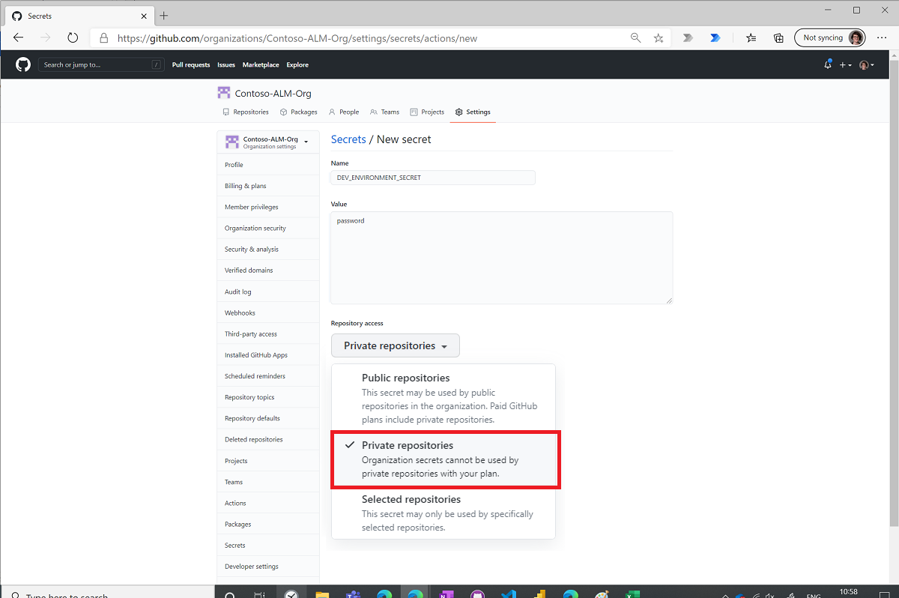

# Set up ALM Accelerator for Makers components

This solution uses [GitHub actions](../../alm/devops-github-actions.md) for source control and deployments. The [GitHub connector](/connectors/github/) is used in flows to interact with GitHub. More information: [Use the ALM Accelerator for Makers components](almaccelerator-components.md)

> [!IMPORTANT] The ALM Accelerator for Makers components don't have a dependency on other components of the CoE Starter Kit. It can be used independently.

## Prerequisites

### Environments

The ALM Accelerator for Makers components will manage deploying solutions from development to testing to production environments. You'll need separate environments for deploying ALM Accelerator for Makers, and for the development, testing, and production of your project.

- Create an environment with a Microsoft Dataverse database for deploying ALM Accelerator for Makers.
- Any target environment (development, test, or production) will require a Dataverse database for deploying solutions.
- Create a GitHub account at [GitHub.com](https://github.com).
- Create a [GitHub org](https://docs.github.com/free-pro-team@latest/github/setting-up-and-managing-organizations-and-teams/creating-a-new-organization-from-scratch).

### Users and permissions

You'll need the following users and permissions in Microsoft Power Platform and Azure Active Directory (Azure AD):

- A licensed Power Apps user with the System Administrator role in the environment where ALM Accelerator for Makers will be deployed.
    >[!NOTE]
    > This user must not have enabled multifactor authentication until the full support of service principals is enabled in GitHub workflows.

- A licensed Azure user with permissions to create app registrations and grant admin consent to app registrations in Azure AD.

- A GitHub account at [GitHub.com](https://github.com)

- A [GitHub organization](https://docs.github.com/free-pro-team@latest/github/setting-up-and-managing-organizations-and-teams/creating-a-new-organization-from-scratch)

## Create an Azure AD app registration

Set up an Azure AD app registration that will be used to create environments and retrieve solutions within an environment.

1. Sign in to [portal.azure.com](https://portal.azure.com).

1. Go to **Azure Active Directory** > **App registrations**.

   

1. Select **+ New Registration**.

1. Enter **GithubDevOpsApp** for the name, and then select **Register**. Don't change any other settings.

1. Select **API Permissions** > **+ Add a permission**.

1. Select **Dynamics CRM**.

1. Select **Delegated permissions**, and then select **user_impersonation**.

    

1. Select **Add permissions**.

1. Select **Grant admin consent for [Your Organization]**.

1. Select **Authentication** from the menu.

1. Under **Advanced Settings** > **Allow public client flows**, turn on the **Enable the following mobile and desktop flows** toggle.

1. Select **Save**.

1. Select **Overview**, and copy and paste the application (client) ID value to Notepad. You'll need this value in the next step as you configure the custom connector.

Leave the Azure portal open, because you'll need to copy some information when you set up the custom connector.

## Import the solution

1. Download the CoE Starter Kit compressed file ([aka.ms/CoeStarterKitDownload](https://aka.ms/CoeStarterKitDownload)).

1. Extract the zip file.

1. Go to [make.powerapps.com](<https://make.powerapps.com>).

1. Go to your target environment. In the example in the following image, we're importing to the environment named **Contoso CoE**.

     

1. Create connections to all connectors used as part of the solution.
    1. Go to **Data** > **Connections**.
    1. Select **+ New Connection**.
    1. Search for and select **Microsoft Dataverse**.
     
    1. Select **+** to create a connection.
    1. Complete the same steps for the following connectors:
        - Office 365 Outlook
        - GitHub
        - Power Apps for Makers
        - Power Platform for Admins
        - Approval
        - Content Conversion

1. On the left pane, select **Solutions**.

1. Select **Import**. A pop-up window appears. (If the window doesn't appear, be sure your browser's pop-up blocker is disabled and try again.)

1. In the pop-up window, select **Choose File**.

1. Select the ALM Accelerator solution from File Explorer (PowerPlatformGitHubALM_x_x_x_xx_managed.zip).

1. When the compressed (.zip) file has been loaded, select **Next**.

1. Review the information, and then select **Next**.

1. Establish connections to activate your solution. If you create a new connection, you must select **Refresh**. You won't lose your import progress.

    

1. Select **Import**.

## Configure environment settings and deployment stages after import

1. Go to [make.powerapps.com](<https://make.powerapps.com>).
1. On the left pane, select **Solutions**.
1. Select the **Power Platform GitHub ALM** solution, and then open the **ALM Accelerator Admin Configuration** app.

### Set up deployment stages

>[!IMPORTANT]
>Update one row at a time, and then select **Update** to save your changes.

1. Update the **Stage Owner Email** for each of the three stages (**DEV**, **TEST**, and **PROD**). The stage owner will receive notification for approving project creation and deployment.
1. Update the **Admin username and password**. These credentials can be a service account or a user account with the Power Platform Admin role.
1. For each of the test and production stages, select a pre-existing environment that will be used for test and production deployments. Your development environment is the environment provisioned when you first create a project.

### Update the Webhook Url value

This URL will be used for callbacks from GitHub.

1. On a new tab, go to [make.powerapps.com](<https://make.powerapps.com>) > **Solutions** > **Power Platform GitHub ALM** solution.
1. Edit the **WorkflowCompleteNotification** flow.
1. Select the first action, and then copy the URL in the action.
1. Go back to the **ALM Accelerator Admin** app, and update the **Webhook Url** field with the value that you copied in the previous step.
1. Select **Update**.

### Update the client ID

The client ID is needed for flows to create an environment and perform other admin-related activities like fetching solutions and apps inside an environment.

1. In the ALM Accelerator Admin app, update the **Client ID** field by using the application (client) ID value you copied in step 13 of [Create an Azure AD app registration](#create-an-azure-ad-app-registration).
1. Select **Update**

### Update the GitHub org name

1. Enter your GitHub org name (see [prerequisites](#prerequisites), earlier in this article). The repositories will be created inside this org.
1. Select **Update**.

### Update the language

1. Change your preferred language, if you want. Power Apps uses the [IETF BCP-47 language tag format](/powerapps/maker/canvas-apps/functions/function-language#language-tags), for example en_US, fr_FR, it_IT.
1. Select **Update**.

### Update GitHub Plan Exists setting

If a paid GitHub org plan exists for your org, turn on the **GitHub Plan Exists** toggle.

## Secure admin credentials

[Field-level security](../../admin/field-level-security.md) is enabled to secure credentials for deployments. As an admin, you'll need to add users to the **FieldSecurityForPassword** field security profile; this enables those users to add their credentials for the deployment from development to test and production environments.
<!--markdownlint-disable MD036-->
**To add users to the field security profile**

1. Go to [make.powerapps.com](https://make.powerapps.com/), select **Solutions**, and then open the **Power Platform GitHub ALM** solution.

1. Select **FieldSecurityForPassword** from the solution.

    

1. Select **Users**.

    

1. Select **Add**.

1. Search for a user you want to add to the profile.

    

1. **Select** to add the user to the security profile.

    

1. Repeat this step for all users who will use the ALM Accelerator for Makers app.

1. Select **Save and Close**.

   

## Configure GitHub org secrets

GitHub org secrets will be used to make API calls to import and export solutions, and to interact with Dataverse. Secrets are the recommended way of storing sensitive information.

GitHub supports org secrets and repository-level secrets. If you have a paid plan, all the secrets created at the org level can be used by private repositories as well. That's the advantage of having a paid plan. Otherwise, the admin has to create secrets for each repository.

Learn more: [GitHub Team offerings](https://docs.github.com/free-pro-team@latest/github/getting-started-with-github/githubs-products#github-team).

> [!IMPORTANT]
> The environment admin must have GitHub repo admin permissions to complete the following steps.

## Paid GitHub org plan

If you have a paid GitHub org plan, configure org secrets by following these steps:

1. Go to your org in GitHub (https://github.com/yourorg).
1. Select **Settings** > **Secret** > **New organization secret**
    
1. Enter **DEV_ENVIRONMENT_SECRET** as the name for your development deployment stage, and enter the value for your secret.
1. In the **Repository access** list, select **Private Repositories**.
         
1. Select **Add Secret**.
1. Repeat the preceding steps to add a **TEST_ENVIRONMENT_SECRET** and **PROD_ENVIRONMENT_SECRET**.

## Free GitHub org plan

If you don't have a paid GitHub org plan, do the following for all projects created in the ALM Accelerator for Makers app.

>[!NOTE]
>These steps need to be followed for all projects created in ALM Accelerator for Makers.

1. Go to your org in GitHub (https://github.com/yourorg).
1. Select **Settings** > **Secret** > **New organization secret**
1. Enter **DEV_ENVIRONMENT_SECRET** as the name for your development deployment stage, and enter the value for your secret.
    
1. Select **Add Secret**.
1. Repeat the preceding steps to add a **TEST_ENVIRONMENT_SECRET** and **PROD_ENVIRONMENT_SECRET**.

You can now [use the ALM Accelerator for Makers components](almaccelerator-components.md).

[!INCLUDE[footer-include](../../includes/footer-banner.md)]