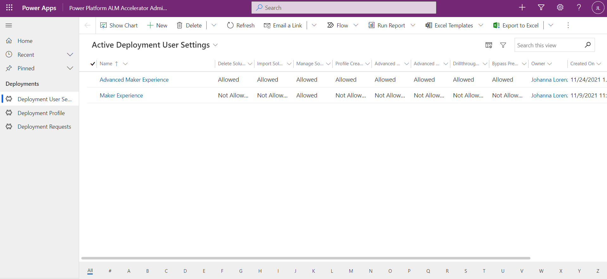

# Configuring the ALM Accelerator for Power Platform App (Preview)

>[!NOTE]
>The ALM Accelerator for Power Platform (AA4PP) is currently in public preview. Please see Issues currently tagged as [vnext](https://github.com/microsoft/coe-starter-kit/issues?q=is%3Aopen+is%3Aissue+label%3Aalm-accelerator+label%3Avnext) for the Roadmap to be completed prior to general availability. While in Public Preview it can be expected that there will be breaking changes and frequent updates to address feedback from preview members. Additionally, the Public Preview is reliant on the experimental [Power Apps Source File Pack and Unpack Utility](https://github.com/microsoft/PowerApps-Language-Tooling) that is being developed separately from AA4PP.

The ALM Accelerator is configurable based on user preferences to turn on and off certain features in the user interface depending on a user's role. A common scenario is to create an **Advanced Maker and a Maker experience** to help both users familiar and unfamiliar with Application Life-Cycle Management to use the app effectively. Linked to the User Settings are Deployment Profiles. Deployment Profiles are used by the app to make decisions for the user on where and how to create branches and approvals for deployment.

In this section, we'll describe how to use the ALM Accelerator for Power Platform Administration app to configure these settings for use by the ALM Accelerator.

## Creating User Settings and Profiles Using AA4PP Administration App

To create User Settings for AA4PP, use the following steps.

1. Open the Power **Platform ALM Accelerator Administration App** and Navigate to **Deployment User Settings**

   

1. Select **New** and **Provide a Name** of the User Setting. This name will only be displayed to users with access than more than one User Setting option.

1. Select **User Functions to Allow or Disallow**. Below are the specific areas that are configurable in the app.
    - **Import Solutions** - Allowing this function will show the Import Solution button in the App.
    - **Delete Solutions** - This function will show the Delete Solution button in the App.
    - **Manage Solutions** - This function will show the Manage Solutions button in the App.
    - **Drillthrough Status** - This function will allow users to drill into the DevOps pipeline runs for the Promote and Deploy functionality.
    - **Profile Creation** - This function will provide users with the ability to create new Deployment Profiles in the App.
    - **Advanced Promote** - This function will provide users with the ability to change between using the Advanced Promote functionality (that is, specifying a source / target branch and creating a new branch).
    - **Advanced Deploy** - This function will provide users with the ability to toggle between using the Advanced Deploy functionality (that is, specifying a source / target branch for a Pull Request).
    - **Bypass Prepare** - This function will provide the user with the ability to skip the Preparation step during promotion of a solution (that is, bypass configuring deployment settings before committing to source control)
    
1. Update **User Labels**. Below are the specific areas that are configurable in the app related to user labels for functions. These values also show in the Deployment History view under the action that was executed.

    - **Deploy Solution** - Updating this label changes the text of the button for the **deployment action** in the app. The default value is **"DEPLOY SOLUTION"**
    - **Commit Solution** - Updating this label changes the text of the button for the **promote action** in the app. The default value is **"COMMIT SOLUTION"**
    - **Import Solution** - Updating this label changes the text of the button for the **import solution action** in the app. The default value is **"IMPORT SOLUTION"**
    - **Delete Solution** - Updating this label changes the text of the button for the **delete solution action** in the app. The default value is **"DELETE SOLUTION"**
    
1. Select **Save** to save your User Settings.

1. Add **New Deployment Profiles** to your User Settings. Deployment Profiles are used by the AA4PP App to determine where and how to **create Branches** during the Commit stage and how to **create Pull Requests** when deploying. Below are the steps to create a Deployment Profile using the AA4PP Administration App to **associate with one or many Deployment User Settings**.

    >[!NOTE]
    >In addition to creating Deployment Profiles using the AA4PP Administration App. Users who have access to User Settings with **Create Profile permissions** in the AA4PP App can create profiles in the App. The AA4PP App makes some assumptions about the setup of your pipelines based on the documentation for setting up your pipelines and doesn't provide the flexibility that the AA4PP Administration App does. It does, however, allow you to jump start this process.
    - From the User Setting, you created above. Select

## Creating ALM Accelerator Profiles Using AA4PP App

If a user logs in to the AA4PP App and doesn't have a Deployment User Settings assigned to them, **the App will automatically create a Deployment User Setting for the user**. This user setting will be created with all of the functionality enabled (for example, Import, Delete and All Advanced Features).

   1. Open the ALM Accelerator for Power Platform App.

      - If the user has more than one Deployment User Setting shared with them, the app will display a drop-down for the user to choose their experience.

      - If a user only has one Deployment User Setting shared with them, they won't see the drop-down to choose from. Their default user setting will be used by the app.
      - If no user setting is shared with them, the app will create a new User Deployment setting for the user and use the default interface for the app.
      
   1. Create a New Profile for your Solution. In order to begin source controlling and deploying a solution, you must have a profile associated with that solution.
      >[!NOTE]
      >Users who have a User Setting shared with them will only be able to perform functions on solutions to which they have been assigned a profile already. If a user has a User Setting shared with them that doesn't have a profile that is already assigned to a solution, they won't be able to perform actions on that profile.

      - Select the **Choose a Profile link** for a solution that doesn't have a profile assigned.
      - Choose an **existing profile from the drop-down or select the plus button** to create a new profile.
      - Enter a **name for the Profile and Select the Organization, Project, Repo and Target Branch**.
      - Select Create. Creating a new Profile will automatically populate the Deployment Environments with the default configuration for Validation, Test, and Production. These environments' URLs will contain a placeholder for your environments actual URL.
      - Enter the URLs for your Validation, Test, and Production environments.
      - Select Save to save your changes to the Profile and save the profile as the default for the solution
      - After the Profile is saved, you'll be able to Commit and Deploy your solution
        

## Sharing ALM Accelerator User Settings and Profiles Using AA4PP Administration App

In order to share User Settings created for a particular user profile it is recommended that you share the user setting row with an AAD Group Team. Sharing with an AAD Group Team will allow you to manage access to User Settings and Deployment Profiles from Azure Active Directory by adding the user to the group in AAD. Below is how to share and provide the appropriate roles to an AAD Group Team after installing the AA4PP Solution.

1. If you haven't already created an AAD Group Team in Dataverse to share your User Settings with follow the steps below otherwise skip to step 2

   - Navigate to [https://admin.powerplatform.com](https://admin.powerplatform.com) and Select the environment in which you've installed AA4PP.

   - Select **See all** under Access - Teams and Select **Create Team**.

   - Enter the required fields and Select **AAD Group Team** as the Team Type.

   - Select the **AAD Group** to use for this Team and Select **Next**.

   - Select **ALM Power App Access** and **Basic User** as the Roles for the Team and Select **Save.**

1. Open the Power **Platform ALM Accelerator Administration App** and Navigate to **Deployment User Settings.**

1. Open the **Deployment User Setting** that you want to share with your Team and Select **Share**.

1. Locate your AAD Group Team by Using **Advanced lookup** in the Sharing dialog.

   - In Advanced lookup Select **Teams**.

   - Select **All AAD Security Group Teams** from the View dropdown.

   - Select the **Team you created previously** and select **Done.**

1. Under Manage Share Access, select the **Team** and Select **Read** and **Append** as the permissions.

1. Select Share.
