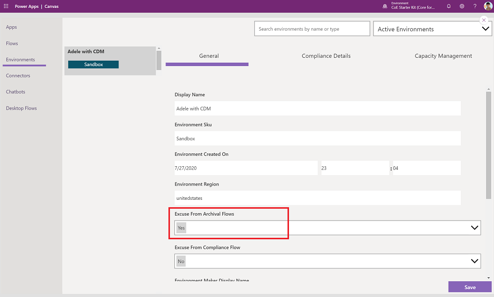

# Set up inactivity processes

This article will help you to set up the inactivity notifications for unused canvas apps and cloud flows, and for how to clean up unused connection references.

[Watch a walk-through](https://www.youtube.com/watch?v=PZ5u_2E9uUI&list=PLi9EhCY4z99W5kzaPK1np6sv6AzMQDsXG) of how the inactivity process works.

## Set up connection cleanup (broken connections)

Process to delete connections that have are, and have been broken for some time (30 days by default)

> [!IMPORTANT]
> You may see an error like this when running for large environments:   
> The action 'Get_Connections_as_Admin' has an aggregated page results size more than '209797598' bytes. This exceeded the maximum size '209715200' bytes allowed'   
> If this occurs you will need to clean up the connections via Power Shell first in order to use the connector in Power Automate.  
> This article will get you started on [Power Shell for Power Platform](/power-platform/admin/powershell-getting-started)  
> And this call will delete all the errored connections in your default environment   
>(Get-AdminPowerAppConnection -EnvironmentName "Default-yourGUIDhere") | Where { $_.statuses -like "*Error*"} | Remove-AdminPowerAppConnection

### Turn on flow

- [Admin | Broken Connection Cleanup](governance-components.md#admin--broken-connection-cleanup)

## Set up inactivity notifications (unused apps and flows)

Processes to ask users if canvas apps and cloud flows are still useful, or to clean them up if they are not.

### Update environment variables values for unused apps and flows

>[!NOTE]
>These flows used to be called called "archive" flows, however they did not automatically archive apps and flows. The name has recently changed to "inactivity notifications", however if you are on an older version of the Governance components solution they may still be called "archive" flows.

You use this functionality to detect unused objects, and ask makers to either archive or unshare them to keep your tenant tidy.

>[!IMPORTANT]
>This article assumes you have [installed the governance components solution](before-setup-gov.md), and you have your [environment set up](setup.md#create-your-environment) and are signed in with the [correct identity](setup.md#what-identity-should-i-install-the-coe-starter-kit-with).

### Grant makers environment access

If your solution is installed in a production environment, make sure your environment isn't restricted with an [environment security group](limitations.md#security-groups-and-approvals).

If your solution is installed in a Dataverse for Teams environment, you first need to grant access to makers who aren't part of your team in Microsoft Teams so they can participate in approval workflows. [Share an app in a Teams environment](faq.md#share-an-app-from-a-dataverse-for-teams-environment) with your [Power Platform maker group](setup.md#how-will-you-communicate-with-your-admins-makers-and-end-users).

### Configure mandatory environment variables

You'll [update these environment variables](faq.md#update-environment-variables) after you import the solution. Environment variables are used to store application and flow configuration data. This means that you only have to set the value once per environment, and it will be used in all necessary flows and apps in that environment.

>[!TIP]
>Learn how to update environment variables for production and Dataverse for Teams environments: [Update environment variables](faq.md#update-environment-variables).

| Name | Description |
|------|---------------|
| Individual Admin | This is separate from the Admin Email environment variable because you can't use a distribution list for approvals. This environment variable holds the individual or shared account who will be charged with approving the removal of unused orphaned objects. |
| Cleanup Old Objects App URL | (Optional) A link to the Cleanup Old Objects canvas app included in this solution. To make cleanup easier, any communication about old objects that are no longer considered to be useful will include this link. More information: [Get an app URL from a production environment](faq.md#get-a-power-apps-url-from-a-production-environment) or [Get an app URL from a Teams environment](faq.md#add-apps-to-microsoft-teams) |
| Flow Approvals URL | (Optional) A link to the Power Automate approval page for your CoE environment. To make cleanup easier, any communication about old objects that are no longer considered to be useful will include this link. To get the URL, go to flows.microsoft.com for your CoE environment > **Action Items** > **Approvals**. The URL will end in **approvals/received**. |  

### Exempt environments from the inactivity notifications process

You might want to exempt some environments from the inactivity notification process—for example, dedicated environments that are already well-managed. More information: [Establishing an environment strategy](../adoption/environment-strategy.md)

You can exempt environments from the inactivity notification process by using the Power Platform Admin View app.  

#### Production environment

If your solution is installed in a production environment, your app will be a model-driven app. Follow these steps:

1. Go to [make.powerapps.com](<https://make.powerapps.com>).
1. Go to your CoE environment.
1. Open the **Power Platform Admin View** app.
1. Select **Environments**, and then select the environment you want to exempt.
1. Set the **Excuse From Archival Flows** field to **Yes**.
1. Select **Save**.

   

#### Dataverse for Teams environment

1. Open the Power Apps app in Teams, select **Build**, and then select the team that you've installed the CoE Starter Kit solutions in.
1. Select **Center of Excellence - Core for Teams** > **See All**.
1. Open the **Power Platform Admin View** app.
1. Select **Environments**, and then select the environment you want to exempt.
1. Set the **Excuse From Archival Flows** field to **Yes**.
1. Select **Save**.

   

### Turn on flows

Turn on the following flows, which are installed as part of the governance components solution:

- [Admin | Inactivity notifications v2 (Check Approval)](governance-components.md#admin--inactivity-notifications-check-approval)
- [Admin | Inactivity notifications v2 (Clean Up and Delete)](governance-components.md#admin--inactivity-notifications-clean-up-and-delete)
- [Admin | Inactivity notifications v2 (Start Approval for Apps)](governance-components.md#admin--inactivity-notifications-v2-start-approval-for-apps)
- [Admin | Inactivity notifications v2 (Start Approval for Flows)](governance-components.md#admin--inactivity-notifications-v2-start-approval-for-flows)
- [Admin | Email Managers Ignored Approvals](governance-components.md#admin--email-managers-ignored-inactivity-notifications-approvals)

### Share apps with makers

The governance components solution contains the [Cleanup Old Objects App](governance-components.md#cleanup-old-objects-app) app for makers and admins to manage archive approvals. Share this app with your makers and admins, assigning them the Power Platform Maker SR security role.

More information:

- [Share a canvas app in Power Apps](faq.md#share-an-app-from-a-production-environment)
- [Share a canvas app in Microsoft Teams](faq.md#share-an-app-from-a-dataverse-for-teams-environment)

Consider adding this app to the **Maker - Command Center** for makers to easily find and access it.

## All environment variables

This section includes the full list of environment variables that affect the compliance process, including environment variables with default values. You might have to [update environment variables](faq.md#update-environment-variables) after import.

>[!IMPORTANT]
> You don't have to change the values during setup, just when you need to change the value of an environment variable that you configured during import or when you want to change a default value. To make sure the latest values are picked up, restart all flows after you change environment variables.

Environment variables are used to store application and flow configuration data with data specific to your organization or environment.

| Name | Description | Default value |
|------|---------------|------|
|Delete Broken Connections Age (Days)| Delete Broken Connections this many days since they were last modified |30|
| Individual Admin | This is separate from the Admin Email environment variable because you can't use a distribution list for approvals. This environment variable holds the individual or shared account who will be charged with approving the removal of unused orphaned objects. | None |
| Auto Delete on Archive | Determines whether apps andd flows are deleted when they're approved for deletion in the following flow: Admin \|Inactivity notifications v2 (Check Approval) and Admin \|Inactivity notifications v2 (Clean Up and Delete). The value must be Yes or No.  | Yes |
| Cleanup Old Objects App URL | (Optional) A link to the Cleanup Old Objects canvas app included in this solution. To make cleanup easier, any communication about old objects that are no longer considered to be useful will include this link. More information: [Get an app URL from a production environment](faq.md#get-a-power-apps-url-from-a-production-environment) or [Get an app URL from a Teams environment](faq.md#add-apps-to-microsoft-teams) | None |
| Flow Approvals URL | (Optional) A link to the Power Automate approval page for your CoE environment. To make cleanup easier, any communication about old objects that are no longer considered to be useful will include this link. To get the URL, go to make.powerautomate.com for your CoE environment > **Action Items** > **Approvals**. The URL will end in **approvals/received**.|  None |
| ProductionEnvironment | Set to **No** if you've installed the solution for development or test purposes. This will send approvals to the admin email instead of the maker. | Yes |
| Archival-PastTime-Interval | The interval for the past time for how far back to go to see if an app/flow is useful. | 6 (months) |
| Archival-PastTime-Unit | The units for the past time for how far back to go to see if an app/flow is useful. | Month. |

## It looks like I found a bug with the CoE Starter Kit; where should I go?

To file a bug against the solution, go to [aka.ms/coe-starter-kit-issues](https://aka.ms/coe-starter-kit-issues).

[!INCLUDE[footer-include](../../includes/footer-banner.md)]
