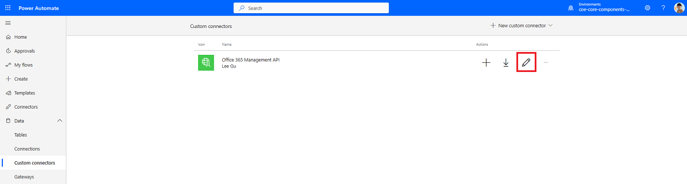
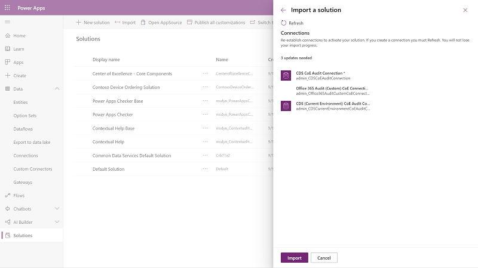
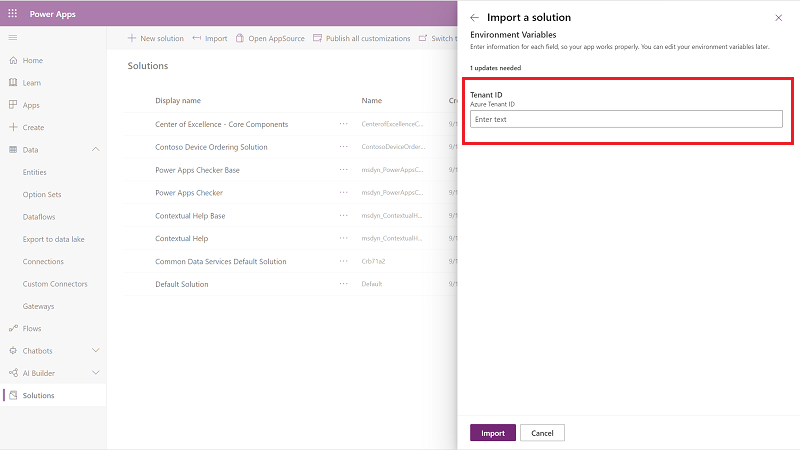

# Set up the audit log connector

The Audit Log Sync flow connects to the Microsoft 365 audit log to gather telemetry data (unique users, launches) for apps. The flow uses a custom connector to connect to the Audit Log. In the following instructions, you'll set up the custom connector and configure the flow.

The Center of Excellence (CoE) Starter Kit will work without this flow, but the usage information (app launches, unique users) in the Power BI dashboard will be blank.

There are two options for connecting to the audit log: one uses basic authentication (username and password) and one uses an Azure AD app registration to establish an identity for your app and allow access to the APIs. If your admin account is protected by multifactor authentication, you'll need to connect by using Azure App Registration.

## Before you use the audit log connector

1. Microsoft 365 audit log search must be turned on for the audit log connector to work. More information: [Turn audit log search on or off](https://docs.microsoft.com/microsoft-365/compliance/turn-audit-log-search-on-or-off?view=o365-worldwide)
1. You must have access to the audit log. The Microsoft Power Platform Service Admin role doesn't give you access to the audit log. More information: [Search the audit log in the Security & Compliance Center](https://docs.microsoft.com/microsoft-365/compliance/search-the-audit-log-in-security-and-compliance?view=o365-worldwide#before-you-begin)
1. Your tenant must have a subscription that supports unified audit logging. More information: [Security & Compliance Center availability for business and enterprise plans](https://docs.microsoft.com/office365/servicedescriptions/office-365-platform-service-description/office-365-securitycompliance-center)

## Option 1: Connect to the audit log by using an Azure AD app registration

The Office 365 Management APIs use Azure Active Directory (Azure AD) to provide authentication services that you can use to grant rights for your application to access them.

### Create an Azure AD app registration for the Office 365 Management API

Using these steps, you'll set up an Azure AD app registration that will be used in a custom connector and Power Automate flow to connect to the audit log. More information: [Get started with Office 365 Management APIs](https://docs.microsoft.com/office/office-365-management-api/get-started-with-office-365-management-apis)

1. Sign in to [portal.azure.com](https://portal.azure.com).

1. Go to **Azure Active Directory** > **App registrations**.

   

1. Select **+ New Registration**.

1. Enter a name (for example, **Microsoft 365 Management**), don't change any other setting, and then select **Register**.

1. Select **API Permissions** > **+ Add a permission**.

   

1. Select **Office 365 Management API**, and configure permissions as follows:

   1. Select **Delegated permissions**, and then select **ActivityFeed.Read**.

      

   1. Select **Application permissions**, and then select **ActivityFeed.Read** and **ServiceHealth.Read**.

      

   1. Select **Add permissions**.

1. Select **Grant Admin Consent for (your organization)**.

   The API permissions now reflect delegated **ActivityFeed.Read**, and application **ActivityFeed.Read** and **ServiceHealth.Read** permissions, with a status of **Granted for _(your organization)_**.

   

1. Select **Certificates and secrets**.

1. Select **+ New client secret**.

   

1. Add a description and expiration (in line with your organization's policies), and then select **Add**.

1. Copy and paste the **Secret** to a text document in Notepad for the time being.

1. Select **Overview**, and copy and paste the application (client) ID and directory (tenant) ID values to the same text document; be sure to make a note of which GUID is for which value. You'll need these values in the next step as you configure the custom connector.

Leave the Azure portal open, because you'll need to make some configuration updates after you set up the custom connector.

### Set up the custom connector

Now you'll configure and set up a custom connector that uses the [Office 365 Management APIs](https://docs.microsoft.com/office/office-365-management-api/get-started-with-office-365-management-apis).

1. Go to [make.powerapps.com](https://make.powerapps.com) > **Data** > **Custom Connectors**. The Office 365 Management API custom connector will be listed here; it has been imported with the core components solution.
1. Select **Edit**.

  

1. Leave the **1. General** page as-is, and then select **2. Security**.

1. Select **Edit** at the bottom of the **OAuth 2.0** area to edit the authentication parameters.

   

1. Paste the application (client) ID you copied from the app registration into **Client Id**.

1. Paste the client secret you copied from the app registration into **Client secret**.

1. Don't change the **Tenant ID**.

1. Set the **Resource URL** to https://manage.office.com

1. Copy the **Redirect URL** into your text document in Notepad.

1. Select **Update Connector**.

> [!NOTE]
> If you have a [data loss prevention (DLP) policy](https://docs.microsoft.com/power-platform/admin/wp-data-loss-prevention) configured for your CoE Starter Kit environment, you'll need to add this connector to the business data&ndash;only group of this policy. More information: [Add custom connectors to your DLP policy](limitations.md#custom-connectors-and-dlp) and [custom connector documentation](https://docs.microsoft.com/connectors/custom-connectors/define-openapi-definition#import-the-openapi-definition)

### Update Azure AD app registration with the redirect URL

1. Go back to the Azure portal and your app registrations.

1. Under **Overview**, select **Add a Redirect URI**.

1. Select **+ Add a platform** > **Web**.

1. Enter the URL you copied from the **Redirect URL** section of the custom connector.

1. Select **Configure**.

### Start a subscription to audit log content

Go back to the custom connector to set up a connection to the custom connector and [start a subscription to the audit log content](https://docs.microsoft.com/office/office-365-management-api/office-365-management-activity-api-reference#start-a-subscription), as described in the following steps.

> [!IMPORTANT]
> You must complete these steps for subsequent steps to work. If you don't create a new connection and test the connector here, setting up the flow and child flow in later steps will fail.

1. On the **Custom Connector** page, select **4. Test**.

1. Select **+ New connection**, and then sign in with your account.

1. Under **Operations**, select **StartSubscription**.

   

1. Paste the **directory (tenant) ID**&mdash;copied earlier from the **App Registration** overview page in Azure AD&mdash;into the **Tenant** field, and then paste the **application (client) ID** into **PublisherIdentifier**. 

1. Select **Test Operation**.

You should see a (200) status returned, which means the query was successful.

> [!IMPORTANT]
> If you don't see a (200) response, the request has failed. There's an error with your setup that's keeping the flow from working. Common issues to check are: 
>
> - Are audit logs enabled, and do you have permission to view the audit logs? Check [protection.office.com](https://protection.office.com) > **Search** > **Audit Log Search**.
> - If you don't have permissions, see [Requirements to search the audit log](https://docs.microsoft.com/microsoft-365/compliance/search-the-audit-log-in-security-and-compliance?view=o365-worldwide#requirements-to-search-the-audit-log).
> -. Have you enabled the audit log very recently? If so, try again in a few minutes, to give the audit log time to activate.
> - Have you pasted in the correct tenant ID from your Azure AD app registration?
> - Have you pasted in the correct resource URL, with no added spaces or characters at the end?
> - Validate that you correctly followed the steps in [Azure AD app registration](#create-an-azure-ad-app-registration-for-the-office-365-management-api)
> - Validate that you correctly updated the security settings of the custom connector, as described in [step 6 of the custom connector setup](#set-up-the-custom-connector) procedure earlier in this article.

### Set up the Power Automate flow

A Power Automate flow uses the custom connector, queries the audit log daily, and writes the Power Apps launch events to a Microsoft Dataverse table, which is then used in the Power BI dashboard to report on sessions and unique users of an app.

1. Follow the instructions in [Set up core components](setup-core-components.md) to download the solution.
1. Go to [make.powerapps.com](https://make.powerapps.com).
1. Import the Center of Excellence audit logs solution (CenterofExcellenceAuditLogs_*x_x_x_xxx*_managed.zip).
1. Establish connections to activate your solution. If you create a new connection, you must select **Refresh**. You won't lose your import progress.
    

1. Paste in the ID you copied for directory (tenant) ID for the *Tenant ID*.
    

1. Open the **Center of Excellence – Audit Log solution**, and select **Admin \| \[Child\] Admin | Sync Logs**. 

1. Edit the **Run only users** settings.

   

1. For both connections (the custom connector and Dataverse), change the value to **Use this connection (userPrincipalName\@company.com)**. If there is no connection for any of the connectors, go to **Data** > **Connections**, and create one for the connector.

   

1. Select **Save**, and then close the **Flow details** tab.

1. (Optional) Edit the Admin | Sync Audit Logs flow to update the time interval at which the log clusters should be retrieved. The default is set to one-day intervals (from the options of Month, Week, Day, Hour, Minute, or Second).

1. (Optional) Edit the Admin | Sync Audit Logs flow to update the start time and end time during which the logs will be read. The maximum is seven days in the past, and the end time must be after the start time. Use a positive number in the interval field.

   

1. Back in the solution, turn on both the \[Child\] Admin | Sync Logs flow and the Admin | Sync Audit Logs flow.

   

## Option 2: Connect to the audit log by using basic authentication

Make sure the account that's used to configure this section has permission to access the audit logs and doesn't have multifactor authentication enabled. Global tenant admins have access to the audit logs by default, and can grant access to the audit logs for other user accounts or groups through the Exchange admin center.

Keep in mind that after a user account has access to the audit logs, that user has access to all audit logs across every Microsoft service that reports telemetry to audit logs.

### Install the custom connector

1. Go to [flow.microsoft.com](https://flow.microsoft.com), and set the current environment to the same environment where the CoE solution is installed.

1. On the left pane, expand **Data**, and then select **Custom Connectors**.

1. Select **+ New custom connector – Import an Open API file**.

   

1. Enter a connector name (**Office 365 Audit Logs**), and then select the .swagger file that can be found in the CoE Starter Kit pack you downloaded.

1. Select **Create Connector**. You don't need to change the security and definition information.

1. Select **4. Test**.

   

1. Select **+ New Connection** to create a connection to your connector.

1. Enter the email address and password of the user who has access to audit logs, and then select **Create connection**.

   

1. Select the refresh icon in the upper-right corner of the **Connections** area to ensure that the new connection is selected.

1. Enter a **Start Date** and **End Date** for the **GetActivitiesByOperation**.

1. Select **Test Operation**.

   A (200) response indicates that the query has been successfully executed.
   

> [!IMPORTANT]
> If you're using DLP, you'll need to put this connector into the business group. More information: [Custom connectors and DLP](limitations.md#custom-connectors-and-dlp) and [Import the OpenAPI definition](https://docs.microsoft.com/connectors/custom-connectors/define-openapi-definition#import-the-openapi-definition)

### Import the flow template compressed (.zip) package named SyncAuditLogs.zip

1. Go to [flow.microsoft.com](https://flow.microsoft.com), and set the current environment to the same environment where the CoE solution is installed.

1. On the left pane, go to the **My Flows** tab.

1. Select **Import**.

1. Select the **Flow-SyncAuditLogs.zip** package, and then select **Import**.

1. Update the connections by following these steps:
    1. For Admin \| Sync Audit Logs, select **Create as new**, and then select **Save**.

    1. For the Office 365 Audit Logs connector, Dataverse connection, and Office 365 Audit Logs Connection, select **Select during import**, and then choose your connection.
       

    1. After the connections are configured, select **Import**.

    1. Open the flow, and make sure there are no errors for any of the actions.

    1. Select the back arrow in the upper-left corner to go back to the flow details screen.

    1. If the flow isn't on yet, turn it on.

    1. Run the flow to start syncing audit log data to the Dataverse table.
