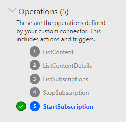
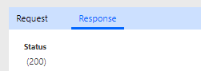
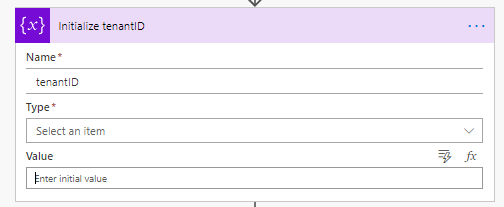
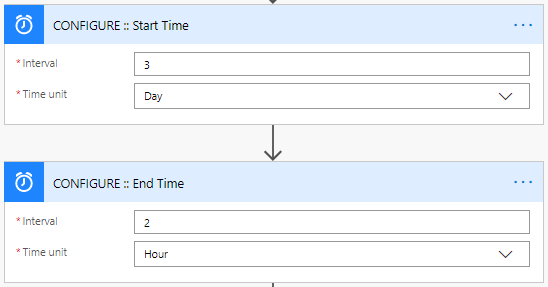
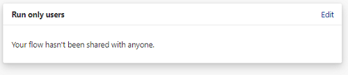
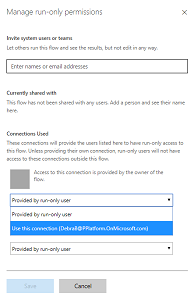

# Set up Audit Log connector

This Audit Log sync flow connects to the Office 365 Audit Log to gather telemetry data (unique users, launches) for Power Apps apps. The flow uses a custom connector to
connect to the Office 365 Audit Log. In the instructions below, we will setup
the custom connector and configure the flow.

The CoE Starter Kit will work without this flow, however the usage information (app launches, unique users) in the Power BI dashboard will be blank.

There are two options to connect to the Audit Log, one using basic authentication (username and password) and one using an Azure App Registration to establish an identity for your application and allow access to the APIs.

## Connect to the Audit Log using basic authentication

Make sure the account that is used to configure this section has permission to
access the audit logs and does not have MFA enabled. Global tenant admins have access to the audit logs by default and can grant access to the audit logs for other user accounts or groups through the Exchange Admin Center.

Keep in mind that once a user account has access to the audit logs, they have
access to all audit logs across every Microsoft service that reports telemetry
to audit logs.

### Install the custom connector

1. Go to [flow.microsoft.com](https://flow.microsoft.com) and set the current Environment to the same Environment where the Center of Excellence solution is installed.

1. In the left navigation, expand **Data** and select **Custom Connectors**

1. Select **+ New custom connector – Import an Open API file**

1. Provide a connector name (Office 365 Audit Logs) and select the .swagger file that is which can be found in the CoE Starter Kit pack you downloaded. 

1. Select **Create Connector**

1. You don't need to change the Security and Definition information, to test the connector select **4. Test** 

1. Select **New Connection** to create a connection to your connector 

1. **Enter** the email address and password of the user that has access to the Audit Logs in the connection window and select **Create connection**

1. **Select** the refresh icon in the right-hand corner of the Connections area to ensure the new connection is selected

1. Provide a Start Date and End Date for the **GetActivitiesByOperation** 

1. Click **Test Operation**

1. You should receive a (200) response which indicates a successful execution of the query  

1. For more information on how to configure a custom connector, see the [custom connector documentation](https://docs.microsoft.com/connectors/custom-connectors/define-openapi-definition#import-the-openapi-definition)

### Import the Flow Template compressed (.zip) package called SyncAuditLogs.zip

1. Go to [flow.microsoft.com](https://flow.microsoft.com) and set the current Environment to the same Environment where the Center of Excellence solution is     installed.

1. In the left navigation, navigate to the **My Flows** tab

1. Select **Import** in the top
1. Select the **Flow-SyncAuditLogs.zip** package, click import
1. Update the connections
    1. Select each of the red icons shown to configure  

    1. For Admin \| Sync Audit Logs, select to **Create as new**, and **Save**

    1. For the rest, chose Select during import, and chose your connection

    1. Once the connections are configured, click Import  
    

    1. Open the flow and make sure there are no errors for any of the actions.

    1. Click the back arrow in the upper left to go back to the flow details
        screen. If the flow is not yet on, turn on the flow and run it to start
        syncing audit log data to the CDS entity.

## Connect to the Audit Log using an Azure App Registration

The Office 365 Management APIs use Azure AD to provide authentication services that you can use to grant rights for your application to access them.

### Create an Azure App Registration for the Office 365 Management API

We will set up an Azure AD App Registration that will be used in a custom connector and Power Automate flow to connect to the Office 365 Audit Log. For additional information, see [Office 365 Management API documentation](https://docs.microsoft.com/office/office-365-management-api/get-started-with-office-365-management-apis).

1. Login to [portal.azure.com](https://portal.azure.com)
1. Navigate to **Azure Active Directory / App Registrations** 
1. Create a **new registration** 
1. Provide a name (e.g., *Office 365 Management*), don't change any of the other settings and click **Register**
1. Select **API Permissions** > **+ Add a permission** 
1. Select **Office 365 Management API** and configure permissions:
      1. Select Delegated Permissions and select *ActivityFeed.Read* 
      1. Select Application permissions and select *ActivityFeed.Read* and *ServiceHealth.Read* 
      1. Select **Add permissions**
1. Select **Grant Admin Consent for (your organization)** at the top.
1. The API Permissions should now look like the below. 
1. Select **Certificates and Secrets**
1. Select **+ New Client Secret** 
1. Add a description and expiration (in line with your company policies) and click **Add**
1. Copy the **Secret** to Notepad for the time being
1. Select **Overview** and copy the Application (client) id and Directory (tenant) id values to the same notepad, make sure to take note of which GUID is for which value. You will need these values in the next step as we configure the Custom Connector.
1. Leave the Azure AD Portal open, as we will need to make some configuration updates after setting up the custom connector.

### Set up the custom connector

We will now configure and set up a custom connector that uses the [Office 365
Management APIs](<https://docs.microsoft.com/office/office-365-management-api/get-started-with-office-365-management-apis>).

1. Download the new **Center of Excellence – Audit Logs** solution from [GitHub](https://github.com/microsoft/powerapps-tools/tree/master/Administration/CoEStarterKit/Audit%20Log%20(MFA))
1. Navigate to [make.powerapps.com](https://make.powerapps.com)
1. Import the new **Center of Excellence – Audit Logs** (CenterofExcellenceAuditLogs_x_x_x_xxx_managed.zip) solution, which contains the custom connector and Power Automate flow to sync audit logs to CoE CDS entities.
1. Open the solution, select the **Office 365 Management API custom connector** and select **edit** 
1. Leave the **1. General** page as is and select **2. Security**
1. Select **Edit** at the bottom of the OAuth 2.0 area to edit the authentication parameters 
1. Paste the Application (Client) ID you have copied from the App Registration under Client Id.
1. Paste the Client Secret you have copied from the App Registration under Client Secret.
1. Leave the Tenant ID to common
1. Set the Resource URL to **https://manage.office.com**
1. Copy the Redirect URL into your Notepad 
1. Select **Update Connector**

### Update Azure AD App Registration with the Redirect URL

1. Go back to the Azure AD Portal and your App Registrations
1. Under Overview, select **Add a Redirect URI**
1. Select **+ Add a platform**
1. Choose **Web**
1. Enter the URL you have copied from the Redirect URL section of the Custom Connector (step 9.g above)
1. Select **Configure**

### Start a subscription to the Audit Log Content

Go back to the Custom Connector to set up a connection to the Custom Connector and Start a Subscription to the [Audit Log Content](<https://docs.microsoft.com/office/office-365-management-api/office-365-management-activity-api-reference#start-a-subscription>).

> [!IMPORTANT]
> It is important to complete these steps for the flow to work.

1. On the Custom Connector page, Select **4. Test**

1. Create a **+ New connection** and login with your account

1. Select **StartSubscription** as Operation 

1. Copy the Directory (Tenant ID) under **tenant** and copy the Directory (Tenant ID)  **PublisherIdentifier**.

    1. Select **Test Operation**

    1. You should see a (200) Status returned, which means the query was successful  
    *Note: If you do not see a (200) response, the request has failed and there is an error with your setup. The flow will therefore not work.*

## Setup the Power Automate Flow

A Power Automate flow uses the custom connector, queries the Audit Log daily and  writes the Power Apps Launch Events to a CDS entity, which is then used in the Power BI Dashboard to report on sessions and unique users of an app.

1. Navigate to [make.powerapps.com](https://make.powerapps.com)

1. Open the Center of Excellence – Audit Log solution and edit the **Admin \| Sync Audit Logs** (Select the flow in the solution to open it in the maker portal, and then select edit there. You will not be able to select Edit directly from the solution.)

1. Look at the **Initialize tenantID** action and paste in the ID you have copied from Directory (tenant) ID. 

1. (Optional) Update the time interval at which the log clusters should be retrieved. Default is set to 1 day intervals (from Month, Week, Day, Hour, Minute, Second)

1. (Optional) Update the start time and end time at which the logs will read from. The maximum is 7 days in the past, and the end time must be after the start time (a smaller amount of time subtracted in the action). Use a positive number in the interval field. 

1. Go back to the Center of Excellence - Audit Log solution, open the flow details screen of the *(Child) Admin \| Sync Logs* by selecting the display name

1. Edit the **Run only users** settings 

1. For both connections (Custom connector and Common Data Service), change the dropdown value to *Use this connection (userPrincipalName\@company.com)*. If there is no connection for any of the connectors, go to **Data \> Connections** and create one for the connector. 

1. Select **Save** and close the Flow details tab

1. Select **Turn on** in the top navigation to turn on the Child Flow 

1. Refresh the page to  make sure the status has changed to On 

1. Go back to the Center of Excellence – Audit Log solution, select the **Admin \| Sync Audit Log** to open the flow details page and **Turn on** this flow as well. 
