# Set up Audit Log connector

These instructions outlines how to set up a connector to the Office 365 Audit Log using authentication with a bearer token, which is required if your admin account has MFA enabled.

The [core components setup instructions](setup-core-components.md) outline how to connect to the Office 365 Audit Log using basic authentication. The purpose of this section is to help you set up a custom connector to the Office 365 Audit Log that works if your Admin Account has MFA enabled or if you can't use basic auth to connect to the Office 365 Audit Log.
The steps involved are creating an Azure App Registration, setting up a custom connector and configuring a flow.

## Create an Azure App Registration for the Office 365 Management API

We will set up an Azure AD App Registration that will be used in a custom connector and Power Automate flow to connect to the Office 365 Audit Log. For additional information, see [Office 365 Management API documentation](https://docs.microsoft.com/office/office-365-management-api/get-started-with-office-365-management-apis).

1. Login to [portal.azure.com](https://portal.azure.com)
1. Navigate to **Azure Active Directory / App Registrations**
1. Create a **new registration**
1. Provide a name (e.g., *Office 365 Management*), don't change any of the other settings and click **Register**
1. Select **API Permissions** > **+ Add a permission**
1. Select **Office 365 Management API** and configure permissions:
      1. Click on Delegated Permissions and select ActivityFeed.Read
      1. Click on Application permissions and select ActivityFeed.Read and ServiceHealth.Read
      1. Click Add permissions
1. The API Permissions should look like the below.  
1. Select **Grant Admin Consent for (your organization)**
1. The API Permissions should now look like the below.
1. Click on **Certificates and Secrets**
1. Select **+ New Client Secret**
1. Add a description and expiration (in line with your company policies) and click **Add**
1. Copy the Secret to Notepad for the time being
1. Click on **Overview** and copy the Application (client) id and Directory (tenant) id values to the same notepad, make sure to take note of which GUID is for which value. You will need these values in the next step as we configure the Custom Connector.
1. Leave the Azure AD Portal open, as we will need to make some configuration updates after setting up the custom connector.

## Set up the custom connector

We will now configure and set up a custom connector that uses the [Office 365
Management APIs](<https://docs.microsoft.com/office/office-365-management-api/get-started-with-office-365-management-apis>).

1. Download the new **Center of Excellence – Audit Logs** solution from [GitHub](https://github.com/microsoft/powerapps-tools/tree/master/Administration/CoEStarterKit/Audit%20Log%20(MFA))
1. Navigate to [make.powerapps.com](https://make.powerapps.com)
1. Import the new **Center of Excellence – Audit Logs** (CenterofExcellenceAuditLogs_x_x_x_xxx_managed.zip) solution, which contains the custom connector and Power Automate flow to sync audit logs to CoE CDS entities.
1. Open the solution, click on the **Office 365 Management API custom connector** and click on **edit** 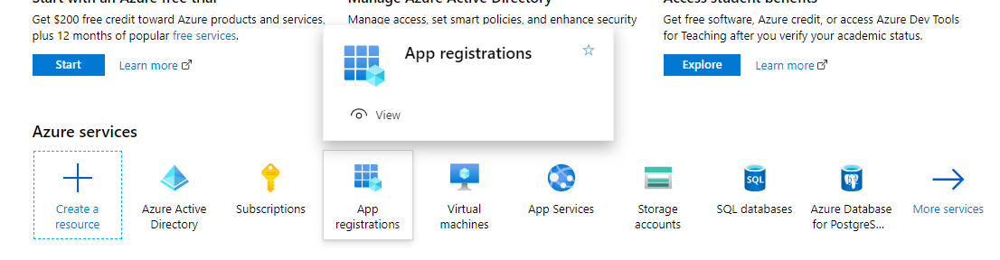

### Custom connector setup

1. Leave the **1. General** page as is and click **Security** 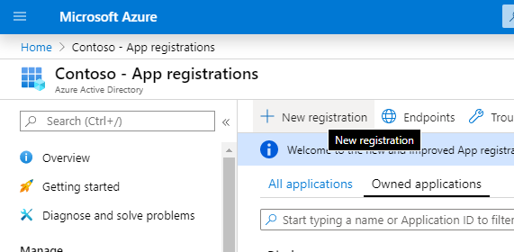
1. Click on **Edit** at the bottom of the OAuth 2.0 area to edit the authentication parameters 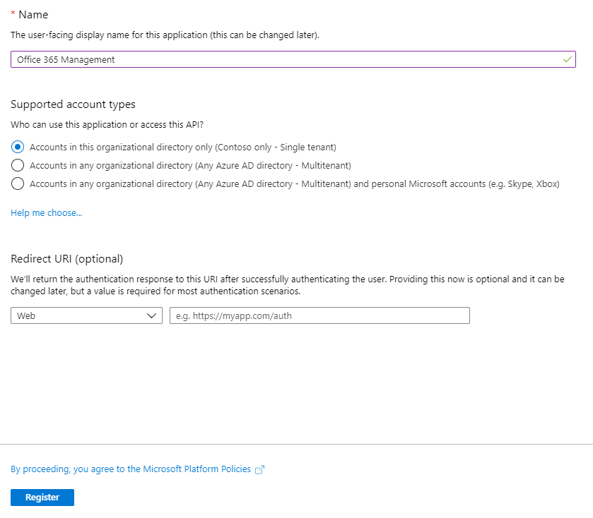
1. Paste the Application (Client) ID you have copied from the App Registration under Client Id. Remember, this is the value you copied from the Overview.
1. Paste the Client Secret you have copied from the App Registration under Client Secret. Remember, this is the value you copied from Certificates & Secrets.
1. Leave the Tenant ID to common
1. Set the Resource URL to **https://manage.office.com**
1. Copy the Redirect URL into your Notepad 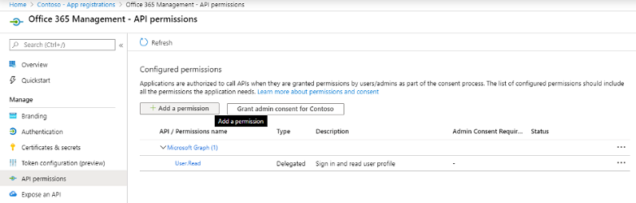
1. Click **Update Connector** 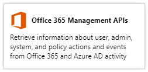

### Update Azure AD App Registration with the Redirect URL

1. Go back to the Azure AD Portal and your App Registrations
1. Under Overview, click on Add a Redirect URI  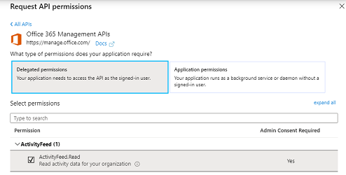
1. Select + Add a platform 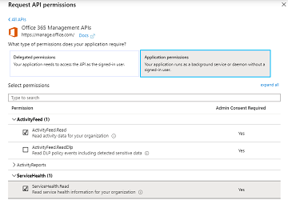
1. Choose Web 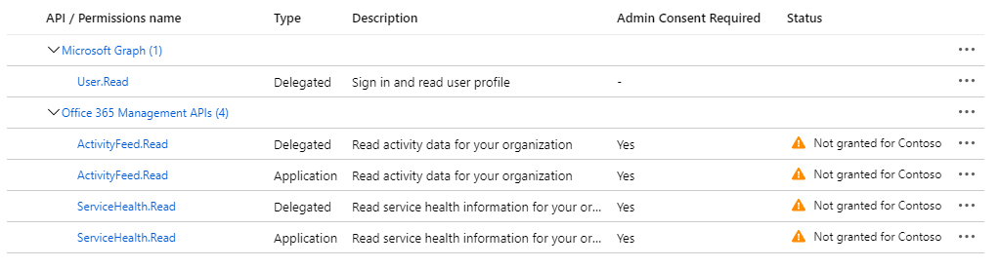
1. Enter the URL you have copied from the Redirect URL section of the Custom Connector (step 9.g above)
1. Click Configure
1. Go back to the Custom Connector setup to set up a connection to the Custom Connector and Start a Subscription to the [Audit Log Content](<https://docs.microsoft.com/office/office-365-management-api/office-365-management-activity-api-reference#start-a-subscription>). It is important to complete these steps for the flow to work.

    1. Select Test 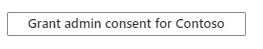

    1. Create a **+ New connection** and login to the user account with access
        to the audit logs

    1. Select **StartSubscription** as Operation 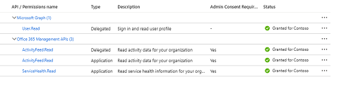

    1. Copy the Directory (Tenant ID) under **tenant** and  **PublisherIdentifier**. Remember, this is the value you copied from the Overview of the Azure App Registration 

    1. Click **Test Operation**

    1. You should see a (200) Status returned, which means the query was successful 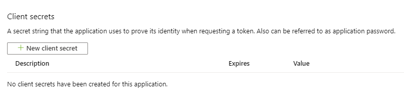 *Note: If you do not see a (200) response, the request has failed and there is an error with your setup. The flow will therefore not work.*

## Setup the Power Automate Flow

A Power Automate flow queries the Audit Log daily and writes the Power Apps
Launch Events to a CDS entity, which is then used in the Power BI Dashboard to
report on sessions and unique users of an app.

1. Navigate to [make.powerapps.com](https://make.powerapps.com)

1. Open the Center of Excellence – Audit Log solution and edit the **Admin \| Sync Audit Logs** (Click on the Flow in the solution to open it in the maker portal, and then click on edit there. You will not be able to select Edit directly from the solution.)

1. Paste in the ID you have copied from Directory (tenant) ID. Remember, this is the value you coped from Directory (tenant) ID from the App Registration Overview 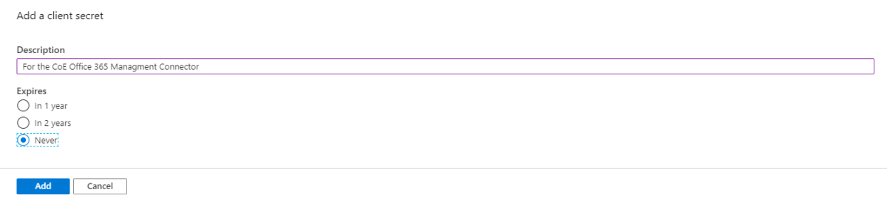 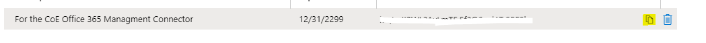

1. Optionally update the time interval at which the log clusters should be retrieved. Default is set to 1 day intervals (from Month, Week, Day, Hour, Minute, Second) 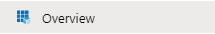

1. Optionally update the start time and end time at which the logs will read from. The maximum is 7 days in the past, and the end time must be after the start time (a smaller amount of time subtracted in the action). Use a positive
    number in the interval field. 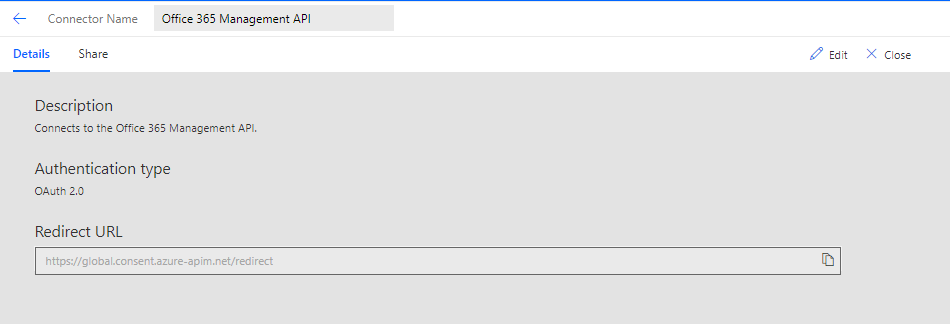

1. Go back to the Center of Excellence - Audit Log solution, open the flow details screen of the [Child] Admin \| Sync Logs by clicking on its display name

1. Edit the **Run only users** settings 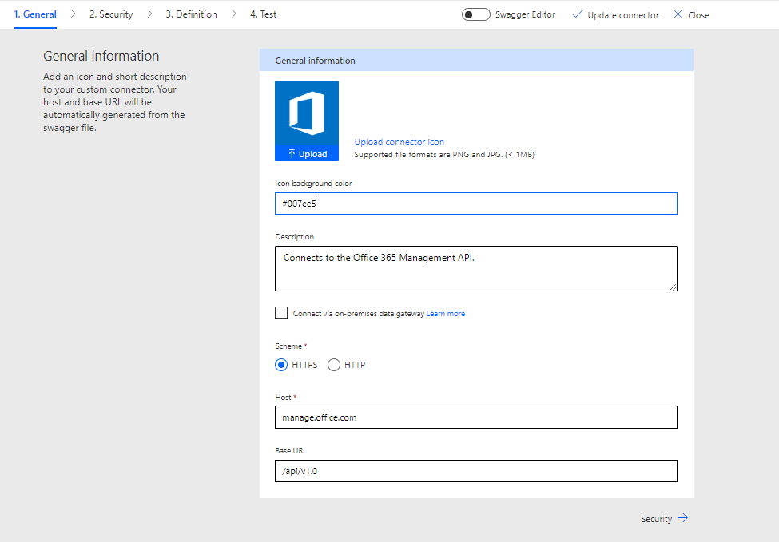

1. For both connections (Custom connector and Common Data Service), change the dropdown value to 'Use this connection (userPrincipalName\@company.com)'. If there is no connection for any of the connectors, go to Data \> Connections and create one for the connector. 

1. Click okay on the prompt

1. Click **Save** and close the Flow details tab

1. Click **Turn on** in the top navigation to turn on the Child Flow 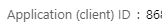

1. Check the status changes to On 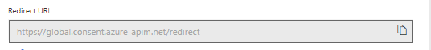

1. Go back to the Center of Excellence – Audit Log solution, click on the **Admin \| Sync Audit Log**s to open the flow details page and **Turn on** this flow as well. 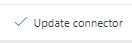

