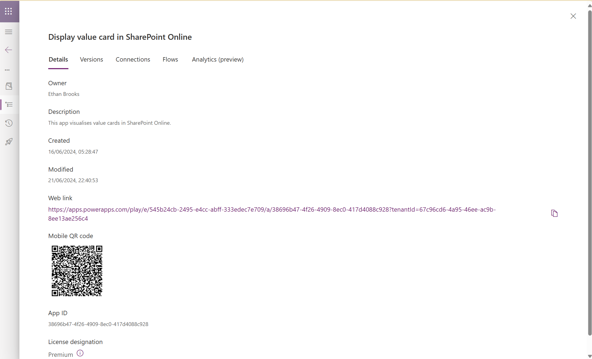

# Set up the Microsoft Power Platform business value toolkit component

This article will help you set up the [Business value toolkit component](business-value-toolkit.md) of the Center of Excellence (CoE) Starter Kit.

The business value toolkit solution contains the following artifacts:

| Type | Name | Description |
|----|-----|----|
| Dataverse table | Average cost | Stores the 'average cost of things' - used to help calculate tangible value of a solution. |
| Dataverse table | Business unit | Stores the hierarchical structure of the organization. |
| Dataverse table | Personal productivity collected data | Stores value data associated with personal productivity use cases. |
| Dataverse table | Proposal assessment collected data | Stores data  captured during proposal analysis. |
| Dataverse table | Strategic objective | Stores data used to describe strategic objectives of business units. |
| Dataverse table | Value assessment collected data | Stores data captured during the analysis of an app, including calculated value. |
| Dataverse table | Value assessment story | Stores the raw, and enhanced versions of a success story. |
| AI prompt | Assess a proposal | Used to assess a proposal (idea for an app, solution) against strategic objectives. |
| AI prompt | Assess an existing app | Used to assess an existing app against strategic objectives.|
| AI prompt | Generate enhanced success story | Used to generate enhanced success stories. |
| AI prompt | Review and refine the story | Used to refine an enhanced story. |
| AI prompt | Proposal comparison | Used to identify similar apps or proposals. |
| AI prompt | Summarise the proposal | Used to summarise the proposal for value. |
| App | Business value admin | Used to define organizational structure, strategic objectives and average cost of things. |
| App | Business value capture | Used to author success stories, perform value analysis and calculation. |
| App | Display value cards in SharePoint Online | When added to SharePoint news articles, provides visualization of value. |
| Cloud flow | AI-EnhancedStoryGen | Used to generate an enhanced story. |
| Cloud flow | AI-ValueAssessmentExistingApp | Used to analyze app against strategic objectives. |
| Cloud flow | AI-ValueAssessmentProposal | Used to analyze a proposal (app/solution idea) against strategic objectives. |
| Cloud flow | New-AdminInitiatedAssessment | Launched by an admin to assess a specific app. |
| Cloud flow | New-PersonalProductivityAssessment | Used to iterate through all flows in an environment to assess value. |
| Cloud flow | SPO-CreateSuccessStory | Used to create a success story in SharePoint online. |
| Cloud flow | AI-ProposalComparison | Used to identify similar apps or proposals. |
| Cloud flow | AI-RunComparisonCheckAgainstProposal | Used to summarize the potential impact of an idea/ proposal. |
| Connection references | Microsoft Dataverse, Microsoft Teams, Office 365 Users, Power Apps for Admins, Power Apps for Makers, Power Automate for Admins, Power Automate Management, SharePoint Online | Used throughout the Business Value Toolkit |
| Environment variable | BusinessValueAppUrl | Launch URI for the Business value capture app |
| Environment variable | CommunityHubUrl | SharePoint Online site collection URL for success stories |

> [!NOTE]
> The Business Value Toolkit component doesn't have a dependency on other components of the CoE Starter Kit. It can be used independently.

> [!NOTE]
> The Business Value Toolkit utilizes generative AI actions in Power Automate, please ensure you consider the global availability of this feature.

## Import the Business Value Toolkit component solution

Begin by downloading the CoE Starter Kit file to install the Business Value Toolkit. Note that the solution does not mandate the installation or use of the remaining components of the CoE Starter Kit.

1. Download the CoE Starter Kit compressed file ([aka.ms/CoeStarterKitDownload](https://aka.ms/CoeStarterKitDownload)).

2. Extract the zip file.

   The CoE Starter Kit compressed file contains all solution and non-solution components that make up the CoE Starter Kit.

   > [!IMPORTANT]
   > The solution name contains the version number. In the following step, use the **business_value_core_x_x_x_xx_managed** zip solution from the download.

3. Import the solution.

The import can take up to 15 minutes to be completed.

## Import sample data

> [!NOTE]
> Importing the sample task data is optional, but recommended.

If you want to prepopulate the solution with strategic objectives, organizational hierarchy and the average cost of things, follow these steps. This can be particularly helpful when you're just getting started with the Business Value Toolkit, or are testing.

1. Sample data must be installed via the 'Configuration Migration Tool' - part of ([PAC CLI](/power-platform/developer/cli/introduction?tabs=windows#install-microsoft-power-platform-cli))

1. From the PAC CLI command line, launch the tool by typing `pac tool cmt`

1. Select **Office 365** for 'deployment type'.

1. Select **Import data**

1. Select **Show advanced**, enter your username and password.

1. Select the environment in which you have imported the Business Value Toolkit.

1. Select **'Log in'** - (enter username and password if using a different account to connect).

1. Browse to the zip file that you downloaded (BV-sample-data.zip).

1. Select **Import data**

## Populating Data in the Business Value Admin App

The Business Value Admin App serves as the central repository for data related to your organization’s structure, strategic objectives, and average costs. This essential data underpins the toolkit's capabilities in value alignment analysis and value calculation.

The following table provides guidance for populating the Business Value Admin app with essential data

| **Task**                               | **Description**                                                                                          |
|----------------------------------------|----------------------------------------------------------------------------------------------------------|
| Setting up business units             | Use the Business Value Admin App and select the Business units page. Add in the teams, departments, and business units that represent your organization and hierarchy. |
| Adding strategic objectives           | Work closely with the various teams and departments to capture the objectives and how they are measuring progress towards them. This is a crucial component of the sample solution. Assign strategic objectives to the relevant team/ department. |
| The average cost of things            | This data is used to calculate the tangible impact an app is having against a strategic objective. Work with your teams and departments to add in this data. This data is assigned to business units. |

### Business Value Toolkit Schema Overview

The schema below outlines the various tables and columns used within the Business Value Admin App, detailing their specific purposes:

| Table             | Column            | Purpose |
|-------------------|-------------------|---------|
| Business unit     | Name              | Identifies the name of the business unit, team, or department. |
| Business unit     | Parent business   | Links a business unit, team, or department to its overarching entity. |
| Strategic objective | Name            | Names the strategic objective (e.g., 'Foster a safe and healthy work environment'). |
| Strategic objective | Description     | Provides detailed information about the strategic objective (e.g., 'Contoso will prioritize employee well-being by ensuring a safe and healthy workplace'). |
| Strategic objective | Measures        | Lists metrics that indicate progress towards the strategic objective (e.g., 'workplace incidents, accident severity, training completion rates'). |
| Strategic objective | Business unit   | Associates the strategic objective with a specific business unit. |
| Strategic objective | Owner           | Indicates the user who created the strategic objective record. |
| Strategic objective | Action verb     | Specifies the action type the objective promotes, using a choice column (e.g., 'Decrease'). |
| Strategic objective | Key result area | Categorizes objectives for analytics purposes, useful for Power BI dashboards (e.g., 'Employee engagement'). |
| Strategic objective | Quantifiable target | Details the type of measure used, employing a choice column (e.g., %, $, qty, time, rating, score). |
| Strategic objective | Time period     | Defines the duration for achieving the objective using a choice column (e.g., 'Annual'). |
| Strategic objective | Measurable component | Expands on the 'Measures' column to describe detailed tracking methods for the objective's progress (e.g., 'Track the number of workplace incidents, frequency and severity of injuries, monitor employee safety training completion'). |
| Strategic objective | Objective target | Sets a specific target for the objective (e.g., 75%, when combined with the quantifiable target). |
| Strategic objective | Current measure | Specifies the type of current measure using a choice column (e.g., %, $, qty, time, rating, score). |
| Strategic objective | Current value   | Records the current value if available. |
| Average cost       | Name            | Names the average cost item (e.g., 'Average cost of workplace injury'). |
| Average cost       | Average cost    | Specifies the numerical average cost (e.g., $10,000). |
| Average cost       | Unit            | Defines the unit of measurement (e.g., qty, time). |
| Average cost       | Business unit   | Associates the cost data with a particular business unit. |

> [!NOTE]
>To effectively populate this data, collaborate closely with stakeholders across various business units. Since strategic objectives are often decentralized and embedded within individual units, gathering this information directly from the teams involved is crucial. Engage with these teams to gain a thorough understanding of their strategic goals and the average costs associated with their operations.

## Assessing the value of an existing app

The Business Value Toolkit is designed to systematically capture and articulate the 'story behind the app,' ensuring organizations can consistently produce high-quality success stories. Leveraging generative AI capabilities through the 'create text using a prompt' action in Power Automate, the toolkit enhances the narrative quality of these stories and analyzes for alignment and impact on strategic goals of the organization.

### AI-Enhanced Success Story Generation

The toolkit employs specific prompts within Power Automate to enhance and refine the narratives provided by app owners. Below is an overview of the prompts used in this process:

| Prompt Name                  | Description                                                                                                                      | Where Used                     |
|------------------------------|----------------------------------------------------------------------------------------------------------------------------------|--------------------------------|
| Generate enhanced success story | This prompt transforms the initial story text into a polished format akin to a business magazine article. It also converts the text into HTML for publication on SharePoint Online, pending approval from the app owner. | Cloud flow: AI-EnhancedStoryGen |
| Review and refine the story    | This prompt further refines the enhanced story, improving readability and flow by processing the AI-generated content through additional refinement stages. | Cloud flow: AI-EnhancedStoryGen |

These prompts facilitate the creation of engaging and well-structured success stories that resonate with business audiences, making complex app functionalities accessible and relatable.

#### Story data schema

The following table illustrates the data schema relating to stories and proposals:

| Table                              | Column                     | Purpose                                                                                                                       |
|------------------------------------|----------------------------|-------------------------------------------------------------------------------------------------------------------------------|
| Value assessment stories    | AI assist                   | If story has been enhanced with genAI. |
| Value assessment stories    | Blog post                  | Currently unused, but can facilitate curated versions of the AI enhanced story. |
| Value assessment stories    | Enhanced AI story                   | Restructured, enhanced and HTML formatted story. |
| Value assessment stories    | Name                   | If row is a story, represents the GUID of the app assessed, if row is a proposal, it is the proposal title. |
| Value assessment stories    | Original story               | JSON formatted, original text provided by the user for both assessments and proposals. |
| Value assessment stories    | Story type                   | Defines if row is an existing app or proposal. |
| Value assessment stories    | Supplemental content                  | Generated to summarize the app or idea. |
| Value assessment stories    | Story status                  | If story has been approved by the user. |
| Value assessment stories    | Story title                   | Title of story or proposal |

### Story approval and communication

Before a story is shared within the organization, it must receive user approval. Once approved, the story is created as a news article in SharePoint Online. Initially, as an unpublished page, the article then requires an administrator or a user with appropriate permissions to finalize it by adding images and making any necessary adjustments before publishing.

> [!NOTE]
>To integrate with SharePoint Online, ensure you populate the environment variable: **CommunityHubUrl**. This URL should point to a SharePoint Online site collection provisioned using the communications site template. Success stories are housed within the Pages library. For instance, your SharePoint site URL might resemble: `https://contoso.sharepoint.com/sites/power-platform-coe`. You should also ensure the account that the cloud flow runs with has at least **'Member'** access in the SharePoint Online site collection.

#### Adding value cards to a success story in SharePoint Online

The Business Value Toolkit provides a canvas app ('Display value card in SharePoint Online') that can be added to the success story. The following steps instruct how to **add and configure the canvas app**:

Prior to editing the page in SharePoint Online:

1. Go to make.powerapps.com > select **'Solutions'** > select **'Business Value'** > **Apps**
1. Select the elipsis **(...)** next to the canvas app named **'Display value cards in SharePoint Online'** then copy the web link:



1. Copy the **'Story ID'** of the success story that you want to add the canvas app to
1. Enter 'edit' mode on the story page, by selecting the **'Edit'** button.
1. Choose the area in the page where you would like to add the canvas app, then select the **'+'** button and select **'Microsoft Power Apps (Preview)'**
1. In the **'App web link or Id'** input, add the following parameter to the web link URL: ``` ?&storyId=<paste story Id> ```
1. Save the page/ republish the page when ready.

### Initiating Value Assessments with the Business Value Toolkit

The Business Value Toolkit provides flexible methods for initiating a value assessment, catering to different roles and use cases within the organization. These methods ensure that assessments can be effectively managed and initiated according to specific needs and in the correct context.

### Methods of Initiation

1. **User Initiated - existing app assessment**:
   - Users launch the Business Value Capture app.
   - Users select an application to assess from within the app.

2. **Admin Initiated - existing app assessment**:
   - Administrators identify an application that requires assessment.
   - Administrators initiate the value assessment process.

3. **Admin Initiated - personal productivity flows**:
   - Administrators identify an environment to assess personal productivity flows.
   - Administrators initiate the assessment process.

These initiation methods offer tailored approaches for different organizational stakeholders, enhancing the efficiency and relevance of value assessments.

#### User-Initiated Value Assessment

The following steps outline the **user-initiated** value assessment process:

1. The user launches the business value capture app.
2. The user selects 'Assess an existing app' from the navigation options.
3. From the list of available apps, the user chooses the app they want to assess.
4. The user shares the story behind the app, including:
   - The challenges faced
   - The solution developed
   - Any obstacles encountered
   - The initial value realized
   - Future plans
5. The system utilizes generative AI to enhance and reformat the story. The user can edit and approve the final version.
6. The story is created as an unpublished news article in SharePoint Online, allowing administrators or users with the required permissions to add images and make final edits before publishing.
7. The user reviews and selects the strategic objectives impacted by the solution, identifying the areas of greatest impact.
8. The final phase involves using the value calculator to accurately determine the app's value.


#### Administrator initiated value assessment

The following steps apply to the **administrator initiated** value assessment scenario:

1. The administrator identifies an app (either through CoE Starter Kit dashboard, PPAC dashboard, or custom solution):


1. The administrator copies the ID of the app, and ID of the environment.
1. The administrator runs the cloud flow titled 'New-AdminInitiatedAssessment', pasting the ID for the app and environment.


1. The flow runs, and sends an adaptive card to the flow owner, inviting them to complete an assessment:


1. The user clicks the button to start the assessment, and launches the Business value capture app (with context).

> [!NOTE]
>Administrator initiated assessments are initiated by populating the New-AdminInitiatedAssessment cloud flow.  This flow requires that the **BusinessValueAppUrl** environment variable is populated with the launch Url of the Business Value Capture canvas app.  You can retrieve this Url by selecting the elipsis '...' > Details and copying the 'Web link' Url

#### Administrator initiated personal productivity assessment

The following steps apply to the **administrator initiated personal productivity assessment**

1. The administrator identifies an environment that they want to assess.
1. The administrator copies the ID of the environment.
1. The administrator runs the cloud flow 'New-PersonalProductivityAssessment', pasting the ID for the environment into the variable 'Environment ID'.
1. The flow runs and sends an adaptive card to the owner of each flow in the environment containing two questions designed to establish value (in time saved), and criticality of flow.


#### Personal productivity assessment data schema

The data collected from user responses is described in the table below:

| Table                              | Column                     | Purpose                                                                                                                       |
|------------------------------------|----------------------------|-------------------------------------------------------------------------------------------------------------------------------|
| Personal productivity collected data    | Asset type                   | Describes the asset type assessed, currently only cloud flows are assessed.                                                           |
| Personal productivity collected data    | Criticality                  | Integer defining criticality of cloud flow to user, team, department or organization.                                         |
| Personal productivity collected data    | Duration                | Describes the duration of saving (hours/ minutes).  |
| Personal productivity collected data    | Value                  | Describes the amount of time saved.                                  |
| Personal productivity collected data    | Name                   | The Identifier of the asset assessed.          |

#### Value assessment data schema

The data collected during value assessment is described in the table below:

| Table                              | Column                     | Purpose                                                                                                                       |
|------------------------------------|----------------------------|-------------------------------------------------------------------------------------------------------------------------------|
| Value assessment collected data    | Accepted                   | Indicates whether the analysis has been agreed upon by the user.                                                              |
| Value assessment collected data    | Action category            | Describes the type of strategic objective (e.g., improvement, reduction).                                                     |
| Value assessment collected data    | Action verb                | Specifies the action associated with the strategic objective.                                                                 |
| Value assessment collected data    | Actual impact measure      | Quantifies the impact of the app on a scale of 1 to 5 during value analysis.                                                   |
| Value assessment collected data    | After implementation value| Reflects the value observed after the implementation of the app.                                                               |
| Value assessment collected data    | Alignment to objective     | Indicates the degree of alignment between the app's impact and the strategic objective, rated on a scale of 1 to 5.           |
| Value assessment collected data    | Average costs              | Represents the average cost utilized in calculating the value impact.                                                          |
| Value assessment collected data    | Impact                     | Illustrates the impact of the app on the strategic objective.                                                                  |
| Value assessment collected data    | Impact type                | Categorizes the impact as tangible or intangible, determined through analysis.                                                |
| Value assessment collected data    | Key value statement        | A concise statement generated during analysis that summarizes the app's impact.                                                |
| Value assessment collected data    | Objective title            | Provides the title of the strategic objective being assessed.                                                                  |
| Value assessment collected data    | Summary                    | Offers a summary of the assessment when used in proposals.                                                                      |
| Value assessment collected data    | Value statement action     | Identifies the type of impact in the value card.                                                                               |
| Value assessment collected data    | Value statement measure    | Specifies the impact the app has on achieving the strategic objective.                                                         |
| Value assessment collected data    | Value statement verb       | Describes the impact the app has on achieving the strategic objective in verb form.                                           |
| Value assessment collected data    | Before implementation value| Represents the value before the app was implemented.                                                                           |
| Value assessment collected data    | Confidence                 | Indicates the level of confidence in the analysis.                                                                             |
| Value assessment collected data    | User Acceptance            | Indicates whether the analysis has been agreed upon by the user.                                                                |

These datasets can be used to develop dashboards providing valuable insights into the time saved by personal productivity flows.

## Assessing the potential value of an idea or proposal

The toolkit employs specific prompts within Power Automate to assess the potential impact of an idea or proposal, along with conducting checks for similar apps and ideas to reduce duplication of effort.


Below is an overview of the prompts used in this process:

| Prompt Name                  | Description                                                                                                                      | Where Used                     |
|------------------------------|----------------------------------------------------------------------------------------------------------------------------------|--------------------------------|
| Assess a proposal | This prompt takes the idea created by the app user and analyzes for alignment and impact against each strategic objective | Cloud flow: AI-ValueAssessmentProposal|
| Proposal comparison | This prompt checks for similarities with other stories and proposal over two scopes: similarity in audience and similarity of features and functionality. | Cloud flow: AI-ProposalComparison |
| Summarise proposal impact | This prompt summaries the potential impact, providing an overview of the solution, potential business value and positive impact on stakeholders. | Cloud flow: AI-RunComparisonCheckAgainstProposal |

These prompts facilitate the creation of engaging and well-structured success stories that resonate with business audiences, making complex app functionalities accessible and relatable.

### Proposal/ idea assessment data schema

The data collected from an idea/ proposal is stored in the following Dataverse table:

| Table name | Purpose |
|------------|---------|
| Proposal assessment collected data | Stores data relating to the assessment of a proposal/ idea. Data is stored in the following columns:|

- AppStoryName: text - the title provided for the idea/ proposal.
- AudienceMatch: text - summary data from checking for audiences.
- ComparisonScore: integer - Score provided (confidence in overall comparison).
- FeatureMatch: text - summary data from checking for similar features.
- Name: text (GUID) - Id of the idea/ proposal.
- StoryId: text (GUID) - Id of the related story. |

[!INCLUDE[footer-include](../../includes/footer-banner.md)]
