# Set up core components

## Import the Solution

This is the first setup step of the installation process and is required for every other component in the starter kit to work.

1. Download the CoE starter kit compressed file ([aka.ms/CoeStarterKitDownload](https://aka.ms/CoeStarterKitDownload)), and extract the zip file. It will contain the solutions.
1. Create an Environment in which to set up the CoE. Please see the following for information about[Sandbox](https://docs.microsoft.com/power-platform/admin/sandbox-environments) and [ALM](https://docs.microsoft.com/power-platform/admin/wp-application-lifecycle-management) generally.
    1. Go to [aka.ms/ppac](https://admin.powerplatform.microsoft.com/)
    1. Select Environments, **+ New**, and then fill in a name, type and purpose
    1. Select **yes** for creating the database, and click Next 
    1. Leave sample apps and data to no, and then select a security group who can view this environment. Then hit Save .
    Navigate to your new environment
       1. Go to <https://make.powerapps.com>
       1. Navigate to the Environment you just created, where the CoE solution will be hosted in. In the screenshots example, we're importing to the Environment called 'Contoso CoE'. 
    1. Select Solutions on the left navigation bar.
    1. Select **Import**, and a pop-up window will appear (make sure to disable the pop-up blocker in your browser and try again if nothing happens when clicking the Import button).
    1. In the pop-up window, select **Choose File**.  
    1. Choose the MANAGED **Power Platform** solution from the file explorer   (CenterOfExcellenceCoreComponents_x_x_x_xx_managed.zip).

1. When the compressed (.zip) file has been loaded, click **Next**.

    1. Review, click **Next**, then click **Import**. (This can take some time.)
    1. When the import succeeds, the list of the components that were imported is displayed.
    1. Close out of the logs dialog.
    1. Back on the Solutions page, click **Publish All Customizations**. This is good practice to follow whenever you make changes to a solution, but especially so when importing.

>[!NOTE]
>When importing the solution, sometimes Power Automate components show a warning of type "Process Activation" and a duplicate record of that component. You can ignore these warnings for flows.

## Configure the CoE Settings Entity

This section explains how to enter data in the CoE Settings entity, which is in the Common Data Service you instantiated. It represents the settings for components in the solution and should be completed second.
The steps below will have you fill this entity with a single row which contains your logo, brand colors and so on, which different applications will reference.

The following assets depend on the CoE Settings being entered:

- **Canvas Apps**. The optional branding details (e.g., logo, brand colors) in
       all the canvas apps are pulled from this entity. Optional support and
       community channel links are also used.
- **Optional Flows**. The optional branding details and support channel links
       are used in the flows used for communication. You also will configure links
       to the canvas apps in the settings. The main flow that syncs data to the
       resource entities do not depend on this setting configuration.

1. Navigate to [make.powerapps.com](https://make.powerapps.com/), click on Apps and open the Power Platform Admin View model driven app in Play mode.
1. In the left navigation, click on **Configure** (under Settings)
1. In the Settings view screen, click on **+ New** to create a new record
1. Provide values as per below table.
1. Save by clicking CTRL + S or by clicking the **Save** button in the bottom right corner.
1. Do not add more records to the CoE Settings table, there is no need. The dependent components will always get values from the first record so there only needs to be one record in this table.

| Name | Setting Value |
|------|------------|
| Brand Logo | Link to your Logo as an image file |
| Brand Primary Color          | HEX Value of your primary brand color (\#cccccc)
| Brand Secondary Color        | HEX Value of your secondary brand color (\#dddddd)                                                    |
| Email End User Support       | Email Address for your Helpdesk or EUC Support Team                                                   |
| Email Maker Support          | Email Address for your Power Platform Maker Support Team                                              |
| Link to Community Channel    | Link to your internal Power Platform Community (Yammer, Teams)                                        |
Link to Learning Resource    | Link to internal Power Platform Learning Resources or Training or you could link to aka.ms/PowerUp    |
Link to Policy Documentation | Link to internal Power Platform Policies, these could be hosted in a Teams Channel or SharePoint site |
Version                      | Set to 1.0                                                                                            |
Company Name                 | Your Company Name as it will appear in Dashboards |

## Update Environment Variables

This step should be completed after the first two steps above. The Environment variables are used to store application and flow configuration data with data specific to your organization and/or environment. This means, you only have to set the value once and it will be used in all necessary flows and apps.

The following assets depend on the Environment Variables being set:

- All of the Sync flows depend on all Environment Variables being configured.

You will see an error at the top, notifying you that Environment Variables need to be configured. For the Core Components solution, it will be **3** environment variables that need to be configured. [Prompt to setup Environment Variables](media/coesetup_setupenvvar.png)

1. Click on a variable and configure the **Default Value** 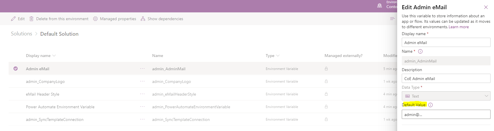
1. You will configure the following Variables for the Core Components solution, confirm by clicking **Save**

| Name | Default Value |
|------|---------------|
|Power Automate Environment Variable | For a US environment <https://us.flow.microsoft.com/manage/environments/> For an EMEA Environment <https://emea.flow.microsoft.com/manage/environments/> For a GCC Environment <https://gov.flow.microsoft.us/manage/environments/> |
|Admin eMail                         | eMail address used in flows to send notifications to Admins, either your email address or a distribution list                                                                                                                |
|eMail Header Style                  | CSS Style used to format emails that are sent to admins and makers

## Activate the Sync Template Flows

This step should be completed after the first three steps above. The flows with
the prefix 'Sync' are required for populating data in the 'resource' related CDS entities (Environments, PowerApps Apps, Flows, Connectors and Makers).

The *Sync flows* are used to write data from the admin connectors into the CDS
entities. None of the other components will work if the Sync flows aren't
successfully configured and have executed.

Required Flows to sync data to the resource entities:

1. **Admin \| Sync Template v2**  
    Flow type: Scheduled (daily by default)  
    Description: This flow syncs environment details to the CoE CDS Entity
    'Environments'

1. **Admin \| Sync Template v2 (Apps, Custom Connectors, Flows, Model Driven
    Apps)**  
    Flow type: Automated  
    Description: This flow rely on the Admin \| Sync Template v2 and are
    triggered automatically when environment details are created or modified in
    the CoE CDS Entity 'Environments'. These Flows then crawl environment
    resources and store app, flow, connector data in the entities 'PowerApps
    App', 'Flow', 'Connection Reference', 'Maker'.

1. **Admin \| Sync Template v2 (Connectors)**  
    Flow type: Scheduled (daily by default)  
    Description: This flow stores all connector information in the CDS Entity
    'PowerApps Connector'.

1. **Admin \| Sync Template v2 (Sync Flow Errors)**  
    Flow type: Scheduled (daily by default)  
    Description: If any of the Sync flows fail, the failure is stored in the CDS
    Entity 'Sync Flow Errors'. This scheduled flow sends a report of failures to
    the admin.

The flows are all part of the solution. It is automatically available in the
Environment when you import the solution, but there are two options to consider
for activation of the flows. Option 1 takes longer to configure than option 2
but is also easier to receive updates.

### Option 1: Keep Flow in the solution and update each action connection

Use this option if you would like to continue receiving updates to the flow
through this solution. This takes longer to set up because the connections for
each action need to be individually configured.

1. Go to the *Center of Excellence - Core Components* solution.

    1. Navigate to [make.powerapps.com
    ](https://make.powerapps.com) and set the current Environment to the same Environment where the Center of Excellence solution is installed

    1. In the left navigation, click on **Solutions**, then select the **Center of Excellence - Core Components** solution

1. Click on the flow name to get to the details screen, then select **Edit** 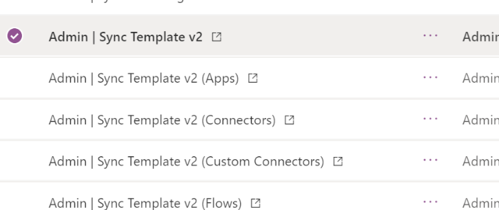

1. The flow will open in the maker studio. For each action that requires a connection, there will be a warning icon on the right side of the action. This indicates the need for a connection to be selected.  If, when you hit save, you see this error, that means that there are more connections that still need made, likely hidden in conditional nodes. 

    1. Some connections will need to be created if not already available

    1. Some actions might be hidden within other built in actions, such as a      condition or scope. Expand these actions to find the hidden ones

    1. Suggest you start at the top of the flow and work down, opening each      step as you go down, step by step until you find them all.

1. Once all actions have a connection, save the flow.

1. Repeat the above steps for *Admin \| Sync Template v2 – Apps, Connectors,   Custom Connectors, Flows, Model Driven Apps and Sync Flow Errors*

1. Ensure the flows are **Turned On**

1. Trigger the sync flows to populate your data

    1. Click on **Admin \| Sync Template v2**

    1. This will open a new tab to the flow's details page.

    1. Click **Run** in the Ribbon

### Option 2: Save a copy of the Flow outside of the solution

Save a copy of the flow from the solution and the connections are created
automatically for you. The drawback from this method is that if you copy the
flow from the solution, the copy flow does not get updated when you update the
solution package with newer versions. You will just have to import the new solution and copy the flows again to upgrade them to the latest version.

1. Go to the *Center of Excellence - Core Components* solution.

    1. Navigate to [make.powerapps.com](https://make.powerapps.com) and set the current Environment to the same Environment where the Center of Excellence solution is installed

    1. In the left navigation, click on **Solutions**, then select the **Center of Excellence - Core Components** solution

1. Click on the display name of the flow you want to enable. This will open a  new tab to the flow's details page. 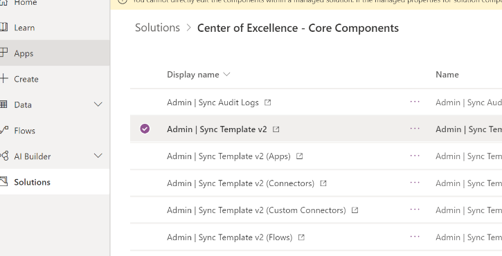

1. Select **Save As** in the ribbon 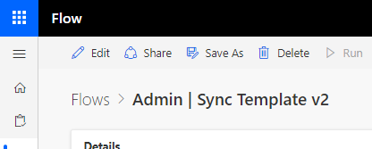

1. A window will popup saying, "We'll create these connections for you". Click Continue. 

1. Rename the copy if desired. Click **Save**.  

1. At this point, the copy has been created. You can view the flow in the **My Flows** page in the left navigation. Remember that the copy of the flow will NOT be visible in the Center of Excellence – Core Components solution.

1. Repeat the above steps for Admin \| Sync Template v2 – Apps, Connectors, Custom Connectors, Flows, Model Driven Apps and Sync Flow Errors

1. Turn each flow on

    1. Click on each flow

    1. This will open a new tab to the flow's details page.

    1. Click Turn On in the Ribbon

1. Trigger the sync flows to populate your data

    1. Click on Copy of Admin \| Sync Template v2

    1. This will open a new tab to the flow's details page.

    1. Click Run in the Ribbon

## Setup Audit Log sync

This flow connects to the Office 365 Audit Log to gather telemetry data (unique
users, launches) for Power Apps apps. The flow uses a custom connector to
connect to the Office 365 Audit Log. In the instructions below, we will setup
the custom connector and configure the flow.

The usage information in the Power BI dashboard depends upon this step being
complete.

> [!NOTE]
> If your Admin account is protected with MFA, using Basic Authentication to authenticate will not work. Please use the seperate solution and setup instructions under Set up Audit Log (MFA) if your Admin account has MFA enabled.

Make sure the account that is used to configure this section has permission to
access the audit logs. Global tenant admins have access to the audit logs by
default and can grant access to the audit logs for other user accounts or groups
through the Exchange Admin Center.

Keep in mind that once a user account has access to the audit logs, they have
access to all audit logs across every Microsoft service that reports telemetry
to audit logs.

1. Install the custom connector

    1. Go to [flow.microsoft.com](https://flow.microsoft.com) and set the current Environment to the same Environment where the Center of Excellence solution is installed.

    1. In the left navigation, expand **Data** and click **Custom Connectors**

    1. Click **+ New custom connector – Import an Open API file**

    1. Provide a connector name (Office 365 Audit Logs) and select the .swagger file that is which can be found in the CoE Starter Kit pack you downloaded. 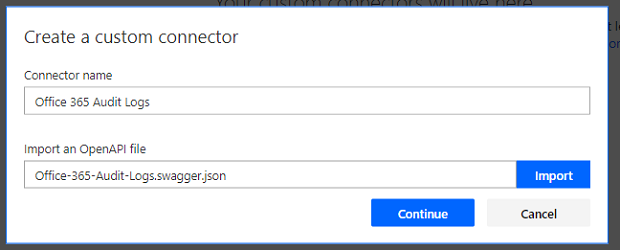

    1. Click on **Create Connector**

    1. You don't need to change the Security and Definition information, to test the connector select **4. Test** 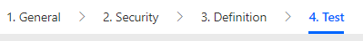

    1. Click on New Connection to create a connection to your connector 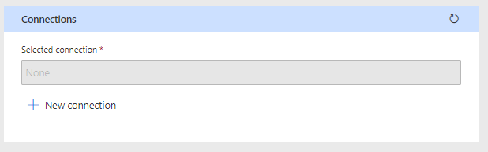

    1. Enter the email address and password of the user that has access to the Audit Logs in the connection window and select Create connection 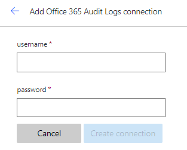

    1. Select the refresh icon in the right-hand corner of the Connections area to ensure the new connection is selected

    1. Provide a Start Date and End Date for the **GetActivitiesByOperation**       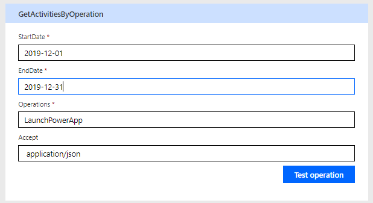

    1. Click **Test Operation**

    1. You should receive a (200) response which indicates a successful execution of the query  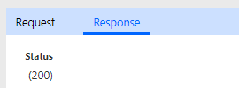

    1. For more information on how to configure a custom connector, see the [custom connector documentation](https://docs.microsoft.com/connectors/custom-connectors/define-openapi-definition#import-the-openapi-definition)

1. Import the Flow Template compressed (.zip) package called SyncAuditLogs.zip.

    1. Go to [flow.microsoft.com](https://flow.microsoft.com) and set the current Environment to the same Environment where the Center of Excellence solution is     installed.

    1. In the left navigation, navigate to the **My Flows** tab

    1. Click **Import** in the top

    1. Select the **Flow-SyncAuditLogs.zip** package, click import

    1. Connect the connections

        1. Click on each of the red icons shown to configure 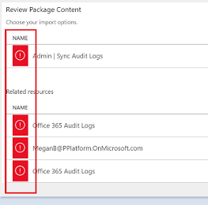

        1. For Admin \| Sync Audit Logs, select to Create as new, and Save

        1. For the rest, chose to Select on input, and chose the option given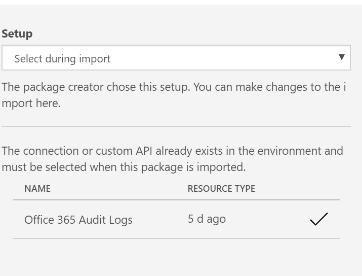

        1. Once you select these the icon will show as an x until you hit   Import 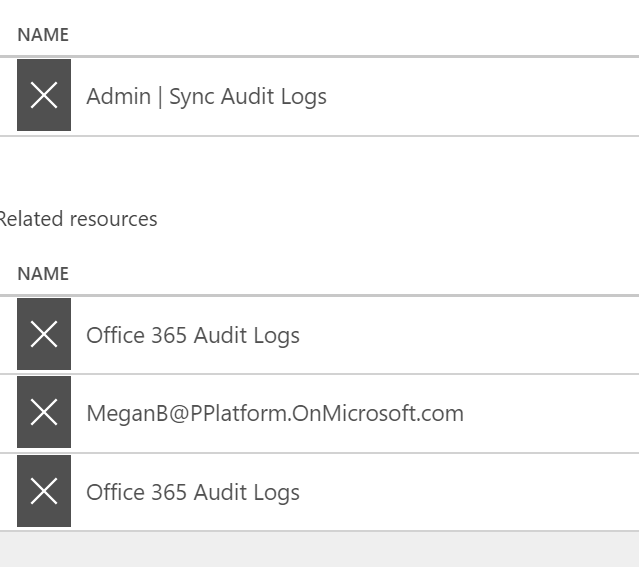

    1. Once the connections are configured, click Import 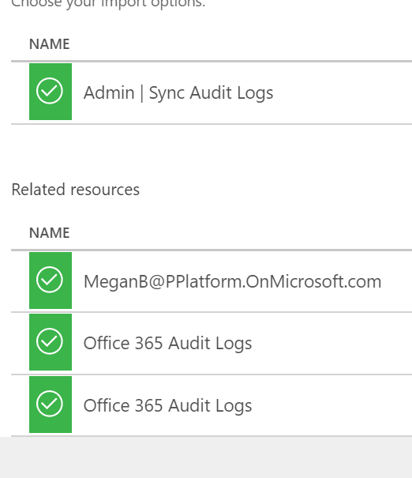

    1. Open the flow and make sure there are no errors for any of the actions.

    1. Click the back arrow in the upper left to go back to the flow details
        screen. If the flow is not yet on, turn on the flow and run it to start
        syncing audit log data to the CDS entity.

## Configure the Power BI Dashboard

The Power BI Dashboard provides a holistic view with visualizations and insights into resources in your tenant: Environments, Power Apps apps, Power Automate flows, Connectors, Connection References, Makers and Audit Logs. Telemetry from the Audit Log is stored from the moment you set up the CoE Starter Kit, so over time you can look back and identify trends for longer than 28 days.

1. Get the Environment URL

    1. Go to the [Power Platform Admin Center](https://aka.ms/ppac)

    1. Click on **Environments**, and select the Environment where the Center of Excellence solution is installed

    1. Copy the organization URL in the details window. 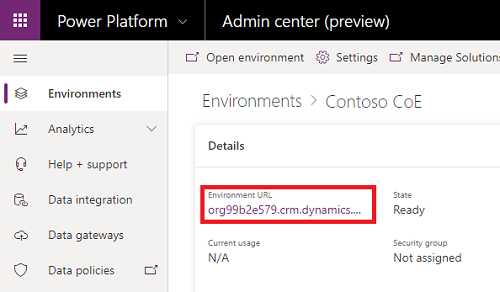

    1. If the URL is cut off, you can see the full URL by clicking See all \> Environment URL [A screenshot of the Environment Settings available in the Power Platform Admin Center](media/coesetup_orgurl.png)

### Get the Power BI Dashboard from App source

> [!NOTE]
> You cannot deploy from AppSource if you are deploying to GCC. If you are
targeting GCC, please use the *Configure the Power BI Dashboard using the pbix file* instructions below.

The Power BI Dashboard is now available via App Source

1. A pre-requisite is to have the CoE Core Components Solution installed, as outlined above.

1. Navigate to the [CoE Starter Kit page on App Source](https://appsource.microsoft.com/product/power-bi/powerapps_pbi.powerapps_coe)

1. Select **Get It Now** 

1. Confirm the T&C and make sure you are signed in with your organization account

1. Wait for the app to install  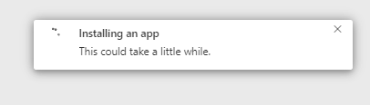

1. **Go to app** once it finished installing  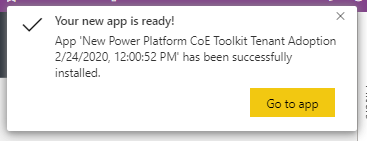

1. To connect the dashboard to your own environment and data, select **Connect**  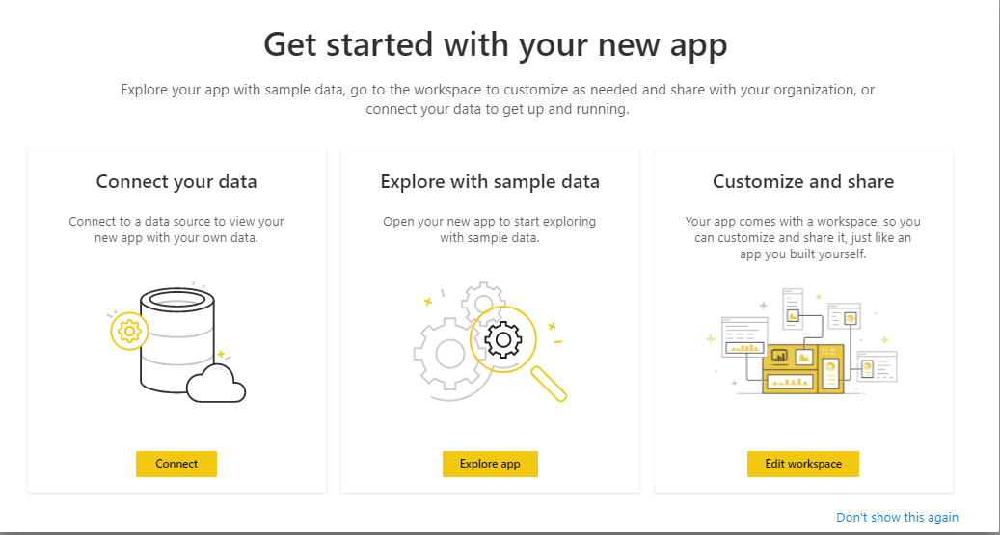

1. Copy and paste the URL you retrieved in *Step 1 Get the Environment URL* (section above) under **EnvironmentUrl** and click **Next** 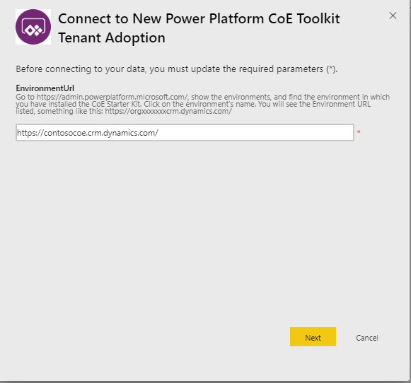

1. Confirm your login to finish setting up the app

1. The Dashboard app will show under the **Reports** tab of your workspace and can be opened from there 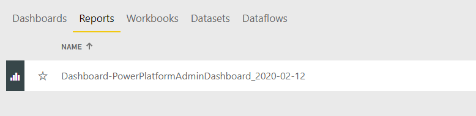

#### Configure the Power BI Dashboard using the pbix file

1. You can also configure and modify the Power BI Dashboard by working directly with the Power BI (pbix) file and the Power BI Desktop client. This gives you more flexibility in terms of modifying the dashboard to your own branding and include/exclude pages or visuals you want to see in the dashboard.

1. Open the **PowerPlatformAdminDashboard.pbix** file, which can be found in the CoE Starter Kit pack you downloaded.

1. Sign-in to your account that has access to the entities.

1. Go to **Edit Query** in the top ribbon (under Home). 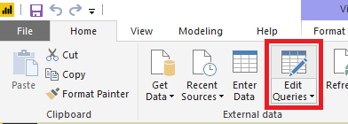

1. Select the OrgUrl parameter and replace the URL with your instance's URL. Make sure to keep the 'http**s**://'. 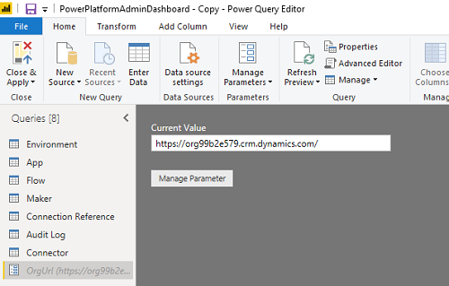

1. Click **Edit Credentials** 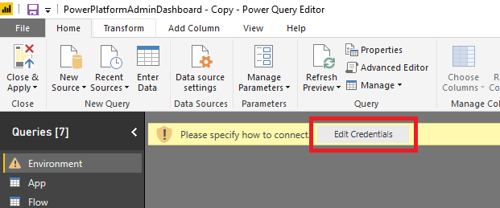

1. Sign-in to your Organizational account. Once signed in, click **Connect**.

1. A preview of the data will load into your table. 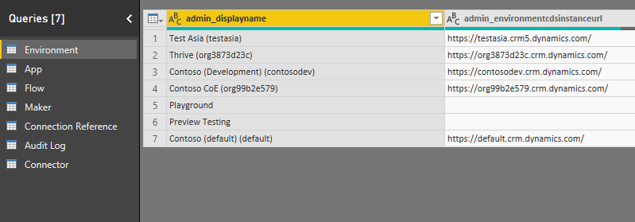

1. Click **Publish**, you will see a link to the report in the presented dialog.

1. You can find the report later by navigating to [app.powerbi.com](https://app.powerbi.com/)

1. Click **Close & Apply**.

## Share apps with other admins

The Core Components solution does not contain any apps for makers or end users,
but only admin specific apps.

The user account who uploaded the solution and the Environment admin of the
Environment the solution exists in will have full access to the solution,
however you might want to share these apps with specific other users. To find more
information on sharing, see the [documentation on sharing Canvas Apps]([this
blog](https://docs.microsoft.com/en-us/powerapps/maker/canvas-apps/share-app).

These components are designed to give admins better visibility and overview of
resources and usage in their environments. None of the components are to be
shared with makers or end users.

## Wait for Flows to Complete

Once the Sync Flows have finished running (depending on the number of
environments and resources, this can take a few hours) you are ready to use the
Core Components of the CoE Starter Kit.

To check the status:

1. Click on Admin \| Sync Template v2

1. This will open a new tab to the flow's details page.

1. View the Runs