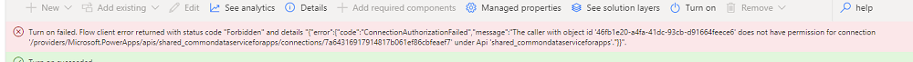
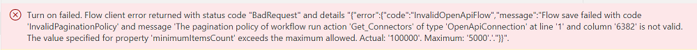

# Set up inventory components

This article helps you set up the inventory components of the Core solution of the Center of Excellence (CoE) Starter Kit. The inventory is the heart of the CoE; before embarking on your Microsoft Power Platform adoption journey, you want to first understand whether you have existing apps, flows, and makers, and lay the foundation to monitor new apps and flows being created.

The flows and dataflows in this solution sync all your resources into tables and build admin apps, flows, and dashboards on top of this inventory to help you get a holistic overview into the apps, flows, and makers that exist in your environment. Additionally, apps like DLP Editor and Set App Permissions help with daily admin tasks.

> [!IMPORTANT]
> - Complete the **[Get started](setup.md)** instructions before continuing with the setup. This article assumes that you have your [environment set up](setup.md#create-your-environments) and are signed in with the [correct identity](setup.md#what-identity-should-i-install-the-coe-starter-kit-with).
> - If you are trying out [Data Export](setup.md#what-data-source-should-i-use-for-my-power-platform-inventory) for inventory, [download](https://aka.ms/CoEBYODLdownload) the version of the CoE Starter Kit that integrates with Data Export and use the [setup wizard](setup-core-components.md#set-up-the-inventory-components-using-the-setup-wizard) to configure the feature in your tenant. We recommend you don't depend on this feature just yet and test it in a dedicated test environment first. Trying out this feature will help us to validate that the feature is what you need and that we're not introducing unintended side effects. Your feedback is critical to this process. Please post your feedback by [raising an issue on GitHub](https://github.com/microsoft/coe-starter-kit/issues/new?assignees=Jenefer-Monroe&labels=coe-starter-kit%2Cquestion&template=5-coe-starter-kit-question.yml&title=%5BCoE+Starter+Kit+-+QUESTION%5D+QUESTION).
>
>    Setting up the inventory components using [Data Export](setup.md#what-data-source-should-i-use-for-my-power-platform-inventory) is only supported through the [setup wizard](#set-up-the-inventory-components-using-the-setup-wizard). Manual setup instructions will be available after the experimental preview.

## Before you start

### Import Creator Kit

The CoE Starter Kit includes features that required the installation of the [Creator Kit](../creator-kit/overview.md) in the environment where you install the CoE Starter Kit.

[Install the Creator Kit](../creator-kit/setup.md) before proceeding.

### Create connections

We recommend that you create connections to all connectors used in the solution prior to importing the solution. This makes the setup faster.

1. Go to [Power Automate](https://make.powerautomate.com/).
1. Select your CoE environment, and go to **Data** > **Connections** > **+ New connection**.
1. Create connections for the following connectors:
    - [Approvals](/connectors/approvals/)
    - [Microsoft Dataverse](/connectors/commondataserviceforapps/)
    - [Microsoft Dataverse (legacy)](/connectors/commondataservice/)
    - [Microsoft Teams](/connectors/teams/)
    - [Office 365 Groups](/connectors/office365groups/)
    - [Office 365 Outlook](/connectors/office365/)
    - [Office 365 Users](/connectors/office365users/)
    - [Power Apps for Admins](/connectors/powerappsforadmins/)
    - [Power Apps for Makers](/connectors/powerappsforappmakers/)
    - [Power Automate for Admins](/connectors/microsoftflowforadmins/)
    - [Power Automate Management](/connectors/flowmanagement/)
    - [Power Platform for Admins](/connectors/powerplatformforadmins/)
    - [Power Query Dataflows](/connectors/dataflows/)
    - [RSS](/connectors/rss/)
    - [SharePoint](/connectors/sharepointonline/)
    - [HTTP with Microsoft Entra ID](/connectors/webcontents/)
1. Create a connection for [HTTP with Microsoft Entra ID](/connectors/webcontents/), and set **Base Resource URL** and **Microsoft Entra Resource URI (Application ID URI)** to [https://graph.microsoft.com/](https://graph.microsoft.com/) for commercial tenants. If your tenant is in GCC, GCC High, or DoD, check your [service root endpoint for Microsoft Graph](/graph/deployments#microsoft-graph-and-graph-explorer-service-root-endpoints).

:::image type="content" source="media/httpazuread.png" alt-text="Establish an HTTP with Microsoft Entra connection":::

## Set up the Inventory components using the Setup Wizard

### Import the core components solution

1. Download the CoE Starter Kit [compressed file](https://aka.ms/CoeStarterKitDownload) to your computer.

1. Extract the compressed (.zip) file. The CoE Starter Kit compressed file contains all solution components in addition to the non–solution-aware components that make up the CoE Starter Kit.

1. Import the **CenterOfExcellenceCoreComponents_x_x_x_xx_managed.zip** solution file from the extracted folder.

1. For an environment in the commercial cloud, leave all environment variable values blank. For a GCC, GCC High, and DoD environment, check [Microsoft Graph and Graph Explorer service root endpoints](/graph/deployments#microsoft-graph-and-graph-explorer-service-root-endpoints) and enter the value for your cloud in the **Graph URL Environment Variable** environment variable.

The import can take up to 15 minutes to be completed.

>[!NOTE]
> After solution import, you may see the following warning: *Solution "Center of Excellence - Core components" imported successfully with warnings: Flow client error returned with status code Bad Request*. This warning message can be ignored, and you can proceed with opening the **Setup Wizard** app to continue the setup and configuration of the solution.
>
> :::image type="content" source="media/coewizardflows.png" alt-text="Ignore any warnings related to flows not turning on.":::

### Open the Setup Wizard to complete the configuration

1. After the solution import is successful, open the **Center of Excellence - Core Components** solution.
1. Open the **CoE Setup and Upgrade Wizard** app.
1. This app provides a guided step-by-step experience through the configuration steps.

   :::image type="content" source="media/coesetupwizard.png" alt-text="CoE Starter Kit Setup Wizard":::

#### Troubleshooting

If you see an *Error Loading Control* warning when opening the Setup Wizard app, it means some of the flows required to run the wizard couldn't be turned on automatically. Navigate to the solution and turn on the following flows manually and then return to the Setup Wizard to continue the setup:

- SetupWizard>GetCurrentEnvironment
- SetupWizard>GetTenantID
- SetupWizard>GetUserDetails

## Set up the Inventory components manually

[Watch a walk-through](https://www.youtube.com/embed/Z9Vp2IxFzpU) on how to set up the core components solution manually.

### Gather environment variable values

During solution import, you configure environment variable values. Make sure to have the following information ready.

> [!IMPORTANT]
> Mandatory environment variables for gathering inventory information are listed in the following table. Leave other environment variables empty during import—we'll update them later as we configure different parts of the CoE Starter Kit.

| Name | Description |
|------|---------------|
|Admin eMail |This is the email address to which most admin communications in the starter kit are sent. More information: [How will you communicate with your admins, makers, and users?](setup.md#how-will-you-communicate-with-your-admins-makers-and-users)  |
|CompanyName |The name of the company to be displayed in various apps, emails, and so forth. Currently only used by the Video hub (Nurture components) app.  |
|Individual Admin |This is the email address to which communications in the starter kit are sent which can't be sent to a group. More information: [How will you communicate with your admins, makers, and users?](setup.md#how-will-you-communicate-with-your-admins-makers-and-users)  |
| Power Platform Maker Microsoft 365 Group | Get the ID of the Microsoft 365 group, which contains all your Power Platform makers. [Create a new group](/microsoft-365/admin/create-groups/create-groups#create-a-microsoft-365-group) if needed. You use this to communicate and share apps with them. Makers are automatically added to this group with the **Admin \| Add Maker to Group** flow and as part of the [Admin | Welcome Email v3](core-components.md#flows-2). More information: [How will you communicate with your admins, makers, and users?](setup.md#how-will-you-communicate-with-your-admins-makers-and-users) |
| Power Platform User Microsoft 365 Group | Get the ID of the Microsoft 365 group, which contains all your Power Platform users (for example, end users that apps are shared with). You use this to communicate and share apps with them. More information: [How will you communicate with your admins, makers, and users?](setup.md#how-will-you-communicate-with-your-admins-makers-and-users) |
| Graph URL Environment Variable |The URL used to connect to Microsoft Graph. For an environment in the commercial cloud: <https://graph.microsoft.com/>  For a GCC, GCC High, and DoD environment, check [Microsoft Graph and Graph Explorer service root endpoints](/graph/deployments#microsoft-graph-and-graph-explorer-service-root-endpoints).|
|PowerApp Maker environment variable | The URL used by the Power Apps maker portal for your cloud, including the trailing slash.   For an environment in the commercial cloud: <https://make.powerapps.com/>  For a GCC, GCC High, or DoD environment, check [Power Apps US Government service URLs](../../admin/powerapps-us-government.md#power-apps-us-government-service-urls). |
|PowerApp Player environment variable | The URL used by the Power Apps player for your cloud, including the trailing slash.  For an environment in the commercial cloud: <https://apps.powerapps.com/>   For a GCC environment: <https://apps.gov.powerapps.us/>  For a GCC High environment: <https://apps.gov.powerapps.us/>  For a DoD environment: <https://play.apps.appsplatform.us> |
|Power Automate environment variable | The URL used by Power Automate for your cloud.  For an environment in the commercial cloud: <https://make.powerautomate.com/environments/>  For a GCC, GCC High, or DoD environment, check [Power Automate US government service URLs](/power-automate/us-govt#power-automate-us-government-service-urls). |
| TenantID | Your Azure tenant ID. Learn more: [Find Tenant ID through the Azure portal](/azure/active-directory/fundamentals/active-directory-how-to-find-tenant#find-tenant-id-through-the-azure-portal)|

### Import the core components solution

1. Download the CoE Starter Kit [compressed file](https://aka.ms/CoeStarterKitDownload) to your computer.

1. Extract the compressed (.zip) file. The CoE Starter Kit compressed file contains all solution components in addition to the non–solution-aware components that make up the CoE Starter Kit.

1. Import the solution: Use the CenterOfExcellenceCoreComponents_x_x_x_xx_managed.zip solution file from the extracted folder to [install the solution](faq.md#installing-a-solution-in-a-production-environment).

1. Update environment variable values by using the [relevant information](#gather-environment-variable-values). The environment variables are used to store application and flow configuration data with data specific to your organization or environment. This means that you only have to set the value once per environment and it is used in all necessary flows and apps in that environment. All the flows in the solution depend on all environment variables being configured.

The import can take up to 15 minutes to be completed.

> [!NOTE]
> - The next steps walk you through turning on flows that gather your tenants' inventory. Some of these flows are configured to turn on automatically after import. However, billing policies, DLP policies or connection issues may prevent them from being turned on. Always double-check to make sure all flows listed here are on.
> - Later steps will create an inventory of all environments in your tenant. If you want to inventory only a subset of environments, see [Setting up CoE for a subset of environments](faq.md#setting-up-coe-for-a-subset-of-environments) before proceeding.

In your test environment, [update the *ProductionEnvironment* environment variable](faq.md#update-environment-variables) to **No** before proceeding.

### Turn on child flows

There are several child flows. Check to make sure all of these flows are on:

- HELPER - Add User to Security Role
- HELPER - Send Email
- HELPER - Maker Check
- HELPER - CloudFlowOperations
- HELPER - CanvasAppOperations
- HELPER - ObjectOperations
- CLEANUP HELPER - Check Deleted (Ai Models)
- CLEANUP HELPER - Check Deleted (Business Process Flows)
- CLEANUP HELPER - Check Deleted (Canvas Apps)
- CLEANUP HELPER - Check Deleted (Cloud Flows)
- CLEANUP HELPER - Check Deleted (Custom Connectors)
- CLEANUP HELPER - Check Deleted (Model Driven Apps)
- CLEANUP HELPER - Check Deleted (PVA)
- CLEANUP HELPER - Check Deleted (Solutions)
- CLEANUP HELPER - Power Apps User Shared With
- SYNC HELPER - Apps
- SYNC HELPER - Cloud Flows
- SYNC HELPER - Get Security Role Users

If you get a connection authorization error when turning on a flow, you might need to set the [run-only user properties](faq.md#set-flow-run-only-users-properties) of the flow.

 

### Turn on setup flows

The following flows support the inventory setup and need to be turned on before proceeding:

- Admin | Sync Template v3 CoE Solution Metadata
- Admin | Sync Template v3 Configure Emails
- Admin | Sync Template v3 (Connectors)
- Admin | Add Maker to Group
- Admin | Excuse Non Inventoried Envts from Governance Flows
- Admin | Excuse Support Envts from Governance Flows
- Command Center App >  Get M365 Service Messages
- Command Center App > Initially Populate Bookmarks
- Command Center App > Set CoE Flows State
- DLP Editor > Parse impacted resources into CSV

>[!IMPORTANT]
> Before proceeding, ensure that these flows run and complete successfully, one by one:
>
> - **Admin | Sync Template v3 CoE Solution Metadata**
> - **Admin | Sync Template v3 Configure Emails**
> - **Admin | Sync Template v3 (Connectors)**

### Turn on inventory flows

The Admin \| Sync Template flows part of this solution crawl through all the resources stored in your Microsoft Power Platform environments and make a copy of details in each resource (for example, apps and flows) to Microsoft Dataverse tables. Most apps and flows in the CoE Starter Kit rely on this, which means that the inventory flows must be configured for everything else to work. The sync flows run daily, and some of the clean-up flows run every two weeks.

>[!IMPORTANT]
> If you see an *Invalid Pagination Policy* error when trying to turn on the flows, it indicates that you are using an insufficient or trial license. All our flows require a medium or high performance profile to run. License requirements are listed in our [prerequisites](setup.md#what-identity-should-i-install-the-coe-starter-kit-with).
>
> 
>
> Learn more: [Power Automate performance profiles](/power-automate/limits-and-config#performance-profiles) and [Concurrency, looping, and debatching limits](/power-automate/limits-and-config#concurrency-looping-and-debatching-limits)

>[!NOTE]
>Only turn on the **Admin | Sync Template v3 (Flow Action Details)** flow if you are likely to perform analytics on the action level of the flow—for example, looking at who is using the Send Email or Get Item actions.
>
>This flow temporarily makes the account running the **Admin | Sync Template v3 (Flow Action Details)** an owner of each flow that is using HTTP actions to retrieve further details of those actions (for example, the HTTP host), and removes owner access once the details have been retrieved. The admin running this flow will receive email notifications to let them know the flows they've just been made an owner of.

- Admin | Sync Template v3 (Ai Models)
- Admin | Sync Template v4 (Apps)
- Admin | Sync Template v3 (Business Process Flows)
- Admin | Sync Template v3 (Connection Identities)
- Admin | Sync Template v3 (Custom Connectors)
- Admin | Sync Template v3 (Desktop Flow - Runs)
- Admin | Sync Template v3 (Desktop flows)
- Admin | Sync Template v3 (Environment Properties)
- (optional) Admin | Sync Template v3 (Flow Action Details)
- Admin | Sync Template v4 (Flows)
- Admin | Sync Template v3 (Model Driven Apps)
- Admin | Sync Template v3 (Portals)
- Admin | Sync Template v3 (PVA)
- Admin | Sync Template v3 (PVA Usage)
- Admin | Sync Template v3 (Solutions)
- Admin | Sync Template v3 (Sync Flow Errors)
- Admin | Sync Template v3 (Driver)
- CLEANUP - Admin | Sync Template v3 (Check Deleted)
- CLEANUP - Admin | Sync Template v3 (Delete Bad Data)
- CLEANUP - Admin | Sync Template v3 (Orphaned Makers)
- CLEANUP - Admin | Sync Template v3 (Power Apps User Shared With)
- CLEANUP - Admin | Sync Template v3 (PVA Usage)
- Admin | Sync Template v3 (Call Updates)

>[!NOTE]
> To load-balance queries against Dataverse, the Admin | Sync Template v3 (Driver) flow implements a delay of up to 15 hours before starting to collect the inventory. This flow, therefore, might appear to be running for a long time.

The first run of these flows performs a full inventory of every Power Platform resource (app, flow, bot, environment, and so on) in your tenant and depending on the size of your tenant, these flows may take a long time to run. Learn more: [Long running flows](limitations.md#long-running-flows).

## Set up dataflows to retrieve your inventory from Data Export

If your inventory is coming from [Data Export](setup.md#what-data-source-should-i-use-for-my-power-platform-inventory), you have to configure dataflows as part of the setup.

> [!NOTE]
> Only complete these steps if you've configured [Data Export](setup.md#what-data-source-should-i-use-for-my-power-platform-inventory) as the mechanism for inventory and telemetry.
>
> Only start with this configuration when you see data in the storage account that is set up to receive data from Data Export. This may take up to five days from initial setup of Data Export in the Power Platform admin center.

### Copy Azure Storage Account URL

1. Navigate to [portal.azure.com](https://portal.azure.com).
1. Search for or select the storage account configured to receive [Data Export data](/power-platform/admin/self-service-analytics#set-up-the-data-export-process-for-your-tenant).
1. Select **Endpoints**.
1. Copy the Data Lake Storage URL to Notepad.

   :::image type="content" source="media/byodl-1.png" alt-text="Copy Data Lake Storage URL from Storage Account endpoints.":::

1. Append */powerplatform* to the URL.

### Confirm Storage Account permission

1. Navigate to [portal.azure.com](https://portal.azure.com).
1. Search for or select the storage account configured to receive [Data Export data](/power-platform/admin/self-service-analytics#set-up-the-data-export-process-for-your-tenant).
1. Select **Access Control (IAM)**.
1. Select **View my access**.
1. Confirm you have the Storage Blob Data Reader role assigned.

    :::image type="content" source="media/byodl-2.png" alt-text="Confirm your account has the Storage Blob Data Reader role.":::

### Copy Environment Web API endpoint

1. Navigate to [make.powerapps.com](https://make.powerapps.com).
1. Select the environment you've installed the CoE Starter Kit in.
1. Select the cog > Developer resources.

   :::image type="content" source="media/byodl-3.png" alt-text="Navigate to Developer Resources.":::

1. Copy the Web API endpoint.

   :::image type="content" source="media/byodl-4.png" alt-text="Copy the Environment Web API endpoint.":::

### Configure connections to data sources

1. Navigate to [make.powerapps.com](https://make.powerapps.com).
1. Select the environment you've installed the CoE Starter Kit in.
1. Select **Dataflows**.
1. Edit the **CoE BYODL Makers** dataflow.

   :::image type="content" source="media/byodl-7.png" alt-text="Edit the CoE BYODL Makers dataflow.":::

    1. Update the *DatalakeURL* parameter with the link to your Data Lake Storage URL and the *EnvironmentAPI* parameter with the link to your Environment Web API endpoint.

        :::image type="content" source="media/byodl-8.png" alt-text="Update the DatalakeURL and EnvironmentAPI parameters":::

    1. Select each table shown in the Queries section and configure the connection.

       :::image type="content" source="media/byodl-9.png" alt-text="Select a table to configure the connection":::

    1. For each connection, select Organizational account and sign in with your account.

       :::image type="content" source="media/byodl-10.png" alt-text="Configure the connection using your organizational account.":::
    
    1. Once all connections are configured and there are no more warnings, select **Next**.
    1. Select the **Makers** table and confirm that this table is configured to load data to the existing **admin_Maker** table.
    
        :::image type="content" source="media/byodl-20.png" alt-text="Confirm the table mapping.":::
        
        >[!NOTE]
        >If the table is configured to map to a new table or you don't see a mapping configured between source and destination columns, select **Cancel** and start again.
       
    1. Select **Publish**. Don't change any data mapping configuration.
    
        :::image type="content" source="media/byodl-11.png" alt-text="Publish the dataflow without making any changes.":::
        
1. The **CoE BYODL Makers** start refreshing. Wait for the refresh to finish.

    :::image type="content" source="media/byodl-12.png" alt-text="Wait for the CoE BYODL Makers dataflow to finish.":::
            
1. Now edit the **CoE BYODL Environments** dataflow and complete the same steps to update the **DatalakeURL** and **EnvironmentAPI** parameters and configure the connections to the data sources used by this dataflow. 
1. Select **Next**. 
1. Select the **Environments** table and confirm this table is configured to load data to the existing **admin_Environment** table.
1. Publish the **CoE BYODL Environments** dataflow and wait for the refresh to finish.

    :::image type="content" source="media/byodl-13.png" alt-text="Wait for the CoE BYODL Environments dataflow to finish.":::
    
1. Now edit the **CoE BYODL Apps**, **CoE BYODL Model Driven Apps**, and **CoE BYODL Flows** dataflows and complete the same steps to update the **DatalakeURL** and **EnvironmentAPI** parameters and configure the connections to the data sources used by this dataflow. 
1. Confirm that the **CoE BYODL Apps** and **CoE BYODL Model Driven Apps** dataflows are configured to load data to the existing **admin_App** table, and the **CoE BYODL Flows** dataflow is configured to load data to the existing **admin_Flow** table.
1. Publish the **CoE BYODL Apps**, **CoE BYODL Model Driven Apps** and **CoE BYODL Flows** dataflows and wait for the refresh to finish.

    :::image type="content" source="media/byodl-17.png" alt-text="Wait for the CoE BYODL Apps, Model Driven Apps, and Flows dataflows to finish.":::
    
1. Now edit the **CoE BYODL Apps Connection**, **CoE BYODL Apps Last Launched Date**, **CoE BYODL Flows Connection**, and **CoE BYODL Flows Last Run Date** dataflows and complete the same steps to update the **DatalakeURL** and **EnvironmentAPI** parameters, and configure the connections to the data sources used by this dataflow.
1. Confirm the **CoE BYODL Apps Connection** and **CoE BYODL Apps Last Launched Date** dataflows are configured to load data to the existing **admin_App** table and the **CoE BYODL Flows Connection** and **CoE BYODL Flows Last Run Date** dataflows are configured to load data to the existing **admin_Flow** table.
1. Publish the **CoE BYODL Apps Connection**, **CoE BYODL Apps Last Launched Date**, **CoE BYODL Flows Connection**, and **CoE BYODL Flows Last Run Date** dataflows and wait for the refresh to finish.

     :::image type="content" source="media/byodl-19.png" alt-text="Wait for the remaining dataflows to finish.":::

#### Troubleshooting

If you receive a "The specified path doesn't exist" dataSource error, this means that you have only recently configured the Data Export and not all required folders and files are yet available in the storage account. After initial setup, it can take up to five days for folders to populate.

:::image type="content" source="media/byodl-21.png" alt-text="Data source error if required folders aren't yet available in the storage account.":::

If you receive a DataFormat.Error after updating the *DatalakeURL* and *EnvironmentAPI* parameters, this may mean you've entered the incorrect URLs. Verify that the *DatalakeURL* parameter points to your Azure Storage Account URL. The URL should contain dfs.core and end with /powerplatform. Verify that the *EnvironmentAPI* points to your Environment Web API. The URL should contain api.crm and end with /api/data/v9.2.

:::image type="content" source="media/byodl-18.png" alt-text="Data format error after updating the parameters.":::

If the publish or refresh has failed, select the error to review the status alert:

:::image type="content" source="media/byodl-15.png" alt-text="Review the status alert if the publish or refresh failed.":::

The refresh may fail if you've missed configuring connections to all data sources used by the dataflow. Edit the dataflow again and verify you've configured connections to all data sources. Select all the queries individually to check for warnings.

:::image type="content" source="media/byodl-14.png" alt-text="Check the error message of the status alert and verify all connections are configured.":::

If you have configured connections in the dataflow, but the **Publish** button remains disabled and you see a warning message, this may indicate you've missed configuring connections to all data sources used by the dataflow. Select **Back** and review all queries for connection warnings.

:::image type="content" source="media/byodl-16.png" alt-text="Ensure all connections are configured if the publish remains disabled.":::

### Configure scheduled refresh

1. Navigate to [make.powerapps.com](https://make.powerapps.com).
1. Select the environment you've installed the CoE Starter Kit in.
1. Select **Dataflows**.
1. Select **Edit refresh settings** for the **CoE BYODL Makers** dataflow.

   :::image type="content" source="media/byodl-5.png" alt-text="Edit refresh settings for the CoE BYODL Makers dataflow.":::

1. Select **Refresh automatically** and configure a daily refresh. Check when files are written to your storage account by the Data Export feature, and set up the daily refresh of the dataflow for after that time. This means the dataflow will run after data is exported to your storage account.

   :::image type="content" source="media/byodl-6.png" alt-text="Configure a daily refresh for the CoE BYODL Makers dataflow.":::

## Set up the CoE Admin Command Center app

>[!IMPORTANT]
> Only complete these steps if you want to review Power Platform–related [Microsoft 365 Message Center](/microsoft-365/admin/manage/message-center) updates in the **[CoE Admin Command Center](core-components.md#coe-admin-command-center)** canvas app. The **CoE Admin Command Center** app can be used without this configuration.

### Create a Microsoft Entra app registration to connect to Microsoft Graph

The [CoE Admin Command Center](core-components.md#coe-admin-command-center) connects to [Microsoft Graph API](/graph/api/serviceannouncement-list-messages) to get [Microsoft 365 Message Center](/microsoft-365/admin/manage/message-center) updates.

Using these steps, you set up a Microsoft Entra app registration that is used in a cloud flow to connect to the Graph API. More information: [Use the Microsoft Graph API](/graph/use-the-api)

1. Sign in to [portal.azure.com](https://portal.azure.com).

1. Go to **Microsoft Entra ID** > **App registrations**.

   :::image type="content" source="media/coe33.png" alt-text="Microsoft Entra app registration":::

1. Select **+ New Registration**.

1. Enter a name (for example, **CoE Command Center**), don't change any other setting, and then select **Register**.

1. Select **API Permissions** > **+ Add a permission**.

    :::image type="content" source="media/coe34.png" alt-text="API Permissions - Add a permission":::

1. Select **Microsoft Graph**, and configure permissions as follows:

   1. Select **Application permissions**, and then select **ServiceMessage.Read.All**.
   1. Select **Add permissions**.

1. Select **Grant Admin Consent for (your organization)**.

1. Select **Certificates and secrets**.

1. Select **+ New client secret**.

   :::image type="content" source="media/coe39.png" alt-text="Add new client secret":::

1. Add a description and expiration (in line with your organization's policies), and then select **Add**.

1. Copy and paste the **Secret** to a text document in Notepad for the time being.

1. Select **Overview**, and copy and paste the application (client) ID value to the same text document; be sure to make a note of which GUID is for which value.

### Update environment variables

[Update the environment variables](faq.md#update-environment-variables) that hold the client ID and secret, as shown in the following table. You can store the client secret either in plain text in the **Command Center - Client Secret** environment variable (not recommended) or store the client secret in Azure Key Vault and reference it in the **Command Center - Client Azure Secret** environment variable (recommended). Review the required permissions to [use Azure Key Vault secrets in environment variables](/powerapps/maker/data-platform/environmentvariables#use-azure-key-vault-secrets-preview).

>[!NOTE]
> The flow using this environment variable is configured with a condition to expect either the Command Center - Client Secret or the Command Center - Client Azure Secret environment variable. It is not necessary to edit the flow or command center application to work with Azure Key Vault.

| Name | Description |
|------|---------------|
| Command Center - Application Client ID | The application client ID from the [Create a Microsoft Entra app registration to connect to Microsoft Graph](#create-a-microsoft-entra-app-registration-to-connect-to-microsoft-graph) step. |
| Command Center - Client Secret | The application client secret from the [Create a Microsoft Entra app registration to connect to Microsoft Graph](#create-a-microsoft-entra-app-registration-to-connect-to-microsoft-graph) step. Leave empty if you're using Azure Key Vault to store your client ID and secret. |
| Command Center - Client Azure Secret | The Azure Key Vault reference for the application client secret from the [Create a Microsoft Entra app registration to connect to Microsoft Graph](#create-a-microsoft-entra-app-registration-to-connect-to-microsoft-graph) step. Leave empty if you're storing your client ID in plain text in the Command Center - Client Secret environment variable. This variable expects the Azure Key Vault reference, not the secret. Learn more: [Use Azure Key Vault secrets in environment variables](/powerapps/maker/data-platform/environmentvariables#use-azure-key-vault-secrets-preview)|

### Modify the Command Center App > Get M365 Service Messages flow for a GCC High or DoD tenant

>[!IMPORTANT]
>If your CoE Starter Kit is installed in a commercial or GCC tenant, you can skip this step.

If your CoE Starter Kit is installed in a GCC High or DoD tenant, update the **Authority** in HTTP action:

1. Go to [make.powerautomate.com](https://make.powerautomate.com), select **Solutions**, and then open the **Center of Excellence - Core Components** solution to view the flows.
1. Edit the **Command Center App > Get M365 Service Messages** flow.
1. Update the **List serviceAnnouncements from Graph** action and change the **Authority** to https://login.microsoftonline.us/ for a GCC High or DoD tenant.
1. **Save** this flow.

## Set up Audit Logs solution

> [!NOTE]
> Only set up the Audit Log solution if you've chosen [cloud flows](setup.md#what-data-source-should-i-use-for-my-power-platform-inventory) as the mechanism for inventory and telemetry.

The Audit Log Sync flow connects to the Microsoft 365 audit log to gather telemetry data (unique users and launches) for apps. The CoE Starter Kit works without this flow. However, usage information, such as app launches and unique users, in the Power BI dashboard is blank. More information: [Set up the audit log connector](setup-auditlog-http.md)

## Set up the Power BI dashboard

The CoE Power BI dashboard provides a holistic view with visualizations and insights into resources in your tenant: environments, apps, Power Automate flows, connectors, connection references, makers, and audit logs. Telemetry from the audit log is stored from the moment you set up the CoE Starter Kit, so over time you can look back and identify trends for longer than 28 days. More information: [Set up the Power BI dashboard](setup-powerbi.md)

## Share apps with other admins

The core components solution contains apps designed to give admins better visibility and overview of resources and usage in their environments.

Share these apps with other Power Platform admins and assign them the **Power Platform Admin SR** security role:

- [CoE Admin Command Center](core-components.md#coe-admin-command-center)
- [DLP Editor v2](core-components.md#dlp-editor-v2)
- [Power Platform Admin View](core-components.md#power-platform-admin-view)
- [Set App Permissions](core-components.md#set-app-permissions)
- [Set Flow Permissions](core-components.md#set-flow-permissions)

Take a look at the [CoE Admin Command Center](core-components.md#coe-admin-command-center) app, which is your central place to open all CoE Starter Kit apps from.

More information: [Share a canvas app in Power Apps](faq.md#share-an-app-from-a-production-environment)

## Wait for flows to finish

After the sync flows have finished running, you're ready to use many of the features of the CoE Starter Kit core solution.  

The first run of the inventory can take a few hours depending on the number of environments and resources in your tenants. Future runs are faster, because they look at new and modified resources.

### To check the status of a flow

1. Select **Admin \| Sync Template v3**.

   This opens a new tab to the **Flow detail** page.

1. View **Runs**.

## What's next?

- Learn how to [regularly upgrade and extend](after-setup.md) the CoE Starter Kit.
- Check out [other components part of the core solution](core-components.md#environment-request-management-components), and the [governance](governance-components.md) and [nurture](nurture-components.md) solutions.

## All environment variables

This section includes the full list of environment variables that affect the inventory sync flows, including environment variables with default values. You might have to [update environment variables](faq.md#update-environment-variables) after import.

>[!IMPORTANT]
> You don't have to change the values during setup, just when you need to change the value of an environment variable that you configured during import or when you want to change a default value. To make sure the latest values are picked up, restart all flows after you change environment variables.

Environment variables are used to store application and flow configuration data with data specific to your organization or environment.

| Name | Description | Default value |
|------|---------------|------|
|Admin eMail |CoE Admin eMail. Email address used in flows to send notifications to admins; this should be either your email address or a distribution list. | Not applicable |
| Admin eMail Preferred Language | The preferred language for the emails sent to the admin email alias, which is specified in the Admin eMail environment variable. | en-US |
|Also Delete from CoE | When running the "Admin \| Sync Template v2 (Check Deleted)" flow, delete the items from CoE (yes) or just mark deleted (no).  | Yes |
| App Dataflow ID | Dataflow ID of the CoE BYODL Apps dataflow. Only used when mechanism for inventory is [Data Export](setup.md#what-data-source-should-i-use-for-my-power-platform-inventory). | Not applicable |
| Command Center - Application Client ID | (optional) The application client ID from the [Create a Microsoft Entra app registration to connect to Microsoft Graph](#create-a-microsoft-entra-app-registration-to-connect-to-microsoft-graph) step earlier in this article. Leave empty if you'd like to use Azure Key Vault to store your client ID and secret. | Not applicable |
| Command Center - Client Secret | (optional) The application client secret from the [Create a Microsoft Entra app registration to connect to Microsoft Graph](#create-a-microsoft-entra-app-registration-to-connect-to-microsoft-graph) step earlier in this article. Leave empty if you'd like to use Azure Key Vault to store your client ID and secret. | Not applicable |
| Command Center - Client Azure Secret | The Azure Key Vault reference for the application client secret from the [Create a Microsoft Entra app registration to connect to Microsoft Graph](#create-a-microsoft-entra-app-registration-to-connect-to-microsoft-graph) step. Leave empty if you're storing your client ID in plain text in the Command Center - Client Secret environment variable.  Learn more: [Use Azure Key Vault secrets in environment variables](/powerapps/maker/data-platform/environmentvariables#use-azure-key-vault-secrets-preview)| Not applicable |
|CompanyName |The name of the company to be displayed in various apps and emails. Currently this is only used by the [Video Hub](nurture-components.md#video-hub) app. | Not applicable |
| Current Environment | Current Dataflow Environment ID used by cloud flows to refresh dataflows. Only used when mechanism for inventory is [Data Export](setup.md#what-data-source-should-i-use-for-my-power-platform-inventory). | Not applicable |
| DelayInventory | If Yes, runs a delay step to assist with the Dataverse load balancing. Only set this to No for debugging. | Yes |
| Disabled Users are Orphaned | If an AD user has property Account enabled as false, it's considered as orphaned. | No |
| eMail Header Style | The CSS / Style to use for eMails. | [Default CSS](/power-platform/guidance/coe/code-samples/css/default-value-email-header-style) |
| eMail Body Start | Starting HTML format for eMails. | Default style provided |
| eMail Body Stop | Ending HTML format for eMails. | Default style provided |
| Environment Dataflow ID | Dataflow ID of the CoE BYODL Environments dataflow.  Only used when mechanism for inventory is [Data Export](setup.md#what-data-source-should-i-use-for-my-power-platform-inventory). | Not applicable |
| Flow Dataflow ID | Dataflow ID of the CoE BYODL Flows dataflow.  Only used when mechanism for inventory is [Data Export](setup.md#what-data-source-should-i-use-for-my-power-platform-inventory). | Not applicable |
| FullInventory | Determines whether you want to update only objects that have changed, or all objects. Switching to Yes causes the flows to inventory every single app, flow, and bot in the tenant every day, and isn't recommended for large tenants.  | No |
| Graph URL Environment Variable |The URL used to connect to Microsoft Graph. For an environment in the commercial cloud: <https://graph.microsoft.com/>  For a GCC, GCC High, and DoD environment, check [Microsoft Graph and Graph Explorer service root endpoints](/graph/deployments#microsoft-graph-and-graph-explorer-service-root-endpoints).| Not applicable |
| Get Security Roles for All Business Units | If false (default), it gathers the SYSTEM Admin users only for the environment's parent business unit. If true, gathers for all business units. This is due to some tenants having a large number of business units and performing too many flow runs if collecting this data across all business units. | No |
|Individual Admin |This is the email address to which communications in the starter kit will be sent, which can't be sent to a group. More information: [How will you communicate with your admins, makers, and users?](setup.md#how-will-you-communicate-with-your-admins-makers-and-users) | Not applicable |
| InventoryFilter_DaysToLookBack | When not running a full inventory, we filter back this number of days and then see if the object needs updated.| 7 |
| is All Environments Inventory |If true (default), the CoE inventory tracks all environments. New environments added to the inventory have their Excuse from Inventory set to false. You can opt out individual environments.  If false, the CoE inventory tracks a subset of environments. New environments added to the inventory have their Excuse from Inventory set to true. You can opt in individual environments.  | Yes |
| Maker Dataflow ID | Dataflow ID of the CoE BYODL Makers dataflow.  Only used when mechanism for inventory is [Data Export](setup.md#what-data-source-should-i-use-for-my-power-platform-inventory). | Not applicable |
| Power Platform Maker Microsoft 365 Group | Get the ID of the Microsoft 365 group, which contains all your Power Platform makers. You use this to communicate and share apps with them. This is needed for the inventory setup in the Admin \| Add Maker to Group flow. More information: [How will you communicate with your admins, makers, and users?](setup.md#how-will-you-communicate-with-your-admins-makers-and-users) | Not applicable |
| Power Platform User Microsoft 365 Group | Get the ID of the Microsoft 365 group, which contains all your Power Platform users (for example, end users that apps are shared with). You use this to communicate and share apps with them. More information: [How will you communicate with your admins, makers, and users?](setup.md#how-will-you-communicate-with-your-admins-makers-and-users) | Not applicable |
|Power Automate environment variable | The URL used by Power Automate for your cloud.  For an environment in the commercial cloud: <https://make.powerautomate.com/manage/environments/>  For a GCC, GCC High, or DoD environment, check [Power Automate US government service URLs](/power-automate/us-govt#power-automate-us-government-service-urls). | Not applicable |
|PowerApp Maker environment variable | The URL used by the Power Apps maker portal for your cloud, including trailing slash.   For an environment in the commercial cloud: <https://make.powerapps.com/>  For a GCC, GCC High, or DoD environment, check [Power Apps US Government service URLs](../../admin/powerapps-us-government.md#power-apps-us-government-service-urls). | Not applicable|
|PowerApp Player environment variable | The URL used by the Power Apps player for your cloud, including trailing slash.  For an environment in the commercial cloud: <https://apps.powerapps.com/>   For a GCC environment: <https://apps.gov.powerapps.us/>  For a GCC High environment: <https://apps.gov.powerapps.us/>  For a DoD environment: <https://play.apps.appsplatform.us/> | Not applicable |
| ProductionEnvironment | Set to No if you're creating a development/test environment. This allows some flows to set target users to the admin instead of resource owners.| Yes |
| User Photos ForbiddenByPolicy | Set to **Yes** if querying user photos is forbidden in your tenant. | No |
| TenantID | Your Azure Tenant ID. Learn more: [Find Tenant ID through the Azure portal](/azure/active-directory/fundamentals/active-directory-how-to-find-tenant#find-tenant-id-through-the-azure-portal)| Not applicable|

## I found a bug with the CoE Starter Kit; where should I go?

To file a bug against the solution, go to [aka.ms/coe-starter-kit-issues](https://aka.ms/coe-starter-kit-issues).

[!INCLUDE[footer-include](../../includes/footer-banner.md)]
