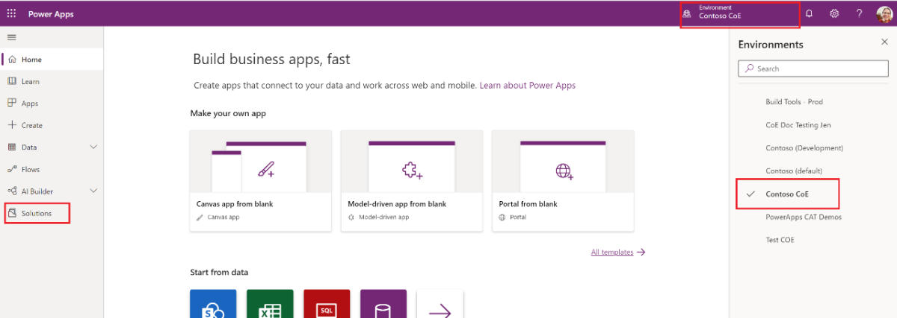
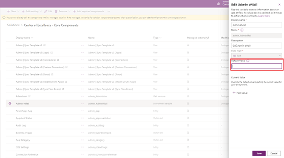
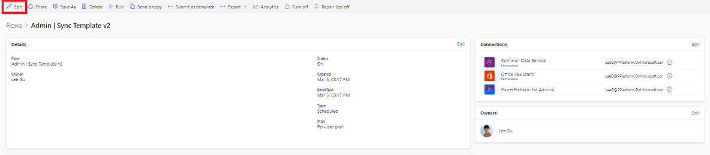
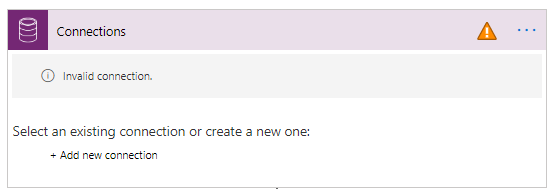
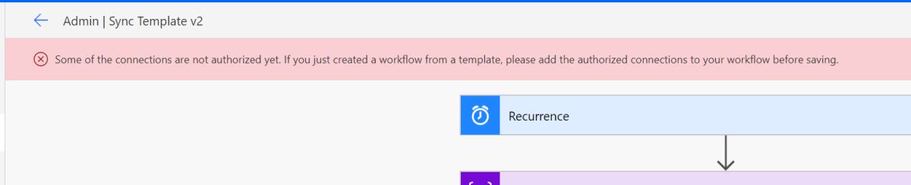
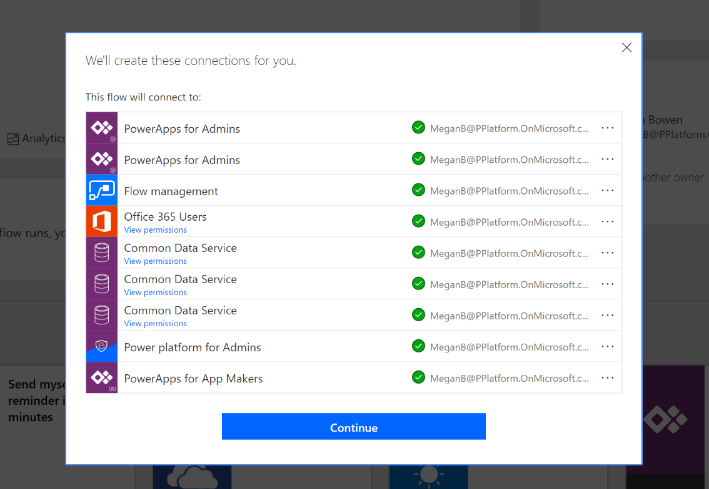
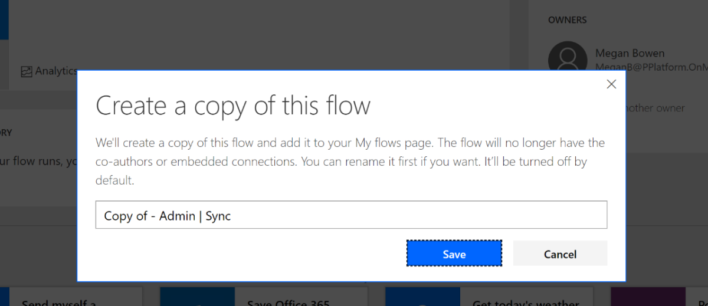

# Set up core components

The core components provide the core to get started with setting up a CoE: they sync all your resources into entities and build admin apps on top of that to help you get more visibility into what apps, flows and makers are in your environment. Additionally, apps like the DLP Editor and Set New App Owner help with daily admin tasks.  

The Core Components solution contains assets relevant only to admins.

## Import the Solution

This is the first setup step of the installation process and is required for every other component in the starter kit to work.

1. Download the CoE starter kit compressed file ([aka.ms/CoeStarterKitDownload](https://aka.ms/CoeStarterKitDownload)) and extract the zip file.
1. Create an Environment in which to set up the CoE. <!---KATHY SAYS: It feels to me like you might need to give some guidance on why this should be its own environment (or, maybe that is obvious to admins?).--->Please see the following <!---KATHY SAYS: .when you say "the following" do you actually mean the links in this sentence?--->for information about [Sandbox](https://docs.microsoft.com/power-platform/admin/sandbox-environments) and [ALM](https://docs.microsoft.com/power-platform/admin/wp-application-lifecycle-management) generally.
    - <!---KATHY SAYS: I think these should be numbered steps (or lettered steps if that is Docs style for sub-steps); they need to be followed in order so it seems like bullets aren't right here.)--->Go to [aka.ms/ppac](https://admin.powerplatform.microsoft.com/).
    - Select Environments, **+ New**, and then fill in a name, type and purpose.
    - Select **yes** for creating the database, and select **Next**.
    - Leave sample apps and data to **no**, and then select a security group who can view this environment. Then select **Save**.
    - Navigate to your new environment.<!---KATHY SAYS: This feels like it ought to be Step 3; in other words a main step, not part of creating an environment.--->
       - Go to <https://make.powerapps.com>.
       - Navigate to the Environment you just created, where the CoE solution will be hosted in. In the screenshots example, we're importing to the Environment called 'Contoso CoE'. 
    - Select **Solutions** on the left navigation bar.
    - Select **Import**. A pop-up window will appear (make sure to disable the pop-up blocker in your browser and try again if nothing happens when selecting the Import button).
    - In the pop-up window, select **Choose File**.
    - Choose the **Center Of Excellence Core Components** solution from the file explorer (CenterOfExcellenceCoreComponents_x_x_x_xx_managed.zip).

1. When the compressed (.zip) file has been loaded, select **Next**. <!---KATHY SAYS: Not clear to me why this step is a main step.--->

    - Review, select **Next**, then select **Import**. (This can take some time.)
    - When the import succeeds, the list of the components that were imported is displayed.
    - Close out of the logs dialog.
    - <!---KATHY SAYS: I could see this being a main step.--->Back on the Solutions page, select **Publish All Customizations**. This is good practice to follow whenever you make changes to a solution, but especially so when importing.

>[!NOTE]
>When importing the solution, sometimes Power Automate components show a warning of type *Process Activation* and a duplicate record of that component. You can ignore these warnings for flows.

## Configure the CoE Settings Entity

This section explains how to enter data in the CoE Settings entity, which is in the Common Data Service you instantiated in step 2 above.

This entity will hold a single row of information <!---KATHY SAYS: This is a nice helpful detail.--->which contains your logo, brand colors and so on, which different applications will reference.

The following assets depend on the CoE Settings entity:

- **Canvas Apps**. The optional branding details (e.g., logo, brand colors) in
       all the canvas apps are pulled from this entity. Optional support and
       community channel links are also used.
- **Optional Flows**. The optional branding details and support channel links
       are used in the communication flows. You also will configure links
       to the canvas apps in the settings. (The main flow that syncs data to the
       resource entities does not depend on this setting configuration.)

1. Navigate to [make.powerapps.com](https://make.powerapps.com/), select Apps and open the Power Platform Admin View model driven app in Play mode.
1. In the left navigation, select **Configure**.
1. In the Configure view screen, select **+ New** to create a new record.
1. Provide values as per below table.
1. Save by selecting Ctrl + S*<!---KATHY SAYS: Is the asterisk intentional?---> or by selecting the **Save** button in the bottom right corner.
1. Do not add more records to the CoE Settings table; there is no need. The dependent components will always get values from the first record.

| Name | Setting Value |
|------|------------|
| Brand Logo | Link to your logo as an image file |
| Brand Primary Color          | HEX Value of your primary brand color (\#cccccc)
| Brand Secondary Color        | HEX Value of your secondary brand color (\#dddddd)                                                    |
| Email End User Support       | Email Address for your Helpdesk or EUC <!---KATHY SAYS: EUC is a new term for me. Is this commonly used?--->Support Team                                                   |
| Email Maker Support          | Email Address for your Power Platform Maker Support Team                                              |
| Link to Community Channel    | Link to your internal Power Platform Community (<!---KATHY SAYS: Are these just examples or does it have to be one of these? If just an example, I would but "e.g."--->Yammer, Teams)                                        |
Link to Learning Resource    | Link to internal Power Platform learning resources, or you could link to aka.ms/PowerUp    |
Link to Policy Documentation | Link to internal Power Platform policies; these could be hosted in a Teams Channel or SharePoint site <!---KATHY SAYS: "for example"?---> |
Version                      | Set to 1.0                                                                                            |
Company Name                 | Your company name as it will appear in Dashboards |

## Update Environment Variables

The Environment variables are used to store application and flow configuration data with data specific to your organization and/or environment. This means, you only have to set the value once and it will be used in all necessary flows and apps.

All of the Sync flows depend on all Environment Variables being configured.

After importing the solution, you will see an error at the top, notifying you that Environment Variables need to be configured. For the Core Components solution, **3** environment variables need to be configured.<!---KATHY SAYS: This made sense to me until the below graphic, which shows 9. ???--->

1. Select a variable to configure the **Default Value**. 
1. Configure the following variables for the Core Components solution and then select **Save**.

| Name | Default Value |
|------|---------------|
|Power Automate Environment Variable | For a US environment <https://us.flow.microsoft.com/manage/environments/>  For an EMEA Environment <https://emea.flow.microsoft.com/manage/environments/>  For a GCC Environment <https://gov.flow.microsoft.us/manage/environments/> |
|Admin eMail                         | eMail address used in flows to send notifications to Admins, either your email address or a distribution list                                                                                                                |
|eMail Header Style                  | CSS Style used to format emails that are sent to admins and makers. A default value is provided.

## Activate the Sync Template Flows

The flows with the prefix *Sync* are required for populating data in the *resource* related CDS entities (Environments, Power Apps apps<!---KATHY SAYS: I see you might have to set his back the way it was. I worry about the old branding of PowerApps.--->, Flows, Connectors and Makers).

The *Sync flows* are used to write data from the admin connectors into the CDS
entities. None of the other components will work if the Sync flows aren't
successfully configured and run.

Required flows to sync data to the resource entities:

1. **Admin \| Sync Template v2**  
    Flow type: Scheduled (daily by default)  
    Description: This flow syncs environment details to the CoE CDS Entity
    *Environments*

1. **Admin \| Sync Template v2 (Apps, Custom Connectors, Flows, Model Driven
    Apps)**  
    Flow type: Automated  
    Description: These flows rely on the Admin \| Sync Template v2 and are
    triggered automatically when environment details are created or modified in
    the CoE CDS Entity 'Environments'. These flows then crawl environment
    resources and store data in the entities *PowerApps
    App, Flow, Connection Reference, Maker*.

1. **Admin \| Sync Template v2 (Connectors)**  
    Flow type: Scheduled (daily by default)  
    Description: This flow stores all connector information in the CDS Entity
    *PowerApps Connector*.

1. **Admin \| Sync Template v2 (Sync Flow Errors)**  
    Flow type: Scheduled (daily by default)  
    Description: If any of the Sync flows fail, the failure is stored in the CDS
    Entity *Sync Flow Errors*. This scheduled flow sends a report of failures to
    the admin.

The flows are all part of the solution. There are two options to consider
for activation of the flows. Option 1 takes longer to configure than option 2
but is also easier to receive updates.

### Option 1: Keep the flow in the solution and update each action connection

Use this option if you would like to continue receiving updates to the flow
through this solution. This takes longer to set up because the connections for
each action need to be individually configured.

1. Go to the *Center of Excellence - Core Components* solution.

    1. Navigate to [make.powerapps.com
    ](https://make.powerapps.com) and set the current Environment to the same Environment where the Center of Excellence solution is installed.

    1. In the left navigation, select **Solutions**, then select the **Center of Excellence - Core Components** solution.

1. Select the flow name (all flows starting with *Admin | Sync Template v2*) to get to the Flow details screen, then select **Edit**. 

1. The flow will open in the maker studio. For each action that requires a connection, there will be a warning icon on the right side of the action. This indicates the need for a connection to be selected. 

<!---KATHY SAYS: You actually skipped the step where you say "Update all the connections." I would say that should be the main step. The one below technically isn't step but is a note for the missing step. However, you might find that the document is too messy to read if you don't go ahead and just let it be a step.--->
1. If, when you select Save, you see this error, that means that there are more connections that still need made, likely hidden in conditional nodes. 

    - Some connections will need to be created if not already available.

    - Some actions might be hidden within other built in actions, such as a condition or scope. Expand these actions to find the hidden ones.

    - We suggest you start at the top of the flow and work down, opening each step as you go down, step by step until you find them all.

1. Once all actions have a connection, **save** the flow.

1. Repeat the above steps for *Admin \| Sync Template v2 – Apps, Connectors, Custom Connectors, Flows, Model Driven Apps and Sync Flow Errors*.

1. Ensure the flows are **Turned On**.

1. Trigger the sync flows to populate your data.

    - Select **Admin \| Sync Template v2**.

    - This will open a new tab to the flow's details page.

    - Select  **Run** in the Ribbon.

### Option 2: Save a copy of the Flow outside of the solution

If you save a copy of the flow from the solution, the connections are created
automatically for you. The drawback of this method is that if you copy the
flow from the solution, the copy flow does not get updated when you update the
solution package with newer versions. You will have to import the new solution and copy the flow again to upgrade it to the latest version. <!---KATHY SAYS: I found it somewhat awkward to refer to flow as singular when you need to do this for multiple flows. By using singular, you seem to e indicating there might be a reason to do it one way for some flows and the other way for others. If you didn't intend that, then it seems like both option 1 and option 2 introductions should refer to the flows in the plural.--->

1. Go to the *Center of Excellence - Core Components* solution.

    1. Navigate to [make.powerapps.com](https://make.powerapps.com) and set the current Environment to the same Environment where the Center of Excellence solution is installed.

    1. In the left navigation, select **Solutions**, then select the **Center of Excellence - Core Components** solution.

1. Select the flow you want to copy to navigate to the flow's details page.

1. Select **Save As** in the ribbon.

1. A window will pop up saying, *We'll create these connections for you*. Select **Continue**. 

1. Rename the copy if desired. Select **Save**.  

1. At this point, the copy has been created. You can now view the flow in the **My Flows** page in the left navigation. Remember that the copy of the flow will *not* be visible in the Center of Excellence – Core Components solution.

1. Repeat the above steps for *Admin \| Sync Template v2 – Apps, Connectors, Custom Connectors, Flows, Model Driven Apps and Sync Flow Errors*.

1. Turn each flow on.

    1. Select each flow.

    1. This will open a new tab to the flow's details page.

    1. Select **Turn On** in the Ribbon.

1. Trigger the sync flows to populate your data.

    1. Select **Copy of Admin \| Sync Template v2**.

    1. This will open a new tab to the flow's details page.

    1. Select **Run** in the Ribbon.

## Set up Audit Log sync
<!---KATHY SAYS: "Set up" is two words when a verb and one word "setup" when an adjective or noun.--->
The Audit Log sync flow connects to the Office 365 Audit Log to gather telemetry data (unique users, launches) for Power Apps apps.

The CoE Starter Kit will work without this flow; however the usage information (app launches, unique users) in the Power BI dashboard will be blank.

The [Set up Audit Log](setup-auditlog.md) section walks you through how to set up the custom connector and flow to start collecting telemetry information.

## Set up Power BI Dashboard

The CoE Power BI Dashboard provides a holistic view with visualizations and insights into resources in your tenant: Environments, Power Apps apps, Power Automate flows, Connectors, Connection References, Makers and Audit Logs. Telemetry from the Audit Log is stored from the moment you set up the CoE Starter Kit, so over time you can look back and identify trends for longer than 28 days.

The [Set up Power BI](setup-powerbi.md) section walks you through how to set up the dashboard.

## Share apps with other admins

The Core Components solution does not contain any apps for makers or end users, only admin-specific apps.

The user account who uploaded the solution and the Environment admin of the
Environment the solution exists in will have full access to the solution.
To share these apps with other users, see the [documentation on sharing Canvas Apps]([this
blog](https://docs.microsoft.com/powerapps/maker/canvas-apps/share-app).

These components are designed to give admins better visibility and overview of
resources and usage in their environments. None of the components are to be
shared with makers or end users.

## Wait for flows to complete

Once the Sync flows have finished running (depending on the number of
environments and resources, this can take a few hours) you are ready to use the
Core Components of the CoE Starter Kit.

To check the status:

1. Select **Admin \| Sync Template v2**.

1. This will open a new tab to the flow's details page.

1. View the **Runs**.
