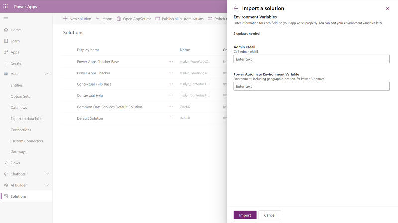

# Set up core components

[!INCLUDE[cc-data-platform-banner](../../includes/cc-data-platform-banner.md)]

The Center of Excellence (CoE) core components solution provides components that you need to get started with setting up a CoE. They sync all your resources into tables and build admin apps on top of that to help you get more visibility into the apps, flows, and makers that exist in your environment. Additionally, apps like DLP Editor and Set App Permissions help with daily admin tasks.  

The core components solution contains assets that are only relevant to admins.

<!-- need to re-record due to new solution import experience Watch the [setup instructions video](https://youtu.be/L8gKjeE5GR4) to help you download and deploy the solution. -->

## Import the solution

This is the first step of the installation process and is required for every other component in the starter kit to work. You'll need to create an environment in which to set up the CoE. For more information about how to decide on the best strategy for your organization, go to [Establishing an Environment Strategy for Microsoft Power Platform](https://docs.microsoft.com/power-platform/guidance/adoption/environment-strategy) and [Application lifecycle management](https://docs.microsoft.com/power-platform/admin/wp-application-lifecycle-management).

1. Download the CoE Starter Kit compressed file ([aka.ms/CoeStarterKitDownload](https://aka.ms/CoeStarterKitDownload)).

    >[!IMPORTANT]
    > **Extract the zip file** after downloading and before moving on to the next step. The CoE Starter Kit compressed file contains all solution components as well as non-solution aware components that make up the CoE Starter Kit.

1. Create an environment in which to set up the CoE.

   1. Go to the [Power Platform admin center](https://admin.powerplatform.microsoft.com/).
   1. Select **Environments** > **+ New**, and then enter a name, type, and purpose.
   1. Select **Yes** for creating the database, and then select **Next**.
   1. Leave **Sample apps and data** set to **No**
   1. Select **Save**.

1. Go to your new environment.

    1. Go to [make.powerapps.com](<https://make.powerapps.com>).
    1. Go to the environment you just created, in which the CoE solution will be hosted. In the example in the following screenshot, we're importing to the environment named **Contoso CoE**.

     

1. Create connections to all connectors used as part of the solution.
    1. Go to **Data** > **Connections**.
    1. Select **+ New Connection**.
    1. Select **Dataverse**.
     
    1. Select **Create**.
    1. Complete the same steps for the following connectors:
        - Dataverse
        - Dataverse (current environment)
        - Power Apps for Admins
        - Power Apps for Makers
        - Power Platform for Admins
        - Power Automate for Admins
        - Power Automate Management
        - Office 365 Users
        - Office 365 Outlook
        - Office 365 Groups
        - SharePoint
        - Microsoft Teams

1. On the left pane, select **Solutions**.

1. Select **Import**, and then **Browse**.

1. Select the Center of Excellence core components solution from File Explorer (CenterOfExcellenceCoreComponents_*x_x_x_xx*_managed.zip).

1. When the compressed (.zip) file has been loaded, select **Next**.

1. Review the information, and then select **Next**.
1. Establish connections to activate your solution. If you create a new connection, you must select **Refresh**. You won't lose your import progress.

     

1. Update environment variable values. The environment variables are used to store application and flow configuration data with data specific to your organization or environment. This means that you only have to set the value once per environment and it will be used in all necessary flows and apps in that environment. All the flows in the solution depend on all environment variables' being configured.

    Configure the following variables for the core components solution, and then select **Save**. (If you need to change the value of an environment variable after you import the solution, go to [Update environment variables](#update-environment-variables).)

    | Name | Current Value |
    |------|---------------|
    |Power Automate environment variable | For a US environment: <https://us.flow.microsoft.com/manage/environments/>  For an EMEA environment: <https://emea.flow.microsoft.com/manage/environments/>  For a GCC environment: <https://gov.flow.microsoft.us/manage/environments/> |
    |Admin eMail                         | Email address used in flows to send notifications to admins; this should be either your email address or a distribution list |

     

1. Select **Import**.

The import can take up to 10 minutes to be completed.

## Activate the sync template flows

The flows with the prefix *Sync* are required for populating and cleaning up data in the Dataverse tables (Environment, Power Apps App, Flow, Flow Action Detail, Connector, and Maker). The sync flows are used to write or delete data from the admin connectors to the Dataverse tables. These flows run on a schedule.

Note that the first run of these will be long running. See the [limitations information](/limitations.md#Long-running-flows) for more details.
We will avoid issues by enabling the flows in an explicit order. We recommend you repeat this order on each upgrade as well.

1) Turn on: CLEANUP - Admin \| Sync Template v2 (Check Deleted)
1) Wait until it finishes before you turn on any other flows.
1) Ensure the Sync Template flows are already turned on for the following object types:  Apps, Connectors, Custom Connectors, Flows, Model Driven Apps, PVA, RPA
1) Turn on Admin \| Sync Template v2. When it completes, turn it back off.
1) This will cause the flows for the objects listed in step 3 to run. Wait until all of these complete.
1) Turn back on Admin \| Sync Template v2.
1) Turn on the rest of the flows listed in the solution

## Configure the CoE Settings table

This section explains how to enter data in the CoE Settings table. This table will hold a single row of information that contains your logo, brand colors, and so on, which different applications will reference.

The following assets depend on the CoE Settings table:

- **Canvas apps**: The optional branding details (logo, brand colors) in all canvas apps are pulled from this table. Optional support and community channel links are also used.
- **Optional flows**: The optional branding details and support channel links are used in communication flows. You'll also configure links to canvas apps in the settings. (The main flow that syncs data to the resource tables doesn't depend on this setting configuration.)
<!--markdownlint-disable MD036-->
**To configure CoE settings**

1. Go to [make.powerapps.com](https://make.powerapps.com/), select **Apps**, and then open the **Power Platform Admin View** model-driven app in Play mode.

1. On the left pane, select **Configure**.

1. On the **Configure view** screen, select **+ New**.

1. Provide values as listed in the following table.

   | Setting | Value |
   |------|------------|
   | Company Name | Your company name as it will appear in dashboards |
   |Brand Logo | Link to your logo as an image file |
   | Brand Primary Color          | Hexadecimal value of your primary brand color (\#CCCCCC) |
   | Brand Secondary Color        | Hexadecimal value of your secondary brand color (\#DDDDDD)   |
   | Email End User Support       | Email address for your helpdesk or user computing support team      |
   | Email Maker Support          | Email address for your Microsoft Power Platform maker support team           |
   | Tenant Type | The type of tenant you have. Possible values:<ul><li>**Commercial** (use if your URL is https://make.powerapps.com)</li><li>**GCC** (use if your URL is https://make.gov.powerapps.us)</li><li>**GCC High** (use if your URL is https://make.high.powerapps.us)</li></ul> |
   | Link to Community Channel    | Link to your internal Microsoft Power Platform community (for example, Yammer or Teams)                            |
   | Link to Learning Resource    | Link to internal Microsoft Power Platform learning resources, or you can link to aka.ms/PowerUp    |
   |Link to Policy Documentation | Link to internal Microsoft Power Platform policies; for example, a Teams channel or SharePoint site |
   |Version                      | Set to 1.0        |

1. Select **Save**.

You don't need to add more records to the CoE Settings table. Any dependent components will always get values from the first record.

## Set up audit log sync

The Audit Log Sync flow connects to the Microsoft 365 audit log to gather telemetry data (unique users, launches) for apps. The CoE Starter Kit will work without this flow; however, usage information (app launches, unique users) in the Power BI dashboard will be blank. More information: [Set up the audit log connector](setup-auditlog.md)

## Set up the Power BI dashboard

The CoE Power BI dashboard provides a holistic view with visualizations and insights into resources in your tenant: environments, apps, Power Automate flows, connectors, connection references, makers, and audit logs. Telemetry from the audit log is stored from the moment you set up the CoE Starter Kit, so over time you can look back and identify trends for longer than 28 days. More information: [Set up the Power BI dashboard](setup-powerbi.md)

## Share apps with other admins

The core components solution doesn't contain any apps for makers or users, only admin-specific apps. These components are designed to give admins better visibility and overview of resources and usage in their environments. None of the components are to be shared with makers or users.

The user account who uploaded the solution, and the environment admin of the environment the solution exists in, will have full access to the solution; however, you might want to share these apps with specific other users. More information: [Share a canvas app in Power Apps](https://docs.microsoft.com/powerapps/maker/canvas-apps/share-app)

## Wait for flows to finish

After the sync flows have finished running (depending on the number of environments and resources, this can take a few hours), you're ready to use the core components of the CoE Starter Kit.

**To check the status of a flow**

1. Select **Admin \| Sync Template v2**.

   This will open a new tab to the **Flow detail** page.

1. View **Runs**.

## Update environment variables

>[!IMPORTANT]
> You don't have to complete this step during setup, just when you need to change the value of an environment variable that you configured during import.

Environment variables are used to store application and flow configuration data with data specific to your organization or environment.

>[!IMPORTANT]
>To edit environment variables in the environment, open the default solution for the environment and set the **Type** filter to **Environment variable**.

- Select a variable, and then configure its **Current Value**.

    Configure the following variables for the core components solution, and then select **Save**.

    | Name | Current Value |
    |------|---------------|
    |Power Automate environment variable | For a US environment: <https://us.flow.microsoft.com/manage/environments/>  For an EMEA environment: <https://emea.flow.microsoft.com/manage/environments/>  For a GCC environment: <https://gov.flow.microsoft.us/manage/environments/> |
    |Admin eMail                         | Email address used in flows to send notifications to admins; this should be either your email address or a distribution list |
    |eMail Header Style                  | CSS style used to format emails that are sent to admins and makers. A default value is provided. [See the provided default value](code-samples/css/default-value-eMail-Header-Style.md). |
    |Also Delete from CoE | When the Admin \| Sync Template v2 (Check Deleted) flow is run, this denotes whether you want the items deleted from CoE (Yes, which is the default) or just marked as deleted (No). |
