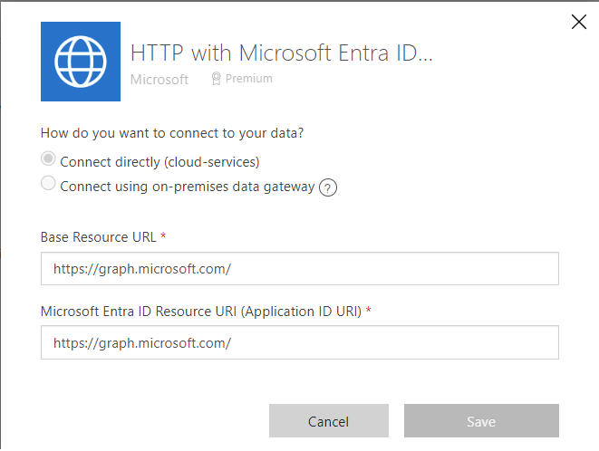
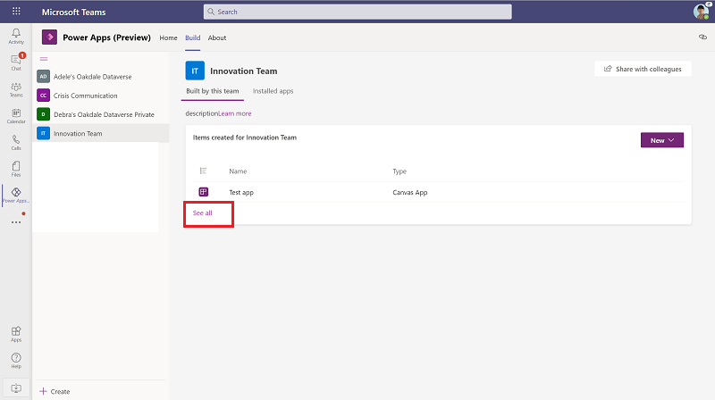
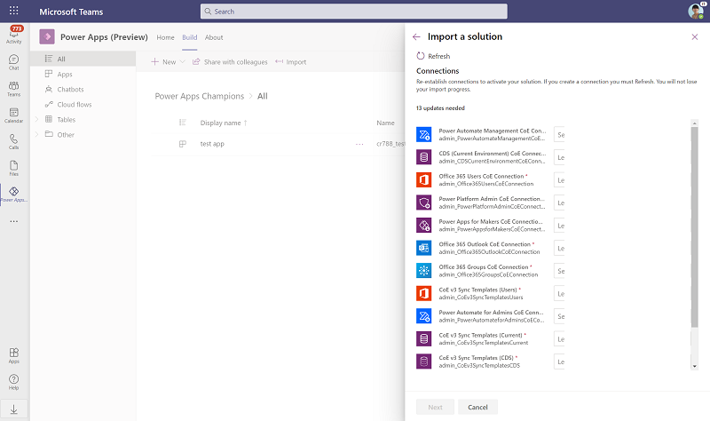
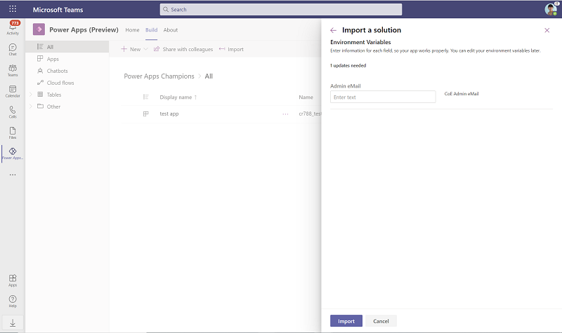
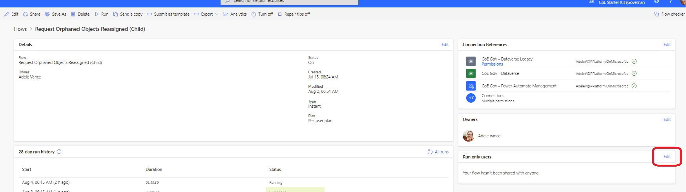
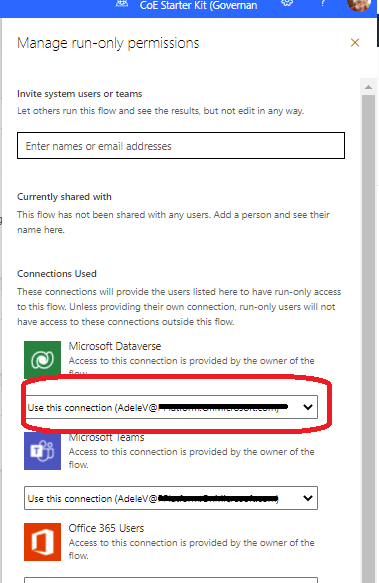
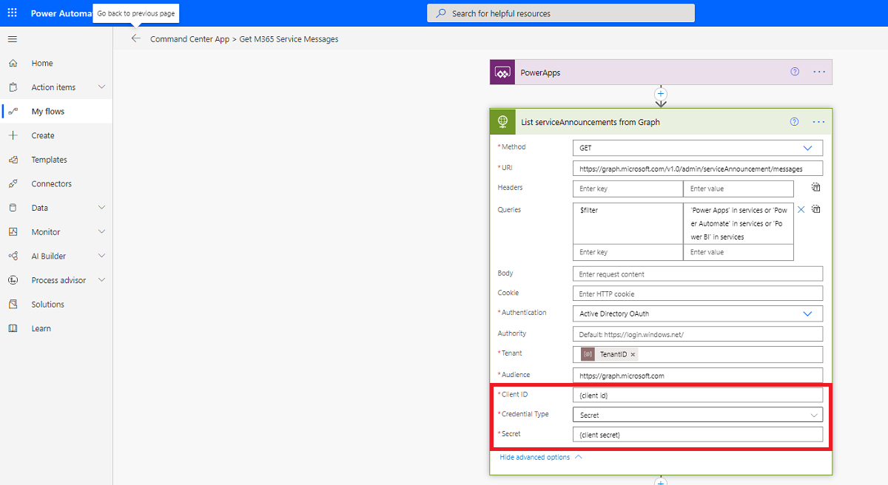

# Set up core components

[!INCLUDE[cc-data-platform-banner](../../includes/cc-data-platform-banner.md)]

The Center of Excellence (CoE) core components solution provides components that you need to get started with setting up a CoE. They sync all your resources into tables and build admin apps on top of that to help you get more visibility into the apps, flows, and makers that exist in your environment. Additionally, apps like DLP Editor and Set App Permissions help with daily admin tasks.  

The core components solution contains assets that are only relevant to admins.

[Watch how to setup](https://www.youtube.com/embed/Z9Vp2IxFzpU) the core components solution.

## Import the solution

The Core Components can be used in both Production environments and Dataverse for Teams environments. Where you install it will depend on your organization setup, your adoption of Microsoft Power Platform so far and what you want to achieve with the CoE Starter Kit. Before you decide, compare [Dataverse vs Dataverse for Teams](/powerapps/teams/data-platform-compare)

Learn more: [What is Dataverse for Teams](/powerapps/teams/overview-data-platform)

### Option 1: Import the solution into a Production environment

This is the first step of the installation process and is required for every other component in the starter kit to work. You'll need to create an environment in which to set up the CoE. For more information about how to decide on the best strategy for your organization, go to [Establishing an Environment Strategy for Microsoft Power Platform](/power-platform/guidance/adoption/environment-strategy) and [Environment strategy for ALM](/power-platform/alm/environment-strategy-alm).

1. Download the CoE Starter Kit compressed file ([aka.ms/CoeStarterKitDownload](https://aka.ms/CoeStarterKitDownload)).

    >[!IMPORTANT]
    > **Extract the zip file** after downloading and before moving on to the next step. The CoE Starter Kit compressed file contains all solution components as well as non-solution aware components that make up the CoE Starter Kit.

1. Create an environment in which to set up the CoE.

   1. Go to the [Power Platform admin center](https://admin.powerplatform.microsoft.com/).
   1. Select **Environments** > **+ New**, and then enter a name, type, and purpose.
   1. Select **Yes** for creating the database, and then select **Next**.
   1. Leave **Sample apps and data** set to **No**
   1. Select **Save**.

1. Go to your new environment.

    1. Go to [make.powerapps.com](<https://make.powerapps.com>).
    1. Go to the environment you just created, in which the CoE solution will be hosted. In the example in the following screenshot, we're importing to the environment named **Contoso CoE**.

     

1. On the left pane, select **Solutions**.

1. Select **Import**, and then **Browse**.

1. Select the Center of Excellence core components solution from File Explorer (CenterOfExcellenceCoreComponents_*x_x_x_xx*_managed.zip).

1. When the compressed (.zip) file has been loaded, select **Next**.

1. Review the information, and then select **Next**.
1. Establish connections to activate your solution. If you create a new connection, you must select **Refresh**. You won't lose your import progress.

     

    When you create the connection for HTTP with Azure AD enter the following into the Base Resource URL and Azure AD Resource URI (Application ID URI): [https://graph.microsoft.com](https://graph.microsoft.com) or [https://dod-graph.microsoft.us/](https://dod-graph.microsoft.us/) if you're in a DoD environment.

     

1. Update environment variable values. The environment variables are used to store application and flow configuration data with data specific to your organization or environment. This means that you only have to set the value once per environment and it will be used in all necessary flows and apps in that environment. All the flows in the solution depend on all environment variables' being configured.

    

    Configure the following variables for the core components solution, and then select **Save**. (If you need to change the value of an environment variable after you import the solution, go to [Update environment variables](#update-environment-variables).)

    | Name | Description | Default Value |
    |------|---------------|------|
    |Admin eMail |Admin eMailed with this solution, and copy the web link (to launch the app) and paste it into this variable. This environment variable is not used until you adopt the Developer Compliance Center.  | n/a |
    |Also Delete from CoE | Recommend Yes here to delete objects from the CoE inventory when they are deleted from the tenant. No will keep a record that an app or flow existed in the past | Yes |
    |Approval Admin | The email address used in flows to send approvals to admins; this cannot be a distribution list. | n/a |
    | Community URL         | Link to your internal Microsoft Power Platform community (for example, Yammer or Teams).  | n/a |
    | Developer Compliance Center URL        | Leave empty on Import and do the following to populated after set up of the [Governance components](setup-governance-components.md).  Navigate to the details page of the Developer Compliance Center (canvas app) included with this solution, and copy the web link (to launch the app) and paste it into this variable.  | n/a|
    | Environment Request Admin App Url | Link to the **Admin - Power Platform Resouce RMS** canvas app included in this solution. Leave empty on Import and fill it in once the app is installed.   To do that, navigate to the details page of the **Admin - Power Platform Resouce RMS** (canvas app) included with this solution, and use the wek link (to launch the app).  | n/a |
    |PowerApp Maker environment variable | The maker URL used by PowerApps for your cloud, including trailing slash. Here are examples:  For a US environment: <https://make.powerapps.com/>   For a GCC environment: <https://make.gov.powerapps.us/>  For a GCC High environment: <https://make.high.powerapps.us/> | n/a |
    |PowerApp Player environment variable For a DoD environment: <https://make.apps.appsplatform.us/> | n/a |
    |PowerApp Player environment variable | The player URL used by PowerApps for your cloud, including trailing slash. Here are examples:  For a US environment: <https://apps.powerapps.com/>   For a GCC environment: <https://apps.gov.powerapps.us/>  For a GCC High environment: <https://apps.gov.powerapps.us/>  For a DoD environment: <https://play.apps.appsplatform.us> | n/a |
    |Power Automate environment variable | The URL used by flow for your region. Here are examples:  For a US environment: <https://us.flow.microsoft.com/manage/environments/>   For a Canadian environment: <https://canada.flow.microsoft.com/manage/environments/>  For an EMEA environment: <https://emea.flow.microsoft.com/manage/environments/>  For a GCC environment: <https://gov.flow.microsoft.us/manage/environments/>   For a GCC High environment: <https://high.flow.microsoft.us/manage/environments>  For a DoD environment: <https://flow.appsplatform.us/manage/environments/> If your region is not listed here, navigate to [flow.microsoft.com](https://flow.microsoft.com) and copy the URL the page directs to from the browser.| n/a |
    | Power Platform Maker Microsoft 365 Group | The Admin \| Welcome Email flow sends a welcome email to onboard new makers and adds them to a Microsoft 365 group. You can use this group to send communications to your makers or invite them to a Yammer or Teams group. Configure the group ID here.| n/a |
    | TenantID | Your Azure Tenant ID.| n/a |
    | Compliance – Apps – Number Users Shared | The Admin \| Compliance detail request flow sends an email to makers asking for business justification if their app is shared with more than x number of users. The number of users is specified in this variable. | 20 users |
    | Compliance – Apps – Number Groups Shared | The Admin \| Compliance detail request flow sends an email to makers asking for business justification if their app is shared with more than x number of groups. The number of groups is specified in this variable. | 1 group |
    | Compliance – Apps – Number Days Since Published | The Admin \| Compliance detail request flow sends an email to makers asking for business justification if their app has not been published in x number of days. The number of days is specified in this variable. | 60 days |
    | Compliance – Apps – Number Launches Last 30 Days | The Admin \| Compliance detail request flow sends an email to makers asking for business justification if their app has been launched more than x number of times in the past 30 days. The number of app launches is specified in this variable. | 30 app launches |
    | Compliance – Chatbots – Number Launches | The Admin \| Compliance detail request flow sends an email to makers asking for business justification if their chatbot has been launched more than x number of times in the past 30 days. The number of chatbot launches is specified in this variable. | 50 app launches |

1. Select **Import**.

The import can take up to 10 minutes to be completed.

### Option 2: Import the solution into a Dataverse for Teams environment

This is the first step of the installation process and is required for every other component in the starter kit to work.

Before you begin:

- decide which team to add the Core Components solution to or create a new team.
- [install the Power Apps app](/powerapps/teams/install-personal-app) in Teams.
- [create your first app](/powerapps/teams/create-first-app) (at least one app is required in the environment to enable the solution import experience).

1. Download the CoE Starter Kit compressed file ([aka.ms/CoeStarterKitDownload](https://aka.ms/CoeStarterKitDownload)).

    >[!IMPORTANT]
    > **Extract the zip file** after downloading and before moving on to the next step. The CoE Starter Kit compressed file contains all solution components as well as non-solution aware components that make up the CoE Starter Kit.

1. Open to the Power Apps app in Teams, select **Build**, and select the Team you want to add the solution to.

1. Select **See All**

    

1. Select **Import**

1. In the pop-up window, select **Choose File**.

1. Select the Center Of Excellence Core Components for Teams solution: CenterOfExcellenceCoreComponentsTeams_*x_x_x_xx*_managed.zip.

1. When the compressed (.zip) file has been loaded, select **Next**.

1. Establish connections to the required connectors including:

    - Microsoft Dataverse
    - Microsoft Dataverse (current environment)
    - Power Apps for Admins
    - Power Apps for Makers
    - Power Platform for Admins
    - Power Automate for Admins
    - Power Automate Management
    - Office 365 Users
    - Office 365 Outlook
    - Office 365 Groups
    - SharePoint
    - Microsoft Teams
    - HTTP with Azure AD: set the Resource URL and Azure AD Resource URI to [https://graph.microsoft.com/](https://graph.microsoft.com/) for a commercial tenant, and [https://graph.microsoft.us/](https://graph.microsoft.us/) for a GCC High tenant.

    If you create a new connection, you must select **Refresh**. You won't lose your import progress.

     

1. Update environment variable values. The environment variables are used to store application and flow configuration data with data specific to your organization or environment. This means that you only have to set the value once per environment and it will be used in all necessary flows and apps in that environment. All the flows in the solution depend on all environment variables' being configured.

     

    Configure the following variables for the core components solution, and then select **Save**. (If you need to change the value of an environment variable after you import the solution, go to [Update environment variables](#update-environment-variables).)

    | Name | Description | Default Value |
    |------|---------------|------|
    |Admin eMail |Admin eMailed with this solution, and copy the web link (to launch the app) and paste it into this variable. This environment variable is not used until you adopt the Developer Compliance Center.  | n/a |
    |Also Delete from CoE | Recommend Yes here to delete objects from the CoE inventory when they are deleted from the tenant. No will keep a record that an app or flow existed in the past | Yes |
    |Approval Admin | The email address used in flows to send approvals to admins; this cannot be a distribution list. | n/a |
    | Community URL         | Link to your internal Microsoft Power Platform community (for example, Yammer or Teams).  | n/a |
    | Developer Compliance Center URL        | Leave empty on Import and do the following to populated after set up of the [Governance components](setup-governance-components.md).  Navigate to the details page of the Developer Compliance Center (canvas app) included with this solution, and copy the web link (to launch the app) and paste it into this variable.  | n/a|
    | Environment Request Admin App Url | Link to the **Admin - Power Platform Resouce RMS** canvas app included in this solution. Leave empty on Import and fill it in once the app is installed.   To do that, navigate to the details page of the **Admin - Power Platform Resouce RMS** (canvas app) included with this solution, and use the wek link (to launch the app).  | n/a |
    |PowerApp Maker environment variable | The maker URL used by PowerApps for your cloud, including trailing slash. Here are examples:  For a US environment: <https://make.powerapps.com/>   For a GCC environment: <https://make.gov.powerapps.us/>  For a GCC High environment: <https://make.high.powerapps.us/> | n/a |
    |PowerApp Player environment variable For a DoD environment: <https://make.apps.appsplatform.us/> | n/a |
    |PowerApp Player environment variable | The player URL used by PowerApps for your cloud, including trailing slash. Here are examples:  For a US environment: <https://apps.powerapps.com/>   For a GCC environment: <https://apps.gov.powerapps.us/>  For a GCC High environment: <https://apps.gov.powerapps.us/>  For a DoD environment: <https://play.apps.appsplatform.us> | n/a |
    |Power Automate environment variable | The URL used by flow for your region. Here are examples:  For a US environment: <https://us.flow.microsoft.com/manage/environments/>   For a Canadian environment: <https://canada.flow.microsoft.com/manage/environments/>  For an EMEA environment: <https://emea.flow.microsoft.com/manage/environments/>  For a GCC environment: <https://gov.flow.microsoft.us/manage/environments/>   For a GCC High environment: <https://high.flow.microsoft.us/manage/environments>  For a DoD environment: <https://flow.appsplatform.us/manage/environments/> If your region is not listed here, navigate to [flow.microsoft.com](https://flow.microsoft.com) and copy the URL the page directs to from the browser.| n/a |
    | Power Platform Maker Microsoft 365 Group | The Admin \| Welcome Email flow sends a welcome email to onboard new makers and adds them to a Microsoft 365 group. You can use this group to send communications to your makers or invite them to a Yammer or Teams group. Configure the group ID here.| n/a |
    | TenantID | Your Azure Tenant ID.| n/a |
    | Compliance – Apps – Number Users Shared | The Admin \| Compliance detail request flow sends an email to makers asking for business justification if their app is shared with more than x number of users. The number of users is specified in this variable. | 20 users |
    | Compliance – Apps – Number Groups Shared | The Admin \| Compliance detail request flow sends an email to makers asking for business justification if their app is shared with more than x number of groups. The number of groups is specified in this variable. | 1 group |
    | Compliance – Apps – Number Days Since Published | The Admin \| Compliance detail request flow sends an email to makers asking for business justification if their app has not been published in x number of days. The number of days is specified in this variable. | 60 days |
    | Compliance – Apps – Number Launches Last 30 Days | The Admin \| Compliance detail request flow sends an email to makers asking for business justification if their app has been launched more than x number of times in the past 30 days. The number of app launches is specified in this variable. | 30 app launches |
    | Compliance – Chatbots – Number Launches | The Admin \| Compliance detail request flow sends an email to makers asking for business justification if their chatbot has been launched more than x number of times in the past 30 days. The number of chatbot launches is specified in this variable. | 50 app launches |

1. Select **Import**.

The import can take up to 60 minutes to be completed. Learn more about the apps and flows in the Core components: [What's in the Core Components](core-components.md)

## Update and turn on child flows

There are several child flows which will need their **Run only users** properties updated.

- HELPER - CloudFlowOperations
- HELPER - CanvasAppOperations
- CLEANUP HELPER - Check Deleted (Canvas Apps)
- CLEANUP HELPER - Check Deleted (Cloud Flows)
- CLEANUP HELPER - Check Deleted (Model Driven Apps)
- CLEANUP HELPER - Check Deleted (PVA)
- CLEANUP HELPER - Check Deleted (Custom Connectors)
- CLEANUP HELPER - Power Apps User Shared With

First, [remove the unmanaged layer](setup.md#installing-updates) for all flows. Then, go to the details page and click the **Run only users** edit button.

 

You will see all the connections in the child flow. For each one, change the value to **Use this connection (userPrincipalName\@company.com)**. If there is no connection for any of the connectors, go to **Data** > **Connections**, and create one for the connector.
  

Once you have updated the run only users, turn on all the child flows.

## Activate the flows

The Admin \| Sync Template flows part of this solution crawl through all the resources stored in Microsoft Power Platform and make a copy of details in each resource (for example, apps and flows) to Dataverse (table definitions are provided in this solution). All data displayed in most of the starter kit components must be in Dataverse, which means that the sync template must be configured for everything else to work. The sync flows run daily overnight.

When you first set up the CoE Starter Kit, enable these flows in a specific order which will start the process of crawling and storing the information in Dataverse. Depending on the size of your tenant, the first run of may take long to complete. See the [limitations information](limitations.md) for more details.

1. For Option 1 (Core Components installed in Production environment):
    1. Go to [make.powerapps.com](https://make.powerapps.com/), select **Solutions**, and then open the **Center of Excellence - Core Components** solution to view the flows.
1. For Option 2 (Core Components installed in Dataverse for Teams environment)
    1. Open to the Power Apps app in Teams, select **Build**, and select the Team you have added the solution to.
    1. Select **Installed apps**.
    1. Select **See all** for Center of Excellence - Core Components.
    1. Select **Cloud flows**.
1. Turn on: CLEANUP HELPER - Check Deleted (Cloud Flows), CLEANUP HELPER - Check Deleted (Model Driven Apps), CLEANUP HELPER - Check Deleted (Canvas Apps) and CLEANUP HELPER - Check Deleted (PVA).
1. Turn on: CLEANUP - Admin \| Sync Template v3 (Check Deleted).
1. Wait until it finishes before you turn on any other flows.
1. Turn on: Admin \| Sync Template V3 (Connectors)
1. Wait until it finishes before you turn on any other flows.
1. Turn on the Admin \| Sync Template flows for the following object types: Apps, Custom Connectors, Desktop Flows, Flows, Model Driven Apps, and PVA
1. Turn on Admin \| Sync Template v3.
1. Wait for Admin \| Sync Template v3 to complete its run and then turn it back off. This will avoid write conflicts for large organizations.
1. Check the Admin \| Sync Template flows for apps, flows and other resources and wait until all of these complete.
1. Turn back on Admin \| Sync Template v3.
1. Now you're ready to turn on all the other flows
    1. Turn on all the flows starting with CLEANUP.
    1. Turn on the [Admin | Capacity Alerts](core-components.md#flows) if you would like to receive alerts when environments get close to approved capacity.
    1. Turn on the [Admin | Welcome Email v3](core-components.md#flows) if you would like to send welcome emails to new makers.
    1. Turn on the flows starting with Env Request and DLP Request if you are using the [Power Platform Request Center](core-components.md#power-platform-request-center). Make sure the Admin eMail and Environment Request Admin App Url [environment variables](#update-environment-variables) are configured before turning on those flows.
    1. Turn on the flows starting with Command Center App if you are using the [Admin - Command Center](core-components.md#admin---command-center)

>[!IMPORTANT]
> Note that **Admin \| Compliance request** flows will not pass until you complete setup of the Governance component so you should leave it turned off until then.

## (Optional) Create an Azure AD app registration to connect to Microsoft Graph

>[!NOTE]
> Only complete this steps if you want to review Power Platform related [Microsoft 365 Message Center](/microsoft-365/admin/manage/message-center) updates in the [Admin - Command Center](core-components.md#admin---command-center) canvas app.

The [Admin - Command Center](core-components.md#admin---command-center) connects to [Microsoft Graph API](/graph/api/serviceannouncement-list-messages) to get [Microsoft 365 Message Center](/microsoft-365/admin/manage/message-center) updates.

Using these steps, you'll set up an Azure AD app registration that will be used in a cloud flow to connect to the Graph API. More information: [Use the Microsoft Graph API](/graph/use-the-api)

1. Sign in to [portal.azure.com](https://portal.azure.com).

1. Go to **Azure Active Directory** > **App registrations**.

   

1. Select **+ New Registration**.

1. Enter a name (for example, **CoE Command Center**), don't change any other setting, and then select **Register**.

1. Select **API Permissions** > **+ Add a permission**.

   

1. Select **Microsoft Graph**, and configure permissions as follows:

   1. Select **Delegated permissions**, and then select **ServiceMessage.Read.All**.
   1. Select **Application permissions**, and then select **ServiceMessage.Read.All**.
   1. Select **Add permissions**.

1. Select **Grant Admin Consent for (your organization)**.

1. Select **Certificates and secrets**.

1. Select **+ New client secret**.

   

1. Add a description and expiration (in line with your organization's policies), and then select **Add**.

1. Copy and paste the **Secret** to a text document in Notepad for the time being.

1. Select **Overview**, and copy and paste the application (client) ID value to the same text document; be sure to make a note of which GUID is for which value. You'll need these values in the next step as you configure the custom connector.

1. Go to [make.powerapps.com](https://make.powerapps.com/), select **Solutions**, and then open the **Center of Excellence - Core Components** solution to view the flows.

1. Edit the **Command Center App >  Get M365 Service Messages** flow.

1. Update the **List serviceAnnouncements from Graph** with your client ID and client secret.
    

    >[!NOTE]
    > Store the client ID and secret in Azure Key Vault and modify the flow to use the [Azure Key Vault connector](/connectors/keyvault/) to retrieve them.

1. **Save** this flow.

## Set up Audit Logs solution

The Audit Log Sync flow connects to the Microsoft 365 audit log to gather telemetry data (unique users, launches) for apps. The CoE Starter Kit will work without this flow; however, usage information (app launches, unique users) in the Power BI dashboard will be blank. More information: [Set up the audit log connector](setup-auditlog.md)

## Set up the Power BI dashboard

The CoE Power BI dashboard provides a holistic view with visualizations and insights into resources in your tenant: environments, apps, Power Automate flows, connectors, connection references, makers, and audit logs. Telemetry from the audit log is stored from the moment you set up the CoE Starter Kit, so over time you can look back and identify trends for longer than 28 days. More information: [Set up the Power BI dashboard](setup-powerbi.md)

## Share apps with other admins

The core components solution contains apps designed to give admins better visibility and overview of resources and usage in their environments. Share those apps with other Power Platform admins. Take a look at the [Admin - Command Center](core-components.md#admin---command-center) app which is your central place to launch all CoE Starter Kit apps from.

More information:
 
[Share a canvas app in Power Apps](/powerapps/maker/canvas-apps/share-app) 
[Publish and add an app to Teams](/powerapps/teams/publish-and-share-apps#publish-and-add-an-app-to-teams)

## Wait for flows to finish

After the sync flows have finished running (depending on the number of environments and resources, this can take a few hours), you're ready to use the core components of the CoE Starter Kit.

**To check the status of a flow**

1. Select **Admin \| Sync Template v3**.

   This will open a new tab to the **Flow detail** page.

1. View **Runs**.

## Update environment variables

>[!IMPORTANT]
> You don't have to complete this step during setup, just when you need to change the value of an environment variable that you configured during import. Re-start all flows after you change environment variables, to make sure the latest value is picked up.

Environment variables are used to store application and flow configuration data with data specific to your organization or environment.

1. If you have installed the solution in a Production environment:
   1. Go to [flow.microsoft.com](<https://flow.microsoft.com>).
   1. On the left pane, select **Solutions**.
   1. Select the **Default Solution**, and change the filter to show **Environment Variables**.
   1. Select a variable that you want to update, and then configure its **Current Value**.

1. If you have installed the solution in a Dataverse for Teams environment:
   1. Go to [flow.microsoft.com](<https://flow.microsoft.com>).
   1. On the left pane, select **Solutions**.
   1. Select the **Common Data Service Default Solution**.
   1. Select **+ Add > Environment Variables**.
   1. Select the existing Environment Variables from the managed solution that you want to update.
   1. Now, change the filter to show **Environment Variables**.
   1. Select a variable that you want to update, and then configure its **Current Value**.

    Update one of the following variables for the core components solution, and then select **Save**.

    | Name | Description | Default Value |
    |------|---------------|------|
    |Admin eMail |Admin eMailed with this solution, and copy the web link (to launch the app) and paste it into this variable. This environment variable is not used until you adopt the Developer Compliance Center.  | n/a |
    |Also Delete from CoE | Recommend Yes here to delete objects from the CoE inventory when they are deleted from the tenant. No will keep a record that an app or flow existed in the past | Yes |
    |Approval Admin | The email address used in flows to send approvals to admins; this cannot be a distribution list. | n/a |
    | Community URL         | Link to your internal Microsoft Power Platform community (for example, Yammer or Teams).  | n/a |
    | Developer Compliance Center URL        | Leave empty on Import and do the following to populated after set up of the [Governance components](setup-governance-components.md).  Navigate to the details page of the Developer Compliance Center (canvas app) included with this solution, and copy the web link (to launch the app) and paste it into this variable.  | n/a|
    | Environment Request Admin App Url | Link to the **Admin - Power Platform Resouce RMS** canvas app included in this solution. Leave empty on Import and fill it in once the app is installed.   To do that, navigate to the details page of the **Admin - Power Platform Resouce RMS** (canvas app) included with this solution, and use the wek link (to launch the app).  | n/a |
    |PowerApp Maker environment variable | The maker URL used by PowerApps for your cloud, including trailing slash. Here are examples:  For a US environment: <https://make.powerapps.com/>   For a GCC environment: <https://make.gov.powerapps.us/>  For a GCC High environment: <https://make.high.powerapps.us/> | n/a |
    |PowerApp Player environment variable For a DoD environment: <https://make.apps.appsplatform.us/> | n/a |
    |PowerApp Player environment variable | The player URL used by PowerApps for your cloud, including trailing slash. Here are examples:  For a US environment: <https://apps.powerapps.com/>   For a GCC environment: <https://apps.gov.powerapps.us/>  For a GCC High environment: <https://apps.gov.powerapps.us/>  For a DoD environment: <https://play.apps.appsplatform.us> | n/a |
    |Power Automate environment variable | The URL used by flow for your region. Here are examples:  For a US environment: <https://us.flow.microsoft.com/manage/environments/>   For a Canadian environment: <https://canada.flow.microsoft.com/manage/environments/>  For an EMEA environment: <https://emea.flow.microsoft.com/manage/environments/>  For a GCC environment: <https://gov.flow.microsoft.us/manage/environments/>   For a GCC High environment: <https://high.flow.microsoft.us/manage/environments>  For a DoD environment: <https://flow.appsplatform.us/manage/environments/> If your region is not listed here, navigate to [flow.microsoft.com](https://flow.microsoft.com) and copy the URL the page directs to from the browser.| n/a |
    | Power Platform Maker Microsoft 365 Group | The Admin \| Welcome Email flow sends a welcome email to onboard new makers and adds them to a Microsoft 365 group. You can use this group to send communications to your makers or invite them to a Yammer or Teams group. Configure the group ID here.| n/a |
    | TenantID | Your Azure Tenant ID.| n/a |
    | Compliance – Apps – Number Users Shared | The Admin \| Compliance detail request flow sends an email to makers asking for business justification if their app is shared with more than x number of users. The number of users is specified in this variable. | 20 users |
    | Compliance – Apps – Number Groups Shared | The Admin \| Compliance detail request flow sends an email to makers asking for business justification if their app is shared with more than x number of groups. The number of groups is specified in this variable. | 1 group |
    | Compliance – Apps – Number Days Since Published | The Admin \| Compliance detail request flow sends an email to makers asking for business justification if their app has not been published in x number of days. The number of days is specified in this variable. | 60 days |
    | Compliance – Apps – Number Launches Last 30 Days | The Admin \| Compliance detail request flow sends an email to makers asking for business justification if their app has been launched more than x number of times in the past 30 days. The number of app launches is specified in this variable. | 30 app launches |
    | Compliance – Chatbots – Number Launches | The Admin \| Compliance detail request flow sends an email to makers asking for business justification if their chatbot has been launched more than x number of times in the past 30 days. The number of chatbot launches is specified in this variable. | 50 app launches |

[!INCLUDE[footer-include](../../includes/footer-banner.md)]
