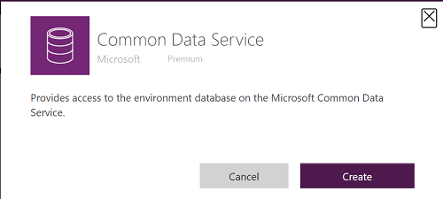
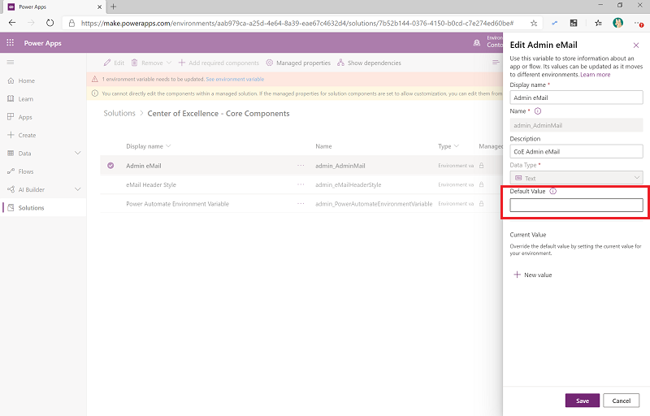

# Set up core components

The Center of Excellence (CoE) Core Components solution provides components that you need to get started with setting up a CoE. They sync all your resources into entities and build admin apps on top of that to help you get more visibility into the apps, flows, and makers that exist in your environment. Additionally, apps like the DLP Editor and Set App Permissions help with daily admin tasks.  

The Core Components solution contains assets that are only relevant to admins.

Watch the [setup instructions video](https://youtu.be/L8gKjeE5GR4) to help you download and deploy the solution.

## Import the solution

This is the first step of the installation process and is required for every other component in the starter kit to work. You'll need to create an environment in which to set up the CoE. More information about how to decide on the best strategy for your organization: [Establishing an Environment Strategy for Microsoft Power Platform](https://powerapps.microsoft.com/blog/establishing-an-environment-strategy-for-microsoft-power-platform/) and [Application lifecycle management](https://docs.microsoft.com/power-platform/admin/wp-application-lifecycle-management)

1. Download the CoE Starter Kit compressed file ([aka.ms/CoeStarterKitDownload](https://aka.ms/CoeStarterKitDownload)).

1. Extract the zip file.

1. Create an environment in which to set up the CoE.

   1. Go to [aka.ms/ppac](https://admin.powerplatform.microsoft.com/).
   1. Select **Environments** > **+ New**, and then fill in a name, type, and purpose.
   1. Select **Yes** for creating the database, and then select **Next**.
   1. Leave sample apps and data set to **No**
   1. Select **Save**.

1. Go to your new environment.

    1. Go to [make.powerapps.com](<https://make.powerapps.com>)
    1. Go to the environment you just created, in which the CoE solution will be hosted. In the example in the following screenshot, we're importing to the environment named **Contoso CoE**.

     

1. Create connections to all Connectors used as part of the solution.
    1. Go to **Data > Connections**.
    1. Select **+ New Connection**.
    1. Select **Common Data Service**.
     
    1. Select **Create**.
        
    1. Complete these steps for these connectors:
        - Common Data Service
        - Common Data Service (current environment)
        - Power Apps for Admins
        - Power Apps for Makers
        - Power Platform for Admins
        - Power Automate for Admins
        - Power Automate Management
        - Office 365 Users
        - Office 365 Outlook
        - Office 365 Groups
        - SharePoint

1. Select **Solutions** on the left navigation bar.

1. Select **Import**.

1. Select **Browse**.

1. Choose the **Center Of Excellence Core Components** solution from the file explorer (CenterOfExcellenceCoreComponents_x_x_x_xx_managed.zip).

1. When the compressed (.zip) file has been loaded, select **Next**.

1. Review the information and select **Next**
1. Establish connections to activate your solution. If you create a new connection you must Refresh. You will not lose your import progress.

     

1. Don't update the environment variable values at this stage. You will update them after the import, see [update environment variables](#update-environment-variables).

1. Select **Import**
1. The import can take up to ten minutes to complete.

## Update environment variables

>[!IMPORTANT]
> Currently it is mandatory to follow the below instructions to configure Environment Variables despite entering the Environment Variable values during the import.

The environment variables are used to store application and flow configuration data with data specific to your organization or environment. This means that you only have to set the value once per environment and it will be used in all necessary flows and apps in that environment.

All of the sync flows depend on all environment variables' being configured.

For the Core Components solution, three environment variables need to be configured. The following screenshot shows an example of what the error message will look like.

 

>[!TIP]
>To view all environment variables in the environment, open the default solution for the environment, and set the **Type** filter to **Environment variable**.

- Select a variable, and then configure its **Default Value**.

   

    Configure the following variables for the Core Components solution, and then select **Save**.

    | Name | Default Value |
    |------|---------------|
    |Power Automate Environment Variable | For a US environment: <https://us.flow.microsoft.com/manage/environments/>  For an EMEA environment: <https://emea.flow.microsoft.com/manage/environments/>  For a GCC environment: <https://gov.flow.microsoft.us/manage/environments/> |
    |Admin eMail                         | Email address used in flows to send notifications to admins; this should be either your email address or a distribution list |
    |eMail Header Style                  | CSS style used to format emails that are sent to admins and makers. A default value is provided. [See the provided default value](code-samples/css/default-value-eMail-Header-Style.md). |
    |Also Delete from CoE | When the **Admin \| Sync Template v2 (Check Deleted)** flow is run, this denotes if you want the items items deleted from CoE (yes) or just mark deleted (no) |

## Activate the Sync Template flows

The flows with the prefix *Sync* are required for populating and cleaning up data in the Common Data Service entities (Environments, Power Apps Apps, Flows, Flow Action Details, Connectors, and Makers).

The sync flows are used to write or delete data from the admin connectors into the Common Data Service entities. These flows run on a schedule, to continue with the setup

1. Ensure all **Admin \| Sync Template v2 (...)** flows are Turned **On**

    

    >[!TIP]
    >To view all environment variables in the environment, open the default solution for the environment, and set the **Type** filter to **Flow**.

1. Select the **Admin \| Sync Template v2** and click **Run** to manually start the first sync of your tenant data into the entities. Going forward, this will happen on a nightly schedule.

The following flows are required to sync data to the resource entities:

-  **Admin \| Sync Template v2**  
    Flow type: Scheduled (daily by default)  
    Description: This flow syncs environment details to the CoE Common Data Service entity, Environments.

-  **Admin \| Sync Template v2 (apps, custom connectors, flows, model-driven apps, PVA, Power Apps Users Shared With, RPA)**  
    Flow type: Automated  
    Description: These flows rely on the _Admin \| Sync Template v2_ flow and are triggered automatically when environment details are created or modified in the CoE Common Data Service Environments entity. These flows then crawl environment resources and store data in the PowerApps App, Flow, Connection Reference, PVA, Power Platform Users and Maker entities.

1. (Optional) **Admin \| Sync Template v2 (Flow Action Details)**  
    Flow type: Scheduled (daily by default)  
    Description: This flow stores all triggers and actions from all the the Power Automate flows in your tenant.
    Note that this flow is resource and performance intense; only enable this flow if you are interested in action and trigger specific reporting.

1. **Admin \| Sync Template v2 (Connectors)**  
    Flow type: Scheduled (daily by default)  
    Description: This flow stores all connector information in the Common Data Service PowerApps Connector entity.

1. **Admin \| Sync Template v2 (Sync Flow Errors)**  
    Flow type: Scheduled (daily by default)  
    Description: If any of the sync flows fail, the failure is stored in the Common Data Service Sync Flow Errors entity. This scheduled flow sends a report of failures to the admin.

1. **Admin \| Sync Template v2 (Check Deleted)**  
    Flow type: Scheduled (weekly by default)  
    Description: Compares CoE to the tenant to determine if any objects were deleted since last run. Either just marks them as deleted (if env var *Also Delete from CoE* = no) or deletes them from the CoE (if *Also Delete from CoE* = yes).
1. **Admin \| Sync Template v2 (UI Flow Sessions)**  
    Flow type: Scheduled (daily by default)  
    Description: This flow gets Ui Flow run information and stores it in the RPA Session entity.

## Configure the CoE Settings entity

This section explains how to enter data in the CoE Settings entity, which is included in the Common Data Service instance from step 2, above.

This entity will hold a single row of information which contains your logo, brand colors, and so on, which different applications will reference.

The following assets depend on the CoE Settings entity:

- **Canvas apps**: The optional branding details (logo, brand colors) in all the canvas apps are pulled from this entity. Optional support and community channel links are also used.
- **Optional flows**: The optional branding details and support channel links are used in the communication flows. You'll also configure links to the canvas apps in the settings. (The main flow that syncs data to the resource entities doesn't depend on this setting configuration.)

1. Go to [make.powerapps.com](https://make.powerapps.com/), select **Apps**, and open the Power Platform Admin View model-driven app in Play mode.

1. In the left navigation, select **Configure**.

1. In the **Configure view** screen, select **+ New** to create a new record.

1. Provide values as listed in the following table.

1. Select **Save**.

1. Don't add more records to the CoE Settings table; there's no need. The dependent components will always get values from the first record.

| Name | Setting value |
|------|------------|
| Company Name | Your company name as it will appear in dashboards
|Brand Logo | Link to your logo as an image file |
| Brand Primary Color          | Hexadecimal value of your primary brand color (\#CCCCCC)
| Brand Secondary Color        | Hexadecimal value of your secondary brand color (\#DDDDDD)                                                    |
| Email End User Support       | Email address for your helpdesk or user computing support team                                        |
| Email Maker Support          | Email address for your Microsoft Power Platform maker support team                                              |
| Tenant Type | The type of tenant you have. Possible Values:  **Commercial** _(use if your url is https://make.powerapps.com)_   **GCC** _(use if your url is https://make.gov.powerapps.us)_   **GCC High** _(use if your url is https://make.high.powerapps.us)_
| Link to Community Channel    | Link to your internal Microsoft Power Platform community (for example, Yammer, Teams)                            |
Link to Learning Resource    | Link to internal Microsoft Power Platform learning resources, or you might link to aka.ms/PowerUp    |
Link to Policy Documentation | Link to internal Microsoft Power Platform policies; for example, a Teams channel or SharePoint site |
Version                      | Set to 1.0                                                                                            |

## Set up Audit Log sync

The Audit Log sync flow connects to the Office 365 Audit Log to gather telemetry data (unique users, launches) for apps. The CoE Starter Kit will work without this flow; however, usage information (app launches, unique users) in the Power BI dashboard will be blank.

More information: [Set up the Audit Log connector](setup-auditlog.md)

## Set up the Power BI dashboard

The CoE Power BI dashboard provides a holistic view with visualizations and insights into resources in your tenant: environments, apps, Power Automate flows, connectors, connection references, makers, and audit logs. Telemetry from the audit log is stored from the moment you set up the CoE Starter Kit, so over time you can look back and identify trends for longer than 28 days.

More information: [Set up the Power BI dashboard](setup-powerbi.md)

## Share apps with other admins

The Core Components solution doesn't contain any apps for makers or users, only admin-specific apps. These components are designed to give admins better visibility and overview of resources and usage in their environments. None of the components are to be shared with makers or users.

The user account who uploaded the solution, and the environment admin of the environment the solution exists in, will have full access to the solution; however, you might want to share these apps with specific other users. More information: [Share a canvas app in Power Apps](https://docs.microsoft.com/powerapps/maker/canvas-apps/share-app)

## Wait for flows to finish

After the sync flows have finished running (depending on the number of environments and resources, this can take a few hours), you're ready to use the core components of the CoE Starter Kit.

**To check the status of a flow**

1. Select **Admin \| Sync Template v2**.

   This will open a new tab to the **Flow detail** page.

1. View **Runs**.
