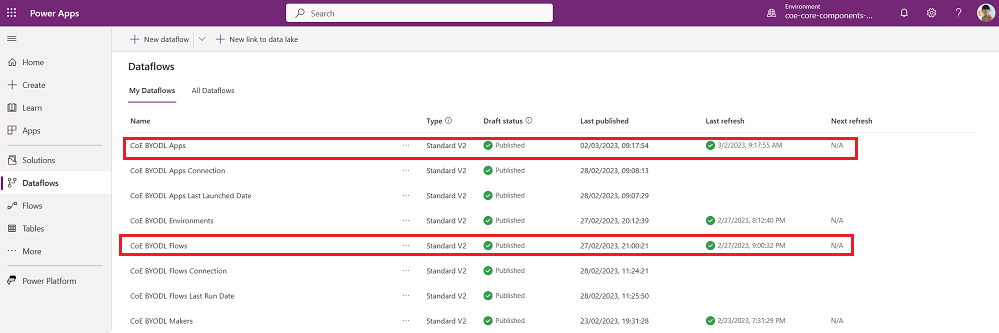
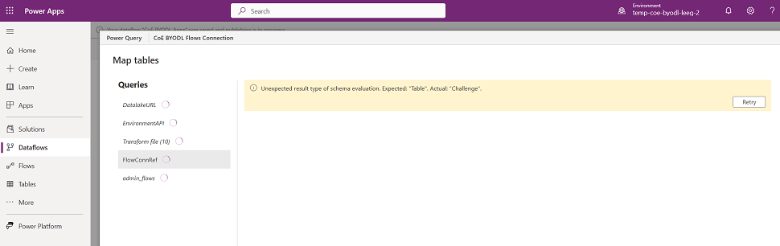
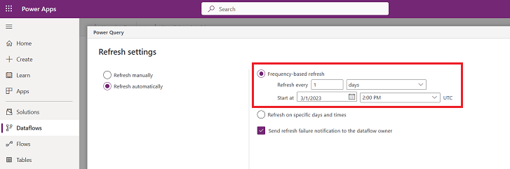

# Data Export Specific inventory setup

## Dataflow Setup

Set up dataflows to retrieve your inventory from Data Export

If your inventory is coming from [Data Export](setup.md#what-data-source-should-i-use-for-my-power-platform-inventory), you have to configure dataflows as part of the setup.

> [!NOTE]
> Only complete these steps if you've configured [Data Export](setup.md#what-data-source-should-i-use-for-my-power-platform-inventory) as the mechanism for inventory and telemetry.
>
> Only start with this configuration when you see data in the storage account that is set up to receive data from Data Export. This may take up to five days from initial setup of Data Export in the Power Platform admin center.

### Copy Azure Storage Account URL

1. Navigate to [portal.azure.com](https://portal.azure.com).
1. Search for or select the storage account configured to receive [Data Export data](/power-platform/admin/self-service-analytics#set-up-the-data-export-process-for-your-tenant).
1. Select **Endpoints**.
1. Copy the Data Lake Storage URL to Notepad.
 

1. Append */powerplatform* to the URL.

### Confirm Storage Account permission

1. Navigate to [portal.azure.com](https://portal.azure.com).
1. Search for or select the storage account configured to receive [Data Export data](/power-platform/admin/self-service-analytics#set-up-the-data-export-process-for-your-tenant).
1. Select **Access Control (IAM)**.
1. Select **View my access**.
1. Confirm you have the Storage Blob Data Reader role assigned.

 

### Copy Environment Web API endpoint

1. Navigate to [make.powerapps.com](https://make.powerapps.com).
1. Select the environment you've installed the CoE Starter Kit in.
1. Select the cog > Developer resources.

 

1. Copy the Web API endpoint.

 

### Configure connections to data sources

1. Navigate to [make.powerapps.com](https://make.powerapps.com).
1. Select the environment you've installed the CoE Starter Kit in.
1. Select **Dataflows**.
1. Edit the **CoE BYODL Makers** dataflow.

1. Update the *DatalakeURL* parameter with the link to your Data Lake Storage URL and the *EnvironmentAPI* parameter with the link to your Environment Web API endpoint.

   

   1. Select each table shown in the Queries section and configure the connection.

       :::image type="content" source="media/byodl-9.png" alt-text="Select a table to configure the connection":::

   1. For each connection, select Organizational account and sign in with your account.

 

   1. Once all connections are configured and there are no more warnings, select **Next**.
   1. Select the **Makers** table and confirm that this table is configured to load data to the existing **admin_Maker** table.

 
        >[!NOTE]
        >If the table is configured to map to a new table or you don't see a mapping configured between source and destination columns, select **Cancel** and start again.

   1. Select **Publish**. Don't change any data mapping configuration.

 

   1. The **CoE BYODL Makers** start refreshing. Wait for the refresh to finish.

 

1. Now edit the **CoE BYODL Environments** dataflow and complete the same steps to update the **DatalakeURL** and **EnvironmentAPI** parameters and configure the connections to the data sources used by this dataflow.
1. Select **Next**.
1. Select the **Environments** table and confirm this table is configured to load data to the existing **admin_Environment** table.
1. Publish the **CoE BYODL Environments** dataflow and wait for the refresh to finish.

 

1. Now edit the **CoE BYODL Apps**, **CoE BYODL Model Driven Apps**, and **CoE BYODL Flows** dataflows and complete the same steps to update the **DatalakeURL** and **EnvironmentAPI** parameters and configure the connections to the data sources used by this dataflow.
1. Confirm that the **CoE BYODL Apps** and **CoE BYODL Model Driven Apps** dataflows are configured to load data to the existing **admin_App** table, and the **CoE BYODL Flows** dataflow is configured to load data to the existing **admin_Flow** table.
1. Publish the **CoE BYODL Apps**, **CoE BYODL Model Driven Apps** and **CoE BYODL Flows** dataflows and wait for the refresh to finish.

 

1. Now edit the **CoE BYODL Apps Connection**, **CoE BYODL Apps Last Launched Date**, **CoE BYODL Flows Connection**, and **CoE BYODL Flows Last Run Date** dataflows and complete the same steps to update the **DatalakeURL** and **EnvironmentAPI** parameters, and configure the connections to the data sources used by this dataflow.
1. Confirm the **CoE BYODL Apps Connection** and **CoE BYODL Apps Last Launched Date** dataflows are configured to load data to the existing **admin_App** table and the **CoE BYODL Flows Connection** and **CoE BYODL Flows Last Run Date** dataflows are configured to load data to the existing **admin_Flow** table.
1. Publish the **CoE BYODL Apps Connection**, **CoE BYODL Apps Last Launched Date**, **CoE BYODL Flows Connection**, and **CoE BYODL Flows Last Run Date** dataflows and wait for the refresh to finish.

 

#### Troubleshooting

If you receive a "The specified path doesn't exist" dataSource error, this means that you have only recently configured the Data Export and not all required folders and files are yet available in the storage account. After initial setup, it can take up to five days for folders to populate.

 

If you receive a DataFormat.Error after updating the *DatalakeURL* and *EnvironmentAPI* parameters, this may mean you've entered the incorrect URLs. Verify that the *DatalakeURL* parameter points to your Azure Storage Account URL. The URL should contain dfs.core and end with /powerplatform. Verify that the *EnvironmentAPI* points to your Environment Web API. The URL should contain api.crm and end with /api/data/v9.2.

 

If the publish or refresh has failed, select the error to review the status alert:

 

The refresh may fail if you've missed configuring connections to all data sources used by the dataflow. Edit the dataflow again and verify you've configured connections to all data sources. Select all the queries individually to check for warnings.

 

If you have configured connections in the dataflow, but the **Publish** button remains disabled and you see a warning message, this may indicate you've missed configuring connections to all data sources used by the dataflow. Select **Back** and review all queries for connection warnings.

 

### Configure scheduled refresh

1. Navigate to [make.powerapps.com](https://make.powerapps.com).
1. Select the environment you've installed the CoE Starter Kit in.
1. Select **Dataflows**.
1. Select **Edit refresh settings** for the **CoE BYODL Makers** dataflow.

 

1. Select **Refresh automatically** and configure a daily refresh. Check when files are written to your storage account by the Data Export feature, and set up the daily refresh of the dataflow for after that time. This means the dataflow will run after data is exported to your storage account.

 

## Environment variables

This section includes the full list of environment variables that affect the Data Export methodology to inventory the tenant. Note that these are all filled for you by the Setup Wizard.

| Name | Description | Default value |
|------|---------------|------|
| App Connections Dataflow ID | Dataflow ID of the CoE BYODL App Connections dataflow. Only used when mechanism for inventory is [Data Export](setup.md#what-data-source-should-i-use-for-my-power-platform-inventory). | Not applicable |
| App Dataflow ID | Dataflow ID of the CoE BYODL Apps dataflow. Only used when mechanism for inventory is [Data Export](setup.md#what-data-source-should-i-use-for-my-power-platform-inventory). | Not applicable |
| App Usage Dataflow ID | Dataflow ID of the CoE BYODL App USage dataflow. Only used when mechanism for inventory is [Data Export](setup.md#what-data-source-should-i-use-for-my-power-platform-inventory). | Not applicable |
| Current Environment | Current Dataflow Environment ID used by cloud flows to refresh dataflows. Only used when mechanism for inventory is [Data Export](setup.md#what-data-source-should-i-use-for-my-power-platform-inventory). | Not applicable |
| Environment Dataflow ID | Dataflow ID of the CoE BYODL Environments dataflow.  Only used when mechanism for inventory is [Data Export](setup.md#what-data-source-should-i-use-for-my-power-platform-inventory). | Not applicable |
| Flow Connections Dataflow ID | Dataflow ID of the CoE BYODL Flow Connections dataflow.  Only used when mechanism for inventory is [Data Export](setup.md#what-data-source-should-i-use-for-my-power-platform-inventory). | Not applicable |
| Flow Usage Dataflow ID | Dataflow ID of the CoE BYODL Flow Usage dataflow.  Only used when mechanism for inventory is [Data Export](setup.md#what-data-source-should-i-use-for-my-power-platform-inventory). | Not applicable |
| Flow Dataflow ID | Dataflow ID of the CoE BYODL Flows dataflow.  Only used when mechanism for inventory is [Data Export](setup.md#what-data-source-should-i-use-for-my-power-platform-inventory). | Not applicable |
| Maker Dataflow ID | Dataflow ID of the CoE BYODL Makers dataflow.  Only used when mechanism for inventory is [Data Export](setup.md#what-data-source-should-i-use-for-my-power-platform-inventory). | Not applicable |
| Model App Dataflow ID | Dataflow ID of the CoE BYODL Model Driven Apps dataflow.  Only used when mechanism for inventory is [Data Export](setup.md#what-data-source-should-i-use-for-my-power-platform-inventory). | Not applicable |

## I found a bug with the CoE Starter Kit; where should I go?

To file a bug against the solution, go to [aka.ms/coe-starter-kit-issues](https://aka.ms/coe-starter-kit-issues).

[!INCLUDE[footer-include](../../includes/footer-banner.md)]
