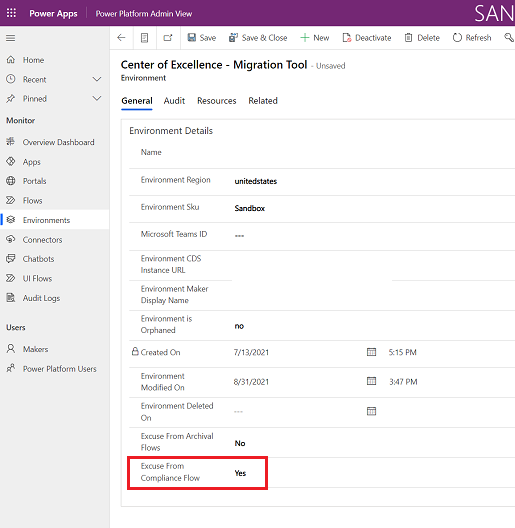

# Set up Developer Compliance components

This article will help you to set up the [Developer Compliance Center](example-processes.md) components of the Core and Governance solutions of the CoE Starter Kit.  

This set of functionality allows you to detect frequently used apps and chatbots in your tenant and request their makers provide additional information about them, such as a business justification, data classification and support plan. The goal is for admins to have better visibility into the solutions built by their makers, and support them in making decisions. For examples, admins may decide to move highly used applications to a dedicated environment.

>[!IMPORTANT]
>This article assumes you have [installed the governance components solution](before-setup-gov.md) and you have your [environment setup](setup.md#create-your-environments), and are logged in with the [correct identity](setup.md#what-identity-should-i-install-the-coe-starter-kit-with).

[Watch a walk-through](https://www.youtube.com/watch?v=WXXFjHLt5ss&list=PLi9EhCY4z99W5kzaPK1np6sv6AzMQDsXG) of how the compliance process works.

## Set up the Developer Compliance  components using the Setup Wizard

1. Open the **Center of Excellence - Core Components** solution.
1. Open the **CoE Setup and Upgrade Wizard** app.
1. Open the **More features** page and select **Compliance process**.
1. This app provides a guided step by step experience through the configuration steps.
        :::image type="content" source="media/setupwizard-compliance.png" alt-text="CoE Starter Kit Setup Wizard":::

> [!NOTE]
> The Setup Wizard is currently in preview. If you experience issues with the Setup Wizard, please [raise them on GitHub](https://aka.ms/coe-starter-kit-issues) and proceed with setting up the Inventory components manually.

## Set up the Developer Compliance  request components manually

### Configure mandatory environment variables

This step will be completed after you import the solution. Environment variables are used to store application and flow configuration data. Using environment variables means that you only have to set the value once per environment and it will be used in all necessary flows and apps in that environment.

> [!TIP]
> Learn how to update environment variables: [Update Environment Variables](faq.md#update-environment-variables).

| Name | Description |
|------|---------------|
| Developer Compliance Center URL  | Set this environment variable to the URL for the **Developer Compliance Center** app. More information: [Get App URL – Production Environment](faq.md#get-a-power-apps-url-from-a-production-environment) |

### Exempt environments from the compliance process

You may want to exempt certain environments from the compliance process - for example, dedicated environments that are already well managed or the environment you've installed the CoE Starter Kit in. Learn more: [Establishing an environment strategy](/power-platform/guidance/adoption/environment-strategy)

You can exempt environments from the compliance process using the Power Platform Admin View app.  

1. Go to [make.powerapps.com](<https://make.powerapps.com>).
1. Go to your CoE environment.
1. Open the **Power Platform Admin View** app.
1. Select Environments > Chose the environment you want to exempt > Set the **Excuse From Compliance Flows** field to Yes > **Save**

    

### Turn on flows

Turn on these flows that are installed as part of the Core components solution:

- Admin | Compliance request complete apps v3
- Admin | Compliance request complete bots v3
- Admin | Compliance request complete custom connector v3
- Admin | Compliance request complete flows v3
- Admin | Compliance Teams Environment BPF kickoff v3
- Admin | Compliance Details Request eMail (Apps)
- Admin | Compliance Details Request eMail (Chatbots)
- Admin | Compliance Details Request eMail (Custom Connectors)
- Admin | Compliance Details Request eMail (Desktop Flows)
- Admin | Compliance Details Request eMail (Flows)
- [**Admin | Compliance detail request v3**](governance-components.md#admin--compliance-detail-request-v3)

### Share apps with makers

The Governance Components solution contains the [**Developer Compliance Center**](governance-components.md#developer-compliance-center) app, which is used by makers to update the compliance details of their applications. Share these apps with your Power Platform makers and assign them the **Power Platform Maker SR** security role.

More information:

- [Share an app in Power Apps](faq.md#share-an-app-from-a-production-environment)

Your app, flow, and bot makers will use the Developer Compliance Center app to provide further information about the resources they're building. Get familiar with the [audit process](example-processes.md) and share the app with your makers.

Consider adding this app to the **CoE Maker Command Center** for makers to easily find and access it.

## All environment variables

Here's the full list of environment variables that are used as part of the compliance process, including environment variables with Default values. You may have to [update environment variables](faq.md#update-environment-variables) after import.

>[!IMPORTANT]
> You don't have to change the values during setup, just when you need to change the value of an environment variable that you configured during import or when you want to change a default value. Re-start all flows after you change environment variables, to make sure the latest value is picked up.

Environment variables are used to store application and flow configuration data with data specific to your organization or environment.

| Name | Description | Default Value |
|------|---------------|------|
| Developer Compliance Center URL  | Set this environment variable to the URL for the **Developer Compliance Center** app. More information: [Get App URL – Production Environment](faq.md#get-a-power-apps-url-from-a-production-environment) | n/a |
| Compliance – Apps – Number Days Since Published | If an app is broadly shared and was last published this many days ago or older, makers are asked to republish the app to stay compliant | 60 |
| Compliance – Apps – Number Groups Shared | If the app is shared with this many or more groups, makers are asked for a business justification | 1 |
| Compliance – Apps – Number Launches Last 30 Days | If the app was launched at least this many times in the last 30 days, makers are asked for a business justification | 30 |
| Compliance – Apps - Number Users Shared | If the app is shared with this many or more users, makers are asked for a business justification | 20 |
| Compliance – Chatbots – Number Launches | If the chatbot is launched this many or more times, makers are asked for a business justification | 50 |
| Exclude Default environment from Compliance Request flows | **(DEPRECATED)** Use [exempt environments from the compliance process](#exempt-environments-from-the-compliance-process) instead. Set to Yes if you want to Exclude the Default environment from the Admin \| Compliance Details request flows | No |

## It looks like I found a bug with the CoE Starter Kit; where should I go?

To file a bug against the solution, go to [aka.ms/coe-starter-kit-issues](https://aka.ms/coe-starter-kit-issues).

[!INCLUDE[footer-include](../../includes/footer-banner.md)]
