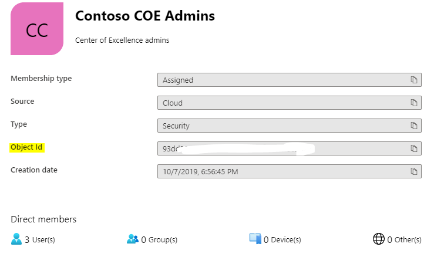
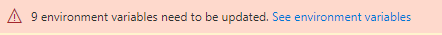
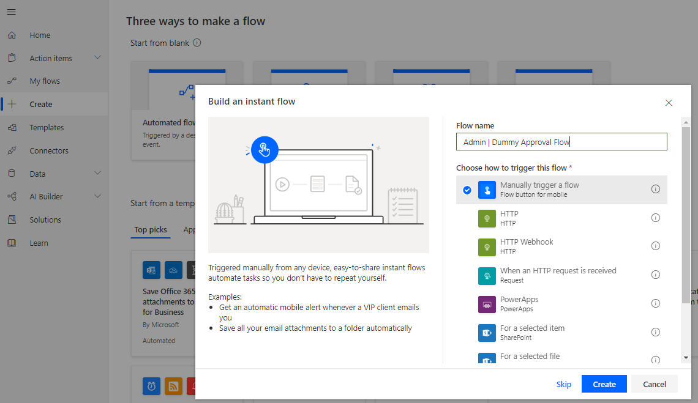
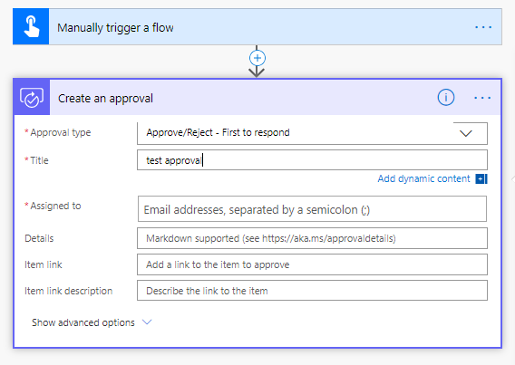
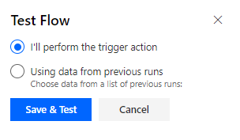
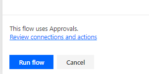
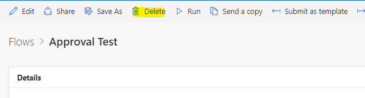
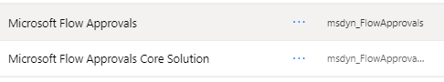

# Set up audit report components

There are multiple components provided in this starter kit, each will require
some configuration to install. The installation instructions have been segmented
based on the set of components that should be grouped and installed together,
and dependencies on other segments are outlined in each section.

## Import the solution

This is the first setup step of the installation process and is required for any
other component in the starter kit to work.

The Audit and Report Components solution requires the Core Components solution
to be installed first.

1. Follow the instructions detailed under [Core components - Import
    Instructions](setup-core-components.md)

1. Import the *CenterOfExcellenceAuditComponents_x_x_x_xx_managed.zip*

## Create a SharePoint document library

The Archive and Clean Up Flows archive apps to a SharePoint library. If you are intending to make use of those flows, a SharePoint site and document library
need to be configured first.

1. Follow the steps described under [Create a team site in
    SharePoint](https://support.office.com/article/create-a-team-site-in-sharepoint-ef10c1e7-15f3-42a3-98aa-b5972711777d)
    to create a new Team Site

1. Follow the steps described under [Create a document library in
    SharePoint](https://support.office.com/article/create-a-document-library-in-sharepoint-306728fe-0325-4b28-b60d-f902e1d75939) to add a Document Library to your new Team Site. Name the document library **PowerAppsArchive**

1. Ensure you set up the correct permissions for your SharePoint site, we would
    recommend only your Admin team should have contribute access to the site.

## Create an Azure AD Security Group

The Admin \| Find and add admins as owners for apps that leverage certain
connectors flow adds the Admin Security Group to apps; it is therefore required to configure the Admin Security Group first.

If you already have a security group ready, go to [portal.azure.com](<https://portal.azure.com/>) and get its Object ID

1. Follow the steps described here to create a new Azure AD Group: [active
    directory groups create azure
    portal](https://docs.microsoft.com/azure/active-directory/fundamentals/active-directory-groups-create-azure-portal)

1. Once created, add your Admin team to the Azure AD Security Group

1. Make note of the **Object Id** of the Group which is needed to share an app with your group. 

## Update Environment Variables

This step should be completed after importing the solution. The Environment
Variables are used to store application and flow configuration data. This means, you only have to set the value once and it will be used in all necessary flows and apps.

All flows in this solution depend on all Environment Variables being configured.

1. You will see an error at the top, notifying you that Environment Variables
    need to be configured.  
    Note: For the Audit and Report Components solution, it will be **4**
    environment variables that need to be configured. 

1. Click on **See Environment Variables** to set the values

| Name | Default Value |
|------|---------------|
| Archive Site URL (SharePoint Site)  | The Archive and Clean Up Flow archives app files (.msapp) to a SharePoint site. Paste the URL of the Team site you created under [Create a SharePoint document library](#create-a-sharepoint-document-library). Leave blank if you are not planning to use the Archive and Clean Up Flow.
| Archive Folder                      | Folder (Document Library) within the above SharePoint site, where the .msapp file should be stored. Paste the Name of the Document Library you created under [Step 2 above](#step-2-optional-create-a-sharepoint-document-library). Leave blank if you are not planning to use the Archive and Clean Up Flow.                                                                                                                                                                                                                                                                                 |
| Developer Compliance Center         | Navigate to the details page of the Developer Compliance Center (Canvas App), part of this solution and copy the Web Link (to launch the app) and paste it into this variable.                                                                                                                                                                            |
| Power Platform Admin Security Group | The *Admin \| Find and add admins as owners for apps that leverage certain connectors flow* adds the Admin Security Group to apps; it is therefore required to configure the Admin Security Group first – enter the Azure AD Group ID (Object Id) of the group you created under Step 3 here. Note: Make sure to enter the Object Id, not an email address. |

## Initialize Flow Approval Entities in your Environment

The Admin \| App Archive and Clean Up – Start Approval and Admin \| App Archive and Clean Up – Check Approval flows use the in-built Approval actions of flow.
In the background, the in-built Approval actions use CDS. If you have installed the solution in a blank new environment, the Approval entities need to be initialized first. The easiest way to do this is to create a dummy approval flow.

1. 1Navigate to [flow.microsoft.com](https://flow.microsoft.com)

1. Click on **+ Create**

1. Select **Instant Flow**

1. Pick **manually trigger a flow** as trigger, and enter *Admin \| Dummy Approval Flow* as name 

1. Select **+ New Step** to add an approval action to the flow, search for and select **Create an approval**

1. Select a dummy title and put your email address under **Assigned To** 

1. Select **Test** in the top right corner, and pick **I'll perform the trigger action**

1. Click **Save & Test**  

1. Click **Run Flow**  

1. This flow can take up to ten minutes to run initially. Once run, you can delete the flow as it will not be needed anymore 

1. Click on Solutions in the right-hand side, and you should now see two new flow Approvals solutions. Note that the presence of these solutions was the point of this step, and the way you know it succeeded. You initialized flow solutions for the environment. 

## Activate the Flows

This Compliance and Report solution contains five flows:

1. Admin \| App Archive and Clean Up – Start Approval
1. Admin \| App Archive and Clean Up – Check Approval
1. Admin \| Compliance detail request
1. SETUP REQUIRED \| Admin \| Find and add admins as owners for apps that leverage certain connectors
1. SETUP REQUIRED \| Admin \| Find and disable flows that leverage certain connectors

Follow the same instructions to configure the flows as mentioned under [
Activate the Sync Template Flows](setup-core-components.md)

## Share apps with Makers

The Audit and Report Components solution contains one app, which is used by
makers to update compliance details of their application.

**Developer Compliance Center**
Once you are ready to adopt the CoE with the makers of Apps and flows, share this Application with them. Your makers must have a Power Apps Premium license, as mentioned under [Prerequisites](setup.md#prerequisites).
