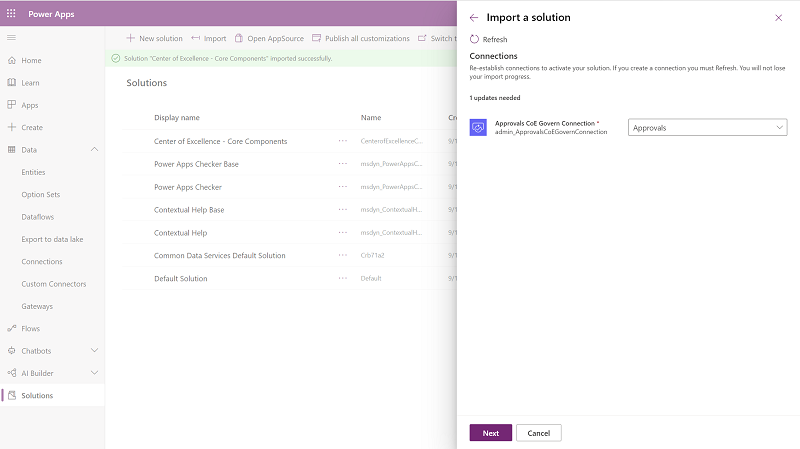
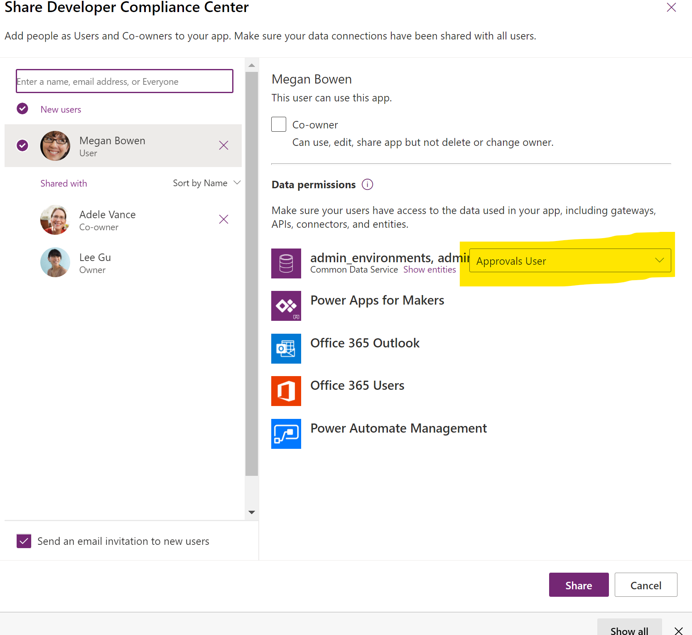
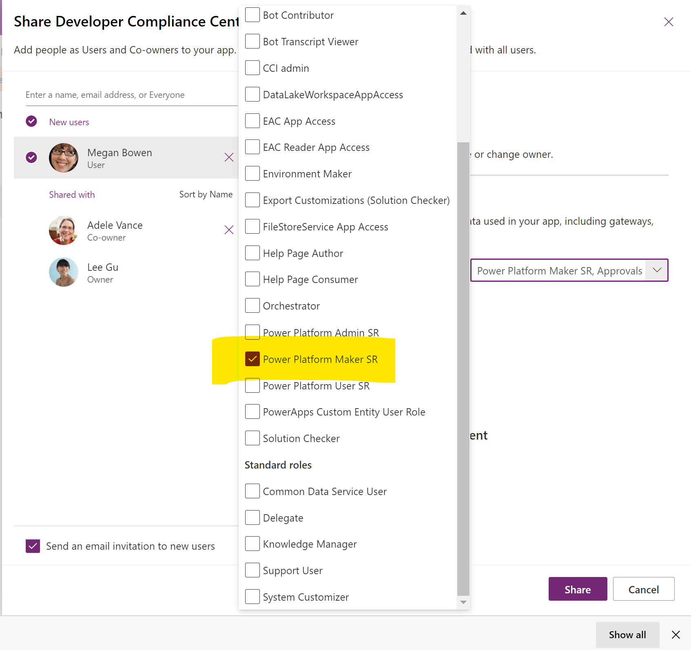

# Set up governance components

Multiple governance components are provided in the Center of Excellence (CoE) Starter Kit; each will require some configuration to install. The installation instructions in this article have been segmented based on the set of components that should be grouped and installed together, and dependencies on other segments are outlined in each section.

## Import the solution

The Core Components solution is required for the Audit and Report Components solution, or any other component in the starter kit, to work.

1. Follow the instructions detailed under [Set up core components](setup-core-components.md).

1. Import the *CenterOfExcellenceAuditComponents_x_x_x_xx_managed.zip* file.
1. Create a new connection to the all connectors.
    
1. Update the Environment Variable values. Environment variables are used to store application and flow configuration data. This means that you only have to set the value once per environment and it will be used in all necessary flows and apps in that environment.

    | Name | Current value |
   |------|---------------|
   | Auto Delete On Archive | Determines whether apps are deleted when they're archived in the following flow: Admin \| App Archive and Clean Up - Check Approvals and Archive.   Value must be Yes or No. A default value of No is provided. |
   | Developer Compliance Center         | Leave this blank on import, and [update the enviornment variable](#update-environment-variables) after the import has finished by first navigating to the details page of the Developer Compliance Center (canvas app) included with this solution, and copy the web link (to launch the app) and paste it into this variable.  |
   | ProductionEnvironment | Determines if the environment is Production or Dev/Test. True (the default) will mean that the approvals are sent to app/flow owners. False will send those approvals to the admin email. |

1. Select **Import** without adding values to the Environment Variables, as we will update them later - see [update environment variables](#update-environment-variables)

## Update environment variables

This step should be completed after you import the solution. Environment variables are used to store application and flow configuration data. This means that you only have to set the value once per environment and it will be used in all necessary flows and apps in that environment..

All flows in this solution depend on all environment variables' being configured.

>[!TIP]
>To view all environment variables in the environment, open the default solution for the environment, and set the **Type** filter to **Environment variable**.

1. Select **See Environment Variables** to set the values as described in the following table.

   | Name | Current value |
   |------|---------------|
   | Auto Delete On Archive | Determines whether apps are deleted when they're archived in the following flow: Admin \| App Archive and Clean Up - Check Approvals and Archive.   Value must be Yes or No. A default value of No is provided. |
   | Developer Compliance Center         | Navigate to the details page of the Developer Compliance Center (canvas app) included with this solution, and copy the web link (to launch the app) and paste it into this variable.  |
   | ProductionEnvironment | Determines if the environment is Production or Dev/Test. True (the default) will mean that the approvals are sent to app/flow owners. False will send those approvals to the admin email. |

## Initialize flow approval tables in your environment

The archive approval flows (*Admin \| App Archive and Clean Up – Start Approval*, *Admin \| Flow Archive and Clean Up – Start Approval*, *Admin \| App Archive and Clean Up – Check Approval*, and *Admin \| Flow Archive and Clean Up – Check Approval*), use the built-in Approval actions of Power Automate. In the background, the built-in Approval actions use Dataverse. If you've installed the solution in a new environment, the Approval tables must be initialized. The easiest way to do this is to create a "dummy" approval flow.

1. Go to [flow.microsoft.com](https://flow.microsoft.com).

1. Select **+ New** > **Instant (From Blank)**.

1. Pick **manually trigger a flow** as the trigger, and enter *Admin \| Dummy Approval Flow* as the name.
   
   

1. Select **+ New Step** to add an approval action to the flow, and then search for and select **Create an approval**.

1. Select a dummy title, and enter your email address under **Assigned To**.

   

1. In the upper-right corner, select **Test**, and then select **I'll perform the trigger action**.

1. Select **Save & Test**  

1. Select **Run Flow**  

    > [!NOTE]
    > This flow can take up to ten minutes to run initially. After it runs, you can delete the flow because it won't be needed anymore.

1. Select **Solutions** on the left side panel, and you should now see two new Flow Approvals solutions. Note that the presence of these solutions was the point of this step, and the way you know it succeeded.

   

## Activate the flows

This Governance Components solution contains flows that you will need to manually turn on, once you are ready to use them.

- Admin \| App Archive and Clean Up – Start Approval
- Admin \| Approval Clean Up
- Admin \| Check Approvals
- Admin \| Flow Archive and Clean Up – Start Approval
- Admin \| Compliance detail request
- Microsoft Teams Admin \| Ask for Business Justification when Microsoft Teams environment is created
- Microsoft Teams Admin \| Weekly Clean Up of Microsoft Teams environments

>[!IMPORTANT]
> These flows will be turned off on solution import, and you can turn them on once you're ready to use them.

## Share apps with makers

The Governance Components solution contains one app, which is used by makers to update the compliance details of their applications.

### Developer Compliance Center

Your app, flow and bot makers will  use the Developer Compliance Center app to provide further information about the resources they're building - get familiar with the [audit process](example-processes.md) and share the app with your makers. Your makers must have a Power Apps Premium license to use this app.

In addition to sharing the app, you will also need to share the data by providing data permissions to the user.

1. Navigate to make.powerapps.com and select the app
1. Select ... > Share
1. Select the Dataverse data permissions
   
1. Select the Power Platform Maker Security Role
   
1. Select Share
