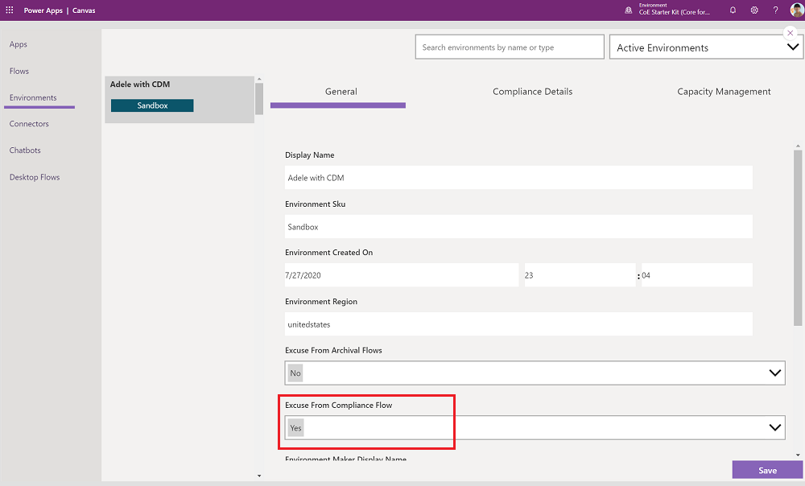

# Set up Developer Compliance components

This article will help you to setup the [Developer Compliance Center](example-processes.md) components of the Core and Governance solutions of the CoE Starter Kit.  

This set of functionality allows you to detect frequently used apps and chatbots in your tenant and request their makers provide additional information about them, such as a business justification, data classification and support plan. The goal is for admins to have better visibility into the solutions built by their makers, and make decisions such as when to provide additional support to a solution or when to move a solution to a dedicated environment.

>[!IMPORTANT]
>This article assumes you have [installed the governance components solution](before-setup-gov.md) and you have your [environment setup](setup.md#create-your-environment), and are logged in with the [correct identity](setup.md#what-identity-should-i-install-the-coe-starter-kit-with).

## Configure mandatory environment variables

This step will be completed after you import the solution. Environment variables are used to store application and flow configuration data. This means that you only have to set the value once per environment and it will be used in all necessary flows and apps in that environment..

>[!TIP]
>Learn how to update environment variables for Production and Dataverse for Teams environments: [Update Environment Variables](faq.md#update-environment-variables).

| Name | Description |
|------|---------------|
| Developer Compliance Center URL  | Set this environment variable to the URL for the **Developer Compliance Center** canvas app. See: [Get App URL – Production Environment](faq.md#get-a-power-apps-url-from-a-production-environment) or [Get App URL – Teams Environment](faq.md#add-apps-to-microsoft-teams). If you have installed the CoE Starter Kit components in a Dataverse for Teams environment, this app is called: Developer Compliance Center (Teams version) and is part of the Core for Teams solution. If you have installed the CoE starter Kit ina  Production environment, this app is called Developer Compliance Center and is part of the Governance components solution.

## Exempt environments from the compliance process

There are some environments that you may want to exempt from the compliance process - this could be dedicated environments that are already well managed. Learn more: [Establishing an environment strategy](/adoption/environment-strategy)

You can exempt environments from the compliance process using the Power Platform Admin View app.  

### Production environment

If your solution is installed in a Production Environment, your app will be a model driven app.  

1. Go to [make.powerapps.com](<https://make.powerapps.com>).
1. Go to your CoE environment.
1. Open the **Power Platform Admin View** app.
1. Select Environments > Chose the environment you want to exempt > Set the **Excuse From Compliance Flows** field to Yes > **Save**

    

### Dataverse for Teams environment

1. Open to the Power Apps app in Teams, select **Build**, and select the Team you have installed the CoE Starter Kit solutions in.
1. Select **Center of Excellence - Core for Teams > See All**.
1. Open the **Power Platform Admin View** app.
1. Select Environments > Chose the environment you want to exempt > Set the **Excuse From Compliance Flows** field to Yes > **Save**.

   

## Turn on flows

For Production environment turn on these flows which are installed as part of the Core components solution:

- Admin | Compliance request complete apps v3
- Admin | Compliance request complete bots v3
- Admin | Compliance request complete custom connector v3
- Admin | Compliance request complete flows v3
- Admin | Compliance Teams Environment BPF kickoff v3
- [**Admin | Compliance detail request v3**](governance-components.md#admin--compliance-detail-request-v3)

For solution installed in a Dataverse for Teams environment, turn on the Admin | Compliance detail request [Teams] v3 flow only which is installed with the Core for Teams components solution.

## Share apps with makers

The Governance Components solution contains the [**Developer Compliance Center**](governance-components.md#developer-compliance-center) canvas app, which is used by makers to update the compliance details of their applications. Share this apps with your Power Platform makers and assign them the **Power Platform Maker SR** security role.

More information:

- [Share a canvas app in Power Apps](faq.md#share-an-app-from-a-production-environment)
- [Share a canvas app in Microsoft Teams](faq.md#share-an-app-from-a-dataverse-for-teams-environment)

Your app, flow, and bot makers will use the Developer Compliance Center app to provide further information about the resources they're building. Get familiar with the [audit process](example-processes.md) and share the app with your makers.

Consider adding this app to the **Maker - Command Center** for makers to easily find and access it.

## All environment variables

Here is the full list of environment variables that impact the compliance process, including environment variables with Default values. You may have to [update environment variables](faq.md#update-environment-variables) after import.

>[!IMPORTANT]
> You don't have to change the values during setup, just when you need to change the value of an environment variable that you configured during import or when you want to change a default value. Re-start all flows after you change environment variables, to make sure the latest value is picked up.

Environment variables are used to store application and flow configuration data with data specific to your organization or environment.

| Name | Description | Default Value |
|------|---------------|------|
| Developer Compliance Center URL  | Set this environment variable to the URL for the **Developer Compliance Center** canvas app. See: [Get App URL – Production Environment](faq.md#get-a-power-apps-url-from-a-production-environment) or [Get App URL – Teams Environment](faq.md#add-apps-to-microsoft-teams). If you have installed the CoE Starter Kit components in a Dataverse for Teams environment, this app is called: Developer Compliance Center (Teams version) and is part of the Core for Teams solution. If you have installed the CoE starter Kit ina  Production environment, this app is called Developer Compliance Center and is part of the Governance components solution. | n/a |
| Compliance – Apps – Number Days Since Published | If an app is broadly shared and was last published this many days ago or older, makers are asked to re-publish the app to stay compliant | 60 |
| Compliance – Apps – Number Groups Shared | If the app is shared with this many or more groups, makers are asked for a business justification | 1 |
| Compliance – Apps – Number Launches Last 30 Days | If the app was launched at least this many times in the last 30 days, makers are asked for a business justification | 30 |
| Compliance – Apps – Number Users Shared | If the app is shared with this many or more users, makers are asked for a business justification | 20 |
| Compliance – Chatbots – Number Launches | If the chatbot is launched this many or more times, makers are asked for a business justification | 50 |
| Exclude Default environment from Compliance Request flows | **(DEPRECATED)** Please use [exempt environments from the compliance process](#exempt-environments-from-the-compliance-process) instead. Set to Yes if you want to Exclude the Default environment from the Admin \| Compliance Details request flows | No |

## It looks like I found a bug with the CoE Starter Kit; where should I go?

To file a bug against the solution, go to [aka.ms/coe-starter-kit-issues](https://aka.ms/coe-starter-kit-issues).

[!INCLUDE[footer-include](../../includes/footer-banner.md)]
