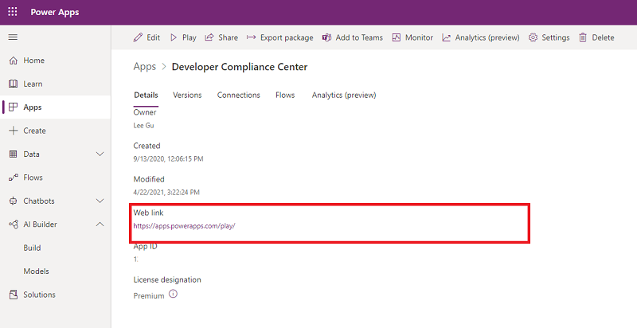
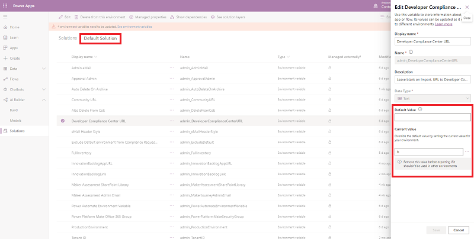
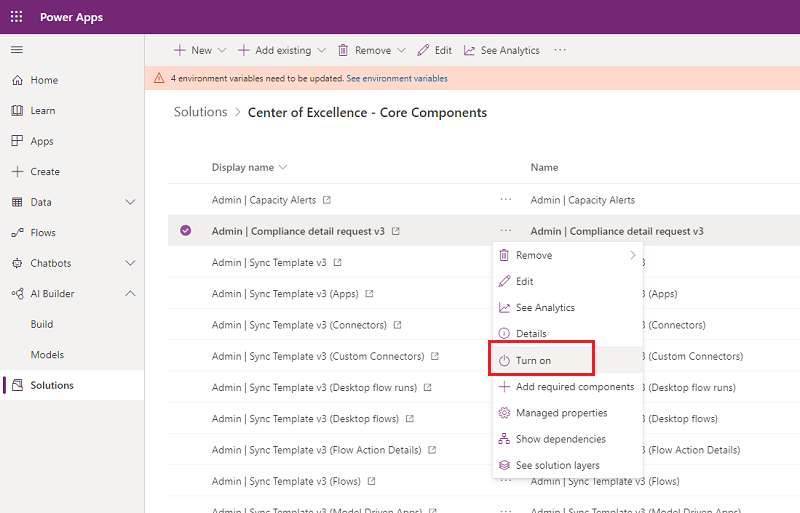
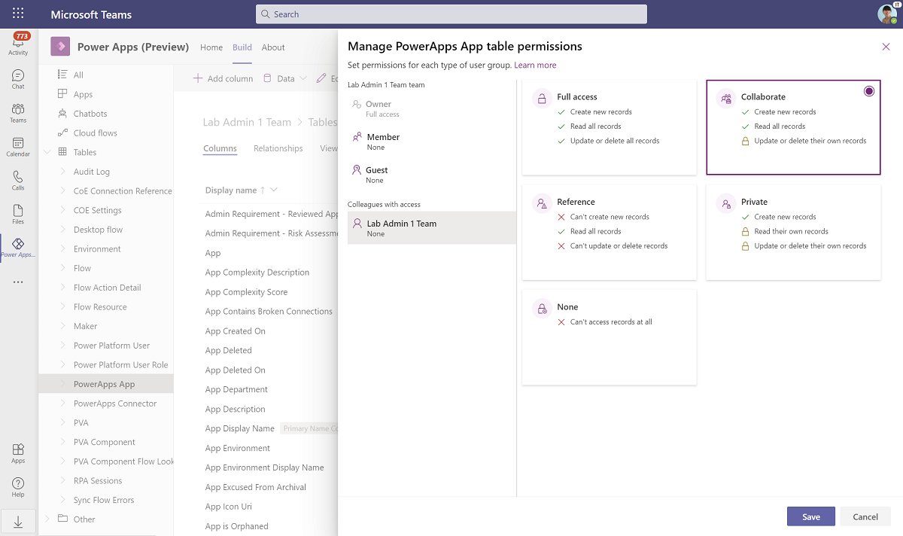
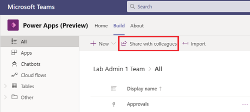
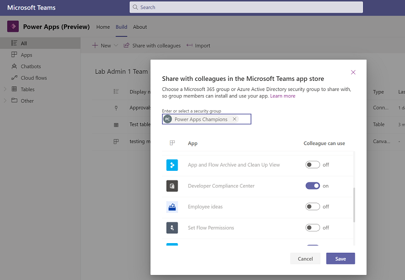

# Set up governance components

Multiple governance components are provided in the Center of Excellence (CoE) Starter Kit; each will require some configuration to install. The installation instructions in this article have been segmented based on the set of components that should be grouped and installed together, and dependencies on other segments are outlined in each section.

## Initialize flow approval tables in your environment

The archive approval flows use the built-in Approval actions of Power Automate.

- *Admin \| Archive and Clean Up v2 (Start Approval for Apps)*
- *Admin \| Archive and Clean Up v2 (Start Approval for Flows)*
- *Admin \| App Archive and Clean Up – Check Approval*
- *Admin \| Flow Archive and Clean Up – Check Approval*)

 In the background, the built-in Approval actions use Dataverse. If you've installed the solution in a new environment, the Approval tables must be initialized. The easiest way to do this is to create a "dummy" approval flow.

1. Go to [flow.microsoft.com](https://flow.microsoft.com) and select your CoE environment.

1. Select **+ New** > **Instant (From Blank)**.

1. Pick **manually trigger a flow** as the trigger, and enter *Admin \| Dummy Approval Flow* as the name.
   
   

1. Select **+ New Step** to add an approval action to the flow, and then search for and select **Create an approval**.

1. Select a dummy title, and enter your email address under **Assigned To**.

   

1. In the upper-right corner, select **Test**, and then select **I'll perform the trigger action**.

1. Select **Save & Test**  

1. Select **Run Flow**  

    > [!NOTE]
    > This flow can take up to ten minutes to run initially. After it runs, you can delete the flow because it won't be needed anymore.

1. Select **Solutions** on the left side panel, and you should now see two new Flow Approvals solutions. Note that the presence of these solutions was the point of this step, and the way you know it succeeded.

   

## Import the solution

The Core Components solution is required for the Governance Components solution, or any other component in the starter kit, to work.

1. Follow the instructions detailed under [Set up core components](setup-core-components.md) to import the solution either into your Production or your Dataverse for Teams environment.

1. Import the *CenterOfExcellenceAuditComponents_x_x_x_xx_managed.zip* file.
1. Create a new connection to the all connectors.
    

1. Select **Import** without adding values to the Environment Variables, as we will update them later - see [update environment variables](#update-environment-variables)

## Update environment variables

This step should be completed after you import the solution. Environment variables are used to store application and flow configuration data. This means that you only have to set the value once per environment and it will be used in all necessary flows and apps in that environment..

All flows in this solution depend on all environment variables' being configured.

>[!TIP]
>To view all environment variables in the environment, open the default solution for the environment, and set the **Type** filter to **Environment variable**.

1. Select **See Environment Variables** to set the values as described in the following table.

   | Name | Description |
   |------|---------------|
   | Auto Delete On Archive | Determines whether apps andd flows are deleted when they're approved for deletion in the following flow: Admin \| App Archive and Clean Up - Check Approvals and Archive.   Value must be Yes or No. A default value of Yes is provided. |
   | Exclude Default environment from Compliance Requests | Determines if the default environment is excluded in the Compliance Details request flow.   Value must be Yes or No. A default value of No is provided.  |
   | ProductionEnvironment | Determines if the environment is Production or Dev/Test. True (the default) will mean that the approvals are sent to app/flow owners. False will send those approvals to the admin email. |

## Activate the flows

This Governance Components solution contains flows that you'll need to manually turn on as soon as you're ready to use them.

- Admin \| Archive and Clean Up v2 (Start Approval for Apps)
- Admin \| Archive and Clean Up v2 (Start Approval for Flows)
- Admin \| Archive and Clean Up v2 (Check Approval)
- Admin \| Archive and Clean Up v2 (Clean Up and Delete)
- Microsoft Teams Admin \| Ask for Business Justification when Microsoft Teams environment is created
- Microsoft Teams Admin \| Weekly Clean Up of Microsoft Teams environments
- Admin \| Compliance detail request (in Center of Excellence - Core Components)

>[!IMPORTANT]
> These flows will be turned off on solution import, and you can turn them on as soon as you're ready to use them. Only turn on the Weekly Clean Up of Microsoft Teams environments when you're ready to enforce the deletion of Teams environments.

## Update the variables and flows back in Core

1) Get the URL for the Developer Compliance Center  
   Browse to Details page of the Developer Compliance Center and grab the Web link
    

1) Browse to Default Solution, filter to Environment Variables, edit the **Developer Compliance Center URL** variable and add the URL from step 1 as a current value

1) Return to the Core Solution and turn on **Admin \| Compliance detail request v3**

## Share apps with makers

The Governance Components solution contains one app, which is used by makers to update the compliance details of their applications.

### Developer Compliance Center

Your app, flow, and bot makers will use the Developer Compliance Center app to provide further information about the resources they're building. Get familiar with the [audit process](example-processes.md) and share the app with your makers. Your makers must have a Power Apps Premium license to use this app.

In addition to sharing the app, you'll also need to share the data by providing data permissions to the user.

#### Share the app from a Production environment

1. Go to make.powerapps.com and select the app.

1. Select **...** > **Share**.

1. Select the Dataverse data permissions.

    

1. Select the Power Platform Maker Security Role.

    

1. Select **Share**.

#### Share the app from a Dataverse for Teams environment

You will share the app with your colleagues that don't belong to your CoE team.

More information: [Sharing for broad distribution apps](https://docs.microsoft.com/powerapps/teams/publish-and-share-apps#share-broad-distribution-apps-with-colleagues)

1. Open to the Power Apps app in Teams, select **Build**, and select the Team you have added the solution to.
1. Select **Installed apps**.
1. [Assign table persmissions](https://docs.microsoft.com/powerapps/teams/publish-and-share-apps#assign-table-permissions) to share the data with your colleagues.
    1. Select **See all** for Center of Excellence - Core Components.
    1. Select Tables from the left pane.
    1. Select **PowerApps App** > **Manage Permissions**.
    1. Select **Colleagues with access**.
    1. Set the permission to **Collaborate**.
        
    1. Repeat these steps for the Environment, Flow, PVA, Desktop flow tables.
    1. Repeat these steps for the COE Settings table, but grant **Reference** permission only.
1. Select **Build** and select **Share with colleagues** to share the app with your colleagues. You must be a Team Owner to see this option.

   
1. Search for, and select the security group you want to share the apps and tables with. Select the **Developer Compliance Center** app.

   
1. Select **Save**.

[!INCLUDE[footer-include](../../includes/footer-banner.md)]