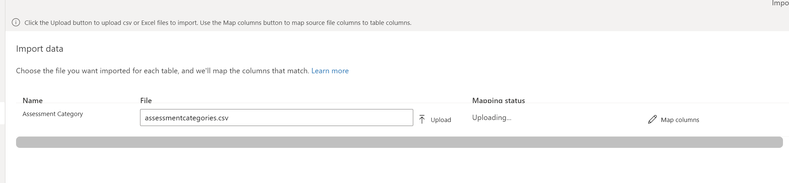
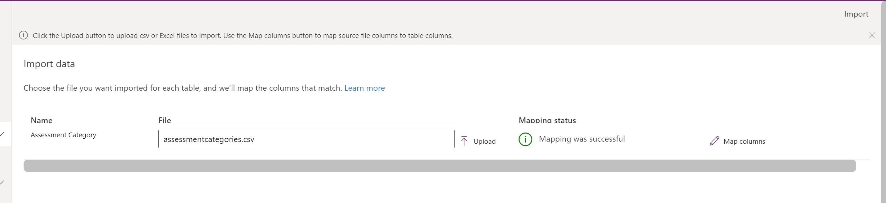
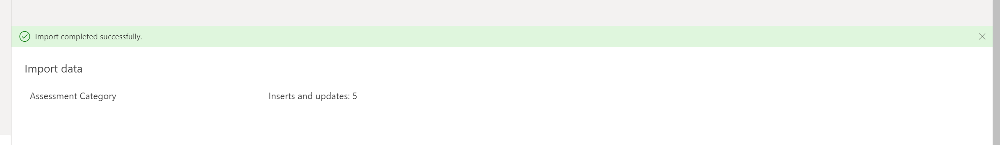
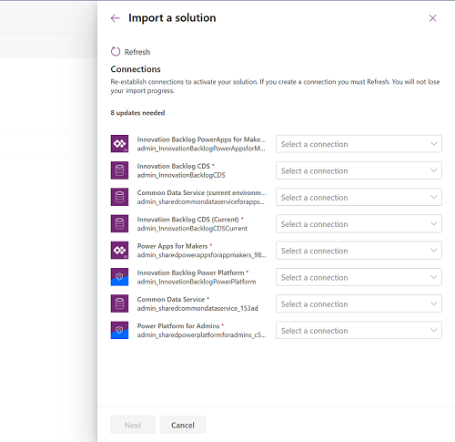
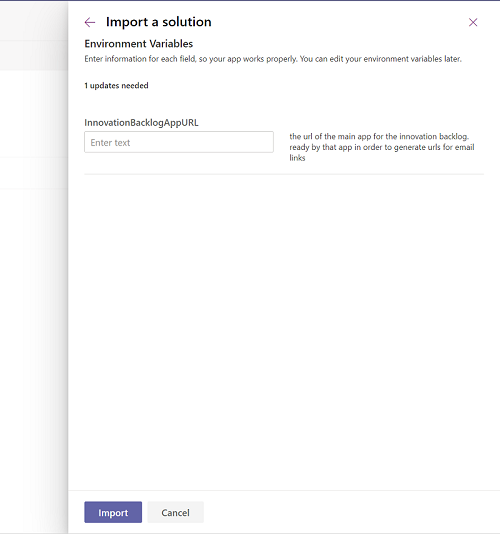
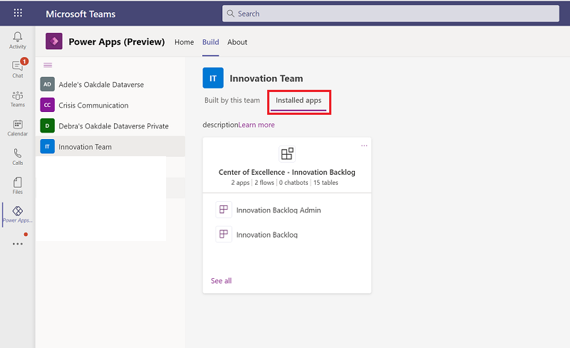
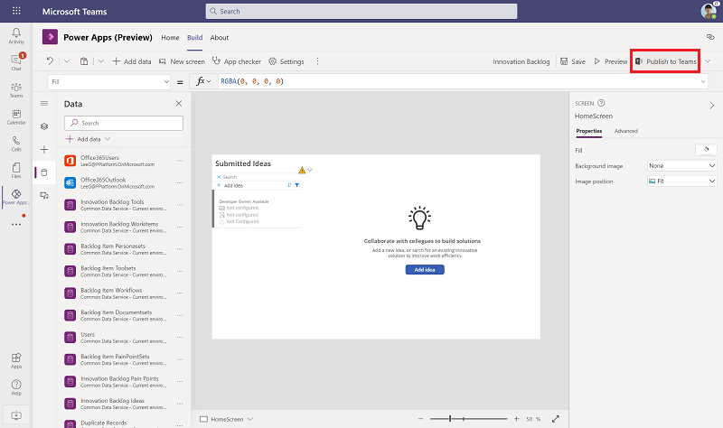
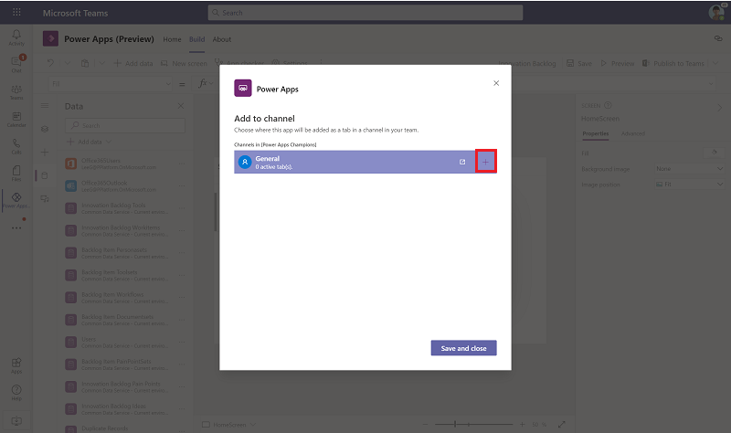
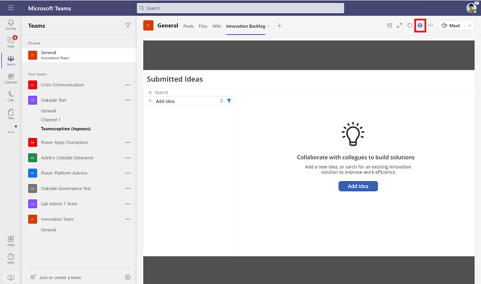

# Set up Maker Journey components

Use the Maker Assessment app to ask users a series of questions like who will support the app, and the types of data to which it will connect. You can then submit an email to an admin alias with the findings including notes that premium licenses or extra storage may be required.

Use the Maker Assessment Admin App to tailor these questions to fit your organizational needs.

The Maker Journey solution contains assets that are relevant to all users in your organization, and can be installed in [Production](https://docs.microsoft.com/power-platform/admin/environments-overview#types-of-environments) or [Dataverse for Teams](https://docs.microsoft.com/powerapps/teams/overview-data-platform) environments.

> [!IMPORTANT]
> The Maker Journey solution doesn't have a dependency on other components of the CoE Starter Kit. It can be used independently.

## Option 1: Import the solution into a Production environment

Before you begin, review the [prerequisites](setup.md#prerequisites) for using the starter kit solution.

- If you aren't already using the CoE Starter Kit, we recommend [creating a new environment](https://docs.microsoft.com/power-platform/admin/create-environment) for CoE solutions.
- If you are already using other CoE Starter Kit components, use the environment that you created as part of setting up the [core components](setup-core-components.md) for this solution.

1. Download the CoE Starter Kit compressed file from [aka.ms/CoeStarterKitDownload](https://aka.ms/CoeStarterKitDownload).

1. Extract the zip file.

1. Sign in to [Power Apps](<https://make.powerapps.com>).

1. Select your CoE environment. In the example, we're importing to the environment named **Contoso CoE**.

     

1. On the left pane, select **Solutions**.

1. Select **Import**. A pop-up window appears. (If the window doesn't appear, ensure that your browser's pop-up blocker is disabled and try again.)

1. In the pop-up window, select **Choose File**.

1. Select the Maker Journey solution: CenterOfExcellenceMakerJourney_*x_x_x_xx*_managed.zip.

1. When the compressed (.zip) file has been loaded, select **Next**.

1. Establish connections if they do not already exist. If you create a new connection, you must select **Refresh**. You won't lose your import progress.

1. Enter the email address of the user or the distribution list where you would like the summary mails sent.
 Note that this can be added later instead if you are not yet sure by browsing to the default solution and selecing the environment variable there.
     

1. Select **Import**. (This might take some time.)

1. Now, load data to get the starter set of assessment questions we have provided.
    1. Extract the MakerJourneyData.zip file. You can find this file in the initial download.
    1. Open the Maker Journey solution by clicking on its name in the Solution list.
    1. Click on the table **Assessment Category** to open it, and then click **Get data** > **Get data from Excel**
         
    1. Click **upload**, and select the **assessmentcategories.csv** file. It will upload and map columns.
         
         
    1. When that is done, click import, and wait for it to complete.
         

1. Repeat the above steps for the other two tables in the solution in the order shown here: 

    | Table | File to use |
   |------|---------------|
   | Assessment Questions | assessments.csv    |
   | Answer Options       | answeroptions.csv  |

1. You can now use the [Maker Assessment solution](innovationbacklog-components.md), and should start with the Admin app to ensure you are happy with the starter set of questions we have just installed.

## Option 2: Import the solution into a Dataverse for Teams environment

Before you begin:

- decide which team to add the Innovation Backlog app to or create a new team.
- [install the Power Apps app](https://docs.microsoft.com/powerapps/teams/install-personal-app) in Teams.
- [create your first app](https://docs.microsoft.com/powerapps/teams/create-first-app) (at least one app is required in the environment to enable the solution import experience).

1. Download the CoE Starter Kit compressed file from [aka.ms/CoeStarterKitDownload](https://aka.ms/CoeStarterKitDownload).

1. Extract the zip file.

1. Open to the Power Apps app in Teams, select **Build**, and select the Team you want to add the solution to.

1. Select **See All**

    

1. Select **Import**

1. In the pop-up window, select **Choose File**.

1. Select the Center Of Excellence Innovation Backlog solution: CenterOfExcellenceInnovationBacklog_*x_x_x_xx*_managed.zip.

1. When the compressed (.zip) file has been loaded, select **Next**.

1. Establish connections to the Common Data Service (Current Environment), Common Data Service, Power Apps for Makers and Power Platform for Admins connector. If you create a new connection, you must select **Refresh**. You won't lose your import progress.

     

1. Leave the Environment Variables blank and select **Next**.

     

1. Select **Import**. (This might take some time.)

1. When the import succeeds, select **Installed Apps**.

    
1. Select **See All** to see the apps, flows, and tables part of the Center of Excellence - Innovation Backlog solution.

     

1. Now, we will populate some of the tables with default values by running instant cloud flows.
    1. Open the **Add pain points** cloud flow and select **Run** > **Run Flow**.
        
    1. Open the **Update Software Tools** cloud flow and select **Run** > **Run Flow**.
        
    1. Wait for both of them to finish (This might take 10 mins.)

1. Extract the **ToolIcons.zip**. You can find this file in the initial download.

1. Open the **Innovation Backlog Admin** app and select **Preview**. There's no need to publish this app as you will only use it for some admin tasks.
1. Select **Go Icon**.
        
1. Select each non-software tool, add an icon from the **ToolIcons** folder, and select **Add** to save the icon.
    

1. Open the **Innovation Backlog** canvas app and select **Publish**
     
1. Select **Next** and add the channels to which the app should be added.
    

1. Go to the Teams channel, open the Innovation Backlog tab, select the **Web Link**, and copy the app link from the new browser window.
          
1. Go to [flow.microsoft.com](<https://flow.microsoft.com>) > **Solutions** > **Default Solution** and filter by **Environment Variables**
    
1. Select the **InnovationBacklogAppURL** variable and paste in the URL for the Innovation Backlog app.
    

You can now [use the Innovation Backlog app](innovationbacklog-components.md).
