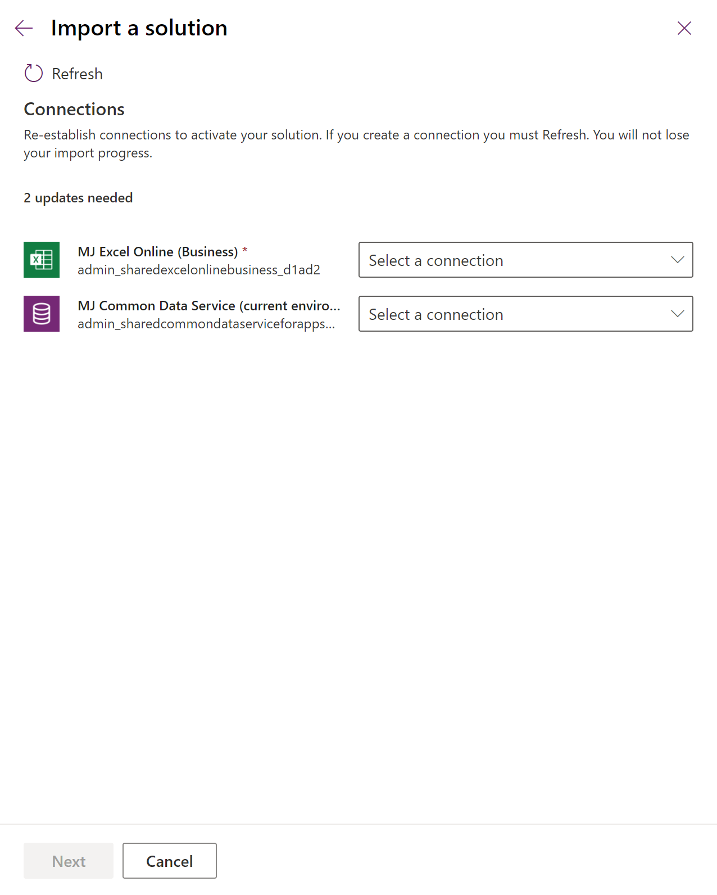
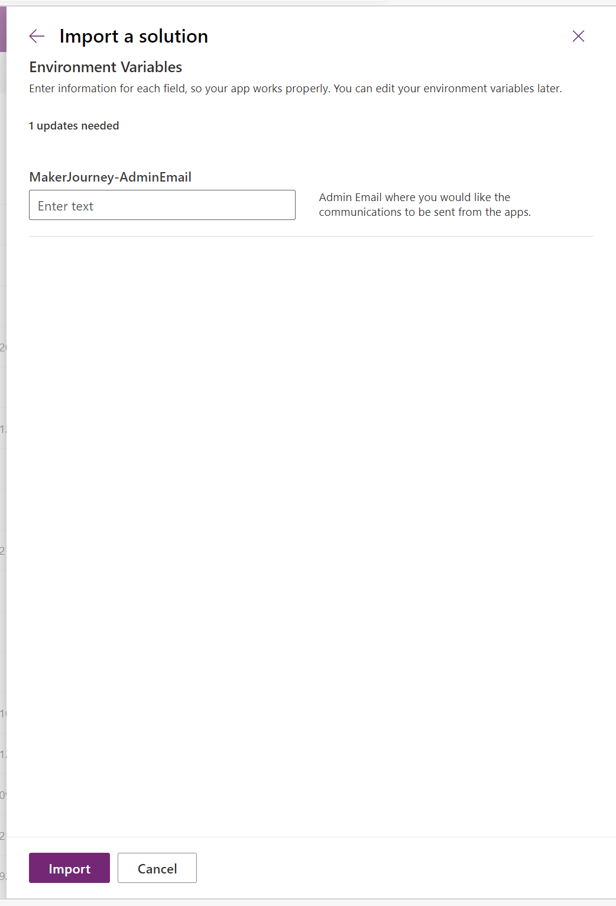
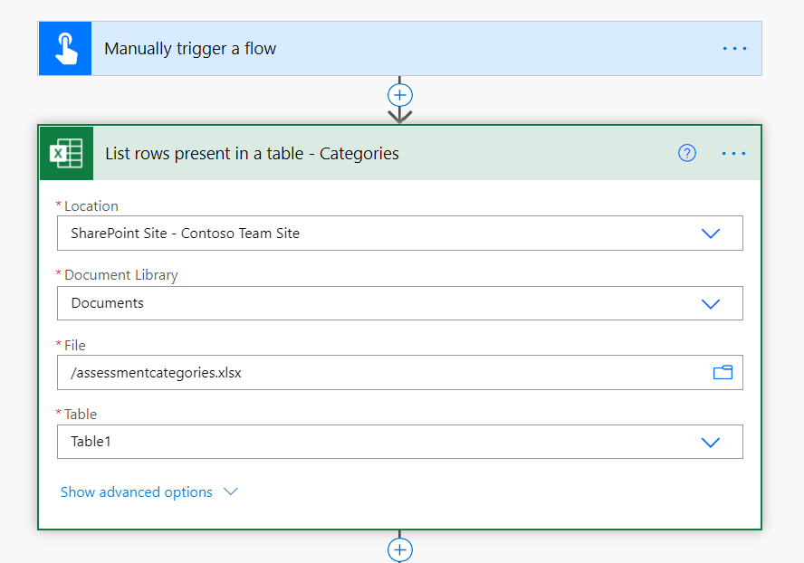
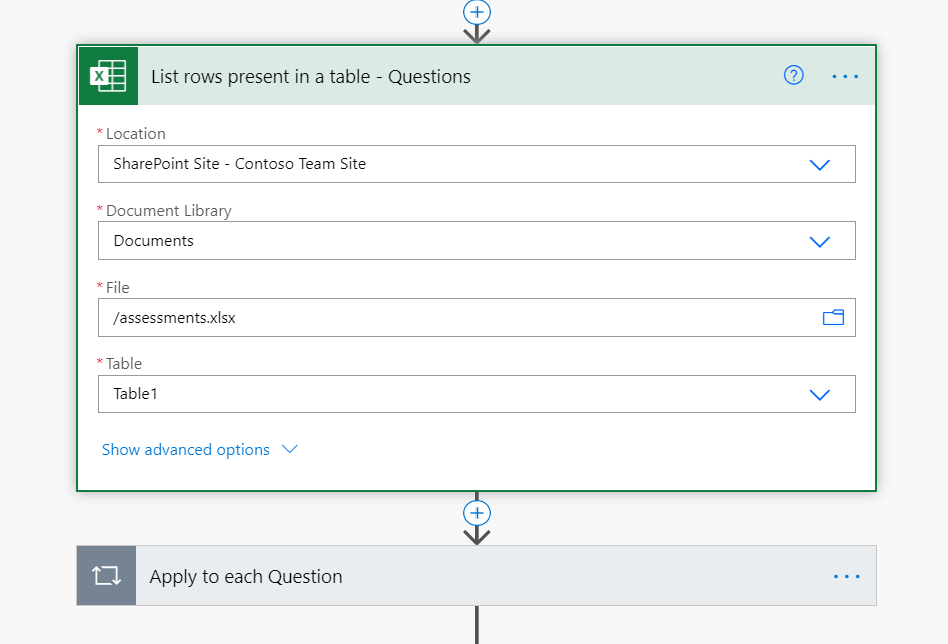

# Set up Maker Journey components

Use the Maker Assessment app to ask users a series of questions like who will support the app, and the types of data to which it will connect. You can then submit an email to an admin alias with the findings including notes that premium licenses or extra storage may be required.

Use the Maker Assessment Admin App to tailor these questions to fit your organizational needs.

The Maker Journey solution contains assets that are relevant to all users in your organization, and can be installed in [Production](https://docs.microsoft.com/power-platform/admin/environments-overview#types-of-environments) or [Dataverse for Teams](https://docs.microsoft.com/powerapps/teams/overview-data-platform) environments.

> [!IMPORTANT]
> The Maker Journey solution doesn't have a dependency on other components of the CoE Starter Kit. It can be used independently.

## Option 1: Import the solution into a Production environment

Before you begin, review the [prerequisites](setup.md#prerequisites) for using the starter kit solution.

- If you aren't already using the CoE Starter Kit, we recommend [creating a new environment](https://docs.microsoft.com/power-platform/admin/create-environment) for CoE solutions.
- If you are already using other CoE Starter Kit components, use the environment that you created as part of setting up the [core components](setup-core-components.md) for this solution.

1. Download the CoE Starter Kit compressed file from [aka.ms/CoeStarterKitDownload](https://aka.ms/CoeStarterKitDownload).

1. Extract the zip file.

1. Sign in to [Power Apps](<https://make.powerapps.com>).

1. Select your CoE environment. In the example, we're importing to the environment named **Contoso CoE**.

     

1. On the left pane, select **Solutions**.

1. Select **Import**. A pop-up window appears. (If the window doesn't appear, ensure that your browser's pop-up blocker is disabled and try again.)

1. In the pop-up window, select **Choose File**.

1. Select the Maker Journey solution: CenterOfExcellenceMakerJourney_*x_x_x_xx*_managed.zip.

1. When the compressed (.zip) file has been loaded, select **Next**.

1. Establish connections if they do not already exist. If you create a new connection, you must select **Refresh**. You won't lose your import progress.
         

1. Enter the email address of the user or the distribution list where you would like the summary mails sent.
 Note that this can be added later instead if you are not yet sure by browsing to the default solution and selecting the environment variable there.
     

1. Select **Import**. (This might take some time.)

1. Next you will load data to get the starter set of assessment questions we have provided.
    1. Extract the MakerJourneyData.zip file. You can find this file in the initial download.
    1. Put the three files found in the zip file into a SP library in your tenant. Note their location.
    1. Open the Maker Journey solution and open for editing the flow **Setup - starter data**
    1. Update the three calls to Excel to point to the files you put in SP in the steps above.
    1. Select AssessmentCategory.xlsx for Categories
        
    1. Select Assessments.xlsx for Questions
        
    1. Select AnswerOptions.xlsx for Answers
        
    1. Save the flow, turn it on, and run it.

1. You can now use the [Maker Journey solution](makerjourney-components.md), and should start with the Maker Assessment Admin app to ensure you are happy with the starter set of questions we have just uploaded.

## Option 2: Import the solution into a Dataverse for Teams environment

Before you begin:

- decide which team to add the Maker Journey solution to or create a new team.
- [install the Power Apps app](https://docs.microsoft.com/powerapps/teams/install-personal-app) in Teams.
- [create your first app](https://docs.microsoft.com/powerapps/teams/create-first-app) (at least one app is required in the environment to enable the solution import experience).

1. Download the CoE Starter Kit compressed file from [aka.ms/CoeStarterKitDownload](https://aka.ms/CoeStarterKitDownload).

1. Extract the zip file.

1. Open to the Power Apps app in Teams, select **Build**, and select the Team you want to add the solution to.

1. Select **See All**

    

1. Select **Import**

1. In the pop-up window, select **Choose File**.

1. Select the Maker Journey solution: CenterOfExcellenceMakerJourney_*x_x_x_xx*_managed.zip.

1. When the compressed (.zip) file has been loaded, select **Next**.

1. Establish connections if they do not already exist. If you create a new connection, you must select **Refresh**. You won't lose your import progress.
         

1. Enter the email address of the user or the distribution list where you would like the summary mails sent.
 Note that this can be added later instead if you are not yet sure by browsing to the default solution and selecting the environment variable there.
     

1. Select **Import**. (This might take some time.)

1. Next you will load data to get the starter set of assessment questions we have provided.
    1. Extract the MakerJourneyData.zip file. You can find this file in the initial download.
    1. Put the three files found in the zip file into a SP library in your tenant. Note their location.
    1. Open the Maker Journey solution and open for editing the flow **Setup - starter data**
    1. Update the three calls to Excel to point to the files you put in SP in the steps above.
    1. Select AssessmentCategory.xlsx for Categories
        
    1. Select Assessments.xlsx for Questions
        
    1. Select AnswerOptions.xlsx for Answers
        
    1. Save the flow, turn it on, and run it.

1. You can now use the [Maker Journey solution](makerjourney-components.md), and should start with the Maker Assessment Admin app to ensure you are happy with the starter set of questions we have just uploaded.