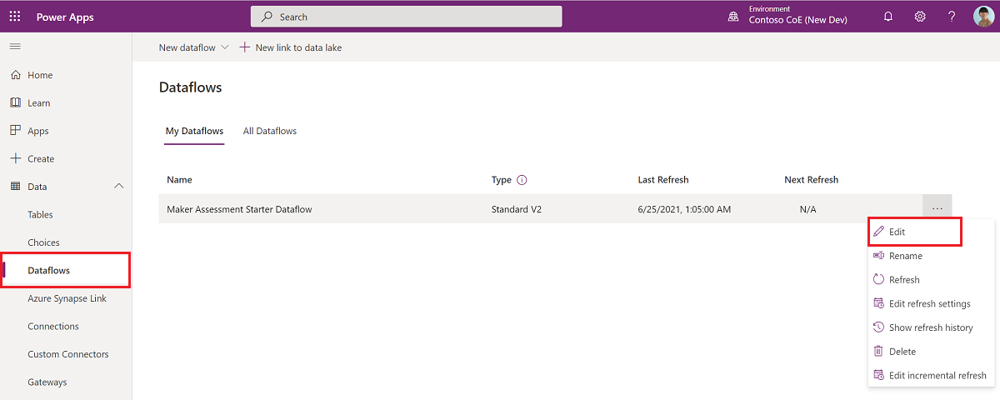
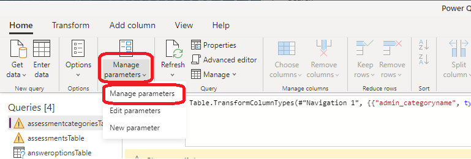
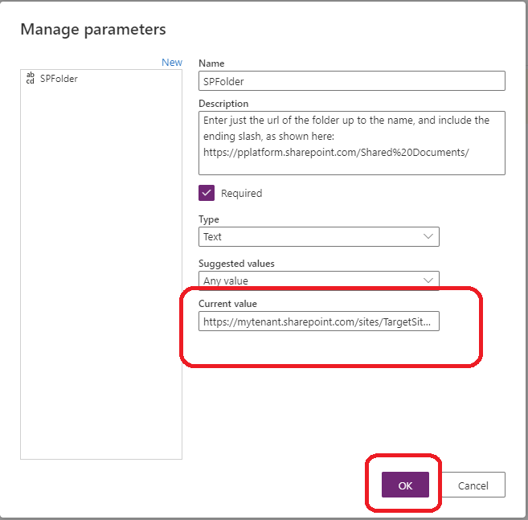
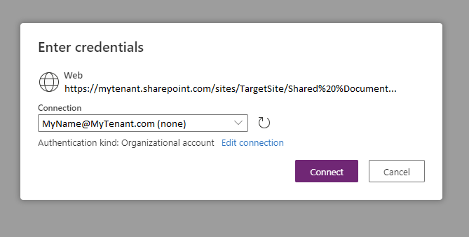
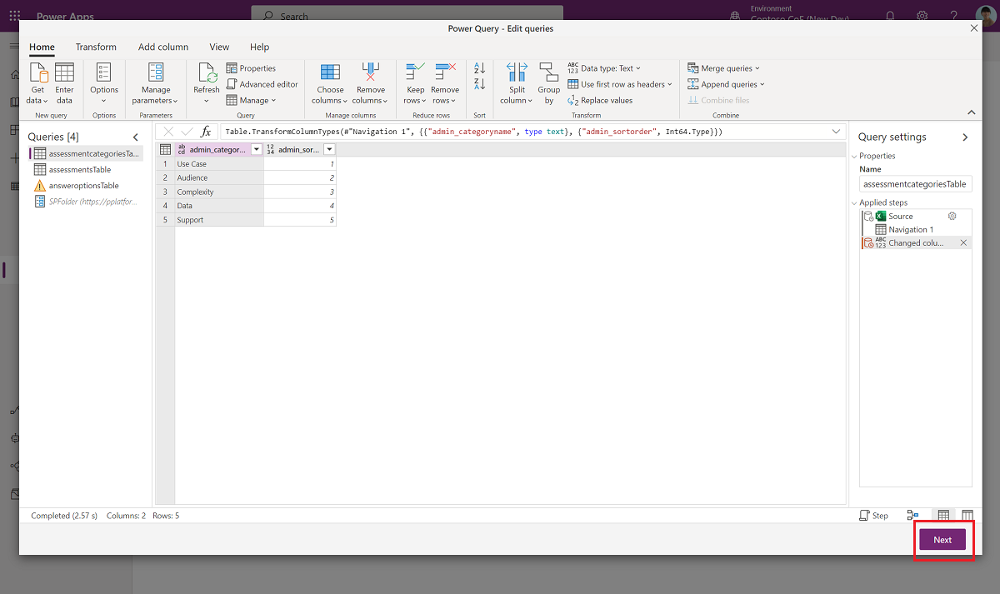
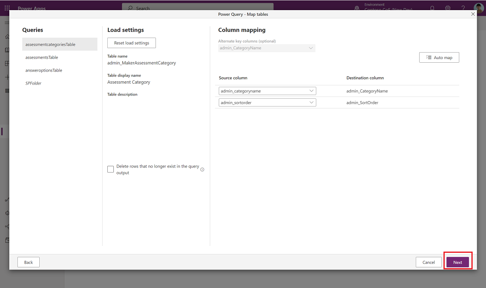
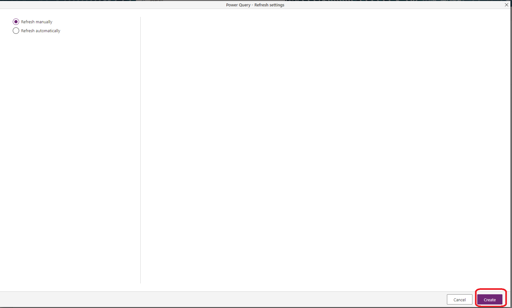
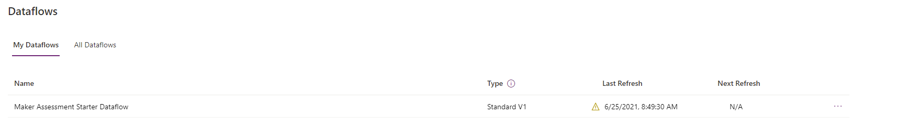

# Set up nurture components

Multiple nurture components are provided in the Center of Excellence (CoE) Starter Kit; each will require some configuration to install. The installation instructions in this article have been segmented based on the set of components that should be grouped and installed together, and dependencies on other segments are outlined in each section.

>[!IMPORTANT]
> Get started by completing the **[Get started](setup.md)** and **[Setup Inventory](setup-core-components.md)** instructions. This article assumes you have your environment setup, and are logged in with the correct identity.

## Before you start

### Set up a feedback form for your Training in a day

1. Open this [template form](https://forms.office.com/Pages/ShareFormPage.aspx?id=v4j5cvGGr0GRqy180BHbR8FBqAfISVJDqMM6DZbPmghUMUxUS1EwSVkxRExKVzdET1lZTTdWQ0FaOS4u&sharetoken=xjgXNluBcJOrLb2xg0TI).
1. Select **Duplicate it**.
1. Edit the form to add your own questions.
1. Select **Share**, and copy the link for **Send and collect responses**.

    

1. When importing the solution, update thee *Training in a day - Feedback Form* with this value.

## Import the solution

The core components solution is required for the nurture components solution to work.

1. Import the solution
    1. If [Installing to Production Environment](faq.md#installing-a-solution-in-a-production-environment) – use the solution file from the download called  CenterOfExcellenceNurtureComponents_x_x_x_xx_managed.zip.
    1. If [Installing to Dataverse for Teams Environment](faq.md#installing-a-solution-in-a-dataverse-for-teams-environment) – use the solution file from the download called  CenterOfExcellenceNurtureComponents_x_x_x_xx_managed.zip.
1. Update the environment variable values. Note that if you choose, you can leave the values empty on import and [update them](#update-environment-variables) later after the import is completed.

    | Name | Description |
    |------|---------------|
    | Training in a day - Feedback Form     | The Training in a Day package includes a flow that automatically sends a feedback request to attendees on the day of the event. Configure the form URL (<https://forms.office.com/>...) here.    |
    | Power User Site URL (SharePoint Site) | The site that your Microsoft Power Platform power users can use to communicate and share files. You'll use it here to house the template library for them. |
    | Innovation Backlog URL | (optional) URl to the [Innovation Backlog](use-innovationbacklog.md) canvas app, if you are using this app |
    | Maker Assessment Admin eMail | eMail of the admin or CoE team that will respond to queries from the Maker Assessment app. |
    | Community URL | Link to your internal Microsoft Power Platform community (for example, Yammer or Teams) |

## Import starter data set for the Maker Assessment app

Import an initial set of assessment questions to get started using the [Maker Assessment](nurture-components.md#maker-assessment) app. You can add your own questions or customize the existing ones using the admin app for this solution.

### Upload starter data to SharePoint Online

The initial set of assessment questions is provided in an Excel spreadsheet.

1. Upload the **MakerAssessmentStarterData.xlsx** file to the Documents library of a SharePoint site in your tenant. You will find this file in the initial download of the CoEStarterKit.zip. 

1. Note down the document library URL in this format, including the prefix and the trailing slash: [https://mytenant.sharepoint.com/sites/TargetSite/Shared%20Documents/](https://mytenant.sharepoint.com/sites/TargetSite/Shared%20Documents/)

This file is only needed once for import, and can be deleted after the dataflow runs.

### Update and run the Dataflow to load initial data into Dataverse

Now we wil load the initial data from SharePoint Online into Dataverse using a Dataflow.

1. In your CoE environment, browse to **Data > Dataflows**, and edit the **Maker Assessment Starter Dataflow**
   

1. Select **SPFolder** under Queries. Enter the document library you have uploaded the file to, including prefix and trailing slash.
   

1. Select **assessmentCategoriesTable** under Queries and select **Configure connection**
   

1. Choose an existing connection or create a new one and select **Connect**

   

1. Data should now be loaded into the editor. If you see a connection error instead, make sure the **SPFolder** parameter is correct. Select **Next**.

   

1. Select **Next** without changing any default setting.

   

1. Select **Create** to create the Dataflow.

   

1. Wait while the Dataflow refresh is in progress.

   

>[!TIP]
>If you see connection error, please select **Refresh** as the connection may not have resolved in time for the initial load:
   

## Update environment variables

Environment variables are used to store application and flow configuration data. This means that you only have to set the value once per environment and it will be used in all necessary flows and apps in that environment.

All flows in this solution depend on all environment variables' being configured.

>[!TIP]
>Learn how to update environment variables for Production and Dataverse for Teams environments: [Update Environment Variables](setup-core-components.md#update-environment-variables).

1. Select **See Environment Variables** to set the current values as described in the following table.

| Name | Description |
|------|---------------|
| Training in a day - Feedback Form     | The Training in a Day package includes a flow that automatically sends a feedback request to attendees on the day of the event. Configure the form URL (<https://forms.office.com/> or https://forms.osi.apps.mil/ for a DoD tenant) here.    |
| Power User Site URL (SharePoint Site) | The site that your Microsoft Power Platform power users can use to communicate and share files. You'll use it here to house the template library for them. |
| Innovation Backlog URL | (optional) URl to the [Innovation Backlog](use-innovationbacklog.md) canvas app, if you are using this app |
| Maker Assessment Admin eMail | eMail of the admin or CoE team that will respond to queries from the Maker Assessment app |
| Community URL | Link to your internal Microsoft Power Platform community (for example, Yammer or Teams) |

## Activate the flows

The nurture components solution contains five flows:

- Admin \| Newsletter with Product Updates

- Training in a day \| Feedback Reminder

- Training in a day \| Registration Confirmation

- Training in a day \| Reminder 3 days prior to event

Follow the same instructions to configure the flows as explained in [Activate the sync template flows](setup-core-components.md#activate-the-flows).

## Add your own templates to the Template Catalog

If you have existing templates that you'd like to share with your makers (for example, template apps, brand guidelines, or app and flow samples), add them to the CoE Templates table so they show up in the template catalog.

1. Go to [make.powerapps.com](https://make.powerapps.com) and select your CoE environment
1. On the left pane, select **Solutions**.
1. Select the **Center of Excellence - Nurture components** solution.
1. Open the **CoE Templates** table.
1. Select **Data**.
1. Select **+ Add Record** to add your template description and file.

## Share apps with your organization

The nurture components solution contains four apps. As soon as you're ready to adopt the CoE, share these apps as follows:

- Maker Assessment: Share with your makers or your entire organization.

- Template Catalog: Share with your makers or your entire organization.

- Power Platform Training Management: Share with admins only.

- Power Platform Training Registration: Share with your entire organization.

[!INCLUDE[footer-include](../../includes/footer-banner.md)]
