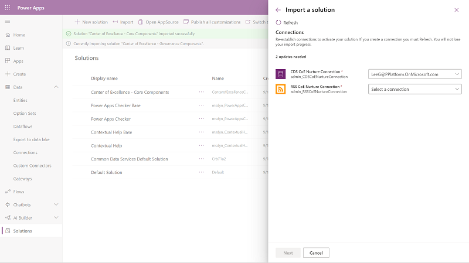

# Set up nurture components

Multiple nurture components are provided in the Center of Excellence (CoE) Starter Kit; each will require some configuration to install. The installation instructions in this article have been segmented based on the set of components that should be grouped and installed together, and dependencies on other segments are outlined in each section.

## Import the solution

The core components solution is required for the nurture components solution, or any other component in the starter kit, to work.

1. Follow the instructions in [Set up core components](setup-core-components.md).

1. Import the CenterOfExcellenceNurtureComponents_*x_x_x_xx*_managed.zip file.
1. Create a new connection to the **RSS** connector, and set your Microsoft Dataverse connection.
    
1. Update the environment variable values. Note that if you choose, you can leave the values empty on import and [update them](#update-environment-variables) later after the import is completed.

    | Name | Default value |
    |------|---------------|
    | Power Platform Maker Office 365 Group | The Admin \| Welcome Email flow sends a welcome email to onboard new makers and adds them to an Office 365 group. You can use this group to send communications to your makers or invite them to a Yammer or Teams group. Configure the group ID here.|
    | Training in a day - Feedback Form     | The Training in a Day package includes a flow that automatically sends a feedback request to attendees on the day of the event. Configure the form URL (<https://forms.office.com/>...) here.    |
    | Power User Site URL (SharePoint Site) | The site that your Microsoft Power Platform power users can use to communicate and share files. You'll use it here to house the template library for them. |

## Create a SharePoint document library

This library is used to store templates, components, and documents that you want to share with makers in your organization. In this section, you'll create and populate the library by using a set of starter materials.

The Template Catalog app depends on this library. If you don't intend to use the template catalog, you can skip this step and go straight to [Update environment variables](#update-environment-variables).

### Create the site

If you don't already have a SharePoint site for the Microsoft Power Platform power users in your tenant, create a new team now for them to access. This site is the one specified in the following environment variable: *Power User Site URL (SharePoint Site)*. More information: [Create a team site in SharePoint](https://support.office.com/article/create-a-team-site-in-sharepoint-ef10c1e7-15f3-42a3-98aa-b5972711777d)

### Create the library

We've created a helper flow to create the library for you. See the zip file CreateCoETemplateLibaryDocLibraryinSP.zip, which is part of your CoE Starter Kit download.

1. Download and import this flow into your CoE environment by using the same pattern as you did to [import the audit log flow](setup-auditlog.md).

2. Ensure that the flow is turned on, and run the flow.
3. When the flow is completed, you'll have a doc library named AppTemplates, with the following columns in the default view:

   | Column name | Type |
   |----|----|
   |Title | Single line of text |
   |DisplayName | Single line of text |
   |ItemDescription | Multiple lines of text |
   |Featured | Yes/No |
   |TemplateType | Choice (the options are **App**, **Flow**, **Component**, **Image**, or **Document**)|

   Ensure that you've set up the correct permissions for your SharePoint site; we recommend that you give view-only access to your power users. More information: [Create a document library in SharePoint](https://support.office.com/article/create-a-document-library-in-sharepoint-306728fe-0325-4b28-b60d-f902e1d75939)

   > [!NOTE]
   > You can't complete setup for the [Template Catalog](nurture-components.md#template-catalog) app, which uses this environment, until you extend the app. More information: [Modify components](modify-components.md#set-up-the-template-catalog-and-upload-components)

<!--- Commenting this out until version 3.20041.19 is live so that these msapp files will work in production
### Load sample templates
We've created a starter set of templates for you. To access them, do the following:

1. Download the CoE Starter Components zip file from the [GitHub repository](https://github.com/microsoft/powerapps-tools/tree/master/Administration/CoEStarterKit) and extract: CoE Components.zip
2. Browse to the newly created document library.

3. Choose to upload files.

4. Select all files in the library downloaded in the preceding step.

5. In the document library, select **Quick edit**.

6. Select the first row under **DisplayName**, and paste the data from the following into the table.

    | DisplayName | ItemDescription |Featured|TemplateType|
    |------------------|---------|--------|--------|
    |Calendar Control|A control for your users to get date values from a calendar for use in their Power Apps canvas apps  | Yes |Component|
    |Components Demo App|App showing the starter components from the CoE Starter Kit  | Yes |App|
    |Dual Range Slider|A control for your users to get numeric values from a slider control that lets them pick two numbers, for use in their Power Apps canvas apps | Yes |Component|
    |Header Nav Control|A control for your users to easily have a nice header with navigation control for their Power Apps canvas apps | Yes |Component|
    |Admin White Paper|An example document, to show how they'll appear in the Template Library. This document is also useful to you as an admin. | No |Document|

7. You now have a starter set of components for your power user usage.

-->

### Add your own templates

If you have existing templates that you'd like to share with your makers (for example, template apps, brand guidelines, or app and flow samples), upload them to the AppTemplates document library so they show up in the template catalog.

## Update environment variables

Environment variables are used to store application and flow configuration data. This means that you only have to set the value once per environment and it will be used in all necessary flows and apps in that environment.

All flows in this solution depend on all environment variables' being configured.

>[!TIP]
>To view all environment variables in the environment, open the default solution for the environment, and set the **Type** filter to **Environment variable**.

1. Select **See Environment Variables** to set the values as described in the following table.

| Name | Default value |
|------|---------------|
| Power Platform Maker Microsoft 365 Group | The Admin \| Welcome Email flow sends a welcome email to onboard new makers and adds them to a Microsoft 365 group. You can use this group to send communications to your makers or invite them to a Yammer or Teams group. Configure the group ID here.|
| Training in a day - Feedback Form     | The Training in a Day package includes a flow that automatically sends a feedback request to attendees on the day of the event. Configure the form URL (<https://forms.office.com/>...) here.    |
| Power User Site URL (SharePoint Site) | The site that your Microsoft Power Platform power users can use to communicate and share files. You'll use it here to house the template library for them. |

## Activate the flows

The nurture components solution contains five flows:

-  Admin \| Newsletter with Product Updates

-  Admin \| Welcome Email

-  Training in a day \| Feedback Reminder

-  Training in a day \| Registration Confirmation

-  Training in a day \| Reminder 3 days prior to event

Follow the same instructions to configure the flows as explained in [Activate the sync template flows](setup-core-components.md#activate-the-sync-template-flows).

## Set up a feedback form for your Training in a day

1. Go to [forms.office.com](https://forms.office.com).
1. Select **New Form**.
1. Enter **Microsoft Power Platform Training Feedback** for the title.
1. Select **+ Add New** to add the following questions:
    1. Rating: **Please rate the training course**
    1. Text: **What went well?**
    1. Text: **What didn't go well?**
1. Select **Share**, and copy the link for **Send and collect responses**.

    

1. Paste the link into the default value of your *Training in a day - Feedback Form* environment variable.

## Share apps with your organization

The nurture components solution contains four apps. As soon as you're ready to adopt the CoE, share these apps as follows:

- App Catalog; Share with your entire organization.

- Template Catalog: Share with your makers or your entire organization.

- Training in a day Management: Share with admins only.

- Training in a day Registration: Share with your entire organization.
