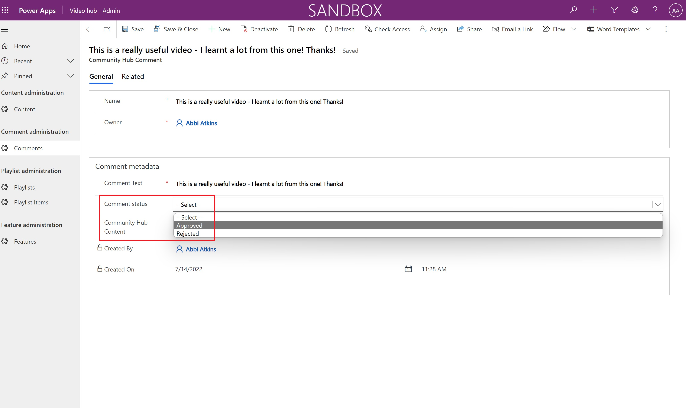

# Set up nurture components

Multiple nurture components are provided in the Center of Excellence (CoE) Starter Kit; each will require some configuration to install. The installation instructions in this article have been segmented based on the set of components that should be grouped and installed together, and dependencies on other segments are outlined in each section.

>[!IMPORTANT]
>Complete the instructions in [Before setting up the CoE Starter Kit](setup.md) and [Set up inventory components](setup-core-components.md) before continuing with the setup here. This article assumes you have your [environment set up](setup.md#create-your-environments) and are logged in with the [correct identity](setup.md#what-identity-should-i-install-the-coe-starter-kit-with).

## Import the solution

The core components solution is required for the nurture components solution to work.

1. Import the solution: Use the CenterOfExcellenceNurtureComponents_x_x_x_xx_managed.zip file from the download to [install the solution](faq.md#installing-a-solution-in-a-production-environment).
1. Leave all environment variables blank on import.

## Set up video hub components

### Set up the Video hub components using the Setup Wizard

1. Open the **Center of Excellence - Core Components** solution.
1. Open the **CoE Setup and Upgrade Wizard** app.
1. Open the **More features** page and select **Video hub**.
1. This app provides a guided step by step experience through the configuration steps.
   :::image type="content" source="media/setupwizard-vide.png" alt-text="CoE Starter Kit Setup Wizard - Video hub":::

>[!NOTE]
> The Setup Wizard is currently in preview. If you experience issues with the Setup Wizard, please [raise them on GitHub](https://aka.ms/coe-starter-kit-issues) and proceed with setting up the Inventory components manually.

### Set up the Video hub components manually

#### Review and enable video hub canvas app features

The canvas app has two features that can be enabled:

1. Comments
2. Related video

Either, or both can be enabled by updating the following environment variables in the CoE Admin Command Center app:

1. Video Hub - Enable Comments
1. Video Hub - Related Videos

Follow [detailed instructions for setting environment variables](/power-platform/guidance/coe/faq#update-environment-variables).

##### Enable Comments

When enabled, video hub users will be able to comment on selected videos. Comment moderation is managed through the admin app - comments must be approved prior to them becoming visible in the video hub.

Approve comments in the admin app by

##### Related video

When enabled, video hub users will see a list of similar videos to the one that they've selected. This is filtered by the 'content category' value of content.  

#### Share apps with admins and makers

The video hub components consist of two apps:

- [**Nurture apps - admin**](nurture-components.md#video-hub---admin) app to manage content, playlists and comments. Share this app with other admins, and assign them the Power Platform SR security role.
- [**Video hub**](nurture-components.md#video-hub) canvas app for video content. Share this app with your makers and assign them the Power Platform SR security role.

More information:

- [Share a canvas app in Power Apps](faq.md#share-an-app-from-a-production-environment)

### Import starter data

> [!NOTE]
> Importing the starter data is optional.

If you want to pre-populate the Video hub with videos from the [Microsoft Power Platform YouTube channel](https://www.youtube.com/@mspowerplatform), import data from the Video hub starter workbook.

1. Open the Nurture - Admin app and navigate to the **Content** page.
1. From the command bar, select **Import from Excel**.
1. Select **Choose File**.
1. Go to the location where you saved the **microsoft-video-hub-starter-data.xlsx** file, and then select **Open**.
1. Select **Next**.
1. Select **Finish**.

An import job is created. You can track its progress by selecting **Track Progress**.

### Manage content in the Nurture apps - admin app

#### Video content

Administrators manage video content in the admin app. The following table describes the schema for video content:

|Column|Column type|Description|
|------|-----|------|
|Name| Text | The title of the video, for example 'Building responsive Power Apps'|
|Owner| User| The creator of the record|
|Content description| Text | Detailed description of the video |
| Content URL | Text (URL) | The URL to the video | 
| View count | Number | This is updated via the video hub canvas app. When a user watches a video, the view count is updated |
| Power Platform product | Choice | Categorizes the video based on Power Platform product |
| Content category | Choice | Select the type of video; for example: How-to, Success story, Community session |

#### Playlists

Playlists are managed by administrators.  Playlists are curated lists of video content.  Playlists have the following schema:

|Column|Column type|Description|
|------|-----|------|
| Name | Text | Represents the display name for the playlist |
| Owner | User | The creator of the record | 
| Playlist description | Text | Represents a detailed description of the playlist |
| Playlist type | Choice | Represents the playlist type.  Options available are personal or shared. Shared playlists are visible to all users, private playlists are only visible to the person that created it. **Note** - private playlists are coming in a future release. |

Playlists are a curated collection of videos. One playlist has many playlist items, the schema for a playlist item is represented in the following table:

|Column|Column type|Description|
|------|-----|------|
| Name | Text | This can be set to any value, it is not used in the video hub canvas app |
| Playlist | Lookup | This lookup column returns a list of playlists|
| Community hub content | Lookup| This lookup column returns a list of video content |

#### Comments

Comments are created by users of the video hub canvas app.  Comments are moderated and only visible when an administrator has set the **Comment status** column value to **Approved**.

Comments have the following schema:

|Column|Column type|Description|
|------|-----|------|
| Name | Text | Unused in admin app. The name column is populated when comments are created via video hub canvas app|
| Comment text | Text | Represents the users comment text|
| Comment status | Choice | Approved or rejected.  Only approved comments will appear in the video hub canvas app |
| Community hub content | Lookup | Represents the video related to the comment |

## Set up training in a day components

### Set up the training in a day components using the Setup Wizard

1. Open the **Center of Excellence - Core Components** solution.
1. Open the **CoE Setup and Upgrade Wizard** app.
1. Open the **More features** page and select **Training in a day**.
1. This app provides a guided step by step experience through the configuration steps.
   :::image type="content" source="media/setupwizard-training.png" alt-text="CoE Starter Kit Setup Wizard - Training in a day":::

>[!NOTE]
> The Setup Wizard is currently in preview. If you experience issues with the Setup Wizard, please [raise them on GitHub](https://aka.ms/coe-starter-kit-issues) and proceed with setting up the Inventory components manually.

### Set up the training in a day components manually

#### Update environment variables values

[Update environment variables](faq.md#update-environment-variables) used by the environment request management components as described in the following table.

| Name | Description |
|------|---------------|
| Training in a day - Feedback Form     | The Training in a Day package includes a flow that automatically sends a feedback request to attendees on the day of the event. Configure the form URL (<https://forms.office.com/> or https://forms.osi.apps.mil/ for a DoD tenant) here.    |
| Community URL | Link to your internal Microsoft Power Platform community (for example, Yammer or Teams) |

#### Set up a feedback form for your Training in a day

1. Open this [template form](https://forms.office.com/Pages/ShareFormPage.aspx?id=v4j5cvGGr0GRqy180BHbR8FBqAfISVJDqMM6DZbPmghUMUxUS1EwSVkxRExKVzdET1lZTTdWQ0FaOS4u&sharetoken=xjgXNluBcJOrLb2xg0TI).
1. Select **Duplicate it**.
1. Edit the form to add your own questions.
1. Select **Share**, and copy the link for **Send and collect responses**.

    

1. When importing the solution, update thee *Training in a day - Feedback Form* with this value.

#### Turn on flows

There are several flows which will need to be turned on for the training in a day components to work:

- Training in a day \| Feedback Reminder
- Training in a day \| Registration Confirmation
- Training in a day \| Reminder 3 days prior to event

#### Share apps with admins and makers

The training in a day components consist of two apps:

- [**Nurture apps - Admin**](nurture-components.md#nurture-apps---admin) app for training organizers to view and manage events and registrations. Share this app with other admins or training organizers, and assign them the Power Platform Admin SR security role.
- [**Nurture apps - Maker**](nurture-components.md#training-in-a-day-pages-in-nurture-apps---maker-app) app for attendees to register to training events. Share this app with your makers, and assign them the Power Platform Maker SR security role.

More information:

- [Share a canvas app in Power Apps](faq.md#share-an-app-from-a-production-environment)

## Set up maker assessment components

### Set up the maker assessment components using the Setup Wizard

1. Open the **Center of Excellence - Core Components** solution.
1. Open the **CoE Setup and Upgrade Wizard** app.
1. Open the **More features** page and select **Maker Assessment**.
1. This app provides a guided step by step experience through the configuration steps.
 :::image type="content" source="media/setupwizard-assessment.png" alt-text="CoE Starter Kit Setup Wizard - Solution Assessment":::

>[!NOTE]
> The Setup Wizard is currently in preview. If you experience issues with the Setup Wizard, please [raise them on GitHub](https://aka.ms/coe-starter-kit-issues) and proceed with setting up the Inventory components manually.

### Set up the maker assessment components manually

#### Update environment variables values

[Update environment variables](faq.md#update-environment-variables) used by the environment request management components as described in the following table.

| Name | Description |
|------|---------------|
| Maker Assessment Admin eMail | eMail of the admin or CoE team that will respond to queries from the Maker Assessment app |

#### Import starter data set for the Maker Assessment app

Import an initial set of assessment questions to get started using the [Maker Assessment](nurture-components.md#solution-assessment-page-in-nurture-apps---maker-apps) app. You can add your own questions or customize the existing ones using the admin app for this solution.

#### Turn on flow

Turn on the flow:

- Add Maker Assessment Starter Data

Run the **Add Maker Assessment Starter Data** flow once to add starter data for the Maker Assessment apps: categories, questions, and answers.

#### Share apps with admins and makers

The maker assessment components consist of two apps:

- [**Nurture apps - Admin**](nurture-components.md#nurture-apps---admin) app for admins to manage assessment questions. Share this app with other admins or training organizers, and assign them the Power Platform Admin SR security role.
- [**Nurture apps - Maker**](nurture-components.md#solution-assessment-page-in-nurture-apps---maker-apps) app for makers to complete assessments. Share this app with your makers, and assign them the Power Platform Maker SR security role.

More information:

- [Share a canvas app in Power Apps](faq.md#share-an-app-from-a-production-environment)

## Set up Pulse feedback survey

>[!NOTE]
>The flows supporting this processes post adaptive cards to users using the [Microsoft Teams](/connectors/teams/) connector. The ability to post adaptive cards in Teams is not available in GCC, GCC High and DoD. These flows should remain turned off in these regions as they will not work.

### Set up the Pulse feedback survey components using the Setup Wizard

1. Open the **Center of Excellence - Core Components** solution.
1. Open the **CoE Setup and Upgrade Wizard** app.
1. Open the **More features** page and select **Pulse feedback**.
1. This app provides a guided step by step experience through the configuration steps.
 :::image type="content" source="media/setupwizard-pulse.png" alt-text="CoE Starter Kit Setup Wizard - Pulse Feedback":::

>[!NOTE]
> The Setup Wizard is currently in preview. If you experience issues with the Setup Wizard, please [raise them on GitHub](https://aka.ms/coe-starter-kit-issues) and proceed with setting up the Inventory components manually.

### Set up the Pulse feedback survey components manually

#### Update environment variables values

[Update environment variables](faq.md#update-environment-variables) used by the environment request management components as described in the following table.

| Name | Description |
|------|---------------|
| Pulse - How many makers to survey? | The Pulse survey is send to makers to provide feedback on their experience working with the CoE and Power Platform. Provide the number of makers you want to survey regularly here. If you set this number to 5, the survey will be sent to 5 random makers per week. A Default value of 1 is provided. |

#### Turn on flows to start collecting feedback

There are several flows which will need to be turned on for the Pulse feedback survey components to work:

- Pulse [Child] - post adaptive cards to maker
- Pulse - Survey Makers for CoE feedback

#### Set up the Power BI dashboard to view feedback

1. Download and install [Microsoft Power BI Desktop](https://www.microsoft.com/download/details.aspx?id=58494).
1. Enable the [TDS endpoint](/power-platform//admin/settings-features) on your environment.
1. Get the [environment URL](setup-powerbi.md#get-the-environment-url).
1. In Power BI Desktop, open the Pulse_CoEDashboard.pbit file, which can be found in the CoE Starter Kit you downloaded from [aka.ms/CoeStarterKitDownload](https://aka.ms/CoEStarterKitDownload).
1. Enter the URL of your environment instance. Do not include the https:// prefix or / postfix for **OrgUrl**.
1. Save the dashboard locally, or select **Publish** and choose the workspace you want to publish the report to.
1. [Configure scheduled refresh](/power-bi/connect-data/refresh-data#configure-scheduled-refresh) for your Power BI Dataset to update the report daily.

You can find the report later by going to [app.powerbi.com](https://app.powerbi.com/).

## Set up template catalog

### Set up the template catalog components using the Setup Wizard

1. Open the **Center of Excellence - Core Components** solution.
1. Open the **CoE Setup and Upgrade Wizard** app.
1. Open the **More features** page and select **Template Catalog**.
1. This app provides a guided step by step experience through the configuration steps.
 :::image type="content" source="media/setupwizard-template.png" alt-text="CoE Starter Kit Setup Wizard - Template Catalog":::

>[!NOTE]
> The Setup Wizard is currently in preview. If you experience issues with the Setup Wizard, please [raise them on GitHub](https://aka.ms/coe-starter-kit-issues) and proceed with setting up the Inventory components manually.

### Set up the template catalog components manually

#### Add your own templates to the Template Catalog

If you have existing templates that you'd like to share with your makers (for example, template apps, brand guidelines, or app and flow samples), add them to the CoE Templates table so they show up in the template catalog.

1. Go to [make.powerapps.com](https://make.powerapps.com) and select your CoE environment
1. On the left pane, select **Solutions**.
1. Select the **Center of Excellence - Nurture components** solution.
1. Open the **CoE Templates** table.
1. Select **Data**.
1. Select **+ Add Record** to add your template description and file.

#### Share apps with admins and makers

The template catalog components consist of one apps:

- [**Nurture apps - Maker**](nurture-components.md#template-catalog-page-in-nurture-apps---maker-app) app for makers and end users to browse available templates. Share this app with end users, and assign them the Power Platform User SR security role.

More information:

- [Share a canvas app in Power Apps](faq.md#share-an-app-from-a-production-environment)

## Set up product newsletter

Turn on the **Admin \| Newsletter with Product Updates** flow to receive a weekly email with updates from the Power Apps, Power Automate, Power BI and Power Virtual Agents blog posts. This email is sent to the admin only.

## All environment variables

Here is the full list of environment variables that impact the nurture solution, including environment variables with Default values. You may have to [update environment variables](faq.md#update-environment-variables) after import.

>[!IMPORTANT]
> You don't have to change the values during setup, just when you need to change the value of an environment variable that you configured during import or when you want to change a default value. Re-start all flows after you change environment variables, to make sure the latest value is picked up.

Environment variables are used to store application and flow configuration data with data specific to your organization or environment.

| Name | Description | Default Value
|------|---------------|------|
| Training in a day - Feedback Form     | The Training in a Day package includes a flow that automatically sends a feedback request to attendees on the day of the event. Configure the form URL (<https://forms.office.com/> or https://forms.osi.apps.mil/ for a DoD tenant) here.    | n/a |
| Power User Site URL (SharePoint Site) | The site that your Microsoft Power Platform power users can use to communicate and share files. You'll use it here to house the template library for them. *Currently not used.* |  n/a |
| Innovation Backlog URL | (optional) URl to the [Innovation Backlog](use-innovationbacklog.md) canvas app, if you are using this app | n/a |
| Maker Assessment Admin eMail | eMail of the admin or CoE team that will respond to queries from the Maker Assessment app | n/a |
| Community URL | Link to your internal Microsoft Power Platform community (for example, Yammer or Teams) | n/a |
| Pulse - How many makers to survey? | The Pulse survey is send to makers to provide feedback on their experience working with the CoE and Power Platform. Provide the number of makers you want to survey regularly here. If you set this number to 5, the survey will be sent to 5 random makers per week. | 1 |
| Video Hub - Enable comments | Enable or disable end users to leave comments on videos published via the Video Hub. Disabled by default.  | No |
| Video Hub - Related Videos | Enable or disable showing related videos in the Video Hub. Enabled by default. | Yes |

## It looks like I found a bug with the CoE Starter Kit; where should I go?

To file a bug against the solution, go to [aka.ms/coe-starter-kit-issues](https://aka.ms/coe-starter-kit-issues).

[!INCLUDE[footer-include](../../includes/footer-banner.md)]
