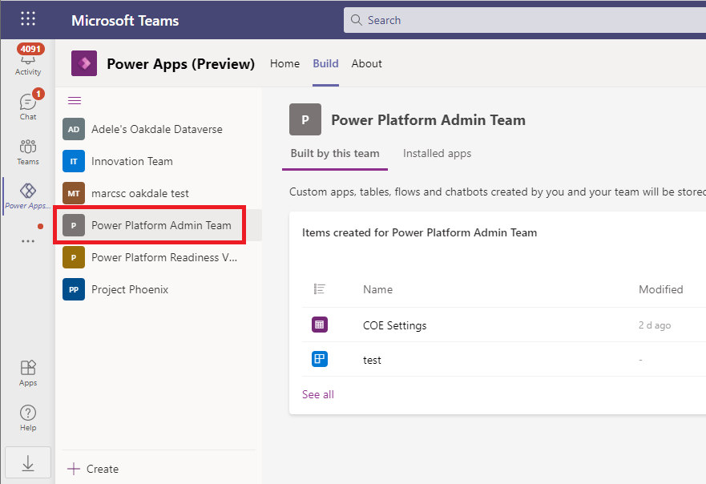
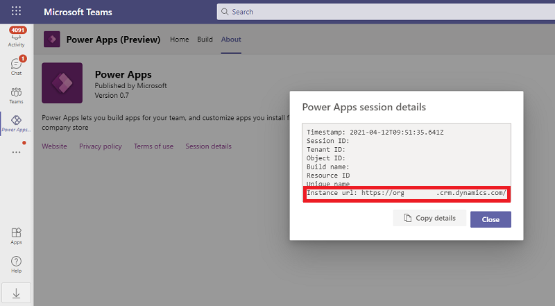
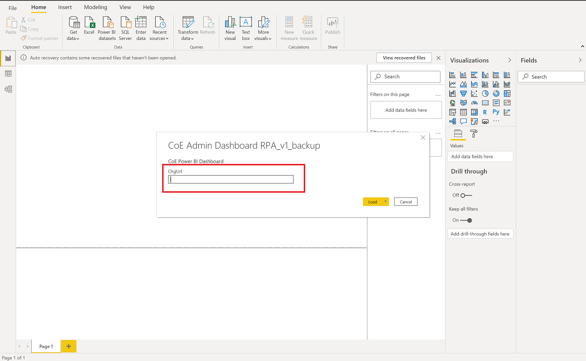
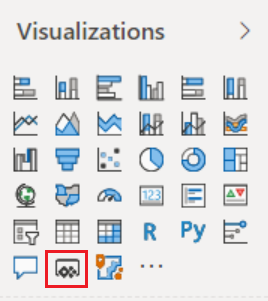
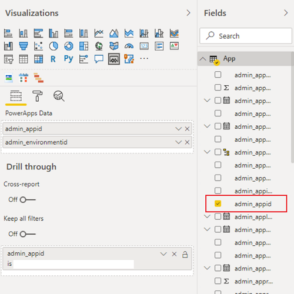
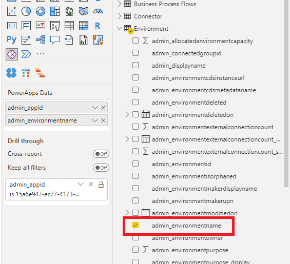
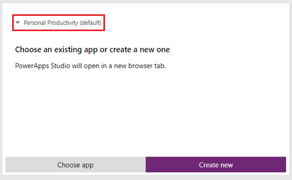
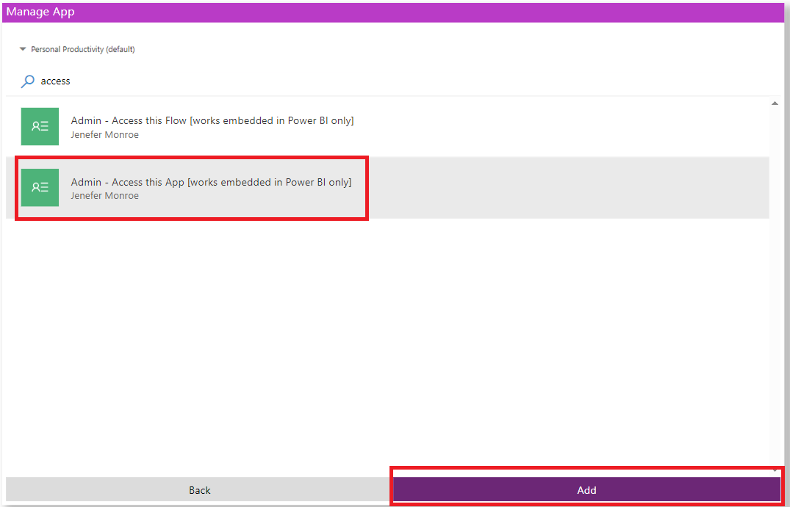

# Set up the Power BI dashboard

The Power BI dashboard provides a holistic view with visualizations and insights into resources in your tenant: environments, apps, Power Automate flows, connectors, connection references, makers, and audit logs. Telemetry from the audit log is stored from the moment you set up the Center of Excellence (CoE) Starter Kit, so over time you can look back and identify trends.

## Which dashboard to download?

You can get the CoE Power BI dashboard by downloading the CoE Starter Kit compressed file ([aka.ms/CoeStarterKitDownload](https://aka.ms/CoeStarterKitDownload)). **Extract the zip file** after downloading - it contains two Power BI template files, one for connecting to Dataverse with **Import** and one for connecting to Dataverse with **DirectQuery**.

- You can use the **Import_yyyyMMdd.pbit** file if you have installed the CoE Starter Kit in a Production environment. Data is cached in the Power BI service and imported on a scheduled interval.
- You must use **DirectQuery_yyyyMMdd.pbit** if you have installed the CoE Starter Kit in a Dataverse for Teams environment (those don't support Import). You can use **DirectQuery** if you have installed the CoE Starter Kit in a Production Environment, if enforcing the Dataverse security model is important. The maximum size limit for query results is 80 MB, so depending on the size of your tenant you may hit limits.

Learn more:

- [Connect to Dataverse using the connector in Power BI](https://docs.microsoft.com/powerapps/maker/data-platform/data-platform-powerbi-connector#connect-to-dataverse-using-the-connector)
- [Limitations us using SQL to query data](https://docs.microsoft.com/powerapps/developer/data-platform/dataverse-sql-query#limitations)
- [Troubleshooting connection problems](https://docs.microsoft.com/powerapps/developer/data-platform/dataverse-sql-query#troubleshooting-connection-problems)

> [!NOTE]
> - Before setting up the Power BI dashboard, you must have installed the [CoE core components solution](setup-core-components.md). 
> - Before you see data in the dashboard, the [core components solution sync flows](core-components.md#flows) will need to have completed their runs.

## Get the environment URL

You need the environment URL of the Microsoft Power Platform environment the CoE Starter Kit is installed in. Power BI will connect to the Microsoft Dataverse tables in that environment.

- If you have installed the CoE Starter Kit in a Production environment:
    1. Go to the [Power Platform admin center](https://aka.ms/ppac).

    1. Select **Environments**, and select the environment where the CoE solution is installed.

    1. Copy the organization URL in the details window.

       

       If the URL is truncated, you can see the full URL by selecting **See all** > **Environment URL**.

       

- If you have installed the CoE Starter Kit in a Dataverse for Teams environment:
    1. Open the Power Apps app in Teams
    1. Select **Build** and select your CoE environment
        
    1. Select **About** > **Session Details** and copy the Instance URL from there.
         

> [!NOTE]
> The Power BI dashboard uses Direct Query to connect to Microsoft Dataverse, therefore TDS Endpoint has to be enabled for the environment: [Manage feature settings](https://docs.microsoft.com/power-platform/admin/settings-features)

## Configure the Power BI dashboard

You can configure and modify the Power BI dashboard by working directly with the Power BI (.pbit) file and Power BI Desktop. This gives you flexibility in terms of modifying the dashboard to your own branding, and including (or excluding) pages or visuals you want to see (or not see) in the dashboard.

1. Download and install [Microsoft Power BI Desktop](https://www.microsoft.com/download/details.aspx?id=58494).

1. In Power BI Desktop, open the .pbit file, which can be found in the CoE Starter Kit you downloaded from [aka.ms/CoeStarterKitDownload](https://aka.ms/CoEStarterKitDownload).

1. Enter the URL of your environment instance (do not include the https:// prefix or / postfix) for **OrgUrl**, and&mdash;if prompted&mdash;sign in to Power BI Desktop with your organization account that has access to the environment you installed the CoE Starter Kit in.

   

1. Save the dashboard locally, or select **Publish** and choose the workspace you want to publish the report to.

You can find the report later by going to [app.powerbi.com](https://app.powerbi.com/).

### Troubleshooting

When you see this error message (*Unable to connect (provider Named Pipes Provider, error: 40 – Could not open a connection to SQL Server)*), the connector fails to connect to the TDS endpoint. This can occur when the URL used with the connector includes https:// and/or the ending /. Remove the https:// and ending forward slash so that the URL is in the form orgname.crm.dynamics.com.

When you see this error message (*A connection was successfully established with the server, but then an error occurred during the pre-login handshake*), the connector fails to connect to the TDS endpoint. This can also occur if the ports the TDS endpoint uses are blocked. Learn more: [Ports required for using SQL to query data](https://docs.microsoft.com/powerapps/developer/data-platform/dataverse-sql-query#blocked-ports)

When you see this error message (*OLE DB or ODBC error: DataSource.Error Microsoft SQL: Return records size cannot exceed 83886080.*), you have reached the 80 MB maximum size limit for query results with the TDS endpoint. Consider using the Power BI Template that uses **Import** connectivity instead.  

### (Optional) Configure embedded apps in the CoE dashboard

The dashboard can be configured to use embedded apps to enable you to drive action based on insights you find. With the embedded apps, you can grant yourself access to resources, delete apps and flows, and reach out to the maker via email. You'll have to import the apps first, and then configure them in the dashboard.

#### Import embedded apps

> [!NOTE]
> If you have installed the Center of Excellence - Core Components in a Teams environment, the embedded apps are included in the solution and you will not have to import them. Skip to [Embed apps into the Power BI dashboard](#embed-apps-into-the-power-bi-dashboard).

1. Go to **[make.powerapps.com](https://make.powerapps.com)** in the environment where you installed the CoE Starter Kit.
1. On the left pane, select **Apps**.
1. Select **Import canvas app**.

   

1. Import the **Admin – Access this app** app (Admin-AccessthisApp.zip).
1. Configure all the connections.
1. Repeat the same steps for the **Admin – Access this flow** app (Admin-AccessthisFlow.zip).

#### Embed apps into the Power BI dashboard

You'll now configure the Power Apps visuals in the Power BI dashboard to point to the apps you just imported.

1. Open the CoE Power BI dashboard in **Power BI Desktop**.
1. Go to the **App Detail** page.

      

1. Select **Power Apps for Power BI** from **Visualizations**.

     

1. Select the fields from your dataset that you want to use in the app.
1. With the visual selected, select **admin_appid** from **App** (on the **Fields** pane).

     

1. With the visual selected, select the **admin_environmentid** environment (on the **Fields** pane).

     

1. In the Power Apps for Power BI visual, select the environment of your CoE (where you imported the apps to).

     

1. Select **Choose app**.
1. Select **Admin – Access this app**.

     

1. Resize and move the visual to the location you want. Delete the placeholder from the template, and move your embedded app to the same place.

**To configure the app on the Flow Detail page**

1. Go to the **Cloud flow detail** tab.
1. Select the **Power Apps visual** from **Visualizations**.
   Select the fields from your dataset that you want to use in the app.
1. With the visual selected, select the **admin_flowid** and **admin_flowenvironment** flows under **Fields**.

     

1. In the visual, select the environment of your CoE (where you imported the apps to).
1. Select **Choose app**.
1. Select **Admin – Access this flow**.

     

1. Resize and move the visual to the location you want. Delete the placeholder from the template, and move your embedded app to the same place.

Republish the dashboard, and view it under [app.powerbi.com](https://app.powerbi.com/).

[!INCLUDE[footer-include](../../includes/footer-banner.md)]