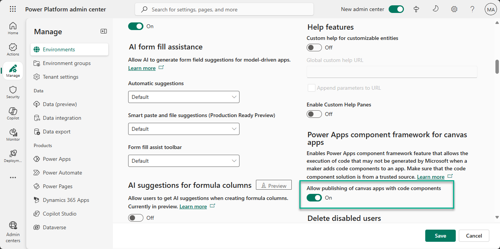

# Set up theming components

You use theming components to create, manage, and share themes for canvas apps. A *theme* contains a collection of styles that define multiple design properties for controls and components such as colors, fonts, and borders. These styles are then applied automatically to controls and components when makers use the themed template app to create a new app.

The theming components solution contains assets that are relevant to makers in addition to designers.

>[!IMPORTANT]
>The theming components solution doesn't have a dependency on other components of the CoE Starter Kit. It can be used independently.

Before you begin, review the [prerequisites](setup.md#prerequisites) for using the starter kit solution.

- If you aren't already using the CoE Starter Kit, we recommend [creating a new environment](https://docs.microsoft.com/power-platform/admin/create-environment) for CoE solutions.
- If you are already using other CoE Starter Kit components, use the environment that you created as part of setting up the [core components](setup-core-components.md) for this solution.

## Prerequisites

- The Power Apps theming solution contains Power Apps component framework elements. Publishing of canvas apps with code components must be enabled for the environment:

    1. Go to the [Power Platform admin center](https://aka.ms/ppac).
    1. Go to your CoE environment, or the environment where you plan to import the solution.
    1. Select **Settings**.

        

    1. Select **Product** > **Features**.
        
    1. Make sure **Allow publishing of canvas apps with code components** is enabled.
        

## Import the solution

1. Download the CoE Starter Kit compressed file ([aka.ms/CoeStarterKitDownload](https://aka.ms/CoeStarterKitDownload)).

1. Extract the zip file.

1. Go to [make.powerapps.com](<https://make.powerapps.com>).

1. Go to your CoE environment. In the example in the following image, we're importing to the environment named **Contoso CoE**.

     

1. On the left pane, select **Solutions**.

1. Select **Import**. A pop-up window appears. (If the window doesn't appear, be sure your browser's pop-up blocker is disabled and try again.)

1. In the pop-up window, select **Choose File**.

1. Select the Center Of Excellence theming solution from File Explorer (CenterOfExcellenceThemingComponents_*x_x_x_xx*_managed.zip).

1. When the compressed (.zip) file has been loaded, select **Next**.

1. Select **Next**, and then select **Import**. (This might take some time.)

1. When the import succeeds, the list of the components that were imported is displayed.

1. Select **Close**.

You can now [use the theming components](theming-components.md).
