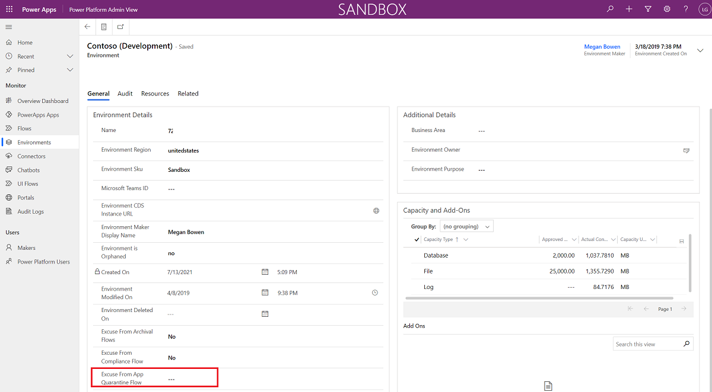
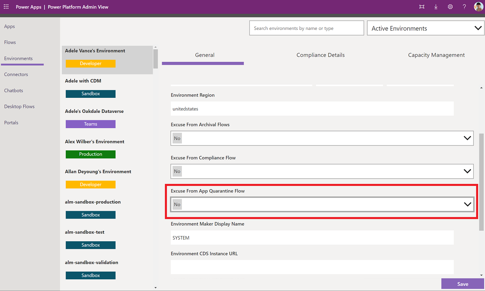

<!-- Note from editor: The link in line 28 looks straightforward, yet it's asking me to sign in to open it, which doesn't seem right. Can you test it on the review page (which I can't access)? Also, check the link in line 46, which doesn't open for me. Should the table in line 40 be set up with a default column like the one in line 94? -->

# Set up app quarantine components

This article will help you to set up the app quarantine components of the governance solution. A quarantined app will present end users who launch the app a message indicating they’re unable to access the app. This feature is currently only available for canvas apps. Learn more: [Manage app quarantine state](/admin/admin-manage-apps#manage-app-quarantine-state-preview)

>[!IMPORTANT]
>This article assumes you have [installed the governance components solution](before-setup-gov.md), and you have your [environment set up](setup.md#create-your-environment) and are signed in with the [correct identity](setup.md#what-identity-should-i-install-the-coe-starter-kit-with).

## Configure mandatory environment variables

You'll [update these environment variables](faq.md#update-environment-variables) after you import the solution. Environment variables are used to store application and flow configuration data. This means that you only have to set the value once per environment, and it will be used in all necessary flows and apps in that environment.

>[!TIP]
>Learn how to update environment variables for production and Dataverse for Teams environments: [Update environment variables](faq.md#update-environment-variables).

| Name | Description |
|------|---------------|
| Quarantine Apps after x days of non-compliance | If using the Compliance flow for apps to gather compliance details from makers, specify whether you want to quarantine apps if they're not compliant and for how many days. The default value is 7 days. |  

## Add or exempt environments from the app quarantine process

You might want to exempt some environments from the app quarantine process—for example, dedicated environments that are already well-managed. More information: [Establishing an environment strategy](/adoption/environment-strategy)

You can exempt environments from the app quarantine process by using the Power Platform Admin View app.  

### Production environment

If your solution is installed in a production environment, your app will be a model-driven app. Follow these steps:

1. Go to [make.powerapps.com](<https://make.powerapps.com>).
1. Go to your Center of Excellence (CoE) environment.
1. Open the **Power Platform Admin View** app.
1. Select **Environments**, and then select the environment you want to exempt.
1. Set the **Excuse From App Quarantine Flow** field to **Yes** to exempt the environment from the app quarantine flow. Set the **Excuse From App Quarantine Flow** field to **No** to include the environment in the app quarantine flow.
    >[!NOTE]
    >Due to the impact of quarantining apps, all environments are initially exempt from the quarantine process and you will have to manually update environments to include them in the quarantine process.
1. Select **Save**.

   

### Dataverse for Teams environment

1. Open the Power Apps app in Teams, select **Build**, and then select the team that you've installed the CoE Starter Kit solutions in.
1. Select **Center of Excellence - Core for Teams** > **See All**.
1. Open the **Power Platform Admin View** app.
1. Select **Environments**, and then select the environment you want to exempt.
1. Set the **Excuse From App Quarantine Flow** field to **Yes** to exempt the environment from the app quarantine flow. Set the **Excuse From App Quarantine Flow** field to **No** to include the environment in the app quarantine flow.
    >[!NOTE]
    >Due to the impact of quarantining apps, all environments are initially exempt from the quarantine process and you will have to manually update environments to include them in the quarantine process.
1. Select **Save**.

   

## Turn on flows

Turn on the following flows, which are installed as part of the governance components solution:

- [Admin | Quarantine non-compliant apps](governance-components.md#admin--quarantine-non-compliant-apps)
- [Admin | Set app quarantine status](governance-components.md#admin--set-app-quarantine-status)

## All environment variables

This section includes the full list of environment variables that affect the compliance process, including environment variables with default values. You might have to [update environment variables](faq.md#update-environment-variables) after import.

>[!IMPORTANT]
> You don't have to change the values during setup, just when you need to change the value of an environment variable that you configured during import or when you want to change a default value. To make sure the latest values are picked up, restart all flows after you change environment variables.

Environment variables are used to store application and flow configuration data with data specific to your organization or environment.

| Name | Description | Default value |
|------|---------------|------|
| Quarantine Apps after x days of non-compliance | If using the Compliance flow for apps to gather compliance details from makers, specify whether you want to quarantine apps if they're not compliant and for how many days.  | 7 days |

## It looks like I found a bug with the CoE Starter Kit; where should I go?

To file a bug against the solution, go to [aka.ms/coe-starter-kit-issues](https://aka.ms/coe-starter-kit-issues).

[!INCLUDE[footer-include](../../includes/footer-banner.md)]
