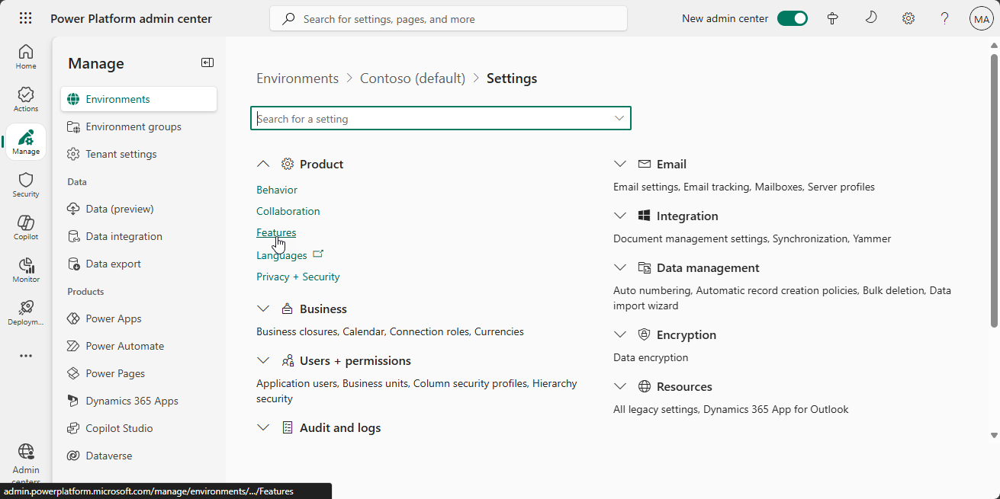

# Set up theming components

The theming components allow you to create, manage and share themes for canvas apps. A theme contains a collection of styles that defines multiple design properties for controls and components such as colors, fonts, borders etc. These styles are then applied automatically when makers use the provided themed template app to create a new app, and controls and components are automatically themed.

The theming components solution contains assets that are relevant to makers as well as designers.

>[!IMPORTANT]
>The Power Apps Theming System solution does not have a dependency on other components of the CoE Starter Kit. It can be used independently.

Please check out the [prerequisites](setup.md#prerequisites) for using the solution.

- If you are not already using the CoE Starter Kit, we recommend [creating a new environment](https://docs.microsoft.com/power-platform/admin/create-environment) for the CoE solutions.
- If you are already using other CoE Starter Kit components, please use the environment created as part of setting up the [Core Components](setup-core-components.md) for this solution.

## Prerequisites

1. The Power Apps Theming System solution contains PCF (Power Apps component framework) elements. Publishing of canvas apps with code components has to be enabled on the environment.

    1. Go to the [Power Platform Admin Center](https://aka.ms/ppac).
    1. Go to your CoE environment.
    1. Select **Settings**.

        

    1. Select **Product > Features**.
        
    1. Make sure **Allow publishing of canvas apps with code components** is enabled.
        

## Import the solution

1. Go to [make.powerapps.com](<https://make.powerapps.com>)

1. Go to your CoE environment. In the example in the following screenshot, we're importing to the environment named **Contoso CoE**.

     

1. Select **Solutions** on the left navigation bar.

1. Select **Import**. A pop-up window appears. (If the window doesn't appear, be sure your browser's pop-up blocker is disabled and try again.)

1. In the pop-up window, select **Choose File**.

1. Choose the **Center Of Excellence - Theming** solution from the file explorer (CenterOfExcellenceThemingComponents_x_x_x_xx_managed.zip).

1. When the compressed (.zip) file has been loaded, select **Next**.

1. Select **Next**, then select **Import**. (This can take some time.)

1. When the import succeeds, the list of the components that were imported is displayed.

1. Select **Close**.

You can now [use the theming components](theming-components.md).
