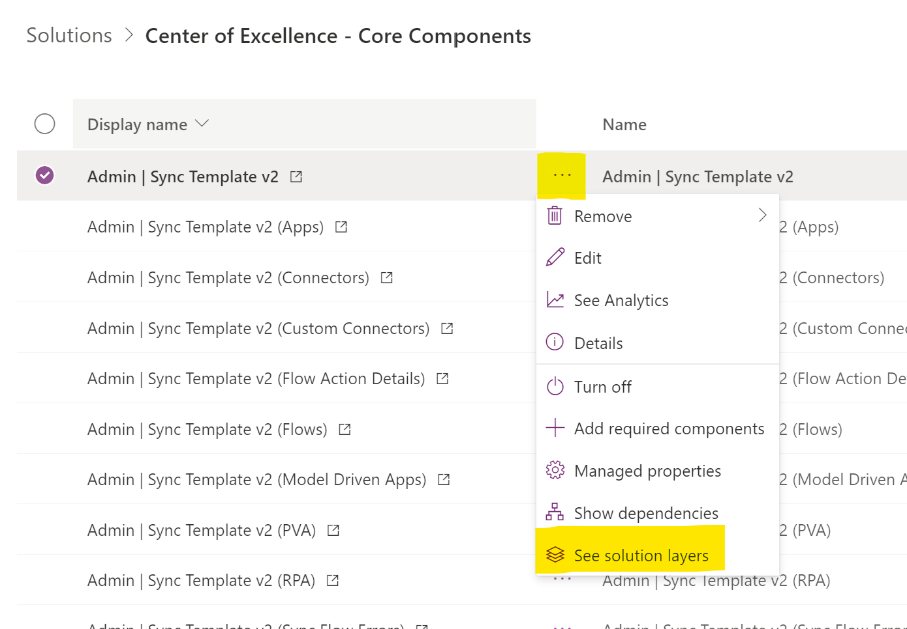
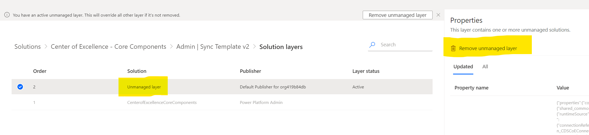

# Set up the CoE Starter Kit

[!INCLUDE[cc-data-platform-banner](../../includes/cc-data-platform-banner.md)]

The Center of Excellence (CoE) Starter Kit is a collection of components and tools that are designed to help you get started with developing a strategy for adopting and supporting Microsoft Power Platform, with a focus on Power Apps and Power Automate. More information about individual components: [CoE Starter Kit explained](starter-kit-explained.md)

In this article, you'll learn how to:

- Import the CoE Starter Kit solutions.
- Configure the apps, flows, and dashboard.
- Extend the starter kit.
- Install updates to the starter kit.

## Prerequisites

The following are prerequisites for installing the CoE Starter Kit as it's included in the solution.

-  Admin account:
    -  Microsoft Power Platform service admin, global tenant admin, or Dynamics 365 service admin for access to all tenant resources through the Power Apps APIs.
    -  This solution will work for environment admins, but the view will be restricted to only the environments an environment admin has access to.
    -  Dynamics 365 service admin is required for getting details about model-driven apps and solution-aware flows.
    - This account must be email enabled.

-  Power Apps Premium license (per app, per user) is required for using Microsoft Dataverse.

-  Power Automate Premium license (per flow, per user) is required for using the sync flows.

- A Microsoft Teams license is required for gathering information about your Microsoft Teams environments.
 
-  Environment with a Dataverse instance, where the user installing the solution has the System Administrator security role.

-  The environment must have a data loss prevention (DLP) policy that allows [Dataverse](https://docs.microsoft.com/connectors/commondataservice/), [Dataverse (current environment)](https://docs.microsoft.com/connectors/commondataserviceforapps/), [Office 365 Users](https://docs.microsoft.com/connectors/office365users/), [Power Platform for Admins](https://docs.microsoft.com/connectors/powerplatformforadmins/), [Power Automate Management](https://docs.microsoft.com/connectors/flowmanagement/), [Office 365 Outlook](https://docs.microsoft.com/connectors/office365/), [Power Apps for Admins](https://docs.microsoft.com/connectors/powerappsforadmins/), [Power Apps for Makers](https://docs.microsoft.com/connectors/powerappsforappmakers/), [SharePoint](https://docs.microsoft.com/connectors/sharepointonline/), [Azure Aciver Directory (Azure AD)](https://docs.microsoft.com/connectors/azuread/), [Power Automate for Admins](https://docs.microsoft.com/connectors/microsoftflowforadmins/), [RSS](https://docs.microsoft.com/connectors/rss/), [Office 365 Groups](https://docs.microsoft.com/connectors/office365groups/), [Approvals](https://docs.microsoft.com/connectors/approvals/) and HTTP to be used together. Those connectors must be in the business data&ndash;only bucket of the DLP policy for this environment. If you're using the [audit log](setup-auditlog.md) solution, the custom connector used to connect to the Microsoft 365 audit log also must be included in your business data&ndash;only bucket.

- If multiple DLP policies apply to the same environment, either all of them must have the connectors the CoE Starter Kit uses in business data only or&mdash;if you have a policy that applies to all environments that you don't want to change&mdash;you can exclude the CoE environment from that policy. More information: [DLP policy scope](https://docs.microsoft.com/power-platform/admin/wp-data-loss-prevention#policy-scope)

- You've downloaded the CoE solution and CoE Power BI dashboard files to your device. The entire content package can be downloaded directly at [aka.ms/CoEStarterKitDownload](https://aka.ms/CoEStarterKitDownload).

- Both the governance components and nurture components solutions require the core solution before they can be installed. Theming components can be used independently, and have no dependency on other CoE Starter Kit components.

These are the requirements for using the solution:

- Power Apps Premium license (per app, per user).

- For the core components solution, only the admins need a Power Apps Premium license. For the governance components solution, all makers require a Premium license. For the nurture components solution, everyone will require a Premium license.

> [!NOTE]
>The Admin \| Sync Template flows crawl through all the resources stored in Microsoft Power Platform and make a copy of details in each resource (for example, apps and flows) to Dataverse (table definitions are provided in this solution). All data displayed in most of the starter kit components must be in Dataverse, which means that the sync template must be configured for everything else to work. The sync flows run daily overnight. When you first set up the CoE Starter Kit, you can manually start the Admin \| Sync Template v2 flow, which will start the process of crawling and storing the information in Dataverse.

Set up the CoE Starter Kit by following these instructions:

- [Set up core components](setup-core-components.md)
- [Set up governance components](setup-governance-components.md)
- [Set up nurture components](setup-nurture-components.md)
- [Set up the CoE Power BI dashboard](setup-powerbi.md)
- [Set up theming components](setup-theming.md)

## Extending the starter kit

When you're ready to extend the CoE Starter Kit with your own ideas, you'll do so by making modifications to the solution components in your own unmanaged solution:

1. Read about solutions in our documentation, which will introduce you to the concepts in addition to notions like how to create your publisher. More information: [Introduction to solutions](https://docs.microsoft.com/powerapps/developer/common-data-service/introduction-solutions)

1. Create a new unmanaged solution.

1. Choose components from the CoE Starter Kit to add to your new solution. You decide which ones you want to customize.

1. Extend the CoE Starter Kit by making modifications to the solution components in the context of your new unmanaged solution.

   > [!NOTE]
   > It's currently not possible to extend canvas apps or flows. If you want to make customizations to apps and flows, create a copy add them to your unmanaged solution.  
   > Editing apps and flows in the managed solution will prevent you from getting changes during an upgrade. See [Installing updates](#installing-updates).

1. Deploy your solution to test and production. We recommend making modifications and installing updates pushed by our team to the solution in a development environment dedicated to this kit, and hosting a production environment that has the real data. If data is being accessed and contributed by other users, it's a good idea to have separate development, test, and production environments.

## Installing updates

Periodically, the solution will receive updates with new features, bug fixes, or optimizations. These updates will be announced on the [GitHub repo](https://aka.ms/CoEStarterKitRepo), and can be downloaded from there or by direct download at [aka.ms/CoEStarterKitDownload](https://aka.ms/CoEStarterKitDownload).

Install the updates by importing the latest version to the environment where you originally installed the solution. Select **Upgrade** to update the solution.

> [!NOTE]
> If you have made any changes to the flows / apps in the solution they will not receive updates until you remove that unmanaged layer.  
> For every flow/app that you changed, go to the solution layers and remove it.
> 
> 

## FAQ

### What licenses do I need to run this solution?

The apps and flows in the CoE Starter Kit use Premium features like custom connectors and Dataverse, therefore a per-app or per-user Power Apps license, in addition to a per-flow Power Automate license, is required to run and play the apps. More information: [Microsoft Power Platform licensing overview](https://docs.microsoft.com/power-platform/admin/pricing-billing-skus)

If you want to use the Power BI report (packaged as part of the solution), you'll need a Power BI license. More information: [Power BI pricing](https://powerbi.microsoft.com/pricing/)

### It looks like I found a bug with the app; where should I go?

To file a bug against the solution, go to [aka.ms/coe-starter-kit-issues](https://aka.ms/coe-starter-kit-issues).

### What features are currently not supported in Government Community Cloud (GCC)?

The Microsoft 365 audit log and custom connector aren't available in the Government Community Cloud.
