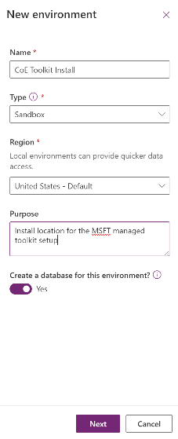
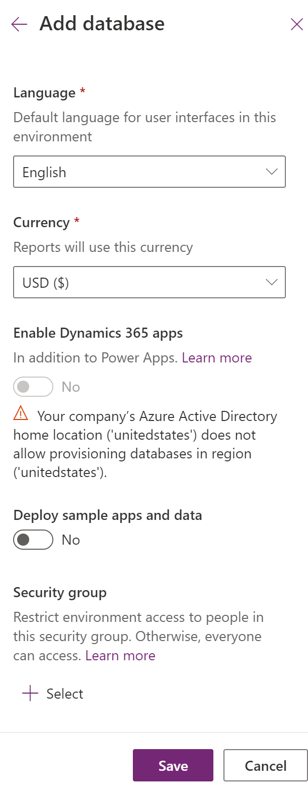
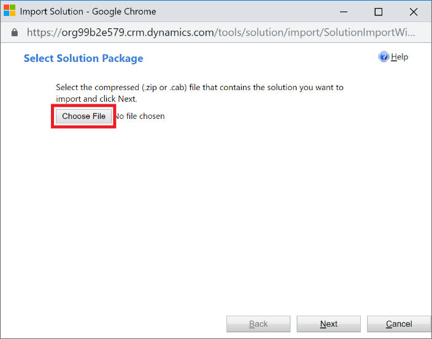

# Set up the Center of Excellence Starter Kit
The Center of Excellence (CoE) starter kit is a collection of components and tools that are designed to help get started with developing a strategy for adopting and supporting the Power Platform, with a focus on Power Apps and Power Automate.

In this walkthrough, you'll learn how to 
- Import the Center of Excellence Starter Kit solutions
- Configure the apps, flows and dashboard assets
- Extend the Starter Kit
- Install updates to the Starter Kit 

## Prerequisites
The following are prerequisites for installing the CoE starter kit as it comes in the solution.

1.  **Admin account**
    1.  Power Platform Service Admin, Global tenant admin or Dynamics 365
        service admin for access to all tenant resources through the Power Apps
        APIs.

    1.  This solution will still work for Environment admins, but the view will
        be restricted to only the environments an Environment admin has access
        to.

    1.  Dynamics 365 service admin is required for getting details on Model
        Driven Apps and Solution Aware Flows.

1.  **PowerApps Premium License** (Per App, Per User or Dynamics 365 Online
    licenses)  
    This is for using the CDS solution.

1.  **Environment with a CDS instance**, where the user installing the solution has the System Administrator security role.

1. The environment must have a **DLP Policies** that allows Common Data Service, Power Platform Management connectors, Office 365 Users and Office 365 Outlook to be used together - those connectors must be in the business data only bucket of the DLP policy for this environment.

1.  **Download of the Center of Excellence Solution** and Power BI dashboard files to your device. The entire content package can be downloaded directly at [aka.ms/CoEStarterKitDownload](https://aka.ms/CoEStarterKitDownload)

1.  Both the Audit and Report Components and Nurture components solution require the **Core Components solution to be installed**

These are the requirements for using the solution.

1.  Power Apps Premium License (Per App, Per User or Dynamics 365 Online licenses)

1.  For the **Core Components** solution, only the admins need a Premium License. For the Audit and Report Components, all makers require a Premium License. For the Nurture components, everyone will require Premium License.

> [!NOTE]
> **Where the data comes from**
> The "Admin \| Sync Template" flows crawl through all the resources stored in the Power Platform and makes a copy of details in each resource (e.g., apps and flows) to the CDS (entity definitions are provided in this solution). All data displayed in most of the starter kit components are dependent on the data first being in CDS, which means that the sync template must be configured for everything else to work. The Sync Flows run daily overnight. When you first set up the CoE Starter Kit, you can manually start the **Admin \| Sync Template v2** which will start the process of crawling and storing the information in CDS.

There are multiple components provided in this starter kit, each will require some configuration to install. The installation instructions have been segmented based on the set of components that should be grouped and installed together, and dependencies on other segments are outlined in each section.

> [!IMPORTANT]
> For any feedback or issues related to the CoE Starter Kit, please use the following link: [Raise Issue in GitHub](https://github.com/microsoft/powerapps-tools/issues/new?assignees=manuelap-msft&labels=coestarterkit&template=-coe-starter-kit-app--bug-report.md&title=%5BBUG%5D%3A+issue+title)

## Core Components Setup

### Step 1: Import the Solution
#### Description

This is the first setup step of the installation process and is required for every other component in the starter kit to work.

#### Instructions

1.  Download the CoE starter kit compressed file
    ([aka.ms/CoeStarterKitDownload](https://aka.ms/CoeStarterKitDownload)), and extract the zip file. It will contain the solutions.

1.  Create an Environment in which to set up the CoE.

    Please see the following for information about
    [Sandbox](https://docs.microsoft.com/en-us/power-platform/admin/sandbox-environments)
    and
    [ALM](https://docs.microsoft.com/en-us/power-platform/admin/wp-application-lifecycle-management)
    generally.

    1.  Go to [aka.ms/ppac](https://admin.powerplatform.microsoft.com/)

    1.  Select Environments, **+ New**, and then fill in a name, type and purpose

    1.  Select **yes** for creating the database, and click Next 

    1.  Leave sample apps and data to no, and then select a security group who can view this environment. Then hit Save 

1.  Navigate to your new environment 
    1.  Go to <https://make.powerapps.com>

    1.  Navigate to the Environment you just created, where the CoE solution will be hosted in. In the screenshots example, we're importing to the Environment called 'Contoso CoE'. 

1.  Select Solutions on the left navigation bar. 

1.  Select **Import**, and a pop-up window will appear (make sure to disable the pop-up blocker in your browser and try again if nothing happens when clicking the Import button).

1.  In the pop-up window, select **Choose File**.   

1.  Choose the MANAGED **Power Platform** solution from the file explorer   (CenterOfExcellenceCoreComponents_x_x_x_xx_managed.zip).

1.  When the compressed (.zip) file has been loaded, click **Next**.

1.  Review, click **Next**, then click **Import**. (This can take some time.)

1. When the import succeeds, the list of the components that were imported is displayed.

1.  Close out of the logs dialog.

1.  Back on the Solutions page, click **Publish All Customizations**. This is good practice to follow whenever you make changes to a solution, but especially so when importing.

> [!NOTE]
> When importing the solution, sometimes Power Automate components show a warning of type “Process Activation” and a duplicate record of that component. You can ignore these warnings for flows.

### Step 2: Configure the CoE Settings Entity

#### Description

This section explains how to enter data in the CoE Settings entity, which is in
the Common Data Service you instantiated. It represents the settings for
components in the solution and should be completed second.

The steps below will have you fill this entity with a single row which contains
your logo, brand colors and so on, which different applications will reference.

#### Dependencies

#### Instructions

## Extending the Toolkit

## Recent changes to the CoE Starter Kit

## Installing updates