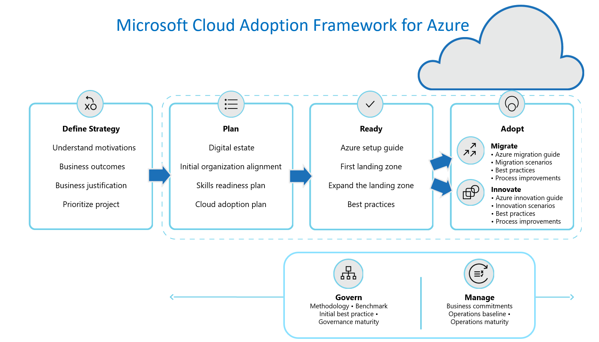

# CoE Starter Kit explained

The Cloud Adoption Framework is the One Microsoft approach to cloud adoption in Azure, consolidating and sharing best practices from Microsoft employees, partners, and customers. The framework gives customers a set of tools, guidance, and narratives that help shape technology, business, and people strategies for driving desired business outcomes during their adoption effort. This guidance aligns to the following phases of the cloud adoption lifecycle, ensuring easy access to the right guidance at the right time.

<!-- markdownlint-disable MD033 -->

<ul class="panelContent cardsF">
    <li style="display: flex; flex-direction: column;">
        <a href="">
            

                

                    

                        

                            

                                
                            

                        

                        

                            <h3>Strategy</h3>
                            Define business justification and expected outcomes.
                        

                    

                

            

        </a>
    </li>
    <li style="display: flex; flex-direction: column;">
        <a href="">
            

                

                    

                        

                            

                                
                            

                        

                        

                            <h3>Plan</h3>
                            Align actionable adoption plans to business outcomes.
                        

                    

                

            

        </a>
    </li>
    <li style="display: flex; flex-direction: column;">
        <a href="">
            

                

                    

                        

                            

                                
                            

                        

                        

                            <h3>Ready</h3>
                            Prepare the cloud environment for the planned changes.
                        

                    

                

            

        </a>
    </li>
    <li style="display: flex; flex-direction: column;">
        <a href="">
            

                

                    

                        

                            

                                
                            

                        

                        

                            <h3>Migrate</h3>
                            Migrate and modernize existing workloads.
                        

                    

                

            

        </a>
    </li>
    <li style="display: flex; flex-direction: column;">
        <a href="">
            

                

                    

                        

                            

                                
                            

                        

                        

                            <h3>Innovate</h3>
                            Develop new cloud-native or hybrid solutions.
                        

                    

                

            

        </a>
    </li>
    <li style="display: flex; flex-direction: column;">
        <a href="">
            

                

                    

                        

                            

                                
                            

                        

                        

                            <h3>Govern</h3>
                            Govern the environment and workloads.
                        

                    

                

            

        </a>
    </li>
    <li style="display: flex; flex-direction: column;">
        <a href="">
            

                

                    

                        

                            

                                
                            

                        

                        

                            <h3>Manage</h3>
                            Operations management for cloud and hybrid solutions.
                        

                    

                

            

        </a>
    </li>
</ul>

## Understand the lifecycle

Each of the methodologies captured above are part of a broad cloud adoption lifecycle. The following image ties together each methodology to demonstrate the overall lifecycle. The Cloud Adoption Framework is a full lifecycle framework, supporting customers throughout each phase of adoption by providing methodologies as specific approaches to overcoming common blockers.

## Intent

The cloud fundamentally changes how enterprises procure, use, and secure technology resources. Traditionally, enterprises assumed ownership of and responsibility for all aspects of technology, from infrastructure to software. By moving to the cloud, enterprises can provision and consume resources only when they're needed. Although the cloud offers tremendous flexibility in design choices, enterprises need a proven and consistent methodology for adopting cloud technologies. The Microsoft Cloud Adoption Framework for Azure meets that need, helping guide decisions throughout cloud adoption.

However, cloud adoption is only a means to an end. Successful cloud adoption starts well before a cloud platform vendor is selected. It begins when business and IT decision makers realize that the cloud can accelerate a specific business transformation objective. The Cloud Adoption Framework can help them align strategies for business, culture, and technical change to achieve their desired business outcomes.

The Cloud Adoption Framework provides technical guidance for Microsoft Azure. Because enterprise customers might still be in the process of choosing a cloud vendor or may have an intentional multicloud strategy, the framework provides cloud-agnostic guidance for strategic decisions whenever possible.

## Intended audience

This guidance affects the business, technology, and culture of enterprises. The affected roles include line-of-business leaders, business decision makers, IT decision makers, finance, enterprise administrators, IT operations, IT security and compliance, IT governance, workload development owners, and workload operations owners. Each role uses its own vocabulary, and each has different objectives and key performance indicators. A single set of content can't address all audiences effectively.

Enter the **Cloud Architect**. The Cloud Architect serves as the thought leader and facilitator to bring these audiences together. We've designed this collection of guides to help Cloud Architects facilitate the right conversations with the right audiences and drive decision-making. Business transformation that's empowered by the cloud depends on the Cloud Architect role to help guide decisions throughout the business and IT.

Each section of the Cloud Adoption Framework represents a different specialization or variant of the Cloud Architect role. These sections also create opportunities to share cloud architecture responsibilities across a team of Cloud Architects. For example, the governance section is designed for Cloud Architects who have a passion for mitigating technical risks. Some cloud providers refer to these specialists as cloud custodians; we prefer the term _cloud guardian_ or, collectively, the _cloud governance team_.

## How to use the Microsoft Cloud Adoption Framework for Azure

If your enterprise is new to Azure, begin by reading [Get started with the Cloud Adoption Framework](./getting-started/migrate.md). This overview provides best practices for your enterprise's digital transformation as it walks you through each step of the process.

<!-- test:ignoreNextStep -->

> [!div class="nextstepaction"]
> [Get started](./getting-started/migrate.md)
