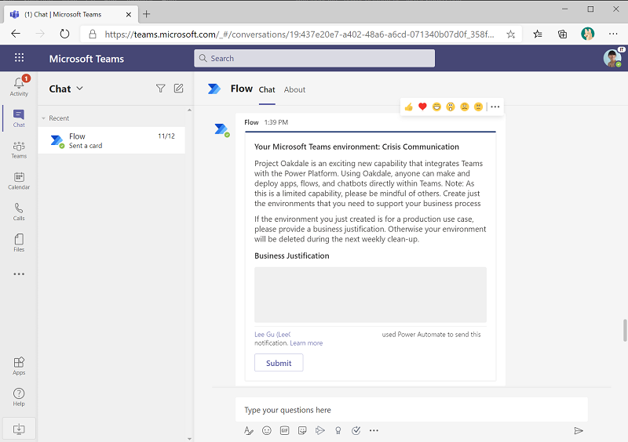
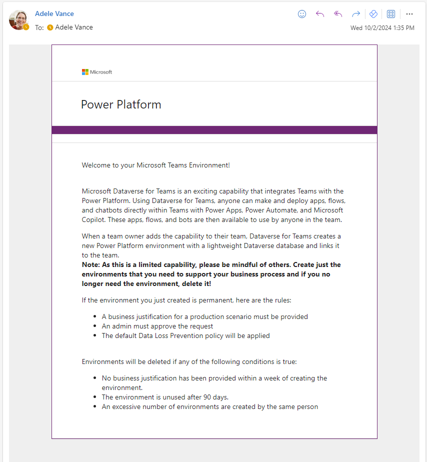
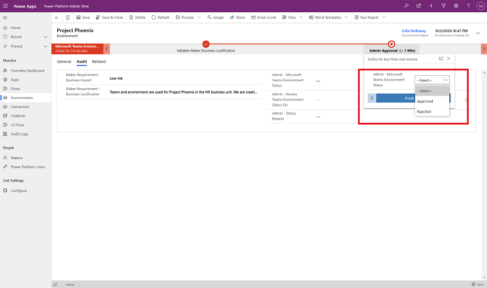
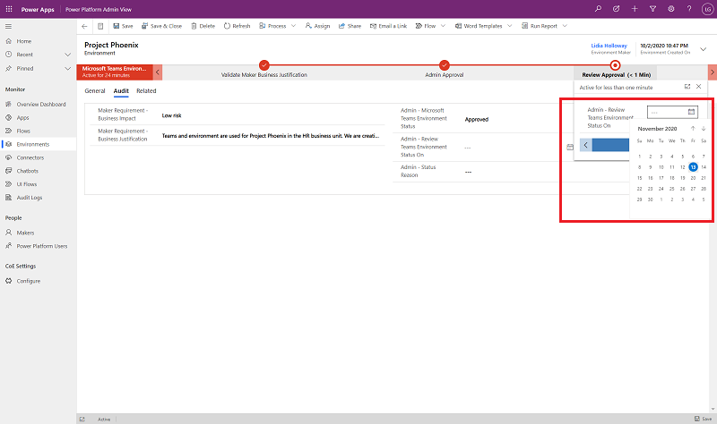
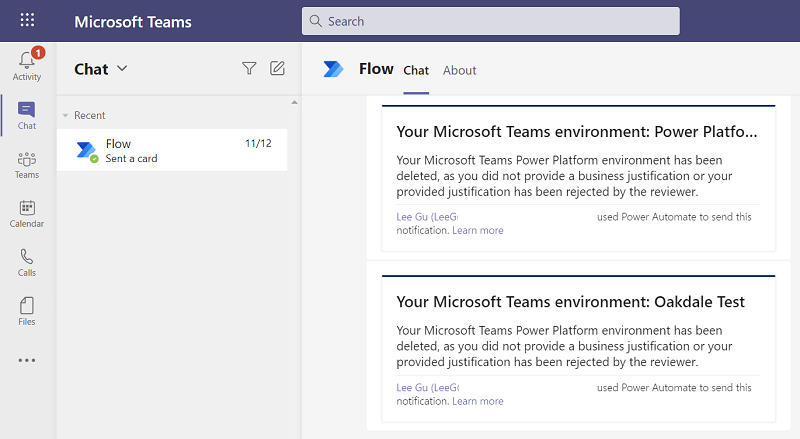

# Microsoft Dataverse for Teams environment management

Leverage our philosophy of using Microsoft Power Platform to manage Microsoft Power Platform by building automation to send welcome emails to owners of new Dataverse for Teams environments and requesting business justification for the newly created environments. This ensures that central IT teams can effectively engage with the new makers onboarding the platform, and ensure that Dataverse for Teams capacity is leveraged effectively in your tenant and distributed to the most effective business use cases. Similar workflows can be used to apply specific DLP policies to Dataverse for Teams environments as needed and to invoke clean-up of unused assets that can be repurposed for more compelling scenarios in the tenant.

## Process description

**Problem statement:** Central IT wants to ensure that Dataverse for Teams environments are leveraged effectively in their tenant. Central IT wants to understand the business justification for a Dataverse for Teams environment to be able to distribute them to the most effective business use cases, as well as be able to invoke cleanup of unused assets that can be repurposed for more compelling scenarios in the tenant.

**Solution:** Reactive governance and monitoring abilities are configured to provide Team owners the ability to provide a business justification, and to provide Central IT with the ability to approve or reject the business justification as well as run regular automated cleanup flows.

## Business justification process

Here is that process from the point of view of the people involved and the components they interact with.

**Team owner:** The Team owner gets a notification in Teams to provide a business justification for the environment they have just created. Team owners have 7 days to submit a business justification.

Team owners also receive a Welcome note via email to provide them with further information about their environment, as well as conditions of using it.

**Admin:** Microsoft Teams environments can be reviewed using the **Microsoft Teams environment review** filter view on the **Power Platform Admin View** model driven app.

An admin opens **Power Platform Admin View** > **Environments** > **Microsoft Teams environment review** and assesses all the environments due for review by looking at the **Audit** tab within the environment, investigating the justification submitted by the Team owner, and then approving or rejecting the justification in the **Admin Review** section.

The admin can further decide to approve a business justification, but highlight it for later review by providing a review date.

## Monitoring and weekly Cleanup process

Admins can also monitor inactive Microsoft Teams environments in their tenant and invoke cleanup as appropriate, as well as have automated cleanup of unused environments in place to free up capacity for more compelling scenarios.

A weekly cleanup deletes environments that

- have been created more than **seven days** ago and have no business justification or where the business justification has been rejected by the admin
- have been created more than **90 days** ago and have no apps or flows in the environment

> [!NOTE]
> Currently, bots created using Power Virtual Agents in Microsoft Teams environments are not discoverable in the CoE Starter Kit.

An admin can customize the conditions for deletion by creating their own copy of the flow and modifying it:

1. Navigate to [flow.microsoft.com](https://flow.microsoft.com) > Solutions > Center of Excellence - Governance Components.
1. Open the *Admin | Weekly Clean Up of Microsoft Teams environments* flow and save a copy.
1. Change what environments are marked for deletion by looking at the condition.

Team owners will receive a notification that their environment has been deleted.

In addition to the automatic cleanup, admins can also monitor how Microsoft Teams environments are used - a [Microsoft Teams environments](power-bi-monitor.md) report has been created in the CoE Starter Kit dashboard.

The **Microsoft Teams environments** page shows you how many environments, environment makers, and apps and flows in Microsoft Teams environments you have.

The page visualizes:

- The Teams environment creation trend
- The number of resources per environment
- The list of environments including the last launched date of an app in the environment
- The list of apps in Teams environments, including their last launched date

The filters allow you to drill down and analyze trends by filtering on the created time or creator.

A link to both the Environment page in the Admin Center, as well as the Teams itself is available and allows the admin to get further information about this environment.

