# Use theming components

A frequent ask from organizations in which makers create canvas apps is the ability to apply themes&mdash;specifically, the ability to create apps that match the organizational brand. The assets in this solution will help you create, manage, and share themes. More information: [Set up theming components](setup-theming.md)

You use theming components to create and manage themes for canvas apps. A *theme* contains a collection of styles that define multiple design properties for controls and components such as colors, fonts, and borders. These styles are then applied automatically when makers use the themed template app to create a new app; controls and components are automatically themed.

The theming components help ensure that makers can focus on what matters&mdash;the business logic and problem they're trying to solve&mdash;and users can have a consistent experience when using apps.

Here's a breakdown of the assets that form the theming components solution:

- [Theme Editor app](#theme-editor)
- [Theme Gallery app](#theme-gallery)
- [Shared Component Library](#components)

## Tables

### Theme

Represents a custom theme created with the [Theme Editor app](#apps).

### Style

Represents the style properties corresponding to a theme created with the [Theme Editor app](#apps). Colors, borders, fonts are stored in this table.

## Apps

### Theme Editor

The Theme Editor app allows designers to create and manage themes. A theme contains a collection of styles that defines design properties for controls and components such as colors, fonts, and borders.

**Permission**: Share Theme Editor with your designers creating themes.

**Prerequisite**: This app uses Microsoft Dataverse; a Premium license is therefore required for every app user.

>[!NOTE]
> If you've recently enabled the use of [code components](setup-theming.md) in the environment, you might have to edit and republish Theme Editor to display the components correctly.

Theme Editor provides an overview of existing themes, and users can edit a theme or create a new one.

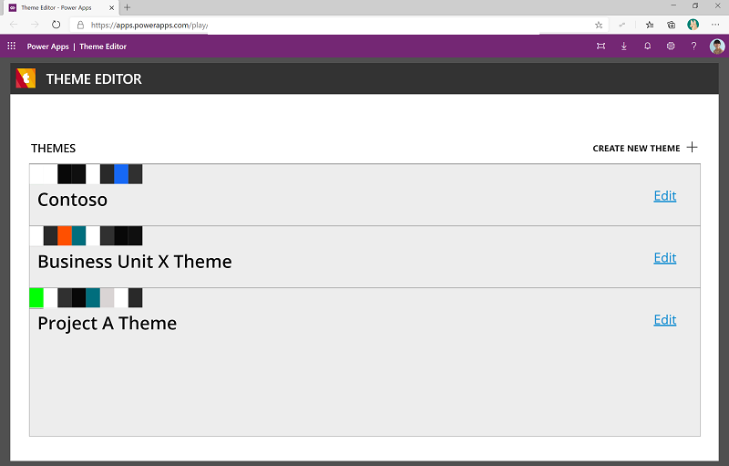

Use the styles (color picker, font picker) to create the style and see a real-time preview of the theme as you're editing various colors, fonts, and sizes.

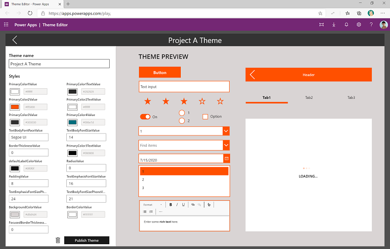

After you've finished authoring the theme, select **Publish Theme**. Here, theme designers will need to update the AppTemplatePhone.msapp and AppTemplateTablet.msapp files, and upload them. This step ensures that the app template will be ready to be used by makers.

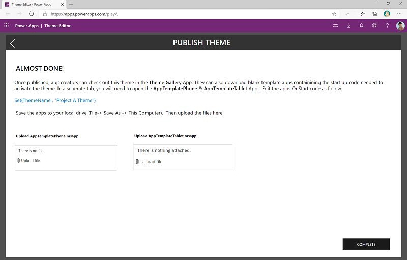

#### Update .msapp files

1. Copy the formula `Set(ThemeName, "Your Theme Name")` to your clipboard or Notepad.
1. Go to [make.powerapps.com](<https://make.powerapps.com>), and then go to your CoE environment where the theming solution is installed.
1. On the left pane, select **Solutions**.
1. Select the Center of Excellence theming solution.
1. Edit the **AppTemplatePhone** canvas app.
    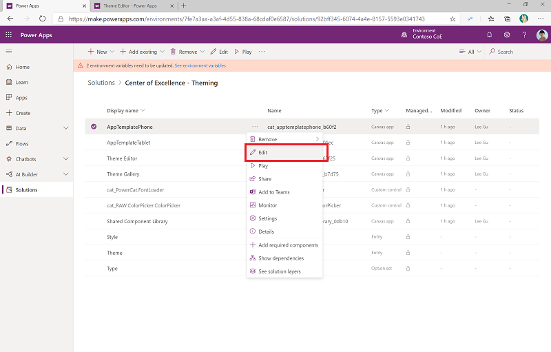
1. Select **App** > **OnStart**, and replace the first line in the formula with the new formula you copied from Theme Editor. Make sure you don't replace any other formulas in the **OnStart** function and that the line ends with a semicolon.
    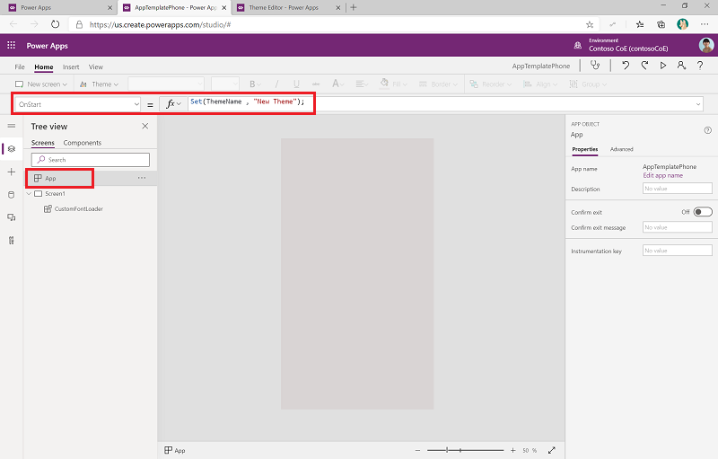
1. Select **File** > **Save as** > **This Computer** to save the file locally.
    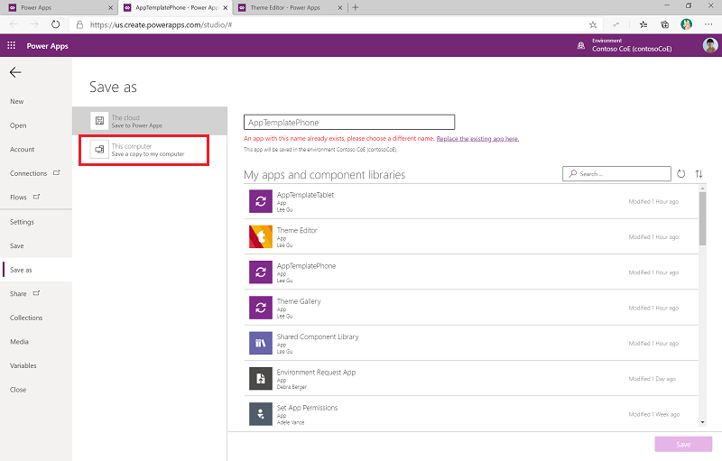
1. Download the file.
  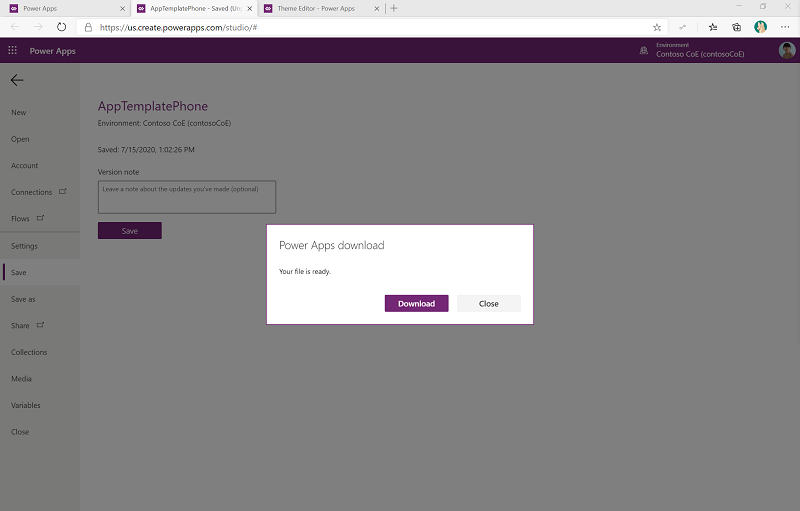

Complete the same steps for the AppTemplateTablet canvas app.

Go back to the Theme Editor app, and upload the template files you just downloaded.

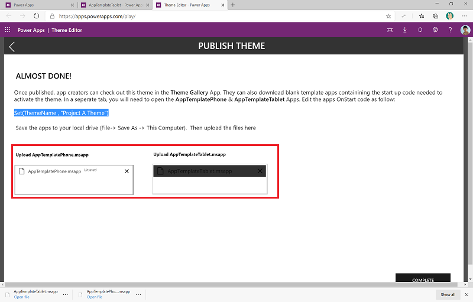

Select **Complete** to publish the theme to the Theme Gallery app.

### Theme Gallery

The Theme Gallery app can be used by app makers to browse existing themes and download a corresponding template app either in Phone (AppTemplatePhone.msapp) or Tablet (AppTemplateTablet.msapp) layout.

**Permission**: Share the Theme Gallery with makers in your organization.

**Prerequisite**: This app uses Dataverse; a Premium license is therefore required for every app user.

Makers can get an overview and browse available themes

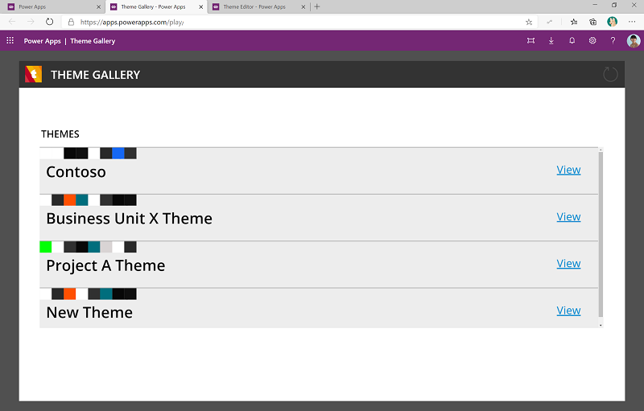

The detail view of the theme provides a preview with all styles applied to native controls and components.

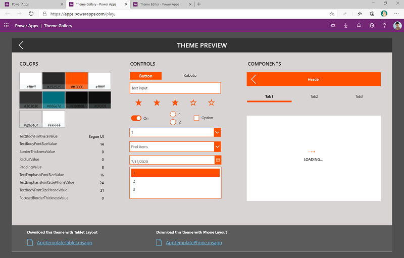

App makers can download the template corresponding to the layout they choose.

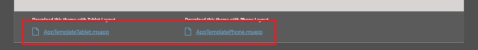

#### Use the template

Create a new app based on the template.

1. Go to [make.powerapps.com](<https://make.powerapps.com>).
1. Select **New** > **Canvas App**.
1. Select **Open** > **Browse Files**, and then select the template file downloaded from the theme gallery.
    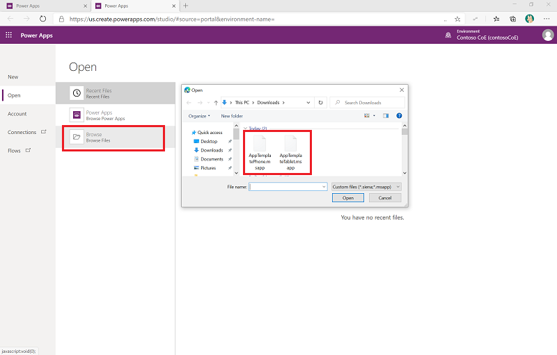
1. After it's opened, the theme will automatically be applied to controls or components that you add to the screen.
    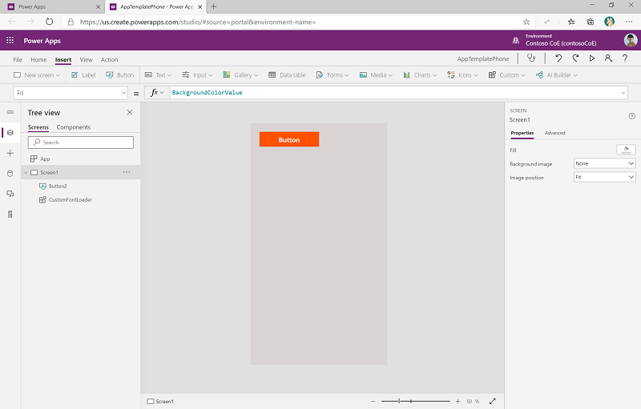

## Components

### Shared component library

[Component libraries](https://docs.microsoft.com/powerapps/maker/canvas-apps/component-library) provide a centralized and managed repository of components for reusability. Component libraries are the recommended way to share components across apps.

The shared component library in the theming component solution contains a Header, TabControl, and PreLoader component. The shared component library isn't editable. Make a copy of the library before expanding it.

**Permission**: Share the shared component library with makers in your organization. When makers use the same components to create their apps, they'll help ensure a consistent look and feel across the apps in your organization.

For a component to also use the theme, makers will need to update the **Style** property and set it to **ComponentStyles**. **ComponentStyles** is a collection of styles specially formatted for components and is initialized as part of the app start code.

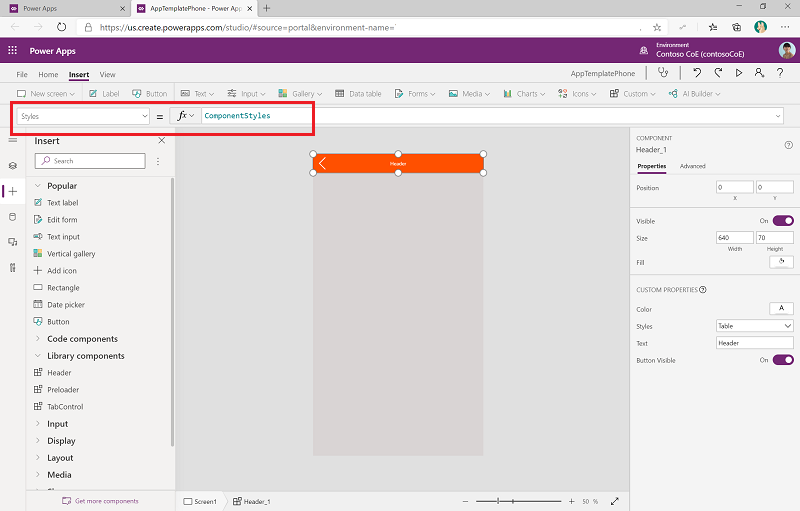
