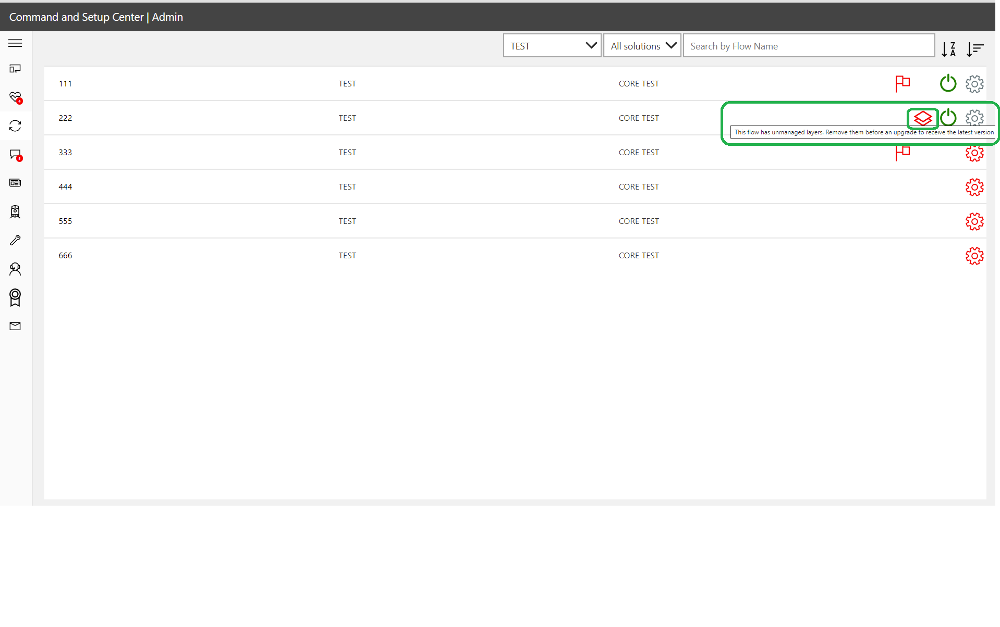

# Updating the Center of Excellence (CoE) Starter Kit

This document is a set of best practices and recommendations for updating the CoE Starter Kit.

The CoE Starter Kit provides inspiration and a starting point for Power Platform governance. If you're new to the CoE Starter Kit, below are some useful links to help you get started:

- [The CoE Starter Kit](/power-platform/guidance/coe/starter-kit)
- [Setting up the CoE Starter Kit](/power-platform/guidance/coe/setup)
- [Extending CoE components](/power-platform/guidance/coe/extending-components)

## How is the CoE Starter Kit updated?

The team behind the CoE Starter Kit releases a new version during the first full week of each month.  This release cadence is important to know for you to review, organize, plan and test the latest version.

The team announces updates (bug fixes, enhancements, new features and deprecations) through:

- GitHub release notes
- Office hours community call

The following sections provide useful guidance and best practices for tracking release information for each channel.

### GitHub release notes

With each release of the CoE Starter Kit, is an accompanying set of release notes. Release notes should be reviewed prior to installing the updated version in your organization.

#### Viewing release notes

View the details of each release by following the steps described below:

1. Navigate to the [CoE Starter Kit repository](https://github.com/microsoft/coe-starter-kit) in GitHub.
1. On the right side of the screen, is [a link to the latest release](https://github.com/microsoft/coe-starter-kit/releases) notes.

Release notes contain links to bug fixes, new features, upgrade instructions and the change log.

Upgrade instructions will notify you of any changes that you need to make (turning on flows, setting variables, etc.) for the release.
The change log lists all bugs, features and updates in the release. Selecting an issue takes you to the item to review comments and all related progress updates.

#### Notifications

Create GitHub notifications for updates.

How to create custom notification for new/ updates to issues and releases:

1. **Sign-in** to your GitHub account, or sign up.
1. Navigate to the [CoE Starter Kit repository](https://github.com/microsoft/coe-starter-kit).
1. Select **'Watch'** (or possibly labeled 'Unwatch' if you've already set up notifications).
1. Either select an existing notification option, or select **'Custom'**.
1. Check the notification types that you want to receive updates about.
1. In the example below, a custom notification has been created to send alerts for new/ updated issues, releases and security alerts.

### Office hours community call

The CoE Starter Kit team runs a monthly community call that dives deeper into new features and bug fixes. You can [register for the Office hours call here](https://aka.ms/coeofficehours). This is highly recommended.

### How often should you update the CoE Starter Kit?

Here are a few things to consider when deciding your update frequency:

- Does the new release **resolve an issue** that you currently have?
- Does the new release **contain a new feature** that you would like to try out?
- By **not** updating to the new release mean your current version is three months older than the newly released version?

Before a release, the CoE Starter Kit team tests any bug fixes or new features against the previous three released versions.  Unfortunately, it means that leaving updates longer than three months could result in unexpected issues when updating.

>[!TIP]
>Review releases monthly by attending the office hours calls and reading release notes. Create notifications to alert you when interesting updates are made. Try to maintain parity between your testing/ production versions of the CoE Starter Kit and the current release, or within the past three releases.

## Installing updates

Below are step-by-step instructions to install and test updates for two possible scenarios:

- If you haven't made customizations to the CoE Starter Kit
- If you've made customizations to the CoE Starter Kit

### Download the latest solution file

Before downloading, read the release notes.  Ensure you're aware of any new components that may require enabling, or variables that need to be created.  [Download the solution file](https://github.com/microsoft/coe-starter-kit/releases).

### Checking for unmanaged layers

Before installing the update, check for unmanaged layers.

>[!NOTE]
>The [feature described below](https://github.com/microsoft/coe-starter-kit/issues/2108) requires the [April 2022 release](https://github.com/microsoft/coe-starter-kit/releases/tag/CoEStarterKit-April2022)

Check for unmanaged layers in your environment using the Admin Control Center app. The Admin Control Center app identifies flows that have unmanaged layers.  These flows won't receive updates until unmanaged layers are removed:

If you can see any unmanaged layers, you'll need to remove them prior to updating:

1. Select **...** > **See solution layers**

2. Select **Remove unmanaged layer**

### If you haven't made customizations

If you haven't made customizations to the CoE Starter Kit, follow the steps described in [this document](/power-platform/guidance/coe/faq#installing-a-solution-in-a-production-environment) to import the update.

When the upgrade has completed processing, move onto testing (below).

### If you've made customizations

Any cloud flow, app or table that you've changed in the solution won't receive updates until you remove the unmanaged layer. Read our recommendations for [extending the CoE Starter Kit](/power-platform/guidance/coe/extending-components) to avoid creating unmanaged layers.

**Remove unmanaged layers prior to update:**

>[!IMPORTANT]
>Editing components in the solution introduces an unmanaged layer. Components that have been changed won't receive any updates until the unmanaged layer has been removed.

If you have made any changes to the flows or apps in the solution, they won't receive updates until you remove that unmanaged layer. For every flow/app that you changed but would like to receive the latest update, go to the solution layers and remove the unmanaged layer. A good indication that a component has been changed is if the modified date is more recent than the latest install. Read our recommendations for extending the CoE Starter Kit to avoid creating unmanaged layers.

1. Select **...** > **See solution layers**.

2. Select **Remove unmanaged layer**

3. Import the solution to a testing environment
    1. If [importing to a Production Environment](/power-platform/guidance/coe/faq#installing-a-solution-in-a-production-environment) - use the solution file from the download called CenterOfExcellenceCoreComponents_x_x_x_xx_managed.zip
    1. If [importing to a Dataverse for Teams Environment](/power-platform/guidance/coe/faq#installing-a-solution-in-a-dataverse-for-teams-environment) - use the solution file from the download called CenterOfExcellenceCoreComponentsTeams_x_x_x_xx_managed.zip

4. Select **Upgrade** (default setting). Solution upgrades will delete components that existed but are no longer included in the upgraded version.

5. If the upgrade adds new environment variables or connection references, establish connections and update environment variable values. You'll find the expected values in our setup instructions.

6. Wait for the Upgrade to finish. **This can take up to 15 mins**. During the upgrade, the new version is installed first and then the old version is deleted. Whilst the upgrade is processing, you may see two solutions with the same name in your solution explorer. [Check the solution history](/powerapps/maker/data-platform/solution-history#view-solution-history) to view the progress of the upgrade.

The upgrade will be complete when the end time is no longer empty.

7. The [solution history](/powerapps/maker/data-platform/solution-history#view-solution-history) will also show you if the upgrade has failed and why. [Raise an issue](https://aka.ms/coe-starter-kit-issues) and [provide the solution operation error details](/en-us/powerapps/maker/data-platform/solution-history#view-solution-operation-error-details).

8. Make sure to check the setup instructions of the solution you're upgrading to see if any new steps are necessary to use the solution and it's new features.

a. [Setup core components](/en-us/power-platform/guidance/coe/setup-core-components)
b. [Setup governance components](/en-us/power-platform/guidance/coe/before-setup-gov)
c: [Setup nurture components](/en-us/power-platform/guidance/coe/setup-nurture-components)

When the upgrade has completed processing, move onto testing (below).

## Testing strategy

As with installing any update, testing prior to installation in a live system increases the likelihood of success.

>[!IMPORTANT]
> Testing is important as it provides feedback. Doing this in an isolated environment protects production versions.
> Create a dedicated testing environment for CoE Starter Kit updates.

Below are some recommendations:

- Create a dedicated testing environment.
- Testing and live environments should have the same versions of the CoE Starter Kit installed.
- Testing and live environments should have the same customizations installed.
- Document test patterns and expected outcomes. Make sure you've covered all possible combinations that might fail.

Example test pattern:

| Reference | Test | Expected outcome | Result |
|-----------|------|------------------|--------|
| 1 | Enable: Admin - Sync Template v3 flow | Turn on successfully | Pass |
| 2 | Launch: Admin - Command Center | App successfully launches | Pass |

### Testing with users

When you've completed your functional tests, you should run final tests with users of the CoE Starter Kit.  This helps ensure that your update doesn't introduce unexpected results.

### If you have an issue

If you find a bug or an issue when testing you can [raise a bug here](https://github.com/microsoft/coe-starter-kit/issues/new?assignees=Jenefer-Monroe&labels=coe-starter-kit%2Cbug&template=1-coe-starter-kit-bug.yml&title=%5BCoE+Starter+Kit+-+BUG%5D+ISSUE+TITLE) ensuring to provide the [solution operation error](/powerapps/maker/data-platform/solution-history#view-solution-operation-error-details) details.

## Application Lifecycle Management

This document doesn't go deep into application lifecycle management. If you're interested in recommendations and scenarios, review the [overview of application lifecycle management with Microsoft Power Platform](/power-platform/alm/overview-alm).  ALM covers many disciplines. This document touches lightly on the discipline of deploying solutions.

### ALM Accelerator

The [ALM Accelerator](/blog/introducing-the-alm-accelerator-for-power-platform/#:~:text=What%20is%20the%20ALM%20Accelerator%3F%20The%20ALM%20Accelerator,of%20Azure%20DevOps%20Pipelines%20and%20Git%20source%20control.?msclkid=36a6686fc15511ec9c253d308c10c711) is a reference implementation that sits on top of Azure Pipelines and Git source control.  

The accelerator includes a canvas app that provides a simplified interface for makers to regularly export components in solutions to source control, and create deployment requests.

### Microsoft Power Platform Build Tools

The [Microsoft Power Platform Build Tools for Azure DevOps Services](/power-platform/alm/devops-build-tools?msclkid=147921b0c15611ecbb1fdca93966d349) automate common build and deployment tasks. They can be used with any other Azure DevOps tasks to compose build and release pipelines

[Download](https://marketplace.visualstudio.com/items?itemName=microsoft-IsvExpTools.PowerPlatform-BuildTools&msclkid=d4b015ebc16e11ecb673fbfc869800f3) the tools, and refer to the [tasks documentation](/power-platform/alm/devops-build-tool-tasks) to get started.

[!INCLUDE[footer-include](../../includes/footer-banner.md)]