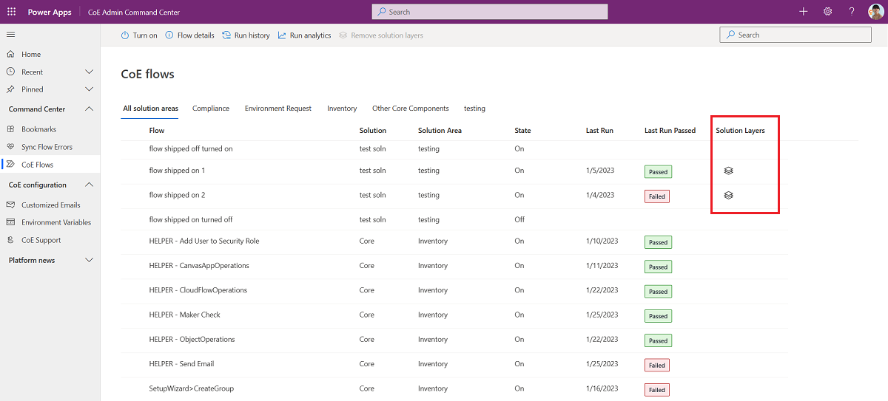

# Updating the Center of Excellence (CoE) Starter Kit

This article will prepare you to upgrade the CoE Starter Kit and provides guidance on:

- How to stay up to date with the latest release.
- How often and why to apply upgrades.
- How to install the latest version.
- How to test the latest release.

> [!NOTE]
> If you are setting up the CoE Starter Kit for the first time, check out our [setup instructions](setup.md). If you are looking to extend the CoE Starter Kit with your own customizations, refer to our guidance for [extending the CoE Starter Kit](modify-components.md)

## How is a new version of the CoE Starter Kit released?

A new version of the CoE Starter Kit is released monthly, usually in the first full week of each month. This release cadence is important to know for you to review, organize, plan and test the latest version.

Updates (bug fixes, enhancements, new features and deprecations) are announced through [GitHub release notes](https://github.com/microsoft/coe-starter-kit/releases).

### GitHub release notes

Each release of the CoE Starter Kit is accompanied with a release notes.  A release note details bug fixes and enhancements addressed with this release. Release notes should be reviewed prior to installing the updated version in your organization.

#### Viewing release notes

To view the details of a release:

1. Navigate to the [CoE Starter Kit repository](https://github.com/microsoft/coe-starter-kit) in GitHub.
1. Select the [latest release](https://github.com/microsoft/coe-starter-kit/releases) notes.
    

Release notes contain a change log of issues (bug fixes and enhancements) addressed with the new version and may also include specific upgrade instructions that are new for the release. This could be turning on a new flow or notes on deprecated features.

#### Subscribe to CoE starter Kit releases

Watch releases on our [GitHub repository](https://github.com/microsoft/coe-starter-kit) to receive notifications about the latest release.

1. **Sign-in** to your GitHub account.
1. Go to our [GitHub repository](https://github.com/microsoft/coe-starter-kit)
1. Select **Watch > Custom**.

    
1. Select **Releases**.

     
1. Select **Apply**.

### How often should you update the CoE Starter Kit?

Here are a few things to consider when deciding your update frequency:

- Does the new release **resolve an issue** that you currently have?
- Does the new release **contain a new feature** that you would like to try out?
- Has your current version been installed more than three months ago?

With the fast pace Power Platform is changing, leaving updates longer than three months could result in unexpected issues when updating.

>[!TIP]
>Review releases monthly by subscribing to release notes.

## Installing updates

Below are step-by-step instructions to install and test updates for two scenarios:

- If you haven't made customizations to the CoE Starter Kit
- If you've made customizations to the CoE Starter Kit

### Download the latest solution file

First, read the [latest release notes](https://github.com/microsoft/coe-starter-kit/releases). Check the [setup instructions](setup.md) where any new components will be mentioned.

Download the latest version CoE Starter Kit compressed file ([aka.ms/CoeStarterKitDownload](https://aka.ms/CoeStarterKitDownload)).

>[!IMPORTANT]
> **Extract the zip file** after downloading and before moving on to the next step. The CoE Starter Kit compressed file contains all solution components as well as non-solution aware components that make up the CoE Starter Kit.

### Get your environment ready for the upgrade

Before installing the upgrade, check the solution is in a healthy state to receive the new updates.

Making any changes to flows or apps in the solution creates an unmanaged layer. Components with unmanaged layers will not receive updates until you remove that unmanaged layer. Learn more: [Understanding solution layers](/power-platform/alm/solution-layers-alm)

#### Remove unmanaged layers from inventory flows

All flows with *Admin \| Sync Template v* in the name are responsible for collecting your tenants inventory and building the foundation the CoE Starter Kit relies on. These flows are changed frequently to fix bugs, address edge cases or collect additional information and should not be customized. If you have additional requirements on what inventory to collect, raise a [feature ask](https://github.com/microsoft/coe-starter-kit/issues/new?assignees=&labels=coe-starter-kit%2Cenhancement&template=3-coe-starter-kit-feature.yml&title=%5BCoE+Starter+Kit+-+Feature%5D%3A+FEATURE+TITLE) or create your own flow.

Your first check before installing the upgrade is removing unmanaged layers from the inventory flows.

>[!NOTE]
>You may have unknowingly created an unmanaged layer by selecting "Edit" to look at flow actions or by modifying the run-only properties of the flow.

You can check for unmanaged layers on the inventory flows using the [Admin - Command Center](core-components.md#admin---command-center) app.

>[!NOTE]
>The [feature described below](https://github.com/microsoft/coe-starter-kit/issues/2108) was made available with the April 2022 release of the CoE Starter Kit, and requires the April or [later release]((https://github.com/microsoft/coe-starter-kit/releases)) to be installed.

1. Open the **Admin - Command Center** app from your CoE environment.
1. Select **Sync flows** from the navigation.
1. Check if any of the flows show the layer icon, indicating they have unmanaged layers
    
1. Click on the layer icon to go to the solution layer page of the flow and remove the unmanaged layer.
    

If you can see any unmanaged layers, you'll need to remove them prior to updating:

1. Select **...** > **See solution layers**

1. Select **Remove unmanaged layer**

### If you haven't made customizations

If you haven't made customizations to the CoE Starter Kit, follow the steps described in [this document](/power-platform/guidance/coe/faq#installing-a-solution-in-a-production-environment) to import the update.

When the upgrade has completed processing, move onto testing (below).

### If you've made customizations

Any cloud flow, app or table that you've changed in the solution won't receive updates until you remove the unmanaged layer. Read our recommendations for [extending the CoE Starter Kit](/power-platform/guidance/coe/extending-components) to avoid creating unmanaged layers.

**Remove unmanaged layers prior to update:**

>[!IMPORTANT]
>Editing components in the solution introduces an unmanaged layer. Components that have been changed won't receive any updates until the unmanaged layer has been removed.

If you have made any changes to the flows or apps in the solution, they won't receive updates until you remove that unmanaged layer. For every flow/app that you changed but would like to receive the latest update, go to the solution layers and remove the unmanaged layer. A good indication that a component has been changed is if the modified date is more recent than the latest install. Read our recommendations for extending the CoE Starter Kit to avoid creating unmanaged layers.

1. Select **...** > **See solution layers**.

2. Select **Remove unmanaged layer**

3. Import the solution to a testing environment
    1. If [importing to a Production Environment](/power-platform/guidance/coe/faq#installing-a-solution-in-a-production-environment) - use the solution file from the download called CenterOfExcellenceCoreComponents_x_x_x_xx_managed.zip
    1. If [importing to a Dataverse for Teams Environment](/power-platform/guidance/coe/faq#installing-a-solution-in-a-dataverse-for-teams-environment) - use the solution file from the download called CenterOfExcellenceCoreComponentsTeams_x_x_x_xx_managed.zip

4. Select **Upgrade** (default setting). Solution upgrades will delete components that existed but are no longer included in the upgraded version.

5. If the upgrade adds new environment variables or connection references, establish connections and update environment variable values. You'll find the expected values in our setup instructions.

6. Wait for the Upgrade to finish. **This can take up to 15 mins**. During the upgrade, the new version is installed first and then the old version is deleted. Whilst the upgrade is processing, you may see two solutions with the same name in your solution explorer. [Check the solution history](/powerapps/maker/data-platform/solution-history#view-solution-history) to view the progress of the upgrade.

The upgrade will be complete when the end time is no longer empty.

7. The [solution history](/powerapps/maker/data-platform/solution-history#view-solution-history) will also show you if the upgrade has failed and why. [Raise an issue](https://aka.ms/coe-starter-kit-issues) and [provide the solution operation error details](/en-us/powerapps/maker/data-platform/solution-history#view-solution-operation-error-details).

8. Make sure to check the setup instructions of the solution you're upgrading to see if any new steps are necessary to use the solution and it's new features.

a. [Setup core components](/en-us/power-platform/guidance/coe/setup-core-components)
b. [Setup governance components](/en-us/power-platform/guidance/coe/before-setup-gov)
c: [Setup nurture components](/en-us/power-platform/guidance/coe/setup-nurture-components)

When the upgrade has completed processing, move onto testing (below).

## Testing strategy

As with installing any update, testing prior to installation in a live system increases the likelihood of success.

>[!IMPORTANT]
> Testing is important as it provides feedback. Doing this in an isolated environment protects production versions.
> Create a dedicated testing environment for CoE Starter Kit updates.

Below are some recommendations:

- Create a dedicated testing environment.
- Testing and live environments should have the same versions of the CoE Starter Kit installed.
- Testing and live environments should have the same customizations installed.
- Document test patterns and expected outcomes. Make sure you've covered all possible combinations that might fail.

Example test pattern:

| Reference | Test | Expected outcome | Result |
|-----------|------|------------------|--------|
| 1 | Enable: Admin - Sync Template v3 flow | Turn on successfully | Pass |
| 2 | Launch: Admin - Command Center | App successfully launches | Pass |

### Testing with users

When you've completed your functional tests, you should run final tests with users of the CoE Starter Kit.  This helps ensure that your update doesn't introduce unexpected results.

### If you have an issue

If you find a bug or an issue when testing you can [raise a bug here](https://github.com/microsoft/coe-starter-kit/issues/new?assignees=Jenefer-Monroe&labels=coe-starter-kit%2Cbug&template=1-coe-starter-kit-bug.yml&title=%5BCoE+Starter+Kit+-+BUG%5D+ISSUE+TITLE) ensuring to provide the [solution operation error](/powerapps/maker/data-platform/solution-history#view-solution-operation-error-details) details.

## Application Lifecycle Management

This document doesn't go deep into application lifecycle management. If you're interested in recommendations and scenarios, review the [overview of application lifecycle management with Microsoft Power Platform](/power-platform/alm/overview-alm).  ALM covers many disciplines. This document touches lightly on the discipline of deploying solutions.

### ALM Accelerator

The [ALM Accelerator](/blog/introducing-the-alm-accelerator-for-power-platform/#:~:text=What%20is%20the%20ALM%20Accelerator%3F%20The%20ALM%20Accelerator,of%20Azure%20DevOps%20Pipelines%20and%20Git%20source%20control.?msclkid=36a6686fc15511ec9c253d308c10c711) is a reference implementation that sits on top of Azure Pipelines and Git source control.  

The accelerator includes a canvas app that provides a simplified interface for makers to regularly export components in solutions to source control, and create deployment requests.

### Microsoft Power Platform Build Tools

The [Microsoft Power Platform Build Tools for Azure DevOps Services](/power-platform/alm/devops-build-tools?msclkid=147921b0c15611ecbb1fdca93966d349) automate common build and deployment tasks. They can be used with any other Azure DevOps tasks to compose build and release pipelines

[Download](https://marketplace.visualstudio.com/items?itemName=microsoft-IsvExpTools.PowerPlatform-BuildTools&msclkid=d4b015ebc16e11ecb673fbfc869800f3) the tools, and refer to the [tasks documentation](/power-platform/alm/devops-build-tool-tasks) to get started.

[!INCLUDE[footer-include](../../includes/footer-banner.md)]