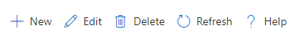

# Context menu control

A control used to input commands.



## Description
This code component provides a wrapper around the [Fluent UI Command Bar](https://developer.microsoft.com/en-us/fluentui#/controls/web/commandbar) control for use in canvas & custom pages.

CommandBar is a surface that houses commands that operate on the content of the window, panel, or parent region it resides above.

## Limitations
This PCF component can only be used in Canvas apps and Custom Pages.


## Key properties

| Property | Description |
| -------- | ----------- |
| Items | Table with the component items |
| Input event | Action that is triggered upon click |

## Items structure
Each item uses the below schema to visualize data in the component. 

| Name | Description |
| ------ | ----------- |
| ItemKey | Arbitrary unique string associated with the item. |
| ItemDisplayName | Text to display in the command bar item. |
| ItemIconName | [Fluent UI Icon](https://uifabricicons.azurewebsites.net/) by name |
| ItemOverflow | Set to true for overflow behavior |

Example:

  ```powerapps-dot
  Table(
      {
          ItemKey: "new",
          ItemDisplayName: "New",
          ItemIconName: "Add"
      },
      {
          ItemKey: "edit",
          ItemDisplayName: "Edit",
          ItemIconName: "Edit"
      },{
          ItemKey: "delete",
          ItemDisplayName: "Delete",
          ItemIconName: "Delete"
      },{
          ItemKey: "refresh",
          ItemDisplayName: "Refresh",
          ItemIconName: "refresh"
      },{
          ItemKey: "help",
          ItemDisplayName: "Help",
          ItemIconName: "help"
      }
  )
    
  ```

## Best Practices

### Configure 'On Select' events
Use the [**Switch()**](https://docs.microsoft.com/en-us/power-apps/maker/canvas-apps/functions/function-if) formula in the component's `OnSelect` property to configure specific actions for each item by referring to the control's selected `ItemKey` as the switch value.

Replace the `false` values with appropriate expressions in the Power Fx language.

  ```powerapps-dot
    Switch( Self.Selected.ItemKey,
      /* Action for ItemKey 'new' (e.g., Patch function) */
      "new", false,
      
      /* Action for 'edit' (e.g., Patch function) */
      "edit", false,
      
      /* Action for 'delete' (e.g., Remove function ) */
      "delete", false,
      
      /* Action for 'refresh' (e.g., Refresh function) */
      "refresh", false,
      
      /* Action for 'help' (e.g., email support with the Office 365 connector ) */
      "help", false,
    
      /* Default action */
          false
    )
  ```

Refer to [Fluent UI Context Menu control best practices](https://developer.microsoft.com/en-us/fluentui#/controls/web/breadcrumb)

[!INCLUDE[footer-include](../../includes/footer-banner.md)]