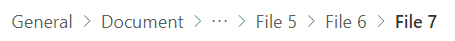

# Context menu control

A control used to provide navigation.



## Description
This code component provides a wrapper around the [Fluent UI Context Menu](https://developer.microsoft.com/en-us/fluentui#/controls/web/contextualmenu) control bound to a button for use in canvas & custom pages.

ContextualMenus are lists of commands that are based on the context of selection, mouse hover or keyboard focus. They are one of the most effective and highly used command surfaces, and can be used in a variety of places.

## Limitations
This PCF component can only be used in Canvas apps and Custom Pages.


## Key properties

| Property | Description |
| -------- | ----------- |
| Items | Table with the component items |
| Chevron | Set to true to display the chevron icon, indicating more options |
| Input event | Action that is triggered upon click |

## Items structure
Each item uses the below schema to visualize data in the component. 

| Name | Description |
| ------ | ----------- |
| ItemKey | Arbitrary unique string associated with the item. |
| ItemDisplayName | Text to display in the item. |
| ItemIconName | [Fluent UI Icon](https://uifabricicons.azurewebsites.net/) by name |
| ItemOverflow | Set to true for overflow behavior |

Example:

  ```powerapps-dot
    Table(
        {
            ItemKey: "File",
            ItemIconName: "save",
            ItemDisplayName: "Save",
            ItemOverflow:true
        },
         {
            ItemKey: "Delete",
            ItemIconName: "Delete",
            ItemDisplayName: "Delete",
            ItemOverflow:true
        }
    )
    
  ```

## Best Practices

### Configure 'On Select' events
Use the [**Switch()**](https://docs.microsoft.com/en-us/power-apps/maker/canvas-apps/functions/function-if) formula in the component's `OnSelect` property to configure specific actions for each item by referring to the control's selected `ItemKey` as the switch value.

Replace the `false` values with appropriate expressions in the Power Fx language.

  ```powerapps-dot
    Switch( Self.Selected.ItemKey,
      /* Action for ItemKey 1 */
      "File", false,
      
      /* Action for ItemKey 2 */
      "Delete", false,
    
      /* Default action */
          false
    )
  ```

Refer to [Fluent UI Context Menu control best practices](https://developer.microsoft.com/en-us/fluentui#/controls/web/breadcrumb)

[!INCLUDE[footer-include](../../includes/footer-banner.md)]