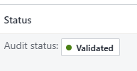
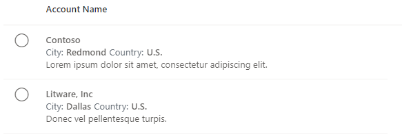
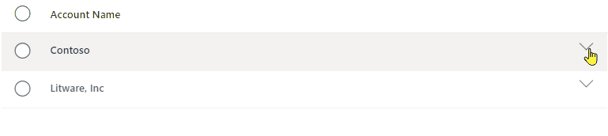
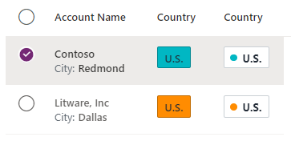
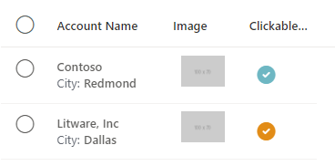
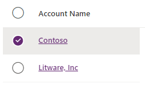
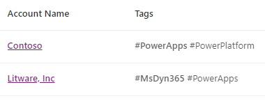

# :::no-loc text="DetailsList"::: control

A control used to display a set of data.

> [!NOTE]
> Full documentation and source code found in the [GitHub code components repository](https://github.com/microsoft/powercat-code-components/tree/main/DetailsList).

:::image type="content" source="media/details-list.png" alt-text="DetailsList control.":::

## Description

A details list (`DetailsList`) is a robust way to display an information-rich collection of items and allow people to sort, group, and filter the content. Use a `DetailsList` when information density is critical.

The `DetailsList` code component allows using the [Fluent UI `DetailsList` component](https://developer.microsoft.com/fluentui#/controls/web/detailslist) from inside canvas apps and custom pages.

- Can be bound to a Dataverse dataset or local collection.
- Supports configurable columns separate to the column metadata provided by the source dataset for flexibility.
- Cell types for links, icons, expand/collapse, and sub text cells.
- Support for paging.
- Support for sorting either using Dataverse sorting or configurable `SortBy` properties.  

## Properties

### Key Properties

| Property | Description |
| -------- | ----------- |
| `Items` | The dataset that contains the rows to render. Also displayed as `Records`. See Items properties table below. |
| `Columns` | The dataset that contains option metadata for the columns. If this dataset is provided, it will completely replace the columns provided in the Records dataset. See Columns properties table below. |
| `SelectionType` | Selection Type (None, Single, Multiple) |
| `PageSize` | Defines how many records to load per page. |
| `PageNumber` | Outputs the current page shown. |
| `HasNextPage` | Outputs true if there's a next page. |
| `HasPreviousPage` | Outputs true if there's a previous page. |
| `TotalRecords` | Outputs the total number of records available. |
| `CurrentSortColumn` | The name of the column to show as currently used for sorting |
| `CurrentSortDirection` | The direction of the current sort column being used |

#### `Items` properties

These attributes must be available in the data source to enable the related functionality. The Power Fx formula [AddColumns()]() can be used to append these values to the original data source.

| Property | Description |
| -------- | ----------- |
| `RecordKey` | (optional) - The unique key column name. Provide this if you want the selection to be preserved when the Records are updated, and when you want the `EventRowKey` to contain the ID instead of the row index after the `OnChange` event is fired.
| `RecordCanSelect` | (optional) - The column name that contains a `boolean` value defining if a row can be selected.
| `RecordSelected` | (optional) - The column name that contains a `boolean` value defining if a row is selected by default and when setting the `InputEvent` to contain `SetSelection`.  See the section on `Set Selection` below.

#### `Columns` properties

| Property | Description |
| -------- | ----------- |
| `ColDisplayName` | (Required) - Provides the name of the column to show in the header. |
| `ColName` | (Required) - Provides the actual field name of the column in the Items collection. |
| `ColWidth` | (Required) - Provides the absolute fixed width of the column in pixels. |
| `ColCellType` | The type of cell to render. Possible values: `expand`, `tag`, `indicatortag`, `image`, `clickableimage`,  `link`. For more information, see the next sections. |
| `ColHorizontalAlign` | The alignment of the cell content if the `ColCellType` is of type `image`, or `clickableimage`. |
| `ColVerticalAlign` |  The alignment of the cell content if the `ColCellType` is of type `image`, or `clickableimage`. |
| `ColMultiLine` | True when the text in the cells text should wrap if too long to fit the available width. |
| `ColResizable` | True when the column header width should be resizable. |
| `ColSortable` | True when the column should be sortable. If the dataset supports automatic sorting via a direct Dataverse connection, the data will automatically be sorted. Otherwise, the `SortEventColumn` and `SortEventDirection` outputs will be set and must be used in the records Power FX binding expression. |
| `ColSortBy` | The name of the column to provide to the `OnChange` event when the column is sorted. For example, if you're sorting date columns, you want to sort on the actual date value rather than the formatted text shown in the column. |
| `ColIsBold` | True when the data cell data should be bold |
| `ColTagColorColumn` | If the cell type is tag, set to the hex background color of the text tag. Can be set to `transparent`. If the cell type isn't a tag, set to a hex color to use as an indicator circle tag cell. If the text value is empty, the tag isn't shown.   |
| `ColTagBorderColorColumn` | Set to a hex color to use as the border color of a text tag. Can be set to `transparent`. |
| `ColHeaderPaddingLeft` | Adds padding to the column header text (pixels) |
| `ColShowAsSubTextOf` | Setting this to the name of another column will move the column to be a child of that column. See below under Sub Text columns. |
| `ColPaddingLeft` | Adds padding to the left of the child cell (pixels) |
| `ColPaddingTop` | Adds padding to the top of the child cell (pixels) |
| `ColLabelAbove` | Moves the label above the child cell value if it's shown as a Sub Text column. |
| `ColMultiValueDelimiter` |  Joins multi value array values together with this delimiter. See below under multi-valued columns. |
| `ColFirstMultiValueBold` | When showing a multi-valued array value, the first item is shown as bold.
| `ColInlineLabel` | If set to a string value, then this is used to show a label inside the cell value that could be different to the column name. for example <br>  
| `ColHideWhenBlank` | When true, any cell inline label & padding will be hidden if the cell value is blank. |
| `ColSubTextRow` | When showing multiple cells on a sub text cell, set to the row index. Zero indicates the main cell content row. |
| `ColAriaTextColumn` | The column that contains the aria description for cells (for example, icon cells). |
| `ColCellActionDisabledColumn` | The column that contains a boolean flag to control if a cell action (for example, icon cells) is disabled. |
| `ColImageWidth` | The icon/image size in pixels. |
| `ColImagePadding` | The padding around an icon/image cell. |
| `ColRowHeader` | Defines a column to render larger than the other cells (14 px rather than 12 px). There normally would only be a single Row Header per column set. |

### Style Properties

| Property | Description |
| -------- | ----------- |
| `Theme` | The Fluent UI Theme JSON to use that is generated and exported from [Fluent UI Theme Designer](https://fabricweb.z5.web.core.windows.net/pr-deploy-site/refs/heads/master/theming-designer/). See [theming](theme.md) for guidance on how to configure. |
| `Compact` | True when the compact style should be used |
| `AlternateRowColor` | The hex value of the row color to use on alternate rows. |
| `SelectionAlwaysVisible` | Should the selection radio buttons always be visible rather than only on row hover. |
| `AccessibilityLabel` | The label to add to the table aria description |

### Event properties
| Property | Description |
| -------- | ----------- |
| `RaiseOnRowSelectionChangeEvent` | The `OnChange` event is raised when a row is selected/unselected. (see below) |
| `InputEvent` | One or more input events (that can be combined together using string concatenation). Possible values `SetFocus`, `SetFocusOnRow`, `SetFocusOnHeader`, `ClearSelection`, `SetSelection`. Must be followed by random string element to ensure the event is triggered. Events can be combined, for example, `SetFocusClearSelection` will clear and set the focus at the same time. `SetFocusOnRowSetSelection` will set focus on a row and set the selection at the same time. |
| `EventName` | Output Event when `OnChange` is triggered. Possible values -  `Sort`, `CellAction`, `OnRowSelectionChange` |
| `EventColumn` | Output Event column field name used when `CellAction` is invoked |
| `EventRowKey` | Output Event column that holds either the index of the row that the event was invoked on, or the Row Key if the `RecordKey` property is set. |
| `SortEventColumn` | The name of the column that triggered the Sort `OnChange` event |
| `SortEventDirection` | The direction of the sort that triggered the Sort `OnChange` event |

### Basic Usage

To determine which columns are displayed in the `DetailsList`, configure the following properties of the `DetailsList`:

1. **Fields**. Add the fields you want by selecting the Edit option in the controls flyout menu on the right (this uses the same interface for modifying [predefined data cards](/power-apps/maker/canvas-apps/working-with-cards)).

1. **Columns**. Provide specific mapping between columns and fields in the `Columns` property.  

Example:

Mapping to the Dataverse [Accounts](/power-apps/developer/data-platform/reference/entities/account) system table, with the following formula:

```power-fx
Table(
    {
        ColName: "name",
        ColDisplayName: "Name",
        ColWidth: 200,
        ColSortable: true,
        ColIsBold: true,
        ColResizable: true
    },{
        ColName: "address1_city",
        ColDisplayName: "City:",
        ColShowAsSubTextOf: "name"
    },{
        ColName: "address1_country",
        ColDisplayName: "Country:",
        ColShowAsSubTextOf: "name"
    },{
        ColName: "telephone1",
        ColDisplayName: "Telephone",
        ColWidth: 100,
        ColSortable: true,
        ColResizable: true
    },{
        ColName: "primarycontactid",
        ColDisplayName: "Primary Contact",
        ColWidth: 200,
        ColSortable: true,
        ColSortBy: "_primarycontactid_value",
        ColResizable: true,
        ColCellType: "link"
    }
)
```

## Sub Text Columns

The `ColShowAsSubTextOf` column property defines a column as being shown below the value in another column. This can be used to show secondary information and expandable content (see below).

If you had a collection defined as:

```power-fx
ClearCollect(colAccounts,
{id:"1",name:"Contoso",city:"Redmond",country:"U.S.",description:"Lorem ipsum dolor sit amet, consectetur adipiscing elit.",expand:false},
{id:"2",name:"Litware, Inc",city:"Dallas",country:"U.S.",description:"Donec vel pellentesque turpis.",expand:false});
```

You could define the columns to be:

```power-fx
Table(
    {
        ColName: "name",
        ColDisplayName: "Account Name",
        ColWidth: Self.Width-100,
        ColIsBold:true
    },
    {
        ColName: "city",
        ColDisplayName: "City:",
        ColShowAsSubTextOf:"name",
        ColLabelAbove:false,
        ColIsBold:true,
        ColSubTextRow: 1
    },
    {
        ColName: "country",
        ColDisplayName: "Country:",
        ColShowAsSubTextOf:"name",
        ColLabelAbove:false,
        ColIsBold:true,
        ColSubTextRow: 1
    },
    {
        ColName: "description",
        ColDisplayName: "",
        ColShowAsSubTextOf:"name",
        ColLabelAbove:false,
        ColIsBold:false,
        ColSubTextRow: 2
    }
)
```

The result will be a table that looks like the following:  


## Cell Types

The `ColCellType` column property accepts the following values: `expand`, `tag`, `image`, `indicatortag`,  `clickableimage`, `link`

### Expand/Collapse

If the 'Sub Text' rows requires to have an expand/collapse icon, an additional column can be added to the column dataset, and the column definition `ColCellType` set `expand` also:

```json
{ColName:"expand",ColDisplayName:"",ColWidth:32,ColResponsive:false, ColRightAligned:true, ColCellType:"expand"}
```

Assuming that a `RecordKey` property is set to the `index` column, the `OnChange` event could then contain the following to expand/collapse the rows:

```power-fx
If(Self.EventName="CellAction" && Self.EventColumn="expand",
    With(LookUp(colExpand,index=Self.EventRowKey) As Row,
        Patch(colExpand,Row,{expand:!Row.expand})
        )
);
```

This searches for the row that has had the Cell Action invoked on using the index (if no `RecordKey` is set, then the `EventRowKey` will contain the row number), and then toggles the expand value.

This will give the following result:  


### Tag & Indicator Tag

Using a cell type of `tag` or `indicatortag` you can create inline colored tags to display the cell content.

- `tag` - This will show a tag box with a colored background and border
- `tagindicator` - Shows a tag box with a colored circle indicator

The colors can vary by row, and so the column metadata dataset simply provides the name of the columns that holds the colors for the tags.

Consider the dataset:  
```power-fx
ClearCollect(
    colAccounts,
    {
        name: "Contoso",
        city: "Redmond",
        country: "U.S.",
        TagColor: "rgb(0, 183, 195)",
        TagBorderColor: "rgb(0,137,147)"
    },
    {
        name: "Litware, Inc",
        city: "Dallas",
        country: "U.S.",
        TagColor: "rgb(255, 140, 0)",
        TagBorderColor: "rgb(194,107,0)"
    }
);
```

You could then add the column metadata to add two columns, one displayed as a tag and the other as a tagindicator - each using the TagColor and TagBorderColor columns to determine the colors:

```power-fx
{
        ColName: "country",
        ColDisplayName: "Country",
        ColCellType:"tag",
        ColWidth: 60,
        ColTagColorColumn: "TagColor",
        ColTagBorderColorColumn: "TagBorderColor"
},
{
        ColName: "country",
        ColDisplayName: "Country",
        ColCellType:"indicatortag",
        ColWidth: 60,
        ColTagColorColumn: "TagColor",
        ColTagBorderColorColumn: "TagBorderColor"
}
```

This will give the following result:  


### Image & Clickable Image

Using a cell type of `image` or `clickableimage`, you can configure inline images that can optionally be selected to raise the `OnChange` action.

The image content can be defined by prefixing with:

- `https:`  A link to an external image. for example, `https://via.placeholder.com/100x70`
- `icon:` Using one of the [Fluent UI icons](https://developer.microsoft.com/en-us/fluentui#/styles/web/icons) for example, `icon:SkypeCircleCheck`
- `data:` Using inline svg image data: for example, `data:image/svg+xml;utf8, %3Csvg%20%20viewBox%3D%270%200%2020...`

If the image is of type `clickableimage` the `OnChange` event will fire when the icon is selected, with an `EvenName` of `CellAction`, `EventColumn` providing the name of the image column and `EventRowKey` being the `RecordKey` of the row (if no `RecordKey` is set, then the `EventRowKey` will contain the row number).

for example, Consider the row data:

```power-fx
{
        id: "1",
        name: "Contoso",
        city: "Redmond",
        country: "U.S.",
        ImageColor: "rgb(0, 183, 195)",
        externalimage: "https://via.placeholder.com/100x70",
        iconimage: "icon:SkypeCircleCheck"
    },
    {
        id: "2",
        name: "Litware, Inc",
        city: "Dallas",
        country: "U.S.",
        ImageColor: "rgb(255, 140, 0)",
        externalimage: "https://via.placeholder.com/100x70",
        iconimage: "icon:SkypeCircleCheck"
    }
```

and the column metadata:

```power-fx
 {
        ColName: "externalimage",
        ColDisplayName: "Image",
        ColCellType:"image",
        ColWidth: 60,
        ColImageWidth: 60,
        ColImagePadding: 8,
        ColVerticalAlign: "Top"
},
{
        ColName: "iconimage",
        ColDisplayName: "Clickable Image",
        ColCellType:"clickableimage",
        ColWidth: 60,
        ColImageWidth: 60,
        ColImagePadding: 8,
        ColVerticalAlign: "Top"
}
```

This would give the result:  


For the `clickableimage` column,  `OnChange` event can then handle when a user selects (mouse or keyboard) and icon (assuming that it isn't disabled) using:

```power-fx
If(Self.EventName="CellAction",
	Notify("CellAction " & Self.EventColumn & " " & Self.EventRowKey)
)
```

The `EventRowKey` will be populated with the column value defined as the `RecordKey` property.

### Links

Columns can be rendered as links, that will raise the OnChange event when the link is selected in a similar way to how clickable images work described above.

The column metadata for a link is configured as follows:

```power-fx
  {
        ColName: "name",
        ColDisplayName: "Account Name",
        ColWidth: 150,
        ColIsBold:true,
        ColCellType: "link"
    }
```

This will result in the cell content being rendered as:  


The `OnChange` event is again fired when the link is clicked, with the `EventColumn` being the name of the column that contains the link, and the `EventRowKey` populated with the column value defined as the `RecordKey` property.

### Multi-valued columns

If a column value can has multiple values by setting it to a Table/Collection. This will then render the values as multiple cell values. for example:

```power-fx
 {
        id: "1",
        name: "Contoso",
        tags:["#PowerApps","#PowerPlatform"]
    },
```

The column metadata then could be:

```power-fx
 {
        ColName: "tags",
        ColDisplayName: "Tags",
        ColWidth: 250,
        ColFirstMultiValueBold :true,
        ColMultiValueDelimiter:" "
    }
```

This would result in the table showing:  


## Behavior

### Sort Events

A column is defined as being sortable by setting the `ColSortable` property to true. If the column shows a text value that is different to the sort order required (for example, a formatted date or status column), then a different sort column can be specified using the `ColSortBy` property.

Sorting is then handled in two ways:

1. Automatically when connected to a Dataverse data source.
2. Manually when using collections.

#### Automatic Sorting

When the Items dataset is a native Dataverse dataset, it will automatically sorted if a column is marked as sortable. If there any changes made to the shape of a Dataverse collection by using `AddColumn`, or by storing the data in a collection, automatic sorting will no longer work, and manual sorting must be implemented.

#### Manual Sorting

Manual Sorting is supported outside of the component to allow for custom connector support and local collection sorting when not connected to a Dataverse connection. Columns can be defined as being sortable or not. When the column sort is selected, an `OnChange` event is raised providing the column and direction. The app should then use these values to change the bound collection to the table to update with the sorted records.

1. In the Columns collection, add a sortable Boolean column

2. Add the name of the sortable column to the `Columns.ColSortable` property

3. Inside the `OnChange` event of the Table, add the code:

   ```power-fx
   If(Self.EventName="Sort", 
   UpdateContext({
                   ctxSortCol:Self.SortEventColumn,
                   ctxSortAsc:If(Self.SortEventDirection='PowerCAT.FluentDetailsList.SortEventDirection'.Ascending,true,false)
    })
   );
   ```

4. Set the property `Sort Column` to be `ctxSortCol`

5. Set the property `Sort Direction` to be:

   ```power-fx
   If(ctxSortAsc,
       'PowerCAT.FluentDetailsList.CurrentSortDirection'.Ascending,
       'PowerCAT.FluentDetailsList.CurrentSortDirection'.Descending) 
   ```

6. Set the input items collection to sort using the context variables set above:

   ```power-fx
   SortByColumns(colData,ctxSortCol,If(ctxSortAsc,SortOrder.Ascending,SortOrder.Descending))
   ```

When the OnChange event is fired after the user select on the column header to change the sort, the sort context variables are updated, using the new sort information provided, which causes the input dataset to be re-sorted and the table is updated accordingly.

### Paging

Paging is handled internally by the component, however the buttons to move back/forwards must be created by the hosting app, and events sent to the component.

The following properties are used to control paging:

- `PageSize` - Defines how many records to load per page.
- `PageNumber` - Outputs the current page shown.
- `HasNextPage` - Outputs true if there's a next page.
- `HasPreviousPage` - Outputs true if there's a previous page.
- `TotalRecords` - Outputs the total number of records available.

The paging buttons can then be defined as follows:

- **Load First Page**
  - `OnSelect`: `UpdateContext({ctxGridEvent:"LoadFirstPage" & Text(Rand())})`
  - `DisplayMode`: `If(grid.HasPreviousPage,DisplayMode.Edit,DisplayMode.Disabled)` 
- **Load Previous Page**
  - `OnSelect`: `UpdateContext({ctxGridEvent:"LoadPreviousPage" & Text(Rand())})`
  - `DisplayMode`: `If(grid.HasPreviousPage,DisplayMode.Edit,DisplayMode.Disabled)` 
- **Load Next Page**
  - `OnSelect`: `UpdateContext({ctxGridEvent:"LoadNextPage" & Text(Rand())})`
  - `DisplayMode`: `If(grid.HasNextPage,DisplayMode.Edit,DisplayMode.Disabled)` 

The number of records label can be set to an expression similar to:

```power-fx
grid.TotalRecords & " record(s)  " & Text(CountRows(grid.SelectedItems)+0) & " selected" 
```

#### Show the top of the next page
This is implemented using the 'SetFocusOnRow' event. If you had the InputEvent property bound to `ctxGridEvent`, on the next page button's OnSelect property you would use:
`UpdateContext({ctxGridEvent:"LoadNextPageSetFocusOnRow" & Text(Rand())});`


### Input Events

The `InputEvent` property can be set to one or more of the following:

- **`SetFocus`** - Sets focus on the first row of the grid
- **`ClearSelection`** - Clears any selection, and sets back to the default selection.
- **`SetSelection`** - Sets the selection as defined by the `RowSelected` column. 
- **`LoadNextPage`** - Loads the next page if there's one
- **`LoadPreviousPage`** - Loads the previous page if there's one
- **`LoadFirstPage`** - Loads the first page

To ensure that the input event is picked up, it must be sufficed with a random value. for example, `SetSelection" & Text(Rand())`

See below for more details.

### Selected Items and Row Actions

The component supports **Single**, **Multiple** or **None** selection modes.

When selecting items, the `SelectedItems` and `Selected` properties are updated.

- `SelectedItems` - If the table is in Multiple selection mode, this will contain one or more records from the Items collection.
- `Selected` - If the table is in Single selection mode, this will contain the selected records.

When a user invokes the row action, either by double clicking or pressing enter or a selected row, the `OnSelect` event is fired. The `Selected` property will contain a reference to the record that has been invoked. This event can be used to show a detailed record or navigate to another screen.

If the `RaiseOnRowSelectionChangeEvent` property is enabled, when the selected rows are changed, the `OnChange` event is raised with the `EventName` set to `OnRowSelectionChange`. If the app needs to respond to a single row select rather than a row double-click, the `OnChange` can detect this using code similar to:

```power-fx
If(
    Self.EventName = "OnRowSelectionChange",
        If(!IsBlank(Self.EventRowKey),
        	// Row Selected
        )
);
```

### Clearing the currently selected items

To clear the selected records, you must set the `InputEvent` property to a string that starts with

for example

```power-fx
UpdateContext({ctxTableEvent:"ClearSelection"&Text(Rand())})
```

The context variable `ctxTableEvent` can then be bound to the `InputEvent` property.

### Set Row Selection

If there's a scenario where a specific set of records should be programmatically selected, the `InputEvent` property can be set to `SetSelection` or `SetFocusOnRowSetSelection` in combination with setting the `RecordSelected` property on the record.

for example If you had a dataset as follows:

`{RecordKey:1, RecordSelected:true, name:"Row1"}`

To select and select the first row, you can set the `InputEvent` to be `"SetFocusOnRowSetSelection"&Text(Rand())` or `"SetSelection"&Text(Rand())`

### Configure "On Change" behavior

Add and modify the following formula in the component's `OnChange` property to configure specific actions based on the `EventName` provided by the component:

- Trigger events when a user changes the selected row: Enable the property **Raise OnRowSelectionChange event** in the component.
- Configure link behavior: Add columns with the **ColCellType** value set to **link**.

```power-fx
/* Runs when selected row changes and control property 'Raise OnRowSelection event' is true */
If( Self.EventName = "OnRowSelectionChange",
    Notify( "Row Select " & Self.EventRowKey )
);

/* Runs when a user selects a column with ColCellType set to 'link' */
If( Self.EventName = "CellAction",
    Notify( "Open Link " &  Self.EventColumn & " " & Self.EventRowKey )
)
```

## Limitations

This code component can only be used in canvas apps and custom pages.

[!INCLUDE[footer-include](../../includes/footer-banner.md)]
