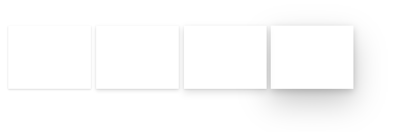

# Elevation control

A control used to construct cards and flyouts.

## Description

Fluent UI elevation support with mouse hover events.

[View component in the Creator Kit GitHub repository](https://github.com/microsoft/powercat-creator-kit/tree/main/CreatorKitCore/SolutionPackage/Controls/cat_PowerCAT.Elevation)

## Limitations
This PCF component can only be used in Canvas apps and Custom Pages.

## Key properties

| Property | Description |
| -------- | ----------- |
| Fill color | Background color of the elevation control. |
| Depth | Depth of the shadow. |

## Additional properties

| Property | Description |
| -------- | ----------- |
| Hover fill color | Background color of the elevation control while hovering. |
| Hover depth | Depth of the shadow while hovering. |
| Padding | Distance between the elevation card and the edge of the control (in each direction: left, right, top, and bottom). |
| Dark overlay padding | Enable for a dark overlay effect in the padded area. |

## Best Practices
Refer to [Fluent UI Elevation control best practices](https://developer.microsoft.com/fluentui#/styles/web/elevation)

[!INCLUDE[footer-include](../../includes/footer-banner.md)]