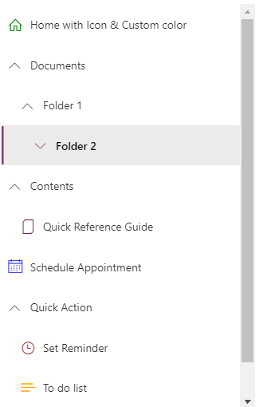

# Nav control

A control used to provide navigation.



## Description
A navigation pane (Nav) provides links to the main areas of an app or site.

The Nav code component allows using of the [Fluent UI Nav menu component](https://developer.microsoft.com/en-us/fluentui#/controls/web/nav) from inside canvas apps and custom pages.

## Limitations
This PCF component can only be used in Canvas apps and Custom Pages.

## Key properties

| Property | Description |
| -------- | ----------- |
| Items | Required. The data source items table to render. |
| Fields | Required. The fields needed are indicated. |
| Columns | Required. Table mapping definition between the component column and the data source. Use this to map field names and define specific column behavior. |

## Additional properties

| Property | Description |
| -------- | ----------- |
| Selected key | The key that is selected by default |

## Items structure
Each item uses the below schema to visualize data in the component. 

| Name | Description |
| ------ | ----------- |
| ItemKey | Arbitrary unique string associated with the breadcrumb item. |
| ItemDisplayName | Text to display in the breadcrumb item. |
| ItemIconName | Name of the [Fluent UI icon](https://developer.microsoft.com/en-us/fluentui#/styles/web/icons) for the item |
| ItemIconColor | Color of the item icon |
| ItemExpanded | Whether the item is expanded by default, if there are children items |
| ItemVisible | Whether the item is rendered |
| ItemParentKey | ItemKey of the parent the item is nested under |

Example:

  ```powerapps-dot
Table(
    {
        ItemKey: "1",
        ItemDisplayName: "Home with Icon & Custom color",
        ItemIconName: "Home",
        ItemIconColor: "Green"
    },
    {
        ItemKey: "2",
        ItemDisplayName: "Documents",
        ItemExpanded: true
    },
    {
        ItemKey: "3",
        ItemDisplayName: "Contents"
    },
    {
        ItemKey: "4",
        ItemDisplayName: "Item Invisible",
        ItemVisible: false
    },
    {
        ItemKey: "5",
        ItemDisplayName: "Quick Reference Guide",
        ItemParentKey: "3",
        ItemIconName: "Document"
    },
    {
        ItemKey: "6",
        ItemDisplayName: "Folder 1",
        ItemParentKey: "2",
        isExpanded: false
    },
    {
        ItemKey: "7",
        ItemDisplayName: "Folder 2",
        ItemParentKey: "6"
    },
    {
        ItemKey: "8",
        ItemDisplayName: "Folder 3",
        ItemParentKey: "7"
    },
    {
        ItemKey: "9",
        ItemDisplayName: "Folder 4",
        ItemParentKey: "8"
    },
    {
        ItemKey: "10",
        ItemDisplayName: "File 6",
        ItemParentKey: "9",
        ItemIconName: "DocumentSet",
        ItemIconColor: "Purple"
    },
    {
        ItemKey: "11",
        ItemDisplayName: "Schedule Appointment",
        ItemIconName: "Calendar",
        ItemIconColor: "Blue"
    },
    {
        ItemKey: "12",
        ItemDisplayName: "Quick Action"
    },
    {
        ItemKey: "13",
        ItemDisplayName: "Set Reminder",
        ItemParentKey: "12",
        ItemIconName: "Clock",
        ItemIconColor: "Brown"
    },
    {
        ItemKey: "14",
        ItemDisplayName: "To do list",
        ItemParentKey: "12",
        ItemIconName: "List",
        ItemIconColor: "Orange"
    }
)
  ```

## Configure 'On Select' behavior
Use the [**Switch()**](https://docs.microsoft.com/en-us/power-apps/maker/canvas-apps/functions/function-if) formula in the component's `OnSelect` property to configure specific actions for each item by referring to the control's selected `ItemKey` as the switch value.

Replace the `false` values with appropriate expressions in the Power Fx language.

  ```powerapps-dot
    Switch( Self.Selected.ItemKey,

      /* Action for ItemKey 1 */
      "1", false,

      /* Action for ItemKey 2 */
      "2", false,

      /* Action for ItemKey 3 */
      "3", false,

      /* Action for ItemKey 4 */
      "4", false,

      /* Action for ItemKey 5 */
      "5", false,

      /* Default action */
          false
    )
  ```

## Best Practices
Refer to [Fluent UI Nav control best practices](https://developer.microsoft.com/en-us/fluentui#/controls/web/nav)

[!INCLUDE[footer-include](../../includes/footer-banner.md)]