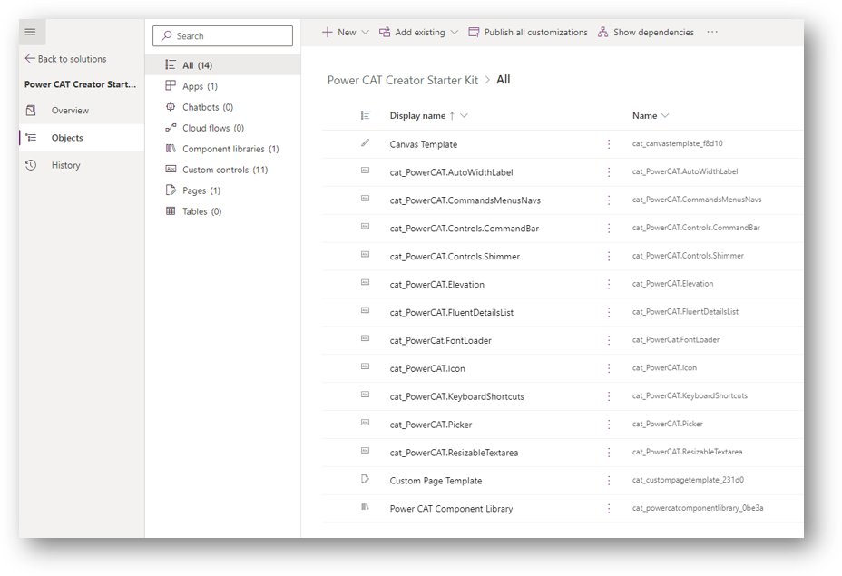

# Creator Kit overview

This toolkit helps create well-designed Power App experiences on the web & mobile. It contains a component library; [PCF controls](https://docs.microsoft.com/en-us/power-apps/developer/component-framework/overview) and other utilities that increase developer productivity. All components utilize the [Fluent UI](https://developer.microsoft.com/en-us/fluentui#/) framework to provide consistent and industry-leading user interface design to create optimal user experiences for your custom business applications.

> [!div class="nextstepaction"]
> [Download the Creator Kit](https://github.com/microsoft/powercat-creator-kit/releases/download/CreatorKit-May2022/PowerCATCreatorStarterKit_1_0_20220506_1_managed.zip)

You can view the code in the latest version of the Creator Kit in the [GitHub repository](https://aka.ms/CreatorKitRepo).

   

## Disclaimer

Although the underlying features and components used to build the kit (such as Canvas Components and Power Apps Component Framework) are fully supported, the kit itself represents sample implementations of these features. Our customers and community can use and customize these features to create Power Apps in their organizations.

If you face issues with:

- **Using the kit**: Report your issue at [aka.ms/Creator-Kit-Issues](https://aka.ms/Creator-Kit-Issues). (Microsoft Support won't help you with issues related to this kit, but they will help with related, underlying platform and feature issues.)
- **The core features in Microsoft Power Platform**: Use your standard channel to contact Support.

## More resources

- Explore the [Fluent UI documentation](https://developer.microsoft.com/en-us/fluentui#/).

- Find training resources, including guided learning and step-by-step guides, at [aka.ms/PowerPlatformLabs](https://aka.ms/powerplatformlabs).

- Read up on customer success stories and find resources relevant to your experience, technical background, and skill level at [aka.ms/PowerPlatformResources](https://aka.ms/powerplatformresources).

- Get started with the Microsoft Power Platform path on Microsoft Learn, a free online and interactive training platform [aka.ms/PowerUp](/learn/paths/create-powerapps/?WT.mc_id=twitter-social-donasa).

> [!div class="nextstepaction"]
> [Next step: Install the kit](setup.md)

[!INCLUDE[footer-include](../../includes/footer-banner.md)]