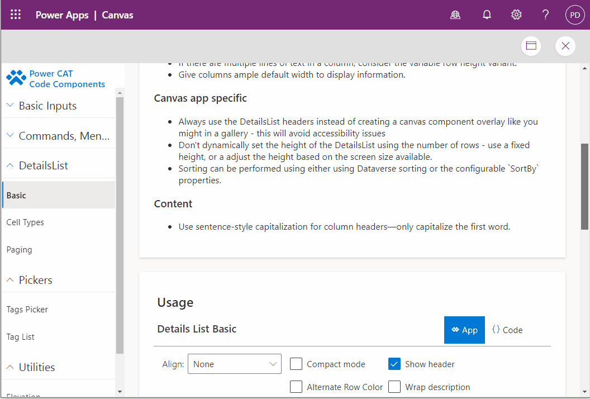
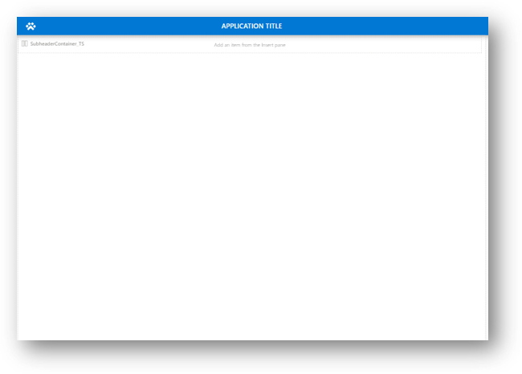

# Creator Kit overview

This toolkit help creating Power App experiences on the web & mobile . It includes a component library; PCF controls and other utilities aimed at increasing app-makers productivity and brings a fluent design theming across all of the components. 
 
You can download the most recently updated assets from the [GitHub repository](https://aka.ms/CreatorKitRepo).

   

## Disclaimer

Although the underlying features and components used to build the kit (such as Canvas Components and Power Apps Component Framework) are fully supported, the kit itself represents sample implementations of these features. Our customers and community can use and customize these features to create Power Apps in their organizations.

If you face issues with:

- **Using the kit**: Report your issue at [aka.ms/powercat-creator-kit-issues](https://aka.ms/coe-starter-kit-issues). (Microsoft Support won't help you with issues related to this kit, but they will help with related, underlying platform and feature issues.)
- **The core features in Microsoft Power Platform**: Use your standard channel to contact Support.

## Purpose of this document

The Creator Kit is targeted toward the advanced makers. The goal of this guidance is to help you understand what the motivation for using the Creator Kit, in addition to walking you through the prerequisites, setup instructions, and individual components of the Creator Kit.

## How to get started

After you've [installed the Creator Kit solution](setup.md), get familiar with the resources in your tenant.

> [!NOTE]
> The following are just examples of what you can do with the components in the Creator Kit. Explore the rest of the guidance here to see what's available and how to make the most of the kit.

1. Open the code components guidance app, and familiarize yourself with the components available in the Creator Kit and their usage.

    

1. Use the Canvas template app as a starting point for your new apps. The template has a responsive layout and sample controls for easy use within your app

    

1. Explore the Reference app to see how the components work  

    

## Further resources

- Explore the [Fluent UI documentation](https://developer.microsoft.com/en-us/fluentui#/).

- Find training resources, including guided learning and step-by-step guides, at [aka.ms/PowerPlatformLabs](https://aka.ms/powerplatformlabs).

- Read up on customer success stories and find resources relevant to your experience, technical background, and skill level at [aka.ms/PowerPlatformResources](https://aka.ms/powerplatformresources).

- Get started with the Microsoft Power Platform path on Microsoft Learn, a free online and interactive training platform [aka.ms/PowerUp](/learn/paths/create-powerapps/?WT.mc_id=twitter-social-donasa).

[!INCLUDE[footer-include](../../includes/footer-banner.md)]