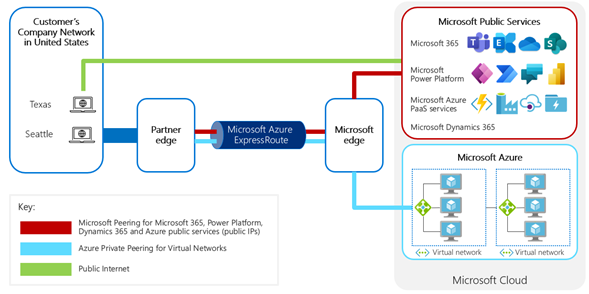

# Benefits of using ExpressRoute with Microsoft Power Platform

The benefits of using ExpressRoute for your organization are:

-   Compliance: Not routing customer information via the public Internet

-   Predictability: Dedicated connection avoiding conflict with other Internet
    traffic

## Compliance

Routing the traffic to Microsoft Power Platform through a private connection avoids routing of
sensitive data over the public Internet.

Some customers need to show for regulatory purposes that data is never passed
through the public Internet. In these situations, utilizing standard connections
via the public Internet to cloud services may not be acceptable.

This is rare, however; most regulations do not specify that the Internet cannot
be used, but rather that the data must be protected in transit, typically by
encryption at the level of 256-bit AES encryption, which the SSL encryption used
by Power Platform meets.

### GDPR

One of the regulations that may make ExpressRoute the right choice for your
organization is the General Data Protection Regulation (GDPR). GDPR is a
complex regulation that might require significant changes in how you gather, use, and manage data. Microsoft has a long history of helping our customers comply
with complex regulations, and when it comes to preparing for the GDPR, we are
your partner on this journey.

One of the reasons on why you may consider ExpressRoute for GDPR compliance is
to show clearly that all network activities are under the private connection,
which should streamline the process of attesting that data is not being exposed
to public internet and is protected. You should however note that it does not
mean ExpressRoute is the only way to be compliant with GDPR, and using the
public internet with correct security and protection measures will still make it
compliant as well.

More information: [GDPR
Overview](https://www.microsoft.com/trust-center/privacy/gdpr-overview)

## Network traffic predictability

The Internet connection of most organizations is shared by many uses. This can
lead to contention for bandwidth. The connection within the Internet provider
may also suffer from contention from other customers.

ExpressRoute can establish a private and direct connection to the Microsoft data
centers. Providing a connection directly through to the Microsoft’s data centers
minimizes the chances of any contention with other traffic either from the same
organization or any other organization.

If the main issue is just within the bandwidth available, internal routing
through the ExpressRoute connectivity provider, or traffic in the connection
between the customer and the connectivity provider, this can be resolved
through either higher bandwidth and more reliable or better optimized
connections without the need for ExpressRoute.

These would in fact be prerequisites to ExpressRoute anyway, so if the problem
can be resolved directly through better Internet connections then ExpressRoute
may not provide more value.

> [!div class="nextstepaction"]
> [Next step: Understand how ExpressRoute works](how-expressroute-works.md)
