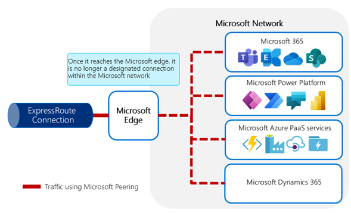
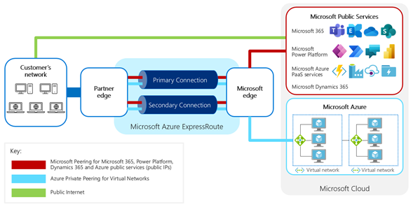
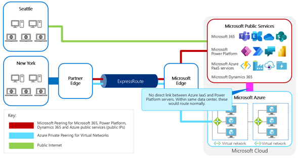

# How ExpressRoute works with Microsoft Power Platform

To understand how ExpressRoute works with Microsoft Power Platform, you need to
know the basics of how ExpressRoute works first.

An ExpressRoute circuit represents a logical connection between your on-premises
infrastructure and Microsoft cloud services through a connectivity provider. You
can order multiple ExpressRoute circuits. Each circuit can be in the same or
different regions and can be connected to your premises through different
connectivity providers.

Connectivity providers are a set of partners who help you set up ExpressRoute so
that your on-premises infrastructure and Microsoft cloud can be connected. For the
complete list of ExpressRoute connectivity partners, go to [ExpressRoute connectivity providers](/azure/expressroute/expressroute-locations#partners). The availability of these providers will depend on the location you choose
to connect from.

An ExpressRoute circuit can offer performance advantages because a dedicated and
optimized connection is set up directly through the ExpressRoute connectivity
provider's infrastructure to the edge of the Microsoft network. This connection
can be optimized without ExpressRoute, but because internet connectivity is typically
provided through a series of partnerships and relationships among
telecommunications providers, your network traffic might be routed through suboptimal connectivity paths
to its destination.<!--note from editor: Edit okay? I wasn't sure who this was addressed to. -->

When you agree with a connectivity provider to set up a dedicated and private connection, it helps ensure that the provider will take direct responsibility to set up an optimized connection to the Microsoft network.
This sense of ownership often leads to an optimized experience.<!--note from editor: Suggested.-->

Each circuit has fixed bandwidth; the bandwidth limitation is dependent on
[which plan you choose](https://azure.microsoft.com/pricing/details/expressroute/). This circuit
is mapped to a connectivity provider and a peering location. The available
bandwidth is shared across the peerings for the circuit. A circuit can have up
to two separate peerings. These peerings represent the different routings used,
depending on which kind of service is being requested:

-   **Microsoft peering** routes requests to Microsoft public services such as
    Microsoft 365, Dynamics 365, or Microsoft Power Platform services.

-   **Private peering** routes requests to the customer's private Azure
    services, for example, Azure Virtual Machines.<!--note from editor: I assume this refers to the Virtual Machines service? If it refers to instances of VMs created with the service, it should be lowercase. -->

Each peering is a pair of independent Border Gateway Protocol (BGP) sessions,
each configured redundantly for high availability. To ensure true resilience,
it's important to ensure that these sessions<!--note from editor: Edit okay?--> transit over physically different
connections.

Microsoft advertises the IP subnets or prefixes of the cloud services to the
public internet. Microsoft also advertises the IP prefixes for the relevant
services through the ExpressRoute BGP connection for the services specified in
the peerings defined for that circuit.

:::image type="complex" source="media/traffic-route-onprem-to-cloud.png" alt-text="Diagram of network traffic routed from on-premises to Microsoft online services via ExpressRoute.":::
   Internal router configuration traffic for Microsoft online services to the ExpressRoute connected subnet. Router configuration routes traffic via the BGP session through the ExpressRoute circuit. After traffic reaches the Microsoft edge, the internal routing configuration routes traffic to the appropriate service.
:::image-end:::

For traffic to Microsoft, the internal routing configuration within the customer
network needs to set up&mdash;and is responsible for&mdash;the following:<!--note from editor: Edit okay?-->

-   Prioritizing the route for Microsoft online services<!--note from editor: I think lowercase (which you use the majority of the time) is better here. The title case seems better in a licensing context, but not when referring to a collection of products.--> traffic via the subnet
    connected to ExpressRoute, as opposed to the public internet
    connection

-   Routing the Microsoft online services traffic from the connected subnet
    through the BGP session established through ExpressRoute

At the other side, Microsoft is then responsible for routing the traffic to the
appropriate service within the Microsoft datacenter.

The requirements for traffic routed from Microsoft online services to an external service are shown in the following image.

:::image type="complex" source="media/traffic-route-msol-external.png" alt-text="Diagram of network traffic routed from Microsoft online services to an external service.":::
   Requests to external services are looked up against DNS. If the IP address is registered against an ExpressRoute circuit, it's routed internally. Traffic to the IP address registered against ExpressRoute, routed over the BGP session through the customer private circuit, goes to the ExpressRoute connection. The router configuration routes traffic internally as appropriate, either by using public IP or network address translation (NAT) IP. Lastly, the connection is made to the internal service.
:::image-end:::

When the request is made:

-   It must be made through a public URL, which must first be resolved to a
    public IP address.

-   If the IP address is registered against an ExpressRoute peering, the traffic
    will be routed internally to be sent via the appropriate ExpressRoute
    circuit.

-   If the IP address isn't registered<!--note from editor: Edit okay?-->, the routing configuration within the online service will route the
    traffic out to the public internet.

-   After the traffic arrives at the customer network, internal routing within
    the customer network is responsible for routing it to the final
    destination, either through direct routing of the IP address or through network address translation (NAT) first.

You must connect to Microsoft cloud services only from a subnet that uses public
IP addresses that are owned by you or your ExpressRoute connectivity provider.
If you're using private IP addresses in your on-premises network, you or your
provider need to translate the private IP addresses to the public IP addresses,
by using NAT, before connecting to ExpressRoute. This enables requests from
Microsoft services to resolve to the service endpoint and route through the
network across shared network segments.

## ExpressRoute peering

One critical factor to consider is that ExpressRoute doesn't currently allow
you to directly configure specific services to be transported across the
ExpressRoute circuit; rather; it allows you to enable groups of services&mdash;called *peerings*&mdash;to be transported.<!--note from editor: Is this what you mean by enabling groups of services?-->

There are two types of ExpressRoute peerings: Microsoft and private.

### Microsoft peering

Configuring ExpressRoute for Microsoft Power Platform services requires Microsoft peering,
which by default will jointly route both Microsoft Power Platform services and Microsoft
365 via ExpressRoute. This means that the traffic will be routed to go to public IP address ranges that are
used by these services.

It's possible to use BGP communities to configure the
network to route traffic only for certain services, such as only Microsoft Teams
or only SharePoint Online services, through an ExpressRoute Microsoft peering
circuit. This is currently not supported for Microsoft Power Platform; alternatives are
explained here.<!--note from editor: Where is "here"? Should this be "in the following section"?-->

Connectivity to Microsoft online services&mdash;such as Microsoft 365 and Microsoft Power
Platform services&mdash;will be routed through Microsoft peering. Microsoft
assigns the URLs and IP addresses for Microsoft Power Platform, Dynamics 365 customer engagement
applications, and Microsoft 365 services to the Microsoft peering, so any traffic
routed to them will be advertised and enabled through the Microsoft peering.
Unlike Microsoft 365, Microsoft Power Platform doesn't have designated BGP
communities. (BGP communities are covered here<!--note from editor: It looks like this is a dropped link?-->.)
<!--note from editor: For notes about this image, please see the editor's note in overview.md, line 20. The alt text is good here.-->

Using Microsoft peering, connections go to shared services at Microsoft. This means that
after a connection arrives at the Microsoft datacenter, the ongoing connection traverses<!--note from editor: Edits okay? Microsoft Writing Style Guide discourages the use of a "weak" verbs like "is" and "are."  -->
an internal shared network; the private connection provided by ExpressRoute doesn't extend all the way to the destination service endpoint itself.

### Private peering
<!--note from editor: Are the uses of "you" okay in this section? I got a bit confused about who was the audience.-->
Private peering is used for your private Azure infrastructure as a service (IaaS) services, and not
directly used by Microsoft Power Platform services. This type of peering typically connects to private IP addresses in an Azure
virtual network.
<!--note from editor: For notes about this image, please see the editor's note in overview.md, line 20. Alt text could be better.-->

For Microsoft Power Platform, Microsoft doesn't use private services that you can access directly, so it isn't necessary to configure private peering for ExpressRoute. If you
separately uses Azure private services, configuring private peering won't be
harmful unless the introduction of additional workloads causes the connection
to be saturated.<!--note from editor: Edit okay?  -->

### ExpressRoute controls traffic to the Microsoft network, not within it

When connections are made to a private Azure resource&mdash;such as an Azure virtual machine&mdash;ExpressRoute links the connection you made directly to your private Azure resources.

For Microsoft peering, ExpressRoute is a dedicated connection between your
network and the edge of the Microsoft network. It isn't a dedicated
connection all the way to your specific Microsoft Power Platform environment. After the traffic reaches the Microsoft network and is identified
through the peering rules as targeting a public resource&mdash;either Azure or a
Microsoft service like Microsoft 365 or Microsoft Power Platform&mdash;the end target is a
shared service so the network connection to it is also shared within the
Microsoft network.<!--note from editor: As above, edits assume the "customer" is actually the audience here.-->

Traffic between services in Microsoft datacenters is routed within the
Microsoft network rather than via the public internet.
<!--note from editor: For notes about this image, please see the editor's note in overview.md, line 20. The alt text here is good.-->

> [!div class="nextstepaction"]
> [Next step: Things to consider before using ExpressRoute](things-to-consider.md)
