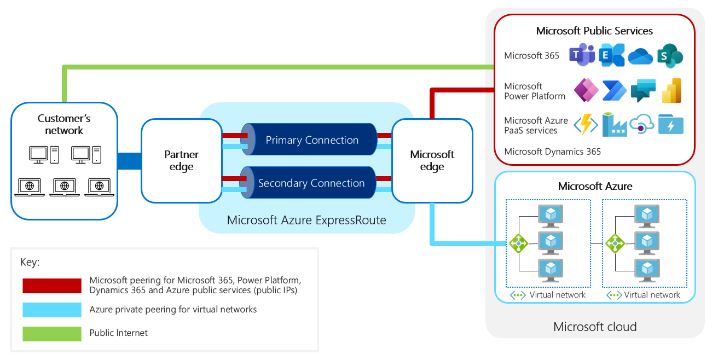

# Use Azure ExpressRoute with Microsoft Power Platform

[Microsoft Azure ExpressRoute](https://azure.microsoft.com/services/expressroute/) provides a way to connect your on-premises network
to Microsoft cloud services using private connectivity.

Although the name of the service is Azure ExpressRoute, it also supports private
connectivity to services built on top of Microsoft Azure, such as Microsoft 365,
Microsoft Power Platform, and Microsoft Dynamics 365.

ExpressRoute is a valuable technology, particularly when used with Azure IaaS,
but its deployment should not be undertaken lightly, particularly for use with
Microosft Power Platform and Microsoft 365 services. It should be considered for these
only after a comprehensive review of the business justification and planned
configuration of its use.

This document focuses on planning and configuring ExpressRoute
for use with Microsoft Power Platform.

More information: [Introduction to Azure
ExpressRoute](/azure/expressroute/expressroute-introduction)

Typically, an organization will look into ExpressRoute if they have one or more
of the following concerns:

-   Making sure their network or Internet connection can handle the additional
    traffic of a rich business application

-   Managing the predictability of the traffic supporting mission-critical
    applications—as opposed to other less critical Internet traffic—to ensure
    performance for the user and the business

-   Ensuring compliance with a regulatory need for data to never transit across
    the public Internet

Using ExpressRoute can address these concerns, but it’s important to understand
what ExpressRoute does and doesn't do so that you can accurately judge the
value for the situation.

> [!div class="nextstepaction"]
> [Next step: Understand the benefits of using ExpressRoute](benefits.md)
