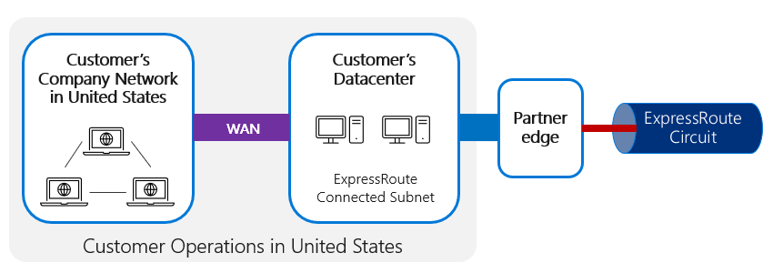
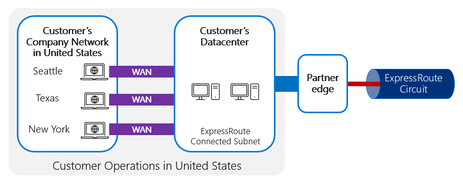
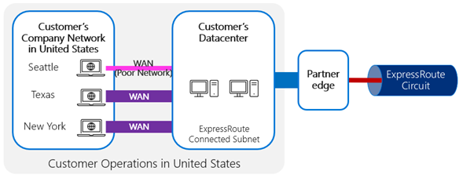
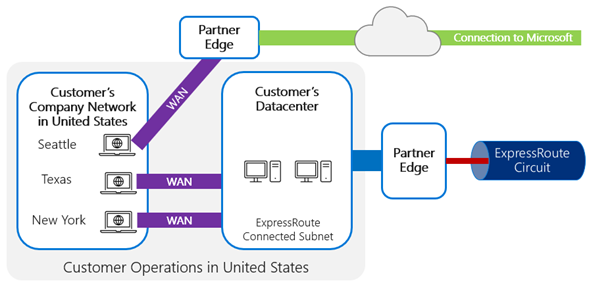
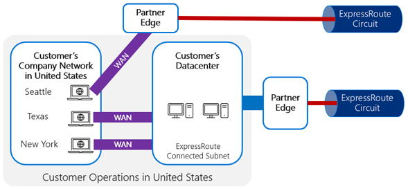
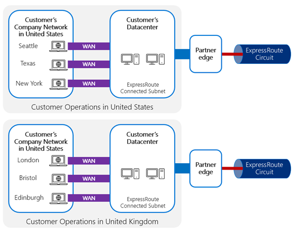
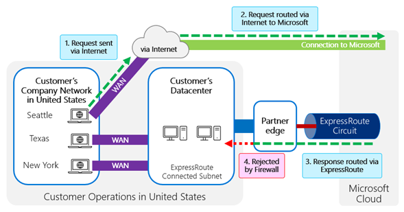
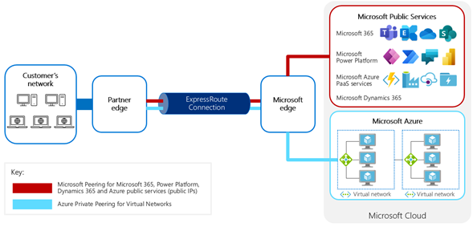
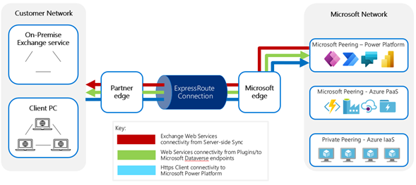

# Planning an ExpressRoute deployment for use with Power Platform

Now that you have decided to use ExpressRoute for Power Platform, it is
important to plan the deployment to allow for the customer’s needs and
environment.

## Pre-requisites for ExpressRoute

Setting up ExpressRoute requires several pre-requisites to be considered and set
up. These can lead to unexpected costs and activities, which if not pre-planned
can impact the project as well as the continuing operation of other services.

### External pre-requisites

ExpressRoute does not provide the physical connection itself; it provides the
private connectivity over an already established physical connection. The
physical connectivity must first be set up by a connectivity provider. There are
several ways this connectivity can be established with existing ExpressRoute
partners. The ExpressRoute documentation gives detailed explanations of the
options and the [currently available
partners](https://docs.microsoft.com/azure/expressroute/expressroute-locations#global-commercial-azure).

As part of planning, the following need to be allowed for:

**Geography**

-   As we will discuss in more detail later, understanding geographically where
    one or more connections need to be made from will impact on the overall
    planning.

**Cost**

-   The Connectivity provider will charge the customer for establishing the
    private connection.

-   This can be a significant cost and will vary depending on the type and
    number of connections needed.

**Setup time**

-   With the need in some cases for physical hardware setup, the setup time for
    this needs to be planned into implementation schedules.

**Configuration skills / resources**

-   The majority of the configuration complexity will be in setting up the
    internal network routing within the customer network. Ensuring availability
    of skilled people to do this is essential.

### Microsoft pre-requisites

Once the physical connectivity is in place, you can proceed to setting up the
Microsoft ExpressRoute connections themselves. This will require:

-   An Azure subscription within which to provision and bill the ExpressRoute
    circuits

-   Configuration within the Azure subscription of the ExpressRoute circuits,
    which is done through the Azure tools

## Planning the routing configuration for Power Platform traffic across ExpressRoute

When planning for routing Power Platform traffic, there are various types of
traffic depending on the use and configuration of Power Platform for a given
customer.

To understand how to configure ExpressRoute for Power Platform, the different
uses and connections to and from Power Platform need to be considered. This will
vary based on the Power Platform services and the specific features or
capabilities being used by that customer.

### Routing configuration

The routing configuration is done either by the connectivity provider or the
customer, depending on the connection type provided.

Although the ExpressRoute connection itself is between datacenters, the actual
network connection is mostly from the end-user client devices (which will often
be distributed across a broader WAN, for example distributed bank branches).
This means connections route from the location of the client device through the
WAN to the data center and then across the ExpressRoute. This requires careful
configuration. The WAN must be set up in such a way that:

1.  The route via the network subnet is configured for ExpressRoute,

2.  Or the failover circuit must be chosen in preference to the public Internet
    connection to Power Platform.

Therefore, identifying which subnets within the customer network should be the
targets for the main and fallback BGP session connections are important to make
sure that the Power Platform prefixes prefer that route. It is not necessary to
specifically configure the services at each end, as this configuration is done
by advertising the IP subnets/prefixes through this connection. When a request
is initiated, the routing algorithm would see that direct BGP connection as the
preferred route for traffic to the subnet connected to the ExpressRoute circuit
and direct the traffic that way.

#### Configuring ExpressRoute for distributed user bases

ExpressRoute is designed to provide private, dedicated and therefore predictable
connections from a customer’s environment to the Microsoft network. Having a
dedicated and direct connection through the connectivity provider to Microsoft
will reduce the potential for contention from other traffic on shared
connections through the connectivity provider’s network. It should not be
necessary to utilize ExpressRoute to achieve that quality of connection through
a connectivity provider, but is a way to ensure it.

In the following example, a user in a branch location would have their
connection routed via the WAN to the customer datacenter connection to
ExpressRoute.

Where a customer has a highly distributed network of users, such as a branch
network of offices distributed around a country, the network traffic now needs
to be connected efficiently from multiple, highly geographically distributed
locations. The typical pattern for this then would be to route things through
the WAN to the local network connected to ExpressRoute as the following diagram
shows:

If the connection between the client and ExpressRoute is too poor or is
saturated or inefficient in some other way, ExpressRoute won’t solve this, as
the connection problems in getting to the ExpressRoute entry point would still
impact the user experience. You should consider using ExpressRoute Direct, which
gives you the ability to connect directly into Microsoft’s global network.

When connecting to cloud services and being constrained by challenges in the WAN
connections, establishing local Internet breakouts from local branches can often
be very beneficial to performance, avoiding the slower WAN connection and
utilizing the reach of the connectivity provider to achieve a more direct
connection to the cloud service.

It’s possible to set up ExpressRoute circuits from multiple locations and even
out to

individual branch locations through a local Internet breakout as shown in the
following diagram:

The WAN approach from branch locations to a central datacenter and ExpressRoute
circuits between the customer and Microsoft datacenters is typically preferable
and more practical than trying to establish an ExpressRoute connection from each
branch office location, which is both relatively expensive and complicated to
set up and maintain if this was required in many locations.

An alternative approach is to connect all the branch offices and customer data
center on the same IP VPN and have the IP VPN service provider connect to
Microsoft at an ExpressRoute location.

If there are challenges with a local WAN connection, then it’s typically better
to optimize that, such as gaining additional bandwidth or optimizing the
routing, rather than trying to establish an ExpressRoute connection from each
location.

For more-physically-distributed networks, it may be valuable to have several
hubs connected to ExpressRoute to minimize the number of ExpressRoute
connections needed while still offering a more local connection point for each
user. In this case it’s important to ensure that unique public IPs are published
via each ExpressRoute circuit; each of these subnets must be distinct, which
requires as many publicly-facing subnets as ExpressRoute connections.

This is particularly beneficial if the different operational areas are in vastly
different geographic areas or if the network connectivity between the areas is
limited and a more direct connection to Microsoft can be established for each.

It’s also possible that different regions have different privacy requirements,
and it’s not necessary for every region to use ExpressRoute simply because one
does. It may be possible for some connections to be routed directly through the
Internet and others through ExpressRoute:

ExpressRoute (standard) offers connectivity only within a specific geographic
region; ExpressRoute Premium is required to offer multi-geo access from a single
ExpressRoute connection point. This would be relevant if, for example, a
customer had US-based offices as well as European offices, all using a single
Power Platform environment. If the customer’s Power Platform tenant is deployed
in the US, their ExpressRoute circuit in Europe needs to be the Premium SKU. If
their Power Platform tenant is in Europe, their US circuit would need to be
Premium.

#### Avoiding asymmetric routing

One challenge to watch for is asymmetric routing, where routing configuration
within the customer network routes traffic to the Microsoft datacenter directly
across the Internet but then the return traffic determines that the responses
should be routed via an ExpressRoute circuit. This can often trigger firewalls
to reject the traffic, as it would receive response packets without having sent
the request packets.

This can happen if the local network for a client determines that the most
efficient routing to Microsoft cloud services is across the public Internet
rather than through the WAN to the private ExpressRoute circuit. But if in that
case the client IP address is either a public IP address or is translated
through NAT mappings to a public IP address that is advertised through
ExpressRoute, the most efficient route back to that IP would likely be through
the BGP session over ExpressRoute. A customer can use different NAT IPs on the
customer’s Internet edge and ExpressRoute edge. With distinct source address,
return traffic will unambiguously come back to the same edge.

This can also happen where there are multiple ExpressRoute circuits configured
for the same customer with outbound traffic routing via one circuit but return
routing through another where firewall checks could block traffic through the
return path. To avoid asymmetric routing across a different ExpressRoute circuit
for the outbound and inbound paths, it is important to ensure that unique public
IPs are published across each circuit.

As you can see, it is important to determine how the routing is managed within
the customer’s WAN and ensure that the paths to and from Microsoft cloud
services are carefully considered.

### External connectivity to/from Power Platform

When making connections to Power Platform from customer locations there are
multiple traffic types to be considered. This may lead to both peering types,
including Microsoft and Private Peering, but the same ExpressRoute circuit can
be used including these different peering types:

The following different connection types exist between Power Platform services
and an external network.

Description Traffic Type and

*Outbound Traffic (Traffic from Power Platform services)*

The following types of outbound traffic can occur directly from Power Platform
services to customer services.

For each of these it is important to note that the customer service must be
publicly addressable with a public IP that can be resolved through public DNS by
the Power Platform services.

This IP address would also need to be advertised to Microsoft through
ExpressRoute so that the internal network routing within Power Platform services
knows to route it via that ExpressRoute connection.

Power Platform services can't specify which service instance or customer
organization can make requests to which IP addresses. It is important therefore
to treat requests inbound to the corporate network as if they were from the
Internet and secure them as such.

| Description                       | Traffic Type and Direction                  | Peering Type                                                                                                                     | Purpose                                                                                                                                |
|-----------------------------------|---------------------------------------------|----------------------------------------------------------------------------------------------------------------------------------|----------------------------------------------------------------------------------------------------------------------------------------|
| Web Services                      | Https Outbound from Power Platform services | Microsoft Peering  Publish web services on public IP addresses that are within ExpressRoute configured subnets                   | Custom plug ins/ workflow activities can make web service requests to external services                                                |
| Exchange Integration: hybrid mode | Https Outbound from Power Platform services | Microsoft Peering Web services would need to be published on public IP addresses that are within ExpressRoute configured subnets | Exchange Web Services requests from Server Side Synchronization for Hybrid deployments (Power Platform services, Exchange On-Premises) |
| Connectors                        | Https Inbound from Power Platform services  | Microsoft Peering                                                                                                                | Requests from Power Platform services through the APIMs via Connectors using On-premises data gateway                                  |

*Inbound Traffic (Traffic to Power Platform services)*

The following inbound traffic is possible to Power Platform services from the
customer network.

| Description         | Traffic Type and Direction               | Peering Type                                                                         | Purpose                                                                                                                               |
|---------------------|------------------------------------------|--------------------------------------------------------------------------------------|---------------------------------------------------------------------------------------------------------------------------------------|
| Client Connectivity | Https Inbound to Power Platform services | Microsoft Peering  Direct Internet connection for static content served by Azure CDN | Client requests for Power Platform services UI                                                                                        |
| Web Services        | Https Inbound to Power Platform services | Microsoft Peering                                                                    | Requests to Power Platform services through the web service APIs (SOAP, Web API). Either from a standard or custom client application |
| Connectors          | Https Inbound to Power Platform services | Microsoft Peering                                                                    | Responses back to Power Platform services through the APIMs via Connectors using On-premises data gateway                             |

### Internal Cloud connectivity within Power Platform services

Power Platform services use and integrate with several other Microsoft online
services hosted both in Microsoft 365 and Azure.

| Description            | Traffic Type and Direction                     | Purpose                                                                                                                                                                                             |
|------------------------|------------------------------------------------|-----------------------------------------------------------------------------------------------------------------------------------------------------------------------------------------------------|
| Exchange Integration   | Https Outbound to Microsoft 365                | Exchange Web Service Requests to Exchange Online from Server-Side Synchronization                                                                                                                   |
| SharePoint Integration | Https Outbound to Microsoft 365                | SharePoint Web Service Requests to SharePoint Online from Power Platform services                                                                                                                   |
| Service Bus            | Https Outbound to Azure Service Bus            | Push events onto Azure Service Bus either as standard event registration or from custom plug ins/ workflow activities                                                                               |
| Data Sync              | Https Inbound from Azure PaaS                  | Inbound Change Tracking requests for synchronization of data services including Search/ Offline/Customer Insight                                                                                    |
| Authentication         | Https Outbound to Azure AD                     | Most authentication done as passive redirects and claims tokens. But some synchronization of data from Azure AD directly                                                                            |
| Dataflows              | Https Outbound to Azure Data Lake Storage Gen2 | Providing analytics capabilities and allow access to big data solutions incorporating data from both Power Platform services and other sources as well as the resulting insight from the analytics. |
| Connectors             | Https Outbound to Azure PaaS services          | Connections to various Azure PaaS services                                                                                                                                                          |

The actual connectivity between these services, hosted either in Microsoft or
customer Azure subscriptions, is handled by Microsoft. ExpressRoute is not
applicable for connections with these services.

Where events are pushed onto the service bus, the connectivity between Power
Platform services and Azure is handled internally. Separately the customer may
make requests to the Service Bus to retrieve information, and this can be
managed through public peering.

### Customer Public/ Private Cloud connectivity to/ from Power Platform services 

Power Platform services also allow direct integration with public or private
Azure resources:

-   From external sources using the Microsoft Dataverse web services APIs

-   To external sources using web service requests made

-   To external sources using Connectors

The implications of this need to be considered in the ExpressRoute routing.

| Description          | Traffic Type and Direction                       | Peering Type                                                                                                                                                                                    | Purpose                                                                                                                                                                                                                                                                       |
|----------------------|--------------------------------------------------|-------------------------------------------------------------------------------------------------------------------------------------------------------------------------------------------------|-------------------------------------------------------------------------------------------------------------------------------------------------------------------------------------------------------------------------------------------------------------------------------|
| Portals              | Https Inbound to Azure                           | Internal to datacenter, with the exception of static content, which utilizes Azure CDN. (Azure CDN is not supported by ExpressRoute, so static content will travel across the public Internet.) | Host public facing services. There may be scenarios where internal employees may access these resources, so may wish traffic to travel across ExpressRoute rather than public Internet                                                                                        |
| Learning Path        | Https Inbound to Azure                           | Utilizes Azure CDN which is not supported by ExpressRoute so will travel across public Internet                                                                                                 | This is hosted on a public facing service as it does not contain private customer data. For predictability purposes, there may be scenarios where it is desirable to route this via ExpressRoute                                                                              |
| Service Bus          | Https Inbound to Azure Service Bus               | Internal to Data Center                                                                                                                                                                         | Pull events from Azure Service Bus that have been placed there either as standard event registration or from custom plug-ins/ workflow activities                                                                                                                             |
| Web Service Requests | Inbound from Azure IaaS/PaaS                     | Internal to Data Center                                                                                                                                                                         | Customers can host custom applications in Azure and make requests of Power Platform web services                                                                                                                                                                              |
| Web Service Requests | Outbound to Azure IaaS/PaaS                      | Internal to Data Center                                                                                                                                                                         | Customers can implement custom plug ins/workflow activities that make requests of Azure hosted services                                                                                                                                                                       |
| Dataflows            | Data connections to Azure Data Lake Storage Gen2 | Internal to Data Center                                                                                                                                                                         | Providing analytics capabilities and allow access to big data solutions incorporating data from both Power Platform services and other sources as well as the resulting insight from the analytics.                                                                           |
| Azure Data Lake      | Data connections to Azure Data Lake Storage Gen2 | Internal to Data Center                                                                                                                                                                         | Providing analytics capabilities will allow access to big data solutions incorporating data from both Power Platform services and other sources as well as the resulting insight from the analytics.                                                                          |
| Azure SQL            | Data connections to Azure SQL services           | Internal to Data Center                                                                                                                                                                         | With capabilities such as Export to Data Warehouse, the use of an Azure SQL instance to hold replicas of Microsoft Dataverse data either for reporting or replication purposes will increase. It may be valuable to protect connections to these resources over ExpressRoute. |

There may be other public services in the future that also connect Internally to
Data Center as other Azure capabilities are utilized.

> [!div class="nextstepaction"]
> [Next step: Setting up ExpressRoute for Power Platform](setup.md)