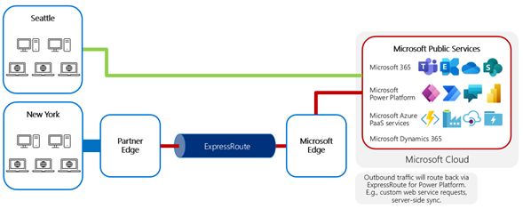
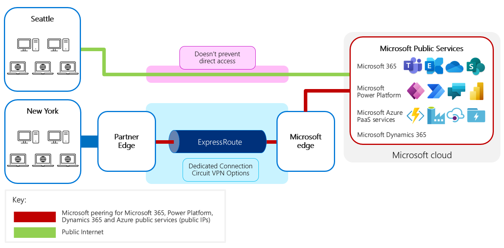
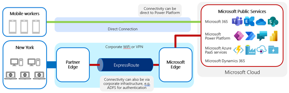

# Set up ExpressRoute for Microsoft Power Platform

Microsoft Power Platform itself doesn't need to be configured specifically for
ExpressRoute. Microsoft Power Platform as a service uses Microsoft Azure behind the scenes
and has been onboarded to support use with ExpressRoute. Therefore, you don't need to make any
specific configurations of the Microsoft Power Platform environments themselves
to specify that ExpressRoute is being used.

Within the Microsoft network, ExpressRoute handles traffic by advertising
routing for specific IP subnets to the specific ExpressRoute circuit against
which they've been configured. Because that routing is advertised across a Border Gateway Protocol (BGP)
connection, it's typically chosen as the most efficient connection to reach
that destination in preference to routing via the internet.

At the customer side, the BGP connection advertises the IP prefixes for the
services for each peering type configured for that ExpressRoute circuit.

Determining what further network configuration you need will depend on what
interactions you want to route via ExpressRoute.

## Server traffic

### Inbound traffic (traffic to Microsoft Power Platform services)

Configuring for inbound traffic will require establishing internal routing
within the datacenter to prefer connections through the ExpressRoute circuit
for traffic to Microsoft services.

### Outbound traffic (traffic from Microsoft Power Platform services)

Where traffic is routed back out through ExpressRoute, such as to an on-premises
server, there are no controls within ExpressRoute to lock down the services that
make connections. The routing is all done at the network level, and therefore
doesn't validate the particular service making the request before routing the
traffic.

Requests can be made from other services to a customer service. Particularly
for Microsoft Power Platform, which is a shared service, it isn't possible to
lock down the requests to a particular set of machines. It's necessary to
consider traffic back through ExpressRoute as coming from an external source,
because although it's coming from a Microsoft datacenter, Microsoft isn't
controlling the source of the requests; other customer services might attempt to make
connections. Any connections should be controlled as if they came from an
external gateway.

To be routed back through ExpressRoute, any service being connected to
must:

-   Have a publicly discoverable URL.

-   Have a public IP address that matches a subnet configured for an
    ExpressRoute circuit peering definition.

-   Be in the same region as the requesting service if ExpressRoute (standard) is
    used, or in any region if ExpressRoute Premium is used.

This approach is valuable for many common integration
scenarios between online and on-premises services.

The target IP address for outbound traffic from a Microsoft Power Platform resource will need
to be a public IP address that's advertised through an ExpressRoute circuit. Due to the shared nature of Microsoft cloud services, all
traffic should be treated as if it originated from the internet. So, typically, a reverse proxy or application
gateway should be used to inspect and control inbound traffic from ExpressRoute.

For information about the IP subnets that are used, go to [System requirements, limits, and configuration values for Power Apps](/powerapps/maker/canvas-apps/limits-and-config#ip-addresses) and [IP address configuration for Power Automate](/power-automate/ip-address-configuration#connectors).

## Client traffic

Users can use various client devices, such as PCs on the corporate network or
mobile devices on public connections. Client traffic will typically be inbound
to the Microsoft services rather than outbound back to the client. You should
note that ExpressRoute isn't enforced as the *only* route to Microsoft Power Platform.

If client traffic is to be routed across the ExpressRoute circuit, the challenge for your network team
is to route the traffic internally first from the client through the
LAN or WAN to the subnet connected to ExpressRoute. It's also your team's responsibility to ensure that this
traffic doesn't accidentally "leak out" and connect via the public internet.

Microsoft Power Platform doesn't block traffic that's received directly from the
internet. Neither will ExpressRoute block responses from traffic that was
originally received directly from the internet. Microsoft Power Platform service will
still be advertised publicly on the internet, so there will be routing paths to
the service available separately from ExpressRoute.

Correct traffic routing would typically be ensured through the use of proxies within
the corporate network and&mdash;for mobile devices&mdash;potentially the additional use of
VPN to connect back into the corporate network first, ensuring that traffic is
routed via the corporate ExpressRoute circuit. However, note that this could
incur overhead compared to directly accessing the cloud services through a local
internet breakout.

Therefore, while ExpressRoute can be configured for use connecting to and from Microsoft Power
Platform, it's important to realize that ExpressRoute:

-   Doesn't ensure that traffic from within the corporate network uses
    ExpressRoute. The proxy and routing rules within the corporate network
    determine this, and you must set them up to ensure that requests from within the corporate network
    use ExpressRoute.

-   Doesn't prevent other connections (for example, users on the internet) from going
    directly to Microsoft Power Platform.

The issue of external connectivity is a concern where mobile users
are involved, especially from mobile devices such as laptops, tablets, and
phones. Where this is a concern, you can choose from a number of approaches:

-   Where federated authentication is used, ensure that access to Active Directory Federation Services (AD FS) is only
    possible after a VPN connection to the corporate network is established.

-   Azure Active Directory conditional access and Intune can be used to control which
    devices and locations are allowed access, and to control the device
    configuration, such as proxies, VPN, and routing.

## Common questions and scenarios with ExpressRoute

When implementing ExpressRoute, it's as important to understand what it doesn't
do as what it does. In this section, we'll explore some common questions
and scenarios for you to consider.

### Configuration of customer network routing

Enabling ExpressRoute handles the configuration of network traffic within the
Microsoft network, but doesn't change the routing of traffic within the
customer network itself. You must configure the network routing within
your network to direct traffic bound for Microsoft cloud services to the subnet
connected to ExpressRoute and then across the ExpressRoute circuit.

We advertise more specific routes for Microsoft 365 over ExpressRoute than the
routes we advertise on the public internet. If a customer propagates the
specific routes from us to their network, their user traffic will be routed to
ExpressRoute because of the longest prefix matching rule.

Two key reasons you might run into challenges when configuring ExpressRoute are:

-   Your internal network routing to route traffic to the ExpressRoute
    connection point is incorrectly set up.

-   You have asymmetric routing, where request and response traffic is routed
    differently.

    For example, traffic is routed directly to Microsoft cloud services across
    the internet but then returns via ExpressRoute, triggering firewall
    exceptions that block the return traffic.

### Performance

ExpressRoute alone will typically not add significant advantages in performance
over an efficient network connection with available capacity. It's possible
that the process of establishing a dedicated and private connection by your
connectivity provider results in a more optimized connection than your shared
internet connection.

### Data load throughput to Microsoft Power Platform

When performing data loads to Microsoft Power Platform, the network is rarely
the bottleneck for data traffic. More likely it's the
application processing that needs to be optimized.

ExpressRoute, therefore, is rarely a direct contributor to higher throughput of
data load into Microsoft Power Platform. However, ExpressRoute will make the traffic
more predictable and ensure that data isn't sent over the public internet.

> [!div class="nextstepaction"]
> [Next step: ExpressRoute readiness checklist](checklist.md)