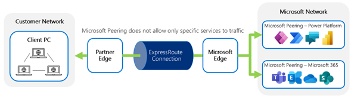

# Things to consider prior to using ExpressRoute for Power Platform

The complexity of setting up ExpressRoute is often underestimated; in particular
several actions and implications for the customer are often missed either in
planning or execution including:

-   Configuration of the customer network to route traffic to the subnet
    connected to ExpressRoute

-   Avoiding asymmetric routing of traffic directly to Power Platform across the
    Internet but returned by ExpressRoute to the corporate network, triggering
    firewall rejection of the traffic

-   The overall costs of provisioning ExpressRoute, including Microsoft Azure
    services, connectivity provider provisioning, and ongoing service and
    internal IT network routing configuration

-   Determining whether multiple ExpressRoute circuits should be established for
    distributed deployments

## Connectivity performance issues

### LAN connectivity

One of the common issues a user may experience is:

-   The connectivity within the local network is already saturated before
    including a rich browser application into the mix.

-   Microsoft Power Platform is replacing a thick client application where only
    the data was transmitted across the network, rather than both data and
    presentation information.

It’s important to understand that a browser application, while requiring less in
terms of client-side deployment administration, will require higher bandwidth
than a thick client application and therefore an already-saturated local network
will suffer further with the addition of new services.

### Poor WAN connectivity

On network analysis of connectivity to the online service, a common pattern
experienced is that at some point the network traffic traverses an internal
network route that adds significant latency. This can be because of conditions
such as:

-   Saturation of the WAN link

-   Proxy processing, incurring additional latency and overhead

-   Inefficient internal routing (e.g. routing within the corporate network
    rather than out to the Internet earlier)

If Power Platform traffic suffers from those challenges, then performance at the
client may also suffer.

### Poor Internet connectivity

Addition of cloud services may introduce additional consumption and load on the
corporate connection to the Internet. This can be caused if the Internet
connection:

-   Is not sufficient to cater for the additional load

-   Within the Internet provider’s network, the routing of that traffic to
    Microsoft’s network is controlled by them; the efficiency of that routing
    can vary

-   Suffers from a mix of traffic which impacts the quality of the connection
    (e.g. multiple Internet-based training, Microsoft Stream or YouTube videos
    with traffic to a business-critical application competing for the available
    bandwidth). This may be sufficient overall for the volume of traffic but
    potentially impacting performance through peaks of demand, which activity
    like video streaming will introduce.

These things can be addressed by getting additional bandwidth or separate
connections through the ISP. In particular, having a separate connection
dedicated to priority traffic can help with both the performance and
predictability of the traffic.

Also make sure to set up Quality of Service (QoS) correctly. If you are using
Microsoft Teams and Microsoft Stream, refer to the [QoS requirements within
ExpressRoute](https://docs.microsoft.com/en-us/azure/expressroute/expressroute-qos).

## Security control

The next configuration you need to consider is the security control.
ExpressRoute itself does not encrypt or filter traffic natively (with exception
of [ExpressRoute Direct with MACsec
enabled](https://docs.microsoft.com/azure/expressroute/expressroute-about-encryption));
it simply establishes a private, rather than shared, connection directly between
the Microsoft and customer data centers through their connectivity provider.

Any request from any Microsoft Online Service or Azure services to the subnet
advertised through an ExpressRoute circuit will be routed via that circuit
regardless of the service or customer. As the request is routed at the network
layer, there is no application-level control to determine whether that is an
appropriate requester for that destination service or not.

For traffic to Microsoft services, these are public shared services and can be
accessed directly across the public Internet. Access control to these services
is handled through application-level authentication and authorization services.
They are further protected at an infrastructure level against intrusion and
threats like Denial of Service attacks.

For traffic from Microsoft services to on-premises hosted services, the customer
is responsible for providing similar protection to their own services when
traffic is received across an ExpressRoute connection.

## Ability to restrict ExpressRoute use to only certain Microsoft services

One of the challenges faced by customers is wanting to use ExpressRoute for a
particular Microsoft cloud service but not for others. While the different
peering options provide some level of control here, the peering itself does not
provide granular control within services of the same peering type (for example
to enable routing only to Azure IaaS machines but not to Microsoft 365). It is
possible, though, to use BGP communities to configure traffic for specific
services only.

This is particularly relevant for Power Platform services with Microsoft 365
presence, where routing via ExpressRoute may be desirable for one service but
not for both or only for certain individual services of Microsoft 365 such as
Microsoft Teams.

ExpressRoute itself doesn’t currently offer the ability to directly configure
services to be routed via a specific ExpressRoute circuit at this level of
service granularity, but BGP communities can be used to control this.

Microsoft advertises routes in the Microsoft peering paths with routes tagged
with appropriate BGP community values for geographical locations and service
types. These can then be configured in the customer’s routers to route traffic
for those services through the ExpressRoute circuit.

Different Microsoft 365 services’ tags can be used to decide to route traffic
only for those services through the ExpressRoute circuit and the rest across
either a different ExpressRoute circuit or the public Internet.

Power Platform specific BGP community values are not available like they are for
Microsoft 365 services. Instead, [regional BGP
communities](https://docs.microsoft.com/azure/expressroute/expressroute-routing#bgp)
are used with corresponding Microsoft Azure regions that are used for each Power
Platform environment. As Power Platform environments use two sets of
datacenters, make sure to look at the [Regions
overview](https://docs.microsoft.com/en-us/power-automate/regions-overview) to
check which two datacenters are used.

-   More information on [BGP
    communities](https://docs.microsoft.com/azure/expressroute/expressroute-routing#bgp)
    for public clouds.

-   More information on [BGP communities for
    GCC](https://docs.microsoft.com/en-us/azure/azure-government/compare-azure-government-global-azure#azure-expressroute).

### Microsoft 365

As Power Platform services and Microsoft 365 services are both offered through
the Microsoft Peering, setting up Microsoft peering would by default advertise
all Power Platform services and Microsoft 365 services across the ExpressRoute
circuit.

The result of this is that enabling it to route traffic for one service would
lead to both being routed across ExpressRoute. This may be desirable or not, but
can have unfavorable results. For example, if you have determined the network
bandwidth needed for Power Platform and sized the ExpressRoute connection
accordingly, but then inadvertently also route all your Microsoft 365 traffic
via Express-Route, this could saturate your network and cause performance
challenges.

While, by default, enabling ExpressRoute for Microsoft peering will route all
Power Platform and Microsoft 365 traffic through the ExpressRoute connection, it
is possible to use BGP Communities tags to control the routing so that only
specific services such as Power Platform services, but not other Microsoft 365
services, utilize the ExpressRoute connection. In particular, not all Microsoft
365 services are designed to work with ExpressRoute. Currently, Power Platform
services do not have a designated BGP communities like [those with Microsoft 365
services](https://docs.microsoft.com/azure/expressroute/expressroute-routing#service-to-bgp-community-value).
Instead, r[egional BPG
communities](https://docs.microsoft.com/azure/expressroute/expressroute-routing#bgp)
should be used to match with the region where [Power Platform
environment](https://docs.microsoft.com/power-platform/admin/environments-overview)
was created.

For further information on routing Microsoft 365, refer to the documentation on
[selective routing with Microsoft
365](https://docs.microsoft.com/microsoft-365/enterprise/azure-expressroute?view=o365-worldwide).As
Power Platform services work partially as part of the Microsoft 365 service,
many crossover services such as the admin portal and authentication are also
required. Not all of these are possible to protect using ExpressRoute; the
Microsoft 365 Portal for example is not published across ExpressRoute.

## Support for sovereign cloud

Customers required to meet government or country specific regulations can choose
to use the sovereign cloud. Sovereign clouds are physically located in a region
to meet the requirements specific to that particular government or country. For
example, Power Apps for Government Community Cloud (GCC) is located in the
United States, where it meets US Government specific regulations and
certifications, as well as protocols to meet those requirements.

A video describing how Power Platform is available with Sovereign clouds is
available in the session “Sovereign Clouds with Marty Carreras”

When you are considering using sovereign cloud environments, you must consider
what limitations exist, as not all of the features are available when compared
with public cloud environments. For ExpressRoute in particular, here is the list
of availability by each environment for Power Platform.

| **Region**                                    | **ExpressRoute support** |
|-----------------------------------------------|--------------------------|
| US Government Community Cloud (GCC)           | Supported \*1            |
| US Government Community Cloud High (GCC High) | Supported \*1            |
| China                                         | Supported \*2            |
|                                               |                          |

For other differences in availability, read through the documentation on data
regions.

\*1 Customer must use Azure Government ExpressRoute when using US GCC or GCC
High regions and cannot be used with Azure commercial cloud ExpressRoute.

\*2 Customer must use Azure China ExpressRoute when using China regions and
cannot use Azure commercial cloud ExpressRoute.

## Azure ExpressRoute costs

When estimating the costs for ExpressRoute, it is necessary to consider several
elements:

-   Azure costs

-   Connectivity provider costs

-   Internal setup effort costs

In determining the business case accurately, it is important to consider all
these costs when evaluating ExpressRoute for Power Platform. Each is discussed
below.

### Azure costs

-   Azure ExpressRoute can be purchased in different models.

-   Billing Type

    -   Metered: a base subscription cost per month with unlimited inbound
        traffic but a per GB charge for outbound traffic

    -   Unlimited: a base subscription cost per month with unlimited inbound and
        outbound traffic

-   SKU / Plan

    -   Standard

        -   Basic connection using ExpressRoute

        -   Offering access to services within a single geographical region

        -   If the ExpressRoute circuit is within the same region as the Power
            Platform environment that users are connecting to then only
            ExpressRoute standard is required for that circuit

    -   Premium

        -   Offers access to worldwide geographical services from wherever the
            connection is made

        -   If a user connects through an ExpressRoute circuit from a different
            region than their end service, they will require ExpressRoute
            Premium for that ExpressRoute circuit.

More information on [Azure ExpressRoute
pricing](https://azure.microsoft.com/pricing/details/expressroute/)

### Connectivity provider costs

-   The costs of establishing the connection with the Connectivity provider in
    some cases can be significant and are separate from the Microsoft Azure
    costs for ExpressRoute.

### Internal customer effort to configure the network routing

-   To enable ExpressRoute, the network routing must be set up internally.

-   For many customers there is an internal cross-charge to the network team or
    an external cost to an IT outsourcing provider, or at least opportunity cost
    for the effort of internal staff focusing on this.

## Impacts to existing Power Platform services, Microsoft 365, and Azure that are in use

When Microsoft peering is enabled, this will configure traffic for Power
Platform services, Microsoft 365, and Azure to be routed via ExpressRoute.

If a customer is already using either Microsoft Power Platform, Dynamics 365
applications or Microsoft 365 without ExpressRoute, then it is important to
appreciate the impact for the existing service of enabling Microsoft Peering
through ExpressRoute, which would be the default behavior. It may be necessary
to configure routing using BGP Communities to separate traffic to different
services.

## Reusing ExpressRoute across multiple online services

A single ExpressRoute connection can be used to access multiple online services
e.g., Power Platform, Dynamics 365, Microsoft 365, and Microsoft Azure.

Note that ExpressRoute itself does not separate different types of Microsoft
services from a particular subnet. It is possible to utilize BGP Community tags
to control the routing of traffic to particular services across ExpressRoute.
Microsoft does not route traffic back across ExpressRoute selectively based on
BGP Communities tags. If traffic needs to be returned differently based on
service type, then make sure that the traffic comes from different public IP
addresses. Because any traffic returning to a subnet would be handled at a
network level, it would be dangerous to configure only some traffic from a
subnet to utilize ExpressRoute, as this can lead to asymmetric routing.

> [!div class="nextstepaction"]
> [Next step: Understanding Power Platform architecture](understanding-architecture.md)