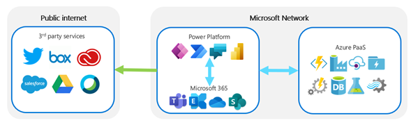

# Understand Microsoft Power Platform architecture to use with ExpressRoute

When setting up ExpressRoute for Microsoft Power Platform, it's important to know the
underlying architecture to understand what can be configured.

## Regions and environments

Microsoft Power Platform is built on top of Microsoft Azure infrastructure,
deployed across various regions around the world. Each deployment is called an
[*environment*](/power-platform/admin/environments-overview), and these environments are associated with a particular region.

:::image type="complex" source="media/region-and-data-centers.png" alt-text="Diagram illustrating each Microsoft Power Platform region with its corresponding datacenters.":::
   Each Microsoft Power Platform region has a pair of datacenters. The diagram shows four different regions: Oceania, Great Britain, North America, and Europe. Each of these regions has a pair. For example, the North America region has West US and East US datacenters in this example. Scale groups exist within each datacenter. There are several scale groups including canary group, sandbox group, and production scale groups.
:::image-end:::

Each environment is contained inside a *scale group*&mdash;a shared infrastructure that
provides a maintainable and scalable infrastructure set. A scale group hosts multiple customer
organizations, each with their own database but with shared service infrastructure. It
uses various Azure services, including Azure SQL, Azure Virtual Machines, and Azure Cache for Redis. These scale groups are set in pairs for each region the customer has selected. For example, selecting United States as the region will create scale
groups in West US and East US.

One common misunderstanding is whether ExpressRoute
can be set up between Microsoft Power Platform and Azure services, and the answer is no.
As explained in the preceding discussion of infrastructure, Microsoft Power Platform uses a shared service
infrastructure; ExpressRoute is a connection that's set up only to the edge
of Microsoft's datacenter.

ExpressRoute is a technology that provides a private connection between your
on-premises network and the "entrance" to the cloud service. Therefore, any
network connections within the same cloud&mdash;in this case, Microsoft Power Platform and
Azure services&mdash;can't be set up with ExpressRoute.

Because Microsoft Power Platform doesn't have designated Border Gateway Protocol (BGP) communities like Microsoft
365 does, you must use two regional BGP communities for the region you've selected.

For example, if you've selected Europe as the region you'd like to use for
your Microsoft Power Platform environment, and you'd like to connect that environment
with ExpressRoute, you must select West Europe and North Europe as the two
regional BGP communities. You can find the regional pair you'll need to set up by going to [Power Automate regions overview](/power-automate/regions-overview).

## Connectors

[Connectors](/connectors/connectors) are a great way of connecting to Microsoft first-party services&mdash;in addition to third-party services&mdash;with Microsoft Power Platform, allowing you to
connect with over 400 different services and apps. One of the details you should
take into consideration is how connectors connect to various services and how this will
affect your connectivity with ExpressRoute.

Connectors use Azure API Management behind the scenes to manage the
credentials and connections from each user.

These connections are then directed to various data sources. For Microsoft
connectors, the connections are within the Microsoft datacenter. Connectors
that are non-Microsoft services are accessed via the public internet.

## On-premises data gateway

Using an [on-premises data gateway](/data-integration/gateway/service-gateway-onprem) enables you to connect to your on-premises
services with Microsoft Power Platform in a secure way by using Azure
behind the scenes. Any data transmitted via the on-premises data gateway is sent via
Azure Service Bus, as shown in the following image.

:::image type="complex" source="media/data-gateway-architecture.png" alt-text="Architectural diagram of an on-premises data gateway.":::
The gateway cloud service encrypts and stores data source credentials and on-premises data gateway details. It routes queries and results between cloud services, the on-premises data gateway, and the data source. Azure Service Bus is used to transmit data between the gateway cloud service and the on-premises data gateway. The on-premises data gateway decrypts data source credentials and connects to a data source. It sends queries to the data source and returns the results to the gateway cloud service.
:::image-end:::

The gateway uses Transport Layer Security (TLS) 1.2 to communicate between the
on-premises data gateway and Microsoft Power Platform services.

The on-premises data gateway connects to one datacenter region per gateway. When
setting up the gateway, you should consider [setting the datacenter region](/data-integration/gateway/service-gateway-data-region)
to the closest region, to minimize latency. More information: [On-premises data gateway architecture](/data-integration/gateway/service-gateway-onprem-indepth)

Depending on the connector you use with on-premises systems, implementing
ExpressRoute doesn't necessarily mean that you can remove the on-premises data gateway.
This is because the on-premises data gateway includes functionality that converts
data. For example, with SQL Server, the on-premises data gateway converts
protocol from OData requests to SQL Data Manipulation Language statements.

Therefore, enabling ExpressRoute doesn't completely remove the need to
implement an on-premises data gateway. Be sure to check each connector
you're using in the [list of connectors](/power-automate/gateway-manage) to determine whether an
on-premises gateway will still be required.

An on-premises data gateway is used when connecting to on-premises systems from
Microsoft Power Platform. The gateway connects on-premises systems with Microsoft Power
Platform by using Azure Service Bus.

## Content Delivery Network

Microsoft Power Platform uses Azure Content Delivery Network (CDN) to optimize performance and
user experiences when using static content such as images and icons. This
static content served by the Content Delivery Network can't be routed via ExpressRoute, so
it will be routed directly across the public internet. However, this content uses
common platform capabilities that contain no customer data; therefore, the content
need not be considered a candidate for protection over private networks like
ExpressRoute.

[!NOTE] For canvas apps specifically, CDN can be turned off using a setting 
**Load default static content from Content Delivery Network** by system administrators 
in case of firewall restrictions and IP approved list related issues.
This setting does not apply to model-driven apps as they do not use CDN currently.

More information: [Manage behavior settings](/admin/settings-behavior)

## Azure Relay

Microsoft Power Automate uses Azure Relay for direct connectivity between Power Automate cloud flows and desktop flows in Power Automate for Desktop. 
It uses HTTPS and data is encrypted when transmitted between the computer and the cloud. 
However to make sure that the traffic is not transmitted through public internet you may use ExpressRoute Instead.
For further information on network settings required, and also to understand the architecture in detail, read the section on [Power Automate architecture](/power-automate/desktop-flows/pad-architecture).

> [!div class="nextstepaction"]
> [Next step: Plan an ExpressRoute deployment](planning-expressroute.md)
