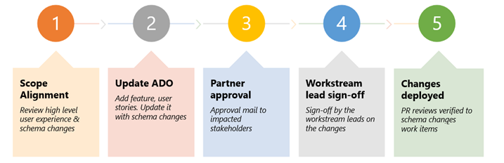

# Digitalizing Business Application Group 

To holistically digitalize a large organization like Business Application Group (BAG), we need to automate all the four aspects of the digital feedback loop shown below.

> [!div class="mx-imgBorder"] 
> 

1. Transforming products to enhance the offerings, for example, publishing release notes on upcoming release wave deliveries.
2. Engaging with the customers and partners to boost the business growth, for example, customer engagements or taking feedback and ideas from the customers. 
3. Empowering its own people to improve an organization’s performance.
4. Optimizing the business operations to achieve better efficiency, for example, automating business reviews.

To digitalize all the four aspects discussed above, we have divided our apps into various workstreams. Each workstream is focused on a specific persona:

:::image type="content" source="media/successhub-persona-focused-workstreams.png" alt-text="Persona focused workstreams":::

This is how 35+ apps are modelled across these 5 workstreams. 

:::image type="content" source="media/successhub-apps-modelled-across-workstreams.png" alt-text="Apps modelled across workstreams":::

Apps are adding the data in Microsoft Dataverse utilizing the data shared by other apps to improve the app experience using automation and intelligence. Data can also be used to provide cost-cutting scenarios on how the data gets leveraged by various apps.

**Product development scenario**

1. Microsoft engages and interacts with the customer. There are numerous apps in customer and partner workstream, for example, customer engagement, exec engagement, Fast Track apps, Power CAT, etc. Each of these is focused on a specific persona.
2. Microsoft gathers feedback from the customers. There are numerous apps in Customer & Partners, and Community work streams, for example, Ideas, Pulse, Heartbeat (for Fast Track). 
3. Aggregate and prioritize feedback/asks using Fusion/One feedback app in the ProductOps workstream.
4. Implement the feature feedback/asks using product planning with apps in the ProductOps workstream.
5. Announce the plan to the customers using the release plan app in the ProductOps workstream exec reviews. This is automated using the bedrock portal which is part of the BizOps workstream.

**Supportability scenarios**

1. Customer creates a support request. This is done with D4M part of the DevOps workstream.
2. Engineer reviews the case to prevent future cases. This is done with the Case review app which is part of the DevOps workstream.
3. Product team plans for the work to be done. This is done with product planning app in Product Ops workstream.
4. Close the loop with customers who face the issue with apps in the Customer and Partner workstream.
5. Close the loop with customers who gave the feedback with apps in the Customer and Partner workstream.

## Success Hub co-development model

The challenge of the co-development model is to enable everyone to co-develop (at scale) and not disturb other apps. To make it scalable, we have divided this problem per workstream. As mentioned earlier, we have five workstreams focused on app development and appointed workstream leads to ensure all the apps in that workstream are honoring the governance process as well as getting the right support from the Success Hub team.

Whenever any major changes are requested by an app, it needs to go through the following five steps to get into production.

> [!div class="mx-imgBorder"] 
> 

As we have 35+ apps working on the platform, it is not scalable to review all the changes. For example, changing a text box color in the app might not impact any other app. Therefore, we are focused more on any changes associated to the table. All other changes are tagged as small scope; it's optional for the app teams to review them with the Success Hub team. 

Changes to the table can be of two types:

1. **Creating a new table**: Many a times, app teams want to create their own table and be independent. But, if we let that happen, it will create multiple tables for the same work and will lead to confusion. Reconciling these tables will take significant time and effort compared to asking app teams to adopt the ones which are available or modifying the current tables to meet the needs of all the app teams.

2. **Changes to a shared table**: There can be two type of changes in shared table.
   1. **Changing the schema**: This needs alignment across the apps which are already using the table. 
   2. **Changing the data (for example, Taxonomy)**: Since the apps are sharing the data in the table, it's necessary to have single team manage that or at least govern it. 

## Deployment (ALM) and Live site 

Success Hub follows a weekly deployment cycle where Microsoft Dataverse components are reviewed in a partner review meeting and subsequently deployed to a test environment every Wednesday. Partner teams have two days to validate their apps and solution changes in a test environment. Post validation, we obtain sign off from the partner teams and deploy these components to a production environment on Monday. 

Microsoft Power Platform also enables us to automate our support process where emails to the support alias are tracked in a ticketing system. These items are reviewed in a “Live Site Review” every week to understand the health of the Success Hub and identify repair items/trends of user queries.

To monitor the health of components, we have:
 
- Dev-Test-UAT-Prod ALM model
  - Dev environment (per app)
  - Test environment (single environment)
  - UAT environment (single environment)
  - PROD environment (single environment)
  - POC environment for teams to try out
- Build and Release Pipeline are managed through Azure DevOps using ‘Power Platform Build Tools’.
- Dev and test environments are refreshed every week (automated fashion) with every weekly build.
- Automated tests are run in test environments and UAT environments. This ensures smoother co-development.
- Every app is a solution and is in the process of becoming a managed solution.

## Security and compliance integration 

Security and compliance integration, once done, can be leveraged by any app in development.

- High volume of read-only data: There are instances in the Success Hub where data is needed only for reference purposes. One such example is the DAU, WAU, and MAU of tenants. This data is used to understand usage but never modified within the Success Hub. We use virtual tables to render such data which can be high volume and read-only.  
- High volume of read-write data: While Flows meet most of our integration needs, there are scenarios where advanced Azure capabilities are needed, for example, invoking Azure Functions. For these, we use Microsoft Azure Logic Apps. 
- Simple integration: Flows are used extensively to build integrations as well as business logic within our org. 
- Specific roles are created to honor security.
- Regular compliance reviews at the Success Hub level. 
- Success Hub stores lot of sensitive information. 
- App team doesn’t need to do compliance reviews if they are using existing data tables and integrations.

## Integration with other data sources 

For business apps, we often need data from various data sources and Dataverse provides a great way to integrate with other data sources using virtual table, etc. We integrate with the following type of data sources:

- Microsoft customer, sales, and partner data (MSX, LCS, Customer Service, etc.)
- DevOps and Serviceability (Azure DevOps, ICM, etc.)
- Organization hierarchy and user profiles (Azure Active Directory and Microsoft Graph)

## Support and maintenance support channels 

The following enable developing, supporting, and maintaining any app:

- Wiki/guidance and weekly office hours to ask questions 
- Maintenance (alerting and monitoring) done by a single team (Microsoft Power Platform workstream) 
- Telemetry dashboard to track performance and health metrics
